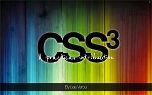

About a week ago, I was in Warsaw, Poland to give [my first talk](http://lea.verou.me/2010/08/lea-verou-at-front-trends-2010/) at a big conference, [Front Trends 2010](http://front-trends.com/). As every first-time speaker, I was extremely nervous and worried that everything would go bad. That my talk would be boring or too basic or that I would just freeze at stage, unable to say a word. It was a 2-hour talk with a break in between, so I was also terrified that nobody would show up the second hour.

Contrary to my fears and insecurities, it went better than I could have ever hoped. The feedback on twitter and in general was enthusiastic! There wasn't a single negative comment. Even people I look up to, like [Tantek Çelik](http://twitter.com/#!/t/status/28020396001), [PPK](http://twitter.com/ppk/status/28018480426), [Jake Archibald](http://twitter.com/jaffathecake/status/28016064374) or [Robert Nyman](http://twitter.com/robertnyman/status/28016285089) had something good to say! And instead of nobody showing up the second hour, the audience almost doubled!

At this point, I would like to thank [Christian Heilmann](http://www.wait-till-i.com/2010/10/25/fronttrends2010-in-warsaw-poland-my-impressions-slides-and-audio/) for helping me become less nervous before my talk by going through all my slides with me and offering his invaluable advice for every part (I forgot to follow most of it, but it really helped in my attitude). I can't thank you enough Christian!

Many attendees asked me for my slides and presentation framework. You can find my slides [online here](http://lea.verou.me/ft2010/) or [download](uploads/ft2010.zip) them. However, **before you follow those links, read below**:

- I originally ran my presentation in **Firefox 4 beta** so I was testing mainly in that and Minefield (Firefox's nightly releases). It supports other browsers too (Chrome 7, Opera 10.6+), but it still displays better in Firefox or Minefield and is (surprisingly) faster in them.
- **Opera** has issues with a few unicode characters I used in some places and won't display Helvetica Neue even if it's installed (@font-face is not an option with that font, for legal reasons)
- **Any non-Gecko browser** will not display **CSS gradients**, since Gecko is the only engine so far that supports the standard syntax. Therefore the gradient demos and the multiple backgrounds demo won't work in non-Gecko browsers.
- Some slides are a bit slow on **Webkit**. **The first slide is extremely slow in it,** you have been warned.
- **Opera** and **Webkit** have (different) bugs with border-radius: 50%, so some things using it will look funny.
- I have **only tested in OSX browsers**. I have no idea how it will perform on Windows or Linux distros yet.
- It's a 2-hour talk and the presentation was designed to run locally. **It's not small and it will take a while to load**. That's due to the images used, as you can easily see from the zip archive.
- The **editable examples** many of you liked are based on this [CSS mindfuck by Anne van Kesteren](http://annevankesteren.nl/2010/03/css-wg-brainstorming). It's smart and convenient, but beware: It breaks really, really easily. It's good for _changing_ the code realtime, but it will most likely break if you try to _add_ extra code.

In case you're not feeling very adventurous today, or you're just using a computer with only unsupported browsers, here's the presentation as a series of images (not interactive, but still the same info):

**[CSS3: A practical introduction (FT2010 talk)](http://www.slideshare.net/LeaVerou/css3-a-practical-introduction-ft2010-talk "CSS3: A practical introduction (FT2010 talk)")**

By popular demand, I'm also releasing my presentation framework, for which in the meantime I found a name (**CSSS**, inspired by S5), designed a logo and made a simpler, [sample presentation](http://lea.verou.me/csss/sample-slideshow.html) with a different, simpler theme. I released it in [a public repo on Github](http://github.com/LeaVerou/CSSS) (finally got around to learning the basics of Github and loved it!). Please note that this is a very first version and I haven't been able to test it much, especially on Windows, since my Mac is quite new and I keep postponing to install some virtualization software. A friend reported that **Firefox 3.6 on Windows has serious issues** with it, although it runs fine on my FF3.6 copy for Mac. It doesn't work at all in IE, even IE9, as I don't yet have IE to test it out. Please report any issues on Github's bug tracker and eventually I --or someone else, you're all welcome :p-- will fix them (don't forget to mention exact browser version and OS). If you're using Safari, press Ctrl+H for something cool ;) (it works on the others too, but it's slower and not smooth)

Some may ask: _"If CSS3 degrades so gracefully and we can use it today as you told us in your talk, then why all these issues with different browsers in CSSS or your FT presentation?"_. First of all, these are not everyday use cases. Projects like CSSS or my FT presentation are quite experimental, use a lot of CSS3, including many edge cases and I could have devoted more time to make them degrade more gracefully, but given the target audience, I don't think it's worth it much. It's expected that  there might be rendering problems in some browsers or that they might be slow, browsers need edge cases to highlight problems in their implementations of the new stuff before it's finalized. Every time I experiment with CSS3, I find at least one browser bug, which I generally try to report (don't let that scare you though, as I said, I have a penchant for edge cases).

You may have also noticed I redesigned my blog. As you may have noticed, I have fallen in love with that [Rainbow Wood wallpaper by Luke Roberts](http://lukeroberts.us/2008/12/wallpaper-colourful-wood/) and I just **_had_** to put it in my blog too :P The new design has a few issues with Opera at the moment, but I hope to fix them soon. It will also look better to those that have Helvetica Neue installed.
