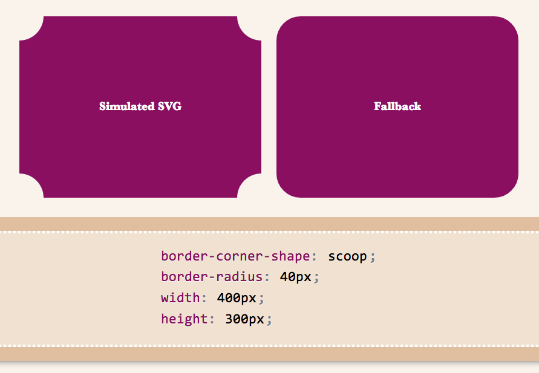
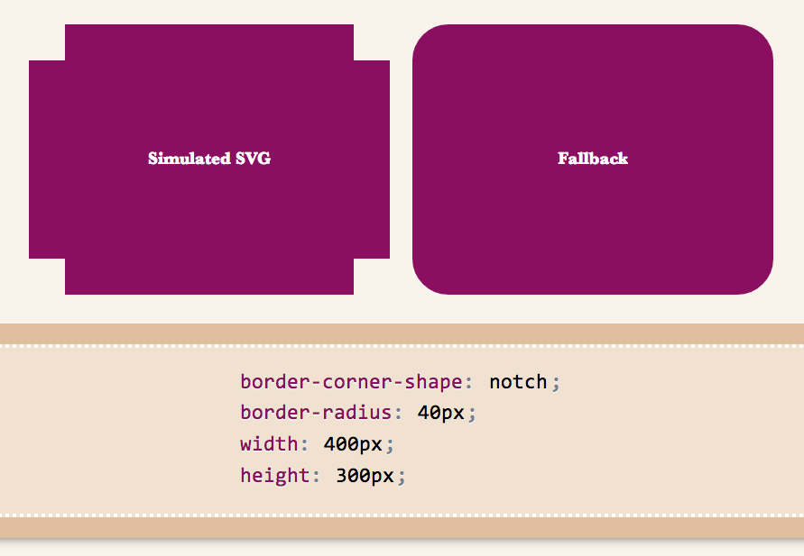
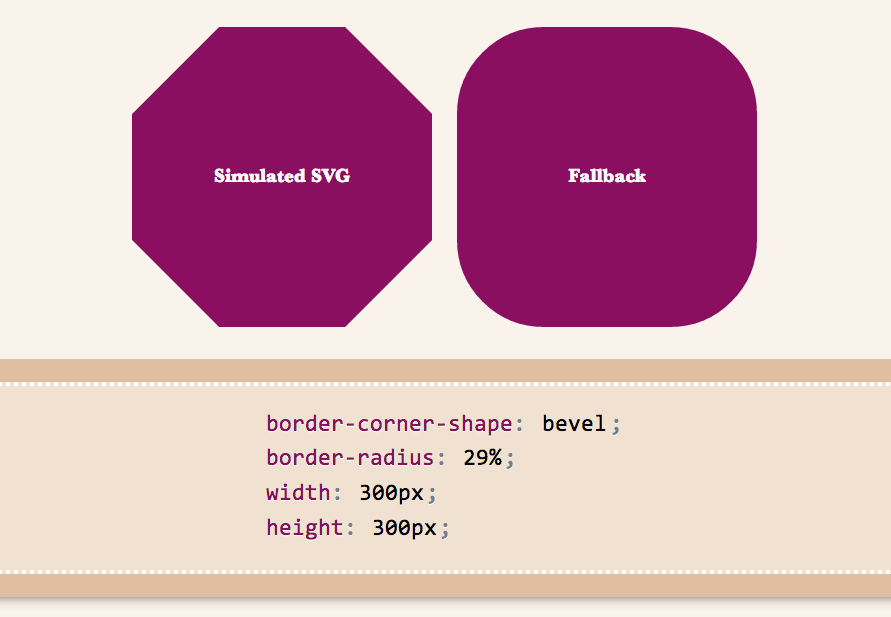
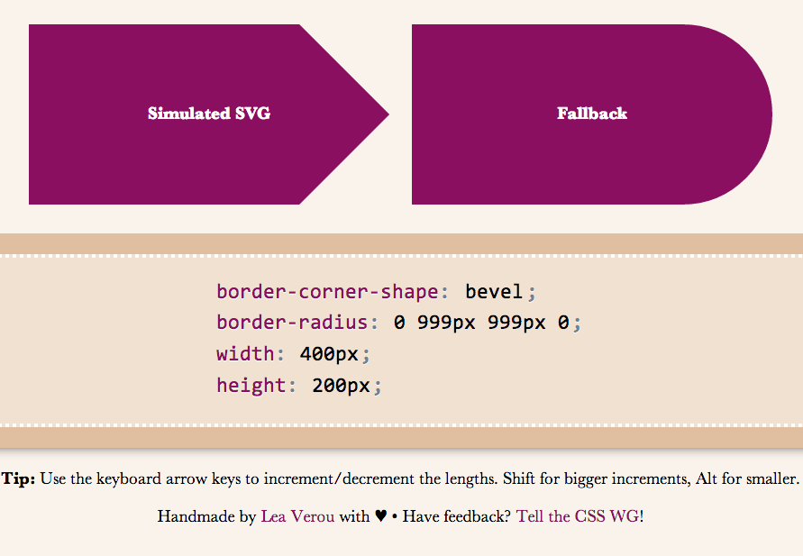

Remember [my previous post about an app I made to preview border-corner-shape](http://lea.verou.me/2013/03/preview-border-corner-shape-before-implementations/)? It stirred a lot of discussion in the CSS WG, and [David Baron posted this](http://lists.w3.org/Archives/Public/www-style/2013Mar/0498.html):

> http://dev.w3.org/csswg/css4-background/#border-corner-shape appears to me to be an example of a feature that's addressing a problem that we don't have -- or at least that we don't have enough to be worth adding such a feature. I think it should be removed.
>
> In particular, if there were demand for the bevel | curve | notch values, we'd be seeing authors using the equivalents of such values on significant numbers of Web sites. So before agreeing to accept this new feature, I'd like to see examples of Web sites that are doing what these values would do. Not something similar to what these values would do, but exactly what these values would do, or at least close enough that the author wouldn't care about the difference.

You can read the whole discussion in the thread I linked to, above.

I might be wrong, but I believe [border-corner-shape](http://dev.w3.org/csswg/css4-background/#border-corner-shape) would greatly simplify many common effects, especially its "bevel" value, which can even create triangles and other polygons, that we go to great lengths to make with CSS today, and it would degrade much more nicely than border-image or backgrounds. I think it was one of [fantasai](http://fantasai.inkedblade.net/)’s many great ideas and I’m glad she added it to [the Editor’s Draft of Backgrounds & Borders 4](http://dev.w3.org/csswg/css4-background/).

I posted a [list of tutorials and questions from web designers & developers](http://lists.w3.org/Archives/Public/www-style/2013Mar/0505.html), to illustrate that these effects are needed. However, David [argued that “Questions from authors don't give you enough information to be sure that the feature being added is sufficient for the author's needs](http://lists.w3.org/Archives/Public/www-style/2013Mar/0507.html)[”](http://lists.w3.org/Archives/Public/www-style/2013Mar/0507.html). He did have a point, so with some help from the community, [I posted a few links to websites using such effects, and use cases](http://lists.w3.org/Archives/Public/www-style/2013Mar/0653.html). [Nicole Sullivan](http://lists.w3.org/Archives/Public/www-style/2013Mar/0519.html), [Liam Quin](http://lists.w3.org/Archives/Public/www-style/2013Mar/0538.html), [fantasai](http://lists.w3.org/Archives/Public/www-style/2013Mar/0648.html) and [Lev Solntsev](http://lists.w3.org/Archives/Public/www-style/2013Mar/0666.html) posted a couple more.

However, the more real examples we have, the more likely it is to retain the feature in some form. This is where you come in: If you think border-corner-shape has merit, provide use cases, either by links to websites whose design elements it would simplify, screenshots of websites or descriptions of cases where you needed such a thing (in that order of preference). You can either post to the thread directly, or comment here and I’ll post them to the list in batches.

If you think it has merit but it could be improved, feel free to post about that as well. If you don’t think it’s a good idea, any alternatives you can think of are welcome as well. Or, if you don’t think it’s useful, say that too (but make sure you first fully understand what it can do). If you’re not sure how it can be used, play around with [the demo app I made](http://leaverou.github.io/corner-shape/) and be creative!

Below are a few examples of shapes:

     

I wanted to demo triangles and trapezoids as well, but it seems there’s a bug in my app, so I’ll have to debug it first :( If we allow border-corner-shape to have different values for all four corners, even more possibilites open (e.g. arrows).

Spend a few minutes to help the CSS WG help you. Thanks!
