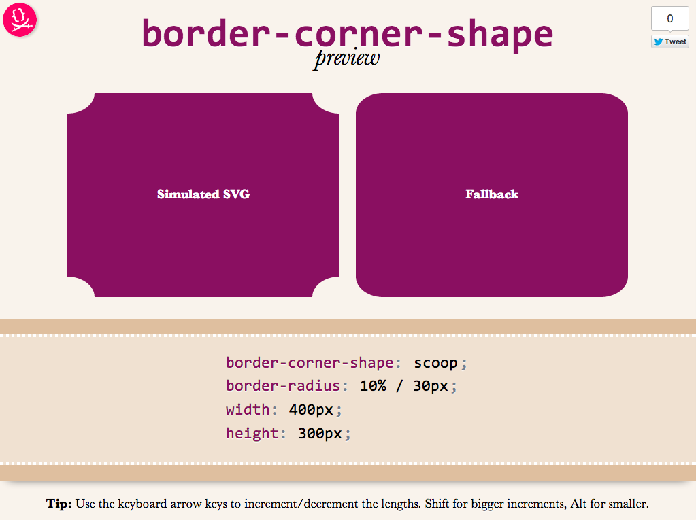

As an editor of the [Backgrounds & Borders Level 4](http://dev.w3.org/csswg/css4-background/) spec, I am naturally a bit more interested in the cool features it will bring, once implementations start (it’s currently too early for that). One of the coolest features in it is [corner-shape](http://dev.w3.org/csswg/css-backgrounds-4/#corner-shaping). While in [Backgrounds & Borders 3](http://www.w3.org/TR/css3-background/), [border-radius](http://www.w3.org/TR/css3-background/#the-border-radius) was only used for rounded (actually, elliptical) corners, with the help of corner-shape, it will be able to do so much more! Beveled corners, scoop-style corners (informally known as “negative border-radius”), even rectangular notches.

Unfortunately, until it’s implemented in browsers, it’s hard to play with it. Or, is it? I spent the weekend creating an app in which you can enter values for corner-shape, border-radius, width, and height, and see the result, simulated through SVG, as well as the fallback in browsers that don’t support border-corner-radius (which is currently all browsers).

Obviously, it’s not a full preview, since you can only play with a limited subset of CSS properties, but it should be good for seeing the kinds of shapes that will be possible.You could also copy the generated SVG from the Developer tools of your browser, and use it as a background in any website!

Use it here: [corner-shape preview](https://projects.verou.me/corner-shape)

Tested to work in at least Chrome, IE9, Firefox, Safari and theoretically, should work in any SVG-enabled browser.

Enjoy! Hope you like it.

**Important:** Please note that corner-shape is still at a very early stage and might completely change before implementations. You can also help to make it better: Play with it and comment on what you think about its naming and functionality!
