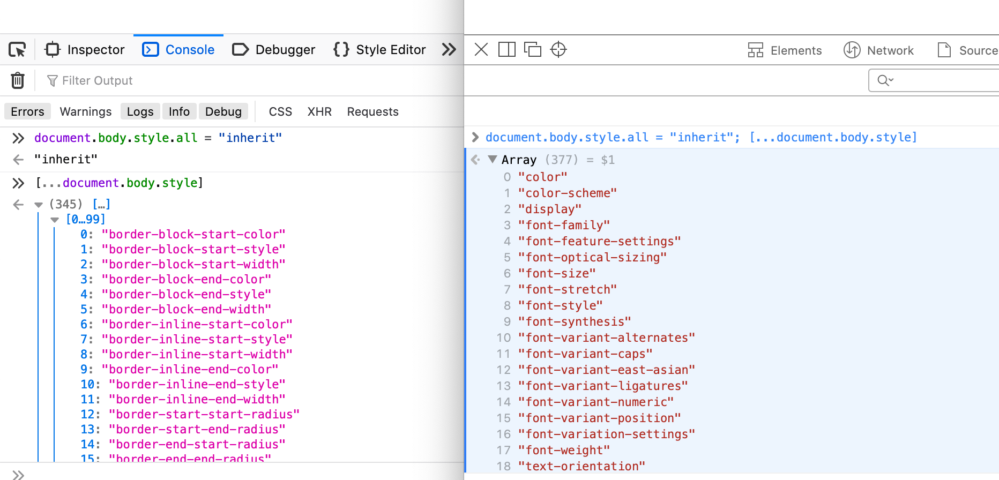

For [some of the statistics](https://github.com/LeaVerou/css-almanac/issues/10) we are going to study for this year's Web Almanac we may end up needing a list of CSS shorthands and their longhands. Now this is typically done by [maintaining a data structure by hand](https://github.com/LeaVerou/prefixfree/blob/gh-pages/prefixfree.js#L298) or [guessing based on property name structure](https://github.com/LeaVerou/prefixfree/blob/gh-pages/prefixfree.js#L298). But I knew that if we were going to do it by hand, it's very easy to miss a few of the less popular ones, and the naming rule where shorthands are a prefix of their longhands [has failed to get standardized](https://lists.w3.org/Archives/Public/www-style/2012Apr/0155.html) and now has even more exceptions than it used to. And even if we do an incredibly thorough job, next year the data structure will be inaccurate, because CSS and its implementations evolve fast. The browser knows what the shorthands are, surely we should be able to get the information from it ...right? Then we could use it directly if this is a client-side library, or in the case of the Almanac, where code needs to be fast because it will run on millions of websites, paste the precomputed result into whatever script we run.

There are essentially two steps for this:

1. Get a list of all CSS properties
2. Figure out how to test if a given property is a shorthand and how to get its longhands if so.

I decided to tell this story in the inverse order. In my exploration, I first focused on figuring out shorthands (2), because I had coded getting a list of properties many times before, but since (1) is useful in its own right (and probably in more use cases), I felt it makes more sense to examine that first.

_**Note:** I’m using `document.body` instead of a dummy element in these examples, because I like to experiment in `about:blank`, and it's just there and because this way you can just copy stuff to the console and try it wherever, even right here while reading this post. However, if you use this as part of code that runs on a real website, it goes without saying that you should create and test things on a dummy element instead!_

## Getting a list of all CSS properties from the browser

In Chrome and Safari, this is as simple as `Object.getOwnPropertyNames(document.body.style)`. However, in Firefox, this doesn't work. Why is that? To understand this (and how to work around it), we need to dig a bit deeper.

In Chrome and Safari, `element.style` is a `[CSSStyleDeclaration](https://developer.mozilla.org/en-US/docs/Web/API/CSSStyleDeclaration)` instance. In Firefox however, it is a `[CSS2Properties](https://www.w3.org/TR/DOM-Level-2-Style/css.html#CSS-CSS2Properties)` instance, which inherits from `CSSStyleDeclaration`. [`CSS2Properties`](https://www.w3.org/TR/DOM-Level-2-Style/css.html#CSS-CSS2Properties) is an older interface, defined in [the DOM 2 Specification](https://www.w3.org/TR/DOM-Level-2-Style/css.html#CSS-CSS2Properties), which is now obsolete. In the [current relevant specification](https://drafts.csswg.org/cssom/#the-cssstyledeclaration-interface), `CSS2Properties` is gone, and has been merged with `CSSStyleDeclaration`. However, [Firefox hasn't caught up yet](https://bugzilla.mozilla.org/show_bug.cgi?id=1290786).


Firefox on the left, Safari on the right. Chrome behaves like Safari.

Since the properties are on `CSSStyleDeclaration`, they are not own properties of `element.style`, so `Object.getOwnPropertyNames()` fails to return them. However, we can extract the `CSSStyleDeclaration` instance by using `[__proto__](https://developer.mozilla.org/en-US/docs/Web/JavaScript/Reference/Global_Objects/Object/proto)` or [Object.getPrototypeOf()](https://developer.mozilla.org/en-US/docs/Web/JavaScript/Reference/Global_Objects/Object/getPrototypeOf), and then `Object.getOwnPropertyNames(Object.getPrototypeOf(document.body.style))` gives us what we want!

So we can combine the two to get a list of properties regardless of browser:

```
let properties = Object.getOwnPropertyNames(
	style.hasOwnProperty("background")?
	style : style.__proto__
);
```

And then, we just drop non-properties, and de-camelCase:

```
properties = properties.filter(p => style[p] === "") // drop functions etc
	.map(prop => { // de-camelCase
		prop = prop.replace(/[A-Z]/g, function($0) { return '-' + $0.toLowerCase() });

		if (prop.indexOf("webkit-") > -1) {
			prop = "-" + prop;
		}

		return prop;
	});
```

You can see a [codepen with the result here](https://codepen.io/leaverou/pen/eYJodjb?editors=0010):

https://codepen.io/leaverou/pen/eYJodjb?editors=0010

## Testing if a property is a shorthand and getting a list of longhands

The main things to note are:

- When you set a shorthand on an element's inline style, you are essentially setting all its longhands.
- `element.style` is actually array-like, with numerical properties and `.length` that gives you the number of properties set on it. This means you can use the spread operator on it:

```
> document.body.style.background = "red";
> [...document.body.style]
< [
	"background-image",
	"background-position-x",
	"background-position-y",
	"background-size",
	"background-repeat-x",
	"background-repeat-y",
	"background-attachment",
	"background-origin",
	"background-clip",
	"background-color"
]
```

Interestingly, `document.body.style.cssText` serializes to `background: red` and not all the longhands.

There is one exception: [The `all` property](https://developer.mozilla.org/en-US/docs/Web/CSS/all). In Chrome, it does not quite behave as a shorthand:

```
> document.body.style.all = "inherit";
> [...document.body.style]
< ["all"]
```

Whereas in Safari and Firefox, it actually returns every single property _that is not a shorthand_!



Firefox and Safari expand `all` to literally all non-shorthand properties.

While this is interesting from a trivia point of view, it doesn't actually matter for our use case, since we don't typically care about `all` when constructing a list of shorthands, and if we do we can always add or remove it manually.

So, to recap, we can easily get the longhands of a given shorthand:

```
function getLonghands(property) {
	let style = document.body.style;
	style[property] = "inherit"; // a value that works in every property
	let ret = [...style];
	style.cssText = ""; // clean up
	return ret;
}
```

## Putting the pieces together

You can see how all the pieces fit together (and the output!) in [this codepen](https://codepen.io/leaverou/pen/gOPEJxz?editors=0010):

https://codepen.io/leaverou/pen/gOPEJxz?editors=0010

How many of these shorthands did you already know?
