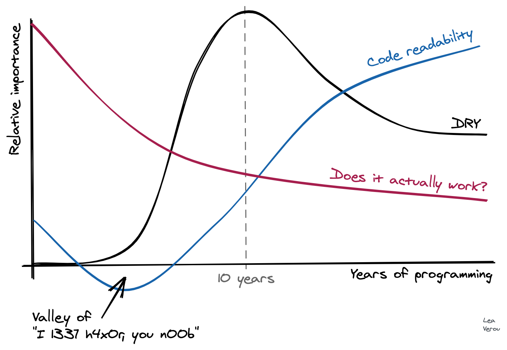

I made this chart in the amazing [Excalidraw](https://excalidraw.com/) about two weeks ago:

It only took me 10 minutes! Shortly after, my laptop broke down into repeated kernel panics, and it spent about 10 days in service (I was in a remote place when it broke, so it took some time to get it to service). Yesterday, I was finally reunited with it, turned it on, launched Chrome, and saw it again. It gave me a smile, and I realized I never got to post it, so I [tweeted this](https://twitter.com/LeaVerou/status/1306001020636540934):

https://twitter.com/LeaVerou/status/1306001020636540934

The tweet kinda blew up! It seems many, _many_ developers identify with it. A few also disagreed with it, especially with the "Does it actually work?" line. So I figured I should write a bit about the rationale behind it. I originally [wrote it in a tweet](https://twitter.com/LeaVerou/status/1306207138931445761), but then I realized I should probably post it in a less transient medium, that is more well suited to longer text.

When somebody starts coding, getting the code to work is already difficult enough, so there is no space for other priorities. Learning to formalize one's thought to the degree a computer demands, and then serialize this thinking with an unforgiving syntax, is _hard_. Writing code that works is THE priority, and whether it's good code is not even a consideration.

For more experienced programmers, whether it works is ephemeral: today it works, tomorrow a commit causes a regression, the day after another commit fixes it (yes, even with TDD. No testsuite gets close to 100% coverage). Whereas readability & maintainability do not fluctuate much. If they are not prioritized from the beginning, they are much harder to accomplish when you already have a large codebase full of technical debt.

Code written by experienced programmers that doesn't work, can often be fixed with hours or days of debugging. A nontrivial codebase that is not readable can take months or years to rewrite. So one tends to gravitate towards prioritizing what is easier to fix.

### The "peak of drought" and other over-abstractions

Many developers identified with the _"peak of drought"_. Indeed, like other aspects of maintainability, DRY is not even a concern at first. At some point, a programmer learns about the importance of DRY and gradually begins abstracting away duplication. However, you _can_ have too much of a good thing: soon the need to abstract away any duplication becomes all consuming and leads to absurd, awkward abstractions which actually get in the way and produce needless couplings, often to avoid duplicating very little code, once. In my own _"peak of drought"_ (which lasted far longer than the graph above suggests), I've written many useless functions, with parameters that make no sense, just to avoid duplicating a few lines of code once.

[Many](https://dev.to/jeroendedauw/the-fallacy-of-dry) [articles](https://dev.to/wuz/stop-trying-to-be-so-dry-instead-write-everything-twice-wet-5g33) [have](https://medium.com/better-programming/when-dry-doesnt-work-go-wet-6befda0444bf) [been](http://joelabrahamsson.com/the-dry-obsession/) written about this phenomenon, so I'm not going to repeat their arguments here. As a programmer accumulates even more experience, they start seeing the downsides of over-abstraction and over-normalization and start favoring a more moderate approach which prioritizes readability over DRY when they are at odds.

A similar thing happens with [design patterns](https://en.wikipedia.org/wiki/Software_design_pattern) too. At some point, a few years in, a developer reads a book or takes a course about design patterns. Soon thereafter, their code becomes so littered with design patterns that it is practically incomprehensible. _"When all you have is a hammer, everything looks like a nail"_. I have a feeling that Java and Java-like languages are particularly accommodating to this ailment, so this phenomenon tends to proliferate in their codebases. At some point, the developer has to go back to their past code, and they realize themselves that it is unreadable. Eventually, they learn to use design patterns when they are actually useful, and favor readability over design patterns when the two are at odds.

What aspects of your coding practice have changed over the years? How has your perspective shifted? What mistakes of the past did you eventually realize?
