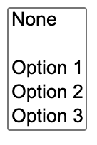
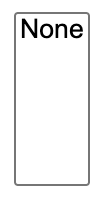

If you’ve been writing CSS for any length of time, you're probably familiar with the `em` unit, and possibly the other [type-relative units](https://drafts.csswg.org/css-values/#font-relative-lengths). We are going to refer to `em` for the rest of this post, but anything described works for all type-relative units.

As you well know, `em` resolves to the current font size on all properties except `font-size`, where it resolves to the _parent_ font size. It can be quite useful for making scalable components that adapt to their context size.

However, I have often come across cases where you actually need to "circumvent" one level of this. Either you need to set `font-size` to the grandparent font size instead of the parent one, or you need to set other properties to the parent font size, not the current one.

_If you’re already familiar with the problem and just want [the solution](#the-solution), [skip ahead](#the-solution). The next few paragraphs are for those thinking "but when would you ever need this?"_

Sometimes, there are workarounds, and it's just a matter of keeping DRY. For example, take a look at this speech bubble:
<!-- more -->
<iframe id="cp_embed_dyvxGLo" src="//codepen.io/anon/embed/dyvxGLo?height=410&amp;theme-id=1&amp;slug-hash=dyvxGLo&amp;default-tab=result" height="410" scrolling="no" frameborder="0" allowfullscreen allowpaymentrequest="" name="CodePen Embed dyvxGLo" title="CodePen Embed dyvxGLo" class="cp_embed_iframe" style="width:100%;overflow:hidden">CodePen Embed Fallback</iframe>

Note this in the CSS:

```
/* This needs to change every time the font-size changes: */
top: calc(100% + 1em / 2.5);
font-size: 250%;
```

Note that every time we change the font size we also need to adjust `top`. And ok, when they're both defined in the same rule we can just delegate this to a variable:

```
--m: 2.5;
top: calc(100% + 1em / var(--m));
font-size: calc(var(--m) * 100%);
```

However, in the general case the font size may be defined elsewhere. For example, a third party author may want to override the emoji size, they shouldn't also need to override anything else, our CSS should just adapt.

In other cases, it is simply not possible to multiply and divide by a factor and restore the ancestor font size. Most notably, when the current (or parent) font-size is set to `0` and we need to recover what it was one level up.

I've come across many instances of this in the 16 years I've been writing CSS. Admittedly, there were way more use cases pre-Flexbox and friends, but it's still useful, as we will see. In fact, it was the latest one that prompted this post.

I needed to wrap `<option>` elements by a generic container for a library I’m working on. Let me stop you there, no, I could not just set classes on the options, I needed an actual container in the DOM.

As you can see in [this pen](https://codepen.io/leaverou/pen/OJpexzE), neither `<div>` nor custom elements work here: when included in the markup they are just discarded by the parser, and when inserted via script they are in the DOM, but the options they contain are not visible. The only [elements that work inside a `<select>`](https://html.spec.whatwg.org/multipage/form-elements.html#the-select-element) are: `<option>`, `<optgroup>`, and [script-supporting elements](https://html.spec.whatwg.org/multipage/dom.html#script-supporting-elements-2) (currently `<template>` and `<script>`). Except `<optgroup>`, none of the rest renders any contents and thus, is not fit for my use case. It had to be `<optgroup>`, sadly.

However, using `<optgroup>`, even without a `label` attribute inserts an ugly gap in the select menu, where the label would have gone ([pen](https://codepen.io/leaverou/pen/vYxoGpZ)):



(There were also gaps on the left of the labels, but we applied some CSS to remove them)

There appears to be [no way to remove](https://www.google.com/search?q=remove+optgroup+label+site:stackoverflow.com) said gap.

Ideally, this should be fixed on the user agent level: Browsers should not generate a label box when there is no label attribute. However, I needed a solution now, not in the far future. There was no pseudo-element for targeting the generated label. The only solution that worked was along these lines ([pen](optgroup:not([label]) {
	display: contents;
	font-size: 0;
}
<div></div>
optgroup:not([label])> * {
	font-size: 13.333px;
})):

```
optgroup:not([label]) {
	font-size: 0;
}

optgroup:not([label]) > * {
	font-size: 13.333px;
}
```

The weird `13.333px` value was taken directly from the Chrome UA stylesheet (as inspected). However, it is obviously flimsy, and will break any additional author styling. It would be far better if we could say "give me whatever `1em` is on the grandparent". Can we?

## The solution

What if we could use custom properties to solve this? Our first attempt might look something like this:

```
select {
	--em: 1em;
}

optgroup:not([label]) {
	font-size: 0;
}

optgroup:not([label]) > * {
	font-size: var(--em);
}
```

However this is [horribly broken](https://codepen.io/leaverou/pen/dyvxXyV):



All the options have disappeared!!

What on Earth happened here?!

By default, custom properties are just containers for CSS tokens.When they inherit, they inherit as specified, with only any `var()` references substituted and no other processing. This means that the `1em` we specified inherits as the `1em` _token_, not as whatever absolute length it happens to resolve to on `select`. It only becomes an absolute length at the point of usage, and this is whatever `1em` would be there, i.e. `0`. So all our options disappeared because we set their font size to `0`!

If only we could make `1em` resolve to an actual absolute length at the point of declaration and inherit as that, just like native properties that accept lengths?

Well, you’re in luck, because today we can!

You may be familiar with the [`@property` rule](https://developer.mozilla.org/en-US/docs/Web/CSS/@property) as "the thing that allows us to animate custom properties". However, it is useful for so much more than that.

If we register our custom property as a `<length>`, this makes the `1em` resolve on the element we specified it on, and inherit as an absolute length! [Let’s try this](https://codepen.io/leaverou/pen/KKWOMMK):

```
@property --em {
	syntax: "<length>";
	initial-value: 0;
	inherits: true;
}

select {
	--em: 1em;
}

optgroup:not([label]) {
	display: contents;
	font-size: 0;
}

optgroup:not([label]) > * {
	font-size: var(--em);
}

/* Remove Chrome gap */
:where(optgroup:not([label]) > option)::before {
	content: "";
}
```

<iframe id="cp_embed_KKWOMMK" src="//codepen.io/anon/embed/KKWOMMK?height=250&amp;theme-id=1&amp;slug-hash=KKWOMMK&amp;default-tab=css,result" height="250" scrolling="no" frameborder="0" allowfullscreen allowpaymentrequest="" name="CodePen Embed KKWOMMK" title="CodePen Embed KKWOMMK" class="cp_embed_iframe" style="width:100%;overflow:hidden">CodePen Embed Fallback</iframe>

And here is the same technique used for the speech bubble:

<iframe id="cp_embed_XWMZewB" src="//codepen.io/anon/embed/XWMZewB?height=250&amp;theme-id=1&amp;slug-hash=XWMZewB&amp;default-tab=result" height="250" scrolling="no" frameborder="0" allowfullscreen allowpaymentrequest="" name="CodePen Embed XWMZewB" title="CodePen Embed XWMZewB" class="cp_embed_iframe" style="width:100%;overflow:hidden">CodePen Embed Fallback</iframe>

## Fallback

This is all fine and dandy for the [68% (as of June 2021) of users that are using a browser that supports `@property`](https://caniuse.com/mdn-css_at-rules_property), but what happens in the remaining 32%? It's not pretty:


We get the default behavior of an unregistered property, and thus none of our options show up! This is _bad_.

We should clearly either provide a fallback or conditionally apply these rules only in browsers that support `@property`.

We can easily detect `@property` support in JS and add a class to our root element:

```
if (window.CSSPropertyRule) {
	let root = document.documentElement;
	root.classList.add("supports-atproperty");
}
```

Then we can just use the descendant combinator:

```
:root.supports-atproperty optgroup:not([label]) {
	font-size: 0;
}
```

## CSS-only fallback for @property

While the JS fallback works great, I couldn't help but wonder if there's a CSS only way.

My first thought was to use `@supports`:

```
@supports (--em: flugelhorn) {
	/* Does not support @property */
}
```

The theory was, if a browser supported any value to be assigned on a property registered as a `<length>`, surely it does not support property registration.

It turns out, registered properties do not validate their syntax at parse time, and thus are always valid for `@supports`. This is [explained in the spec](https://drafts.css-houdini.org/css-properties-values-api-1/#parsing-custom-properties):

> When parsing a page’s CSS, UAs commonly make a number of optimizations to help with both speed and memory.
>
> One of those optimizations is that they only store the properties that will actually have an effect; they throw away invalid properties, and if you write the same property multiple times in a single declaration block, all but the last valid one will be thrown away. (This is an important part of CSS’s error-recovery and forward-compatibility behavior.)
>
> This works fine if the syntax of a property never changes over the lifetime of a page. If a custom property is registered, however, it can change its syntax, so that a property that was previously invalid suddenly becomes valid.
>
> The only ways to handle this are to either store every declaration, even those that were initially invalid (increasing the memory cost of pages), or to re-parse the entire page’s CSS with the new syntax rules (increasing the processing cost of registering a custom property). Neither of these are very desirable.
>
> Further, UA-defined properties have their syntax determined by the version of the UA the user is viewing the page with; this is out of the page author’s control, which is the entire reason for CSS’s error-recovery behavior and the practice of writing multiple declarations for varying levels of support. A custom property, on the other hand, has its syntax controlled by the page author, according to whatever stylesheet or script they’ve included in the page; there’s no unpredictability to be managed. Throwing away syntax-violating custom properties would thus only be, at best, a convenience for the page author, not a necessity like for UA-defined properties.

Ok this is great, and totally makes sense, but what can we do? How can we provide a fallback?

It turns out that there is a way, but brace yourself, as it’s quite hacky. I’m only going to describe it for entertainment purposes, but I think for real usage, the JS way is far more straightforward, and it's the one I'll be using myself.

The main idea is to take advantage of the `var()` fallback argument of a _second_ registered variable, that is registered as non-inheriting. We set it to the fallback value on an ancestor. If `@property` is supported, then this property will not be defined on the element of interest, since it does not inherit. Any other properties referencing it will be [invalid at computed value time](https://drafts.csswg.org/css-variables/#invalid-at-computed-value-time), and thus any `var()` fallbacks will apply. If `@property` is _not_ supported, the property will inherit as normal and thus using it becomes our fallback.

Here is an [example](https://codepen.io/leaverou/pen/ExWqyzQ) with a simple green/red test to illustrate this concept:

```
@property --test {
	syntax: "*";
	inherits: false;
}

html {
	--test: red;
}

body {
	background: var(--test, green);
}
```

<iframe id="cp_embed_ExWqyzQ" src="//codepen.io/anon/embed/ExWqyzQ?height=250&amp;theme-id=1&amp;slug-hash=ExWqyzQ&amp;default-tab=result" height="250" scrolling="no" frameborder="0" allowfullscreen allowpaymentrequest="" name="CodePen Embed ExWqyzQ" title="CodePen Embed ExWqyzQ" class="cp_embed_iframe" style="width:100%;overflow:hidden">CodePen Embed Fallback</iframe>

And here is how we can use the same concept to provide a fallback for the `<select>` example:

```
@property --test {
	syntax: "*";
	inherits: false;
}

select {
	--test: 1em; /* fallback */
	--em: 1em;
}

optgroup:not([label]) {
	font-size: var(--test, 0);
}
```

Here is the [finished demo](https://codepen.io/leaverou/pen/eYvqdYG).
