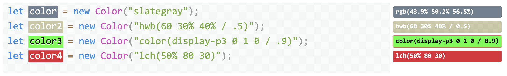
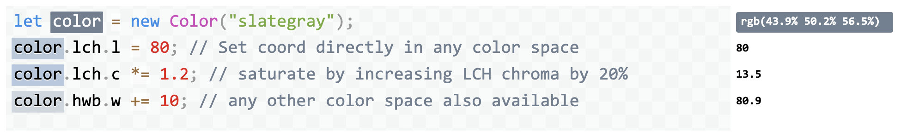

_Related: [Chris’ blog post for the release of Color.js](https://svgees.us/blog/colorjs-release.html)_

This post has been long overdue: [Chris](https://svgees.us) and I started working on Color.js in 2020, over 2 years ago! It was shortly after I had finished the Color lecture [for the class I was teaching at MIT](https://designftw.mit.edu) and I was appalled by the lack of color libraries that did the things I needed for the demos in my slides. I asked Chris, "Hey, what if we make a Color library? You will bring your Color Science knowledge and I will bring my JS and API design knowledge. Wouldn't this be the coolest color library ever?". There was also a fair bit of discussion in the CSS WG about a native Color object for the Web Platform, and we needed to play around with JS for a while before we could work on an API that would be baked into browsers.

We had a prototype ready in a few months and presented it to the CSS WG. People loved it and some started using it despite it not being "officially" released. There was even a library that used Color.js as a dependency!

Once we got some experience from this usage, we worked on a draft specification for a Color API for the Web. In July 2021 [we presented it again in a CSS WG Color breakout](https://github.com/w3c/css-houdini-drafts/issues/1047) and everyone agreed to [incubate it in WICG, where it lives now](https://github.com/wicg/color-api).

_**Why can't we just standardize the API in Color.js?** While one is influenced by the other, a Web Platform API has different constraints and needs to follow more restricted design principles compared to a JS library, which can be more flexible. E.g. exotic properties (things like `color.lch.l`) are very common in JS libraries, but are [now considered an antipattern in Web Platform APIs](https://github.com/w3ctag/design-principles/issues/16)._

Work on Color.js as well as the Color API continued, on and off as time permitted, but no release. There were always things to do and bugs to fix before more eyes would look at it. Because eyes _were_ looking at it anyway, we even slapped a big fat warning on the homepage:

Eventually a few days ago, I discovered that the [Color.js package we had published on npm](https://www.npmjs.com/package/colorjs.io) somehow has over 6000 downloads per week, nearly all of them direct. I would not bat an eyelid at those numbers if we had released Color.js into the wild, but for a library we actively avoided mentioning to anyone outside of standards groups, it was rather odd.

How did this happen? Maybe it was the [HTTP 203 episode that mentioned it in passing](https://web.dev/shows/http-203/Uh95jZPTDfw/)? Regardless, it gave us hope that it's filling a very real need in the pretty crowded space of color manipulation libraries and it gave us a push to finally get it out there.

So here we are, releasing [Color.js](https://colorjs.io) into the wild. So what's cool about it?
<!-- more -->
- Completely color space agnostic, each `Color` object just has a reference to a color space, a list of coordinates,, and optionally an alpha.
- Supports a large variety of color spaces including all color spaces from [CSS Color 4](https://drafts.csswg.org/css-color-4/), as well as the unofficial [CSS Color HDR](https://drafts.csswg.org/css-color-hdr) draft.
- Supports interpolation as defined in CSS Color 4
- Doesn't skimp on color science: does actual gamut mapping instead of naïve clipping, and actual chromatic adaptation when converting between color spaces with different white points.
- Multiple DeltaE methods for calculating color difference (2000, CMC, 76, Jz, OK etc)
- The library itself is written to be very modular and ESM-first (with CJS and IIFE bundles) and provides a tree-shakeable API as well.

Enjoy: [Color.js](https://colorjs.io)

There is also an entire (buggy, but usable) script in the website for realtime editable color demos that we call "Color Notebook". It looks like this:

And you can [create and share your own documents with live Color.js demos](https://colorjs.io/notebook/). You log in with GitHub and the app saves in GitHub Gists.

Color spaces presently supported by Color.js
