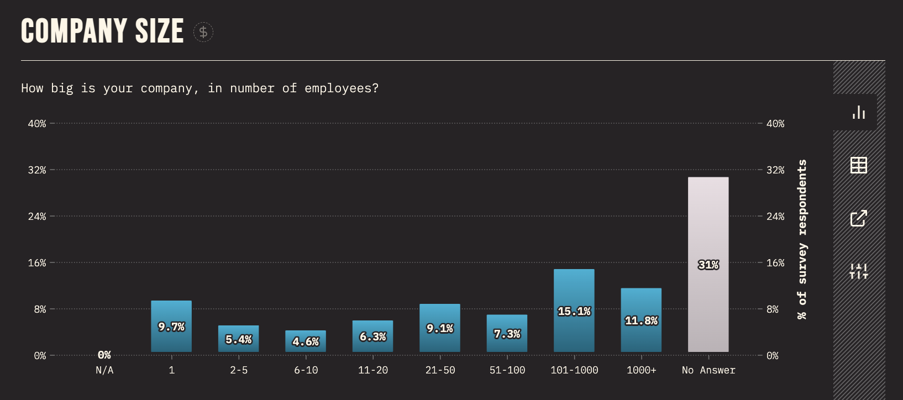

As you may know, this summer I am leading the design of the inaugural [State of HTML](../design-state-of-html/) survey.
Naturally, I am also exploring ways to improve both survey UX, as well as all questions.

*Shaine Madala*, a data scientist working on the survey design team [proposed](https://github.com/Devographics/surveys/discussions/166#discussioncomment-6625819) using numerical inputs instead of brackets for the income question.
While [I was initially against it](https://github.com/Devographics/surveys/discussions/166#discussioncomment-6626156),
I decided to explore this a bit further, which changed my opinion.

<!-- more -->

There are actually four demographics questions in *State of X* surveys where the answer is essentially a number, yet we ask respondents to select a bracket:
age, years of experience, company size, and income.

The arguments for brackets are:
1. They are more privacy preserving for sensitive questions (e.g. people may feel more comfortable sharing an income bracket than their actual income)
2. They are more efficient to input (one click vs homing to keyboard and hitting several keystrokes).
3. In some cases respondents may not know the precise number offhand (e.g. company size)

The arguments for numerical input are:
1. Depending on the specifics, these can actually be faster to answer overall since they involve lower cognitive overhead (for known numbers).
2. The brackets are applied at the analysis stage, so they can be designed to provide a better overview of the dataset
3. More elaborate statistics can be computed (e.g. averages, medians, stdevs, the sky is the limit)

## Which one is faster?

We can actually calculate this!
Average reading speed for non-fiction is around 240 wpm (= 250ms/word)  [^1]
Therefore, we can approximate reading time for each question by multiplying number of brackets × average words per bracket (wpb) × 250ms.

However, this assumes the respondent reads all brackets from top to bottom, but this is a rare worst case scenario.
Usually they stop reading once they find the bracket that matches their answer, and they may even skip some brackets, performing a sort of manual binary search.
We should probably **halve these times** to get a more realistic estimate.

Average typing speed is 200 cpm [^2] (≈ 300ms/character).
This means we can approximate typing time for each question by multiplying the number of digits on average × 300ms.

[^1]: https://www.sciencedirect.com/science/article/abs/pii/S0749596X19300786
[^2]: https://www.typingpal.com/en/blog/good-typing-speed

Let’s see how this works out for each question:

| Question | Brackets | WPB | Reading time | Avg Digits | Typing time |
| -------- | -------- | --- | ------------ | ------ | ----------- |
| Age      | 8 | 4 | 4s | 2 | 0.6s |
| Years of Experience | 6 | 4 | 3s | 2 | 0.6s |
| Company size | 9 | 4 | 4.5s | 3 | 0.9s |
| Income | 7 | 2 | 1.75s | 5 | 1.5s |

As you can see, despite our initial intuition that brackets are faster, the time it takes to read each bracketed question **vastly** outweighs typing time for all questions!

Of course, this is a simplification.
There are models in [HCI](https://en.wikipedia.org/wiki/Human%E2%80%93computer_interaction), such as [KLM](https://en.wikipedia.org/wiki/Keystroke-level_model) that can more accurately estimate the time it takes for certain UI flows.
We even taught some of these to MIT students in [6.813](http://web.mit.edu/6.813/www/sp18/classes/10-more-efficiency/#keystroke_level_model),
as well as [its successor](https://designftw.mit.edu/).

For example, here are some of the variables we left out in our analysis above:
- When answering with numerical input, most users need to home from mouse to keyboard, which takes time (estimated as 0.4s in KLM)
and then focus the input so they can write in it, which takes an additional click (estimated as 0.2s in KLM)
- When answering with brackets, users need to move the mouse to the correct bracket, which takes time (KLM estimates all pointing tasks as a flat 1.1s, but this can be more accurately estimated using [Fitts’ Law](https://en.wikipedia.org/wiki/Fitts%27s_law))
- We are assuming that the decision is instantaneous, but doing the mental math of comparing the number in your head to the bracket numbers also takes time.

However, given the vast difference in times, I don't think a more accurate model would change the conclusion much.

Note that this analysis is based on a desktop interface, primarily because it’s easier (most of these models were developed before mobile was widespread, e.g. KLM was invented in 1978!)
Mobile would require a separate calculation taking into account the specifics of mobile interaction (e.g. the time it takes for the keyboard to pop up), though the same logic applies.
(thanks Tim for [this exellent question](https://twitter.com/gumnos/status/1687199431819763712)!)

## What about sliders?

Sliders are uncommon in surveys, and for good reason.
They offer the most benefit in UIs where changes to the value provide **feedback**, and allow users to **iteratively approach the desired value by reacting to this feedback**.
For example:
- In a color picker, the user can zero in to the desired coordinates iteratively, by seeing the color change in real time
- In a video player, the user can drag the slider to the right time by getting feedback about video frames.
- In searches (e.g. for flights), dragging the slider updates the results in real time, allowing the user to gradually refine their search with suitable tradeoffs

In surveys, there is usually no feedback, which eliminates this core benefit.

When the number is known in advance, sliders are usually a poor choice, except when we have very few numbers to choose among (e.g. a 1-5 rating)
and the slider UI makes it very clear where to click to select each of them, or we don't much care about the number we select (e.g. search flights by departure time).[^3]
None of our demographics questions falls in this category (unless bracketed, in which case why not use regular brackets?).

[^3]: [Slider Design: Rules of Thumb, NNGroup, 2015](https://www.nngroup.com/articles/gui-slider-controls/)

There are several reasons for this:
- It is hard to predict where exactly to click to select the desired number. The denser the range, the harder it is.
- Even if you know where to click, it’s [hard to do so on mobile](https://www.nngroup.com/articles/gui-slider-controls/#:~:text=Imprecise%20Interactions)
- Dragging a slider on desktop is generally slower than typing the number outright.[^4]

[^4]: KLM is a poor model for dragging tasks for two reasons:
First, it regards dragging as simply a combination of three actions: *button press, mouse move, button release*.
But we all know from experience that dragging is much harder than simply pointing, as managing two tasks simultaneously (holding down the mouse button and moving the pointer) is almost always harder than doing them sequentially.
Second, it assumes that all pointing tasks have a fixed cost (1.1s), which may be acceptable for actual pointing tasks, but the inaccuracy is magnified for dragging tasks.
A lot of HCI literature (and even [NNGroup](https://www.nngroup.com/articles/gui-slider-controls/#:~:text=subjected%20to%20the-,steering%20law,-%2C%20which%20describes%20the)) refers to the [Steering Law](https://en.wikipedia.org/wiki/Steering_law) to estimate the time it takes to use a slider,
however modern sliders (and scrollbars) do not require steering, as they are not constrained to a single axis:
once dragging is initiated, moving the pointer in any direction adjusts the slider, until the mouse button is released.
[Fitts Law](https://en.wikipedia.org/wiki/Fitts%27s_law) actually appears to be a better model here, and indeed there are [many papers](https://scholar.google.com/scholar?hl=en&as_sdt=0%2C22&q=fitts+law+dragging) extending it to dragging.
However, evaluating this research is out of scope for this post.

## `<input type=number>` all the things?

Efficiency is not the only consideration here.
Privacy is a big one. These surveys are anonoymous, but respondents are still often concerned about entering data they consider sensitive.
Also, for the efficiency argument to hold true, the numerical answer needs to be top of mind, which is not always the case.

I summarize my recommendations below.

### Age

This is a two digit number, that is always top of mind. **Number input.**

### Years of experience

This is a 1-2 digit number, and it is either top of mind, or very close to it. **Number input.**

### Company size

While most people know their rough company size, they very rarely would be able to provide an exact number without searching.
This is a good candidate for **brackets**.
However, the number of brackets should be reduced from the current 9 (does the difference between 2-5 and 6-10 employees really matter?),
and their labels should be copyedited for scannability.

We should also take existing data into account.
Looking at the [State of CSS 2022 results for this question](https://2022.stateofcss.com/en-US/demographics/#company_size),
it appears that about one third of respondents work at companies with 2-100 people,
so we should probably not combine these 5 brackets into one, like I was planning to propose.
101 to 1000 employees is also the existing bracket with the most responses (15.1%), so we could narrow it a little,
shifting some of its respondents to the previous bracket.

Taking all these factors into consideration,
I proposed the following brackets:

- Just me!
- Small (2 - 50)
- Medium (51 - 200)
- Large (201 - 1000)
- Very Large (1000+)

### Income

The question tht started it all is unfortunately the hardest.

Income is a number that people know (or can approximate).
It is faster to type, but only marginally (1.75s vs 1.5s).
We can however reduce the keystrokes further (from 1.5s to 0.6s on average) by asking people to enter thousands.

The biggest concern here is **privacy**.
Would people be comfortable sharing a more precise number?
We could mitigate this somewhat by explicitly instructing respondents to round it further, e.g. to the nearest multiple of 10:

<blockquote class="question">
<strong>What is your approximate yearly income (before taxes)?</strong>
<small>
Feel free to round to the nearest multiple of 10 if you are not comfortable sharing an exact number.
If it varies by year, please enter an average.
</small>
 
<label>$<input type=number size=3> ,000</label>
</blockquote>

However, this assumes that the privacy issues are about granularity, or about the number being too low (and rounding to 10s could help with both).
However, [David Karger](https://people.csail.mit.edu/karger/) made an excellent point in [the comments](https://lea.verou.me/blog/2023/numbers-vs-brackets/#comment-6246846722),
that people at the higher income brackets may also be reluctant to share their income:

> I don't think that rounding off accomplishes anything. It's not the least significant digit that people care about, but the most significant digit. This all depends on who they imagine will read the data of course. But consider some techy earnings, say 350k. That's quite a generous salary and some people might be embarrassed to reveal their good fortune. Rounding it to 300k would still be embarrassing. On the other hand, a bracket like 150 to 500 would give them wiggle room to say that they're earning a decent salary without revealing that they're earning a fantastic one. I don't have immediate insight into what brackets should be chosen to give people the cover they need to be truthful, but I think they will work better for this question.

I wonder if the solution may instead be to offer UI that lets users indicate that the number they have entered is actually an upper or lower bound.

<blockquote class="question">
<strong>What is your approximate yearly income (before taxes)?</strong>
<select>
<option selected>About</option>
<option>Over</option>
<option>Under</option>
<option>Exactly</option>
</select>
<label>$<input type=number size=3> ,000</label>
</blockquote>

Of course, a dropdown PLUS a number input is much slower than using brackets,
but if only a tiny fraction of respondents uses it, it does not affect the analysis of the average case.

## Conclusion

I’m sure there is a lot of prior art on the general dilemma on numerical inputs vs brackets,
but I wanted to do some analysis with the specifics of this case and outline an analytical framework for answering these kinds of dilemmas.

That said, if you know of any relevant prior art, please share it in the comments!
Same if you can spot any flaws in my analysis or recommendations.

You could also [check out the relevant discussion](https://github.com/Devographics/surveys/discussions/177) as there may be good points there.