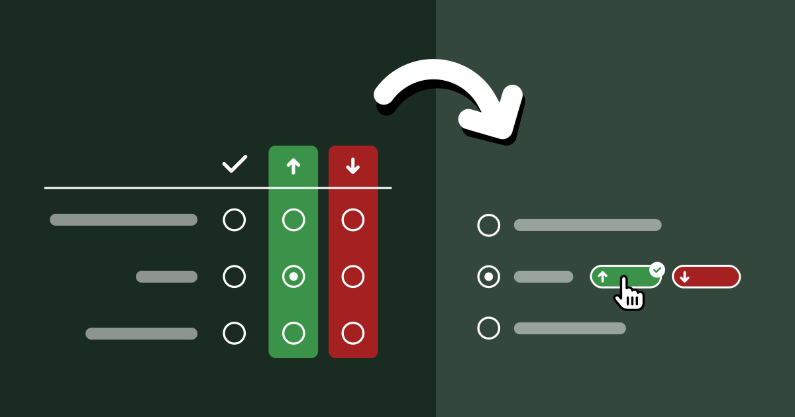
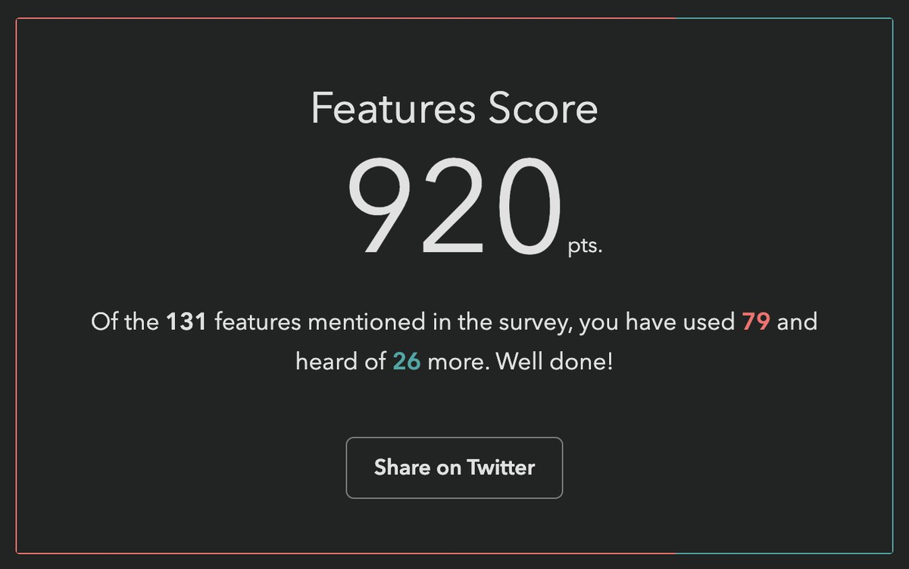

One would think that we've more or less figured survey UI out by now.
Multiple choice questions, checkbox questions, matrix questions, dropdown questions, freeform textfields, numerical scales,
_what more could one possibly need_?!

And yet, every time Google sponsored me to lead one of the [State Of ... surveys](https://devographics.com), and _especially_ the inaugural [State of HTML 2023 Survey](../../2023/state-of-html-2023/),
I kept hitting the same wall; I kept feeling that the established options for answering UIs were woefully inadequate for
**balancing the collection good insights with minimal friction for end-users**.

The [State Of](https://www.devographics.com/) surveys used a completely custom survey infrastructure,
so I could often (but not always) convince engineering to implement new question UIs.
After [joining Font Awesome](../awesome/), I somehow found myself leading [yet another survey](https://survey.awesome.me/?from=lv_blog), despite swearing never to do this again. 🥲
Alas, building a custom survey UI was simply not an option in this case; I had to make do with the existing options out there [^tally], so I felt this kind of pain to my core once again.

[^tally]: Unlike Devographics, surveys are not FA’s core business, so the Impact/Effort tradeoff simply wasn’t there for a custom UI, at least at this point in time. I ended up going with [Tally](https://tally.so), mainly due to the flexibility of its conditional logic and its support for code injection (which among other things, allowed me to use FA icons — a whopping 120 different ones!).

So what are these cases where the existing answering UIs are inadequate, and how could better ones help?
I’m hoping this case study to be Part 1 of a series around how survey UI innovations can help balance tradeoffs between user experience and data quality, though this is definitely the one I’m most proud of, as it was such a bumpy ride, but it was all worth it in the end.

<!-- more -->

## The Problem

For context, the body of State Of surveys is a series of *"Feature questions"*,
which present the respondent with a certain web platform feature and ask if they had heard of it or used it.
Feature questions look like this:

<figure>

<figcaption>
An example of a feature question from the State of CSS 2022 survey.
</figcaption>
</figure>

Respondents get a score in the end, based on how many of these they had heard of or used.
Each survey had dozens of these questions.
Based on initial estimates, State of HTML was going to have at least **fifty**.

<figure class="float">

<figcaption>
This was my score. We revamped the scoring system for this iteration and switched from a percentage to a point-based score,
since not all questions were equally weighted.
</figcaption>
</figure>

**Respondents *love* these questions.**
They learn about new things they may not have heard of, and get to test their knowledge.
But also, from the survey designer’s perspective, they gamify a (very long) survey, increasing completion rates,
and provide users incentive to share their score on social media, spreading the word.

One would expect that they also provide valuable data, yet browser vendors had repeatedly mentioned that this data was largely useless to them.
Surveys were all about what people _felt_, not what they knew or had used — they had better ways to gauge those.
Instead, **the reason they funneled thousands into funding these surveys every year was the 1-2 pain points questions** towards the end.
That was it.
Survey data on experience and awareness _could_ be useful, but only if it was accompanied with subjective sentiment data:
if they hadn't used it or heard about it, were they interested? If they had used it, how did it _feel_?

<figure class="float">

<video src="videos/comments.mp4" loop muted loading="lazy" autoplay playsinline></video>
<figcaption>
Optional freeform comments had been added the year prior, but got an abysmally low response rate,
and being entirely freeform, were hard to analyze.
</figcaption>
</figure>

As an attempt to address this feedback, a button that opened a freeform comment field had been introduced the year prior, but response rates were abysmally low,
starting from **0.9%** for the first question [^1] and dropping further along the way.
This was no surprise to me: freeform questions have a dramatically lower response rate than structured questions,
and hidden controls get less interaction (*"out of sight, out of mind"*).
But even if they had a high response rate, freeform comments are notoriously hard to analyze, especially when they are so domain specific.

[^1]: Meaning out of the people who responded to that question about their experience with a feature, only 0.9% left a comment.

## Ideation

Essentially, the data we needed to collect was a combination of two variables: **experience** and **sentiment**.
Collecting data on two variables is common in survey design, and typically implemented as a matrix question.

<figure class="center">

| 		| 🤷 | 👍 | 👎 |
|-------|----|----|----|
| Never heard of it | <input type=radio name=matrix> | <input type=radio name=matrix> | <input type=radio name=matrix> |
| Heard of it | <input type=radio name=matrix> | <input type=radio name=matrix> | <input type=radio name=matrix> |
| Used it  | <input type=radio name=matrix> | <input type=radio name=matrix> | <input type=radio name=matrix> |

<figcaption>
If user experience and cognitive load were not a concern, the same data could actually be collected with a matrix question.
</figcaption>
</figure>

Indeed, if there were only a couple such questions, a matrix could have been acceptable.
But …could you imagine filling out 50 of these?

An acceptable solution needed to add **minimal friction for end-users**:
there were at least 50 such questions, so any increase in friction would quickly add up — even one extra click was pushing it.
And we needed a sufficiently **high response rate** to have a good <abbr title="Confidence Interval">CI</abbr>.
But it also needed to facilitate **quantitative** data analysis.
Oh, and all of that should involve **minimal engineering effort**, as the (tiny) engineering team was already stretched thin.

Did I hear anyone say _overconstrained_? 😅

### Idea 1: Quick context

Initially, I took these constraints to heart.
Misguided as it may have been, the comment field and the infrastructure around it already existed, so I designed a UI that revealed relevant positive/negative sentiment options using contextual [progressive disclosure](https://www.nngroup.com/articles/progressive-disclosure/).
These **inserted predefined responses** into the comment field with a single click.

Being a purely client-side interaction meant it could be implemented in a day, and it _still_ kept end-user friction at bay:
providing sentiment was optional and only required a single click.

In theory, quantitative data analysis was not optimally covered, as freeform responses are notoriously hard to analyze.
However, based in the psychology of user behavior, I hypothesized that **the vast majority of users would not edit these at all**, a minority would append context, and an even tinier minority would actually edit the responses.
This meant we could analyze them via simple string matching and only lose a few false negatives.

<figure>
<video src="videos/quick-context.mp4" loop muted loading="lazy" autoplay playsinline></video>
<figcaption>
Mockup of the quick context idea.
</figcaption>
</figure>

I was very proud of myself: I had managed to design a solution that satisfied all constraints, a feat that initially seemed impossible!
Not to mention this design gently guided users towards using the comment field, which could motivate them to add even more context.

Yet, when I presented my mocks to the team, engineering _hated_ it with a passion.
The lead engineer (who was also the project founder) found the idea of **turning a structured interaction into unstructured data _deeply_ unsettling**.
So much it motivated him to implement a whole backend to store these followups properly, something I had initially thought was out of the question.

So now what?
Back to the drawing board, but with one constraint lifted!

### Ideas 2 & 3: Followups and sentiment radios

<figure>

<figcaption>
Mockups of intermediate ideas.
Left: Followups (by lead engineer)
Right: Sentiment radios (by Google PM)
</figcaption>
</figure>

This new backend came with a UI proposal that raised red flags for both me and the Google PM I was collaborating with (one of the survey's core stakeholders, but not the main one).
Even *seeing* the followup UI required an extra click, so it was guaranteed to have a low response rate.
It would have been better than the 0.9% of the comment field (clicking is easier than typing!), but still pretty low (I would estimate < 15%).
And even when users were intrinsically motivated to leave feedback, **two clicks and a popover was a steep price** to pay.

<aside>

#### "Two clicks and a popover"

Perceived friction is not just about the number of clicks and keystrokes, but also about the number of *context switches*.
The bigger the UI shift, the more cognitive overhead it adds, as the action is *perceived* as more substantial, even when in terms of user interaction it involves exactly the same number of steps (using simplistic models like [KLM](https://en.wikipedia.org/wiki/Keystroke-level_model)).
This is the reason why it feels smoother to have a text field that expands when you click on it,
rather than a button that makes a text field appear:
an existing control changing form is perceived as a smaller UI shift than one control disappearing and another appearing.
</aside>

Another idea came from the Google PM: **sentiment radios**.
It was an attempt to simplify the interaction by framing it as a two step process:
first experience, then sentiment, through radio buttons that slid down once a main answer was selected.
However, I was very concerned that such a major UI shift after every single answer would quickly become overwhelming over the course of the survey.

### Idea 4: Context chips

Back to the drawing board, I asked myself: if I had infinite engineering resources, what UI would I design?
The biggest challenge was reducing friction.
All ideas so far had required at least one extra (optional) click to select sentiment.
Could we do better?
**What if users could select _both_ experience _and_ sentiment with a single click?**

Guided by this, I designed a UI where selecting sentiment is done via "context chips" which are **actually part of the answer**,
so clicking them _also_ selects the answer they are accompanying, allowing users to express an answer across both variables with a single click, or just select the answer itself to express no sentiment.
To reduce visual clutter, these only faded in on hover.
Additionally, clicking on the selected chip a second time would deselect it, fixing a longstanding UX issue with radio buttons [^radios].

[^radios]: A radio group with all buttons off cannot be returned to that state by user interaction.

Over the course of designing this, I became so convinced it was the right solution, that I implemented a high fidelity prototype myself, complete with code that could be easily adapted to the infrastructure used by the survey app.

<figure>
	<video src="videos/feature-desktop.mp4" loop muted loading="lazy" autoplay playsinline style="flex: 2.9 "></video>
	<video src="videos/feature-mobile.mp4" loop muted loading="lazy" autoplay playsinline></video>
<figcaption>

The context chips prototype on desktop and mobile.
</figcaption>
</figure>

There were so many things I loved about this design, even beyond the core idea of answering both variables with a single click.
There were no layout shifts, the followups were in close proximity to the main answer, and the styling of the chips helped build a visual association to reduce friction even more as you go.
I was not a huge fan of the mobile version, but I couldn't think of a much better way to adapt this UI to mobile.

<figure>
<video src="videos/in-answer.mp4" loop muted loading="lazy" autoplay playsinline></video>
<figcaption>

Early alternative concept that supported followups.
This was deemed too complicated and was abandoned early on.
</figcaption>
</figure>

Reception of context chips was not what I had hoped at first.
I had expected pushback due to the engineering effort needed, but folks also had other concerns:
that users would find things appearing on hover distracting and feel "ambushed",
that the UI was too "weird",
that users would not discover the 1-click interaction and use it as a two-step process anyway,
and that response rate would be low because these chips were not visible upfront.

### Mini-feature questions: Context Chips + Checkboxes?

Around the same time as designing context chips, I had a relevant realization:
**we don’t actually need to know _both_ awareness and usage for all features**.

For old, widely supported features, awareness doesn’t matter, because even when it’s low, it has plateaued.
And for features that are so new they have not yet been implemented in browsers, usage is largely meaningless.
For these cases, each feature only has two states, and thus experience can be expressed with a checkbox!
This would allow us to combine questions about multiple features in one,
and we could still use context chips, albeit a little differently:

<figure>
	<video src="videos/minifeature-desktop.mp4" loop muted loading="lazy" autoplay playsinline style="flex: 3.97"></video>
	<video src="videos/minifeature-mobile.mp4" loop muted loading="lazy" autoplay playsinline></video>
<figcaption>

The mini features prototype on desktop and mobile.
</figcaption>
</figure>

While these could be used for questions that **either** discern usage **or** awareness, we decided to stick to the former, as there was a (valid) concern that having mini-feature questions whose checked state meant different things could be confusing and lead to errors.
That way, only old, lower-priority features would be relegated to this template,
and new features which tend to be higher priority for browser vendors would still get the full UI, comments and all.
Instead, to improve the experience for cutting edge features, we introduced a "Not implemented" tag next to the "Used it" option.

One disadvantage of the mini feature UI is that due to the way context chips work, it is not possible to select sentiment for features you have not used:
once you click on a chip, it also *selects* the feature, as if you had clicked on its label.
I guess it could be possible to click on a chip and then *uncheck* the feature, but that would be a very weird interaction.

### Idea 5: Existing 5-point question template

At this point, the lead engineer dredged up a question template that had been used in other surveys to ask about the respondent’s experience with various types of tooling.
Instead of separating experience and sentiment, it used a 5-point scale where each answer except the first answered *both* questions.

<figure class="float">

<figcaption>

The existing 5-point question template.
</figcaption>
</figure>

The eng lead was sold: zero engineering effort!
The Google PM was also sold: 100% response rate! (since it was **not possible to *avoid* expressing sentiment** for features you had heard or used).

I had serious reservations.
- There are arguments for even numbered [Likert scales](https://en.wikipedia.org/wiki/Likert_scale) (no neutral option), but these always involve scales of at least 4 points.
If you force people to select between two states, positive or negative, you’re simply going to get garbage data.
Neutral votes get pushed into positive votes, and the data around positive sentiment becomes useless.
- These did not allow users to express sentiment for features they had not heard of, despite these questions often including enough info for users to know whether they were interested.
- I was worried that increasing the number of upfront answers to 5 would increase cognitive load too much — and even scrolling distance, by 66%!

A UX researcher we were working with even did a [heuristic evaluation](https://www.nngroup.com/articles/how-to-conduct-a-heuristic-evaluation/) that somewhat favored the 5-point template mainly on the basis of being a more familiar UI.
The odds seemed stacked against context chips, but the upcoming usability testing could still tip the scales in their favor.

## Usability Testing to the Rescue!

Despite the lead engineer being unconvinced about the merits of context chips and being adamant that even adapting my fully functional prototype was too much work, since the prototype existed, we decided to user test it against the 5-point question and see how it compared.

We ran a [within-subjects](https://www.nngroup.com/articles/between-within-subjects/) usability study
with 6 participants ([no, they are not too few](https://www.nngroup.com/articles/why-you-only-need-to-test-with-5-users/))
recruited via social media.
Half of the survey used the 5-point template, the other half context chips.
The order of the conditions was randomized to avoid order effects.

In addition to their actual experience, we also collected subjective feedback at the end of the survey,
showing them a screenshot of each answering UI and asking how each felt.

### What worked well: Context Chips

I have run many usability studies in the last ten years, and I have never seen results as resounding as this one.
So much that we unanimously agreed to switch to context chips after the 5th participant, because the scales were so tipped in favor of context chips that nothing that happened in the last session could have tipped them the other way.

The lead engineer observed some of the sessions, and this was instrumental in changing his mind.
This was not a coincidence: when engineering is unconvinced that a certain UI is worth the implementation complexity,
it can be a good strategy to have them observe usability testing sessions.
Not only does it help prove the value to them, it also builds long-term user empathy, which makes future consensus easier.
Given the unfortunate lack of [HCI](https://en.wikipedia.org/wiki/Human%E2%80%93computer_interaction) prioritization in Computer Science curricula, this may even be their first exposure to usability testing.

_All_ of my concerns about the 5-point template were brought up by participants on their own accord, repeatedly:

- All participants *really* liked being able to express sentiment, and were vocal about their **frustration when they could not express it**.
- All but one participant (4/5) complained about **being forced into selecting a sentiment when they had no opinion**.
- Some participants even mentioned that the 5-point template felt overwhelming.

Furthermore, _none_ of the concerns about context chips were validated:

- No-one found the chips appearing on hover distracting or felt "ambushed".
- No-one struggled to understand how to use them.
- Everyone discovered the 1-click interaction pretty fast (typically within the first 2-3 questions).
But interestingly, **they still *chose* to use it as a two-step process for some of the questions**, presumably to reduce cognitive load for difficult to answer questions by breaking down the decision into two smaller ones.
The fact that this UI allowed users to make ***their own* efficiency vs cognitive load tradeoffs** was an advantage I had not even considered when designing it!
- Response rate was generally high — when people did not select sentiment, it was because they **genuinely** had no opinion, not because they couldn’t be bothered.

### What worked okay: Mini-feature Questions

[Mini-feature questions](#mini-feature-questions) did successfully help **cut down response time per feature by 75%**,
though this came at a cost:
Once more, we saw that participants *really* wanted to express sentiment, and were frustrated when they couldn’t,
which was the case for features they had not used.
Regardless, we agreed that the tradeoff was worth it for the low-priority questions we were planning to use mini-features for.

### What did not work: Context Chips on Mobile

A blind spot in our testing was that we did not test the UI on mobile.
Usability tests were conducted remotely via video call, so it was a lot easier to get participants to use their regular computers.
Additionally, stats for previous surveys showed that mobile use was a much smaller percentage in these surveys than for the web in general (~25%), so we did not prioritize it.

This was a mistake in itself: using current usage stats to inform prioritization may seem like a great idea, but it can be prone to [reverse causality bias](https://www.indeed.com/career-advice/career-development/reverse-causality).
Meaning, are people not using these surveys on mobile very much because they genuinely don’t need to,
or because the experience on mobile is subpar?
We often see this with accessibility too: people claim that it doesn’t matter because they don’t have users with disabilities,
but often they don’t have users with disabilities because their site is not accessible!

But even if 75% of users genuinely preferred to take these surveys on desktop (which is plausible, since they are long and people often do them in increments), we should at least have done a few sessions on mobile — 25% is not negligible!

Once responses started coming in, we realized that participants had trouble understanding what the up and down arrows meant, since on mobile these are shown without labels until selected.
This would have been an easy fix had it had been caught early, e.g. thumbs up/down icons could have been used instead.
This was not a huge issue, as their purpose becomes clear when selected, but it definitely adds some friction.

## Aftermath: Context Chips in the Wild

In our usability testing, we had seen a high response rate for sentiment (% of question respondents who selected sentiment),
but that is no guarantee things will play out that way post-launch as well.
When participants know they are being watched they are always more willing to engage and pay a lot more attention,
no matter how much you emphasize that they should act naturally when briefing them.
That's not their failing; it's simply human nature.

Indeed, sentiment response rates in the real-world were lower than those observed in the usability study,
but still high — ranging from 24% to 59% and averaging 38% (with the same median) **per question**, meaning that out of every ten participants that answered each question, approximately four also provided a sentiment.
This was more than enough to draw conclusions.
In fact, context chips were deemed such a success **they were later adopted by all other State Of surveys**,
even at the cost of continuity with previous years.

Against expectations, participants were **just as likely to express sentiment for features they had never heard of**,
and in fact marginally more likely than for features they had simply heard of.
In general response rates were pretty uniform across all experiences:

<figure class="center">

| Experience | Sentiment response rate (average) | Sentiment response rate (median) |
|------------|------------------------------|----------------------------|
| Never heard of it | 37.3% | 37.4% |
| Heard of it | 37.3% | 36.9% |
| Used it | 39.0% | 40.1% |
| **Overall** | **37.6%** | **37.9%** |

<figcaption>

Sentiment response rates overall and by experience (per question).
</figcaption>
</figure>

As we had observed in the user study as well, participants were **_far_ more likely to express positive rather than negative sentiment**.
Here are some interesting stats:
- The feature with the **most negative sentiment** overall across all experiences ([`<model>`](https://immersive-web.github.io/model-element/)) still only had 10% of respondents expressing negative sentiment for it, and still had **2.4x more positive sentiment** than negative (24.7% vs 10.4%)!
- In contrast, the feature with the **most positive sentiment** ([`<datalist>`](https://developer.mozilla.org/en-US/docs/Web/HTML/Element/datalist)) got a whopping 55% of respondents expressing positive sentiment (and only 4% negative).
- In fact, even the feature with the **least positive sentiment** ([Imperative Slot Assignment](https://developer.mozilla.org/en-US/docs/Web/API/HTMLSlotElement/assign) 🤔) still had way more positive sentiment (17.24%) than `<model>` had negative sentiment (10%)!
- If we look at the **ratio of positive over negative sentiment**, it ranged from **64x** (!) more positive than negative sentiment (45% vs 0.7% for landmark elements) to a mere **2.4x** times more positive sentiment (24.7% vs 10.4% for `<model>`).

The analysis presented in this section was done before the survey closed and thus includes _most_ of the data (around 90%) but not all.

### Results Visualization

Presenting all this data was another challenge.
When you have two variables, **ideally you want to be able to group results by either**.
E.g. you may be more interested in the total negative sentiment for a feature, or how many people had used it, and the results visualization should support both.
How do we design a results display that facilitates this?
Thankfully the visualizations for State Of surveys were already very interactive so interactivity was not out of the question.

I was no longer involved by then but consulted in a volunteer capacity.
My main advice was to **use proximity for clear visual grouping**, and to use a **consistent visual association for bars** that represented the same bit of data, both of which they followed.
This was the rendering they settled on for the results:

<figure>
<video src="videos/results.mp4" loop muted loading="lazy" autoplay playsinline></video>
<figcaption>
Interactive bar chart presenting two variables at once.
</figcaption>
</figure>

I think in terms of functionality this works really well.
The visual design could be improved to communicate IA better and appear less busy at first glance,
but given there is no dedicated designer in the team, I think they did a fantastic job.

## Generalizability

While this UI was originally designed to collect sentiment about the selected option in a multiple choice question,
I think it could be **generalized to improving UX for other types of two variable questions**.
Generally, it can be a good fit when we have questions that collect data across two variables and:
1. The second variable is **optional** and lower priority than the first
2. The first variable is **exclusive** (single) choice, i.e. not checkbox questions.

The core benefit of this approach is the **reduction in cognitive load**.
It is [well established that matrix questions are more overwhelming](https://journals.sagepub.com/doi/full/10.1177/0894439316674459).
This design allows questions to initially appear like a simple multiple choice question, and only reveal the UI for the second variable upon interaction.
Additionally, while matrix questions force participants to decide on both variables at once, this design allows them to make their own tradeoff of cognitive load vs efficiency, treating the UI as single step or two step as they see fit.

Another benefit of this design is that it allows for **option labels to be context-dependent** for the second variable, whereas a matrix limits you to a single column header.
In the sentiment case, the labels varied depending on whether the feature had been used (_"Positive experience"_ / _"Negative experience"_) or not (_"Interested"_ / _"Not interested"_).

The more such questions a survey has, the bigger the benefits — if it’s only about a couple questions,
it may not be worth the implementation complexity,
though I’m hoping that survey software may eventually provide this out of the box so that this is no longer a tradeoff.

That said, matrix questions _do_ have their benefits, when used appropriately, i.e. when the two requirements listed above are not met.

Matrix questions have an big edge when users need to make **a single selection per row**,
especially when this may be the same answer for multiple rows, which means they can just **tick down a whole column**.
Context chips do not allow users to build this positional association, as they are not aligned vertically.
THey are placed right after the answer text, and thus their horizontal position varies per answer.
To mitigate this, it can be useful to color-code them and maintain the same color coding consistently throughout the survey so that participants can build a visual association [^colorblind].

[^colorblind]: The ~9% of people with atypical color vision won’t benefit, but that’s okay in this case,
as color is used to add an extra cue, and not an essential part of the interface.

Context chips also **enforce a clear prioritization** across the two variables:
the question is presented as a multiple choice question across the first variable,
with the chips allowing the respondent to provide optional additional context across a second variable.
Matrix questions allow presenting the two variables with the same visual weight,
which could be desirable in certain cases.
For example, there are cases when we don’t want to allow the respondent to provide an answer to the first variable without _also_ providing an answer to the second.

## Lessons Learned

In addition to any generalizable knowledge around survey design, I think this is also an interesting product management case study, and teaches us several lessons.

### Never skimp on articulating the [north star UI](../../2023/eigensolutions/#nsui)

Start any product design task by **ignoring ephemeral constraints** (e.g. engineering resources) and first reach consensus on what the optimal UI is, _before_ you start applying constraints.
Yes, you read that right.
I want to write a whole post about the importance of north star UIs, because this is one of many cases over the course of my career where tight implementation constraints were magically lifted, either due to a change of mind, a change in the environment, or simply someone's brilliant idea.
Without consensus on what the north star UI is (or even a clear idea about it) you then have to go back to the drawing board when this happens.

### User testing is also a consensus-building tool

You probably already know that usability testing is a great tool for improving user experience,
but there is a second, more strategic hidden utility to it: consensus building.

I’ve been in way, **_way_** too many teams where UI decisions were made by **hypothesizing about user behavior**, which could not only be missing the mark, but also there is no way forwards for disagreements.
What do you do, hypothesize harder?
When there is user testing data, it is much harder to argue against it.

This is especially useful in convincing engineering that a certain UI is worth the implementation complexity,
and having engineers observe usability testing sessions can be an educational experience for many.

### Heuristic evaluations are not a substitute for usability testing

There are many things to like about [heuristic evaluations](https://www.interaction-design.org/literature/topics/heuristic-evaluation?srsltid=AfmBOoq-_ZLU1ObBeZI5GJYZBlWSI4uRNlwL6_7W1hwKloKHw-54l29n) and [design reviews](https://en.wikipedia.org/wiki/Design_review).
They can be done by a usability expert alone and can uncover numerous issues that would have taken multiple rounds of usability testing, especially if they are also a domain expert.
Fixing the low hanging fruit issues means user testing time can be spent more efficiently, uncovering less obvious problems.
That are  are also certain types of issues that can _only_ be uncovered by a heuristic evaluation, such as _"death by a thousand paper cuts" type issues: small issues that are not a big deal on their own and are too small to observe in a user study, but add up to more friction.

However, a big downside of these is that they are inherently **prone to bias**.
They can be excellent for finding problems that may have been overlooked and are often obvious once pointed out.
However (unless the number of evaluators is large), they are not a good way to decide between alternatives.
