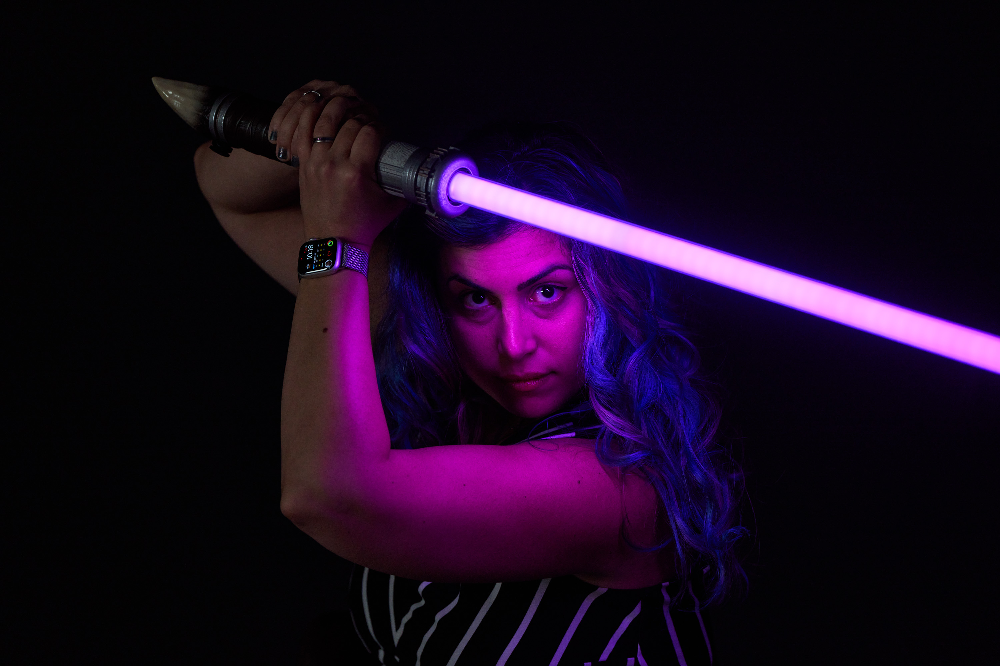

<figure class="full-width">

<figcaption>

Photo taken by [Max Wilkinson](https://madebyprisma.com/) in 2024.
</figcaption>
</figure>

My name is Lea[^firstname] Verou[^lastname] and
I’ve had a rather unusual career path, but one thing has been constant since childhood:
**my obsession with making things that make people’s lives easier**.

[^firstname]: Lea being short for Michaelia, or Μιχαήλια in my native Greek.

[^lastname]: Until 2013 I officially had both my parents’ surnames (Komvouti-Verou / Κομβούτη-Βέρου) though I had been going by Lea Verou for over a decade, Verou being my mom’s surname. When she died in 2013, I did the paperwork to make it official. I love that my parents left the choice up to me and not the patriarchy, and did the same with my own daughter.

This drive has taken me through product, entrepreneurship, engineering, graphic design, web standards, and a decade of scientific research and teaching at [MIT](http://mit.edu).
My career spans 20 years of experience in the tech industry, and for the last 15 I have largely focused around creator tools, or as I like to call it, **“making things for making things”**.

A few places this has led me to:
- I currently work as **Product Lead** at [Font Awesome](https://fontawesome.com/), building tools that make it easy to create [awesome Web UIs](https://webawesome.com/), [for everyone](https://lea.verou.me/blog/2024/awesome/).
- I hold a PhD from [MIT](http://mit.edu) in usability (Human-Computer Interaction as the academic field is known) and Programming Language design, where I researched how to make web programming easier.
- I spent 4 years as an elected [W3C Technical Architecture Group (TAG)](https://en.wikipedia.org/wiki/Technical_Architecture_Group) member **reviewing proposed web technologies for usability and architectural consistency**,
and documenting the patterns as [Web Platform Design Principles](https://w3.org/TR/design-principles/).
- I have designed [several web technologies](/specs) that have shipped in every browser and are used by the millions of web developers. Most of them have been around CSS, as have been one of the few Invited Experts of the [W3C CSS Working Group](http://www.w3.org/Style/CSS/members.en.php3) since 2012.
- I have launched [dozens of open source dev tools](http://github.com/leaverou), with the two most popular ones being
[PrismJS](http://prismjs.com), a widely used syntax highlighter with [millions of weekly downloads](https://www.npmjs.com/package/prismjs) and [**almost 2 billion total downloads**](https://npm-stat.com/charts.html?package=prismjs&from=2012-07),
and [Color.js](https://colorjs.io), a color manipulation library with over [35 million npm downloads](https://limonte.dev/total-npm-downloads/?package=colorjs.io).
- As a consultant, my clients include [Google](https://google.com), [Mozilla](https://mozilla.com), [O’Reilly](https://oreilly.com), [Wix](https://wix.com), Stripe,  McKinsey & Company, and many others.

While I definitely prefer _doing over teaching_, I do love sharing knowledge, and have a long track record of doing so:

- I have travelled the world, [giving over 100 invited talks at web conferences in 4 continents](http://lea.verou.me/speaking)
- I wrote a [bestselling CSS book](http://www.amazon.com/CSS-Secrets-Lea-Verou/dp/1449372635?tag=leaverou-20) that was translated into 8 languages and dubbed ["Best CSS book" by the Chicago Tribune](https://www.chicagotribune.com/consumer-reviews/sns-bestreviews-electronics-the-best-css-book-20200701-kda2pyikobda5o3c4ivi4wzfui-story.html),
- Together with [David Karger](https://en.wikipedia.org/wiki/David_Karger), I [co-designed and co-taught an MIT course](https://designftw.mit.edu) combining my two passions: usability and web technologies. After we taught it thrice, it became a permanent subject (6.4500).
- I have written several [articles](https://lea.verou.me/publications/#articles) in various well-known industry publications,
- I have worked at [W3C](http://w3.org) as a Developer Advocate.

In the more distant past, I grew up in Lesbos, Greece [^lesbos], and started my career at the same time as my studies, in 2005.
For the first few years I freelanced across the whole spectrum, from traditional graphic design to full-stack web development.
In 2008 I **co-founded a startup** around a set of communities which organically reached nearly **1% of the country’s population** as registered users (and many more as visitors); a level of national penetration rarely achieved without paid acquisition.
I left the company in 2011 and it was sold in 2013.

[^lesbos]: I used to joke that this makes me _geographically Lesbian_.
I stopped when I realized that most people had no idea that ["Lesbian" literally means "person from Lesbos"](https://en.wikipedia.org/wiki/Lesbian#Etymology) and thought I was simply making a pun. 🤦🏽‍♀️

If any of this seems relevant,
I am open to particularly interesting [consulting](/consulting) opportunities in a limited capacity.
<a class="contact">Email me</a> for more.

<!--
I also have a CV! It’s just as infrequently updated as other CVs, but here it is if you want it:

<a href="http://lea.verou.me/view-cv.png "View my CV")](https://cv.verou.me/" class="cta">http://lea.verou.me/view-cv.png "View my CV")](https://cv.verou.me/</a>
-->

