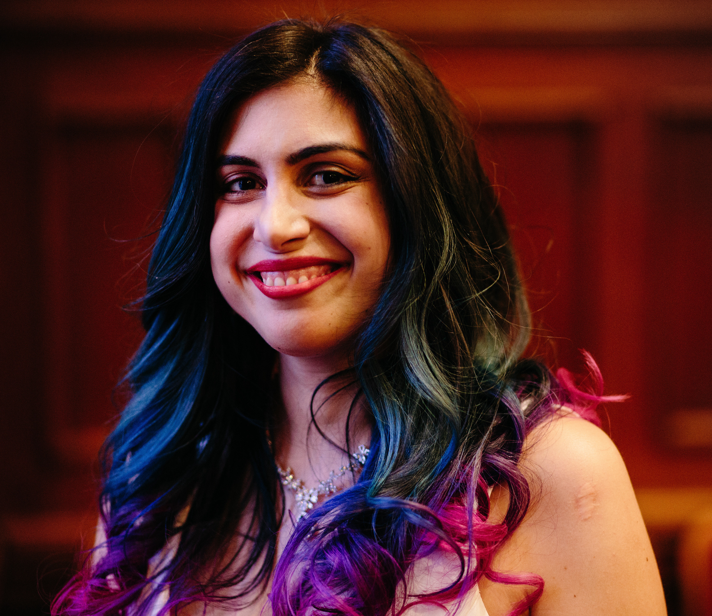

<figure class="right">
	
	<figcaption>Photo taken in 2018 by Kelly Benvenuto</figcaption>
</figure>

My name is Lea Verou[*](#lastname-note) (Lea being short for Michaelia or Μιχαήλια) and I wear many hats.
My day job is researching how to make web programming easier at [MIT CSAIL](http://csail.mit.edu), working with [David Karger](https://en.wikipedia.org/wiki/David_Karger) in the [Haystack](http://haystack.csail.mit.edu/) group.

I have a long-standing passion for open web standards.
I’m an elected [W3C Technical Architecture Group (TAG)](https://www.w3.org/groups/other/tag) member as of Jan 2021.
The TAG is a special W3C working group that ensures all new Web technologies are [well-designed and consistent with the rest of the Web Platform](https://w3ctag.github.io/design-principles/), and [do not expose Web users to harm](https://w3ctag.github.io/ethical-web-principles/).
I’ve been one of the few Invited Experts of the [W3C CSS Working Group](http://www.w3.org/Style/CSS/members.en.php3) since 2012 and [co-edit several CSS specifications](https://lea.verou.me/publications/#specifications), so if you’re a Web developer, you probably use bits of my work daily.
In the past, I have also worked at [W3C/MIT](http://w3.org) as a Developer Advocate.

I love sharing knowledge and have [given over 100 invited talks at web design/web development conferences around the world](http://lea.verou.me/speaking).
My talks are known for their interactive style and are often [cited](https://bradfrost.com/blog/post/on-speaking/#:~:text=demonstrate%20your%20points.-,Don%E2%80%99t%20live%20code,-%E2%80%93%20This%20applies%20to) as one of the few examples of live coding that doesn’t suck.
I have also written a [bestselling book on advanced CSS](http://www.amazon.com/CSS-Secrets-Lea-Verou/dp/1449372635?tag=leaverou-20) and several [articles](https://lea.verou.me/publications/#articles).

<figure class="left">
	
	<figcaption>Selfie from 2018 to commemorate my (still unbroken) personal record number of hair colors 😅</figcaption>
</figure>

I love designing and building tools that enhance people’s lives and/or make their tasks easier and have designed and launched over 30 tools, most of them open source.
Some of them are:
- [Mavo](https://mavo.io), the programming language I developed while at MIT to make full stack development as easy as writing HTML (which is also my research at MIT),
- [PrismJS](http://prismjs.com), a syntax highlighter literally used all over the Web, with [8M weekly](https://www.npmjs.com/package/prismjs) and ~1 **billion** total downloads),
- and [many others](http://github.com/leaverou).

I hold a MSc in Computer Science from [MIT](https://web.mit.edu/) and a BSc in Computer Science from [Athens University of Economics and Business](http://aueb.gr/), and I’m currently finalizing a PhD at MIT.
Despite my technical pursuits, I’m one of the few misfits who love code and design equally.

In the more distant past, I grew up in Greece, and started my career at the same time as my studies, in 2005. For the first few years I was freelancing for graphic design and web development projects, and in 2008 I co-founded a startup called [Fresset Ltd](http://www.fresset.gr) there. It created and managed several popular Greek community websites that my co-founder and I had created since 2005. I left in 2011 and the company was sold in 2013.

You can email me at **lea＠verou.me** ([don’t copy/paste it](/blog/2009/11/yet-another-email-hiding-technique/)) if you are so inclined.

<!--
I also have a CV! It’s just as infrequently updated as other CVs, but here it is if you want it:

<a href="http://lea.verou.me/view-cv.png "View my CV")](https://cv.verou.me/" class="call-to-action">http://lea.verou.me/view-cv.png "View my CV")](https://cv.verou.me/</a>
-->

&ast; _Until 2013 I officially had both my parents’ last names (Komvouti-Verou / Κομβούτη-Βέρου) though I had been going by Lea Verou for over a decade. In 2013 I finally did the paperwork to only keep my mother’s surname, for simplicity and brevity. I think it’s awesome that my parents left the choice up to me, and not the patriarchy, and I have strong opinions [on last name politics](https://pensieve.verou.me/post/40603145637/on-last-name-politics). Of course, my daughter also has both my and my husband’s last names._ 😊