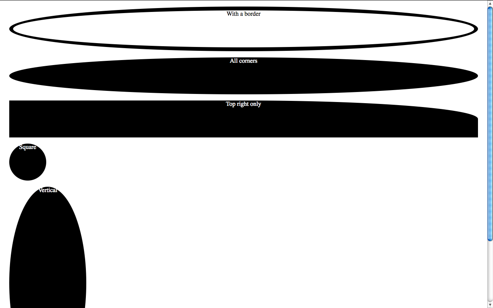
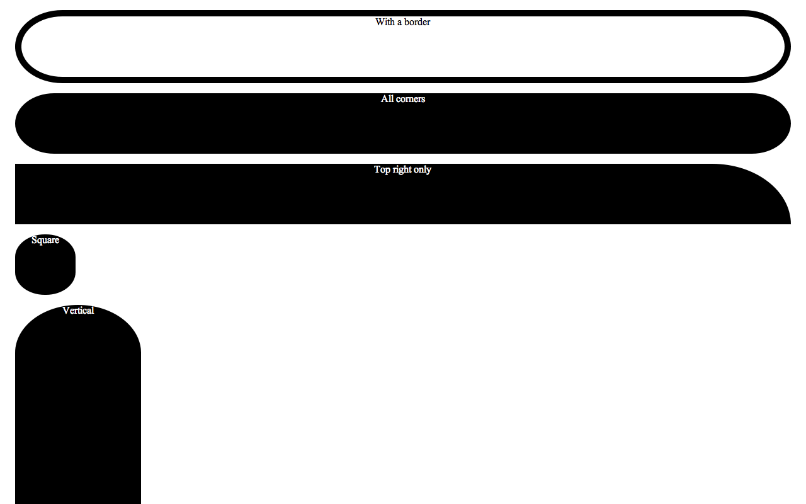

Admittedly, percentages in border-radius are not one of the most common use cases. Some even consider them an edge case, since most people seem to set border-radius in pixels or --rarely-- ems. And since it's not used very frequently, it's still quite buggy. A bit of a chicken and egg case actually: Is it buggy because it's used rarely or is it used rarely because it's buggy? My vote would go to the first, so the purpose of this post is to let people know about why percentages in border-radius are incredibly useful and to highlight the various browser whims when it comes to rendering them.

## Specification

Before we go into discussing implementations, let's first examine what the right thing to do is, i.e. what [the specification says](http://www.w3.org/TR/2010/WD-css3-background-20100612/#the-border-radius):

> Percentages: Refer to corresponding dimension of the border box.

> The two length **or percentage** values of the ‘border-\*-radius’ properties define the radii of a quarter ellipse that defines the shape of the corner of the outer border edge (see the diagram below). The first value is the horizontal radius, the second the vertical radius. If the second value is omitted it is copied from the first. If either length is zero, the corner is square, not rounded. **Percentages for the horizontal radius refer to the width of the border box, whereas percentages for the vertical radius refer to the height of the border box**.

## Why is that useful?

It's the only way of utilizing border-radius to draw a circle or ellipse, i.e. **a rounded shape without any straight lines whatsoever** (without knowing the dimensions in advance).

As you will see below, Firefox used to have a bug, or actually a different interpretation of the spec, which I think is a quite commonly needed use case, even more than ellipses: It **always drew a regular curve** for the corners (quarter of a circle) **with the maximum possible radii**. This is a **very commonly needed shape** in UI design. If you're using OSX, you're seeing it everywhere: the buttons, the scrollbars, even Skype (notice the blue or grey shading around the usernames in a chat). As I'm writing this post, I can see the same shape in the buttons of Wordpress' admin panel. And as the current spec stands, there's no way to do that. You have to know the height (or width, if you want a vertical shape) in advance, which even when possible, makes border-radius depend on the value of other attributes (such as line-height) and you have to remember to change it every time you change those, which causes maintenance headaches. And what's worse is that the Backgrounds & Borders module is almost done, so it's quite unlikely that this will change anytime soon. :(

As noted in [this comment by David Baron](http://lea.verou.me/2010/10/the-curious-case-of-border-radius50/#comment-1516), that assumption wasn't exactly correct about Firefox's old rendering. It just resolved % as relative to width in every case (kinda like percentages in margins) and when the height was smaller than the width, it applied the rules for radii that are too big, which say to reduce it equally. A straightforward deduction is that we do have a standards-compliant way to get the behavior from old versions of Firefox, in every browser: Just specify a very big radius, like 9999px.

## Different implementations, different bugs

<figure class="left">

<figcaption>Firefox 4 beta 6</figcaption>
</figure>

As I mentioned above, **Gecko** up to Firefox version 4 beta 6 always draws a regular curve for the corners with the largest radii applicable, resulting in a shape that is either a perfect circle or a rectangle with a semicircle on top and bottom (if height > width) or right and left (if width > height).

<figure class="right">

<figcaption>Minefield (latest Gecko nightlies)</figcaption>
</figure>

In the latest nightlies this bug is fixed, and it follows the spec to the letter. I can't help but wonder if this was a bug, a misinterpretation of the spec or a deliberate disagreement with it.

<figure class="left">

<figcaption>WebKit nightlies</figcaption>
</figure>

**Webkit** was late to support percentages in border-radius, but it seems to be the first (it or IE9, I'm not sure) to follow the spec to the letter --concerning corner radii at least-- and renders an ellipse (horizontal radius = width/2, vertical radius = height/2) no matter what. Webkit however seems to be having serious trouble with borders, rendering them with variable width strokes (!).

<figure class="right">

<figcaption>Opera 11</figcaption>
</figure>

**Presto** (Opera) is the weirdest when it comes to rendering a percentage border-radius. I can't figure out the algorithm it uses to determine the radii of the corners even if it was to save my life, it even changes according to window size in my testcases! Since I've been using border-radius:50% regularly, I've had the pleasure of observing Opera's rendering in many different designs and I still can't find a pattern. It's particularly funny when rendering the little fuchsia comment bubbles in the homepage of my blog: Every one of them has a different radius, even if they are about the same size. It even got one of them right and rendered it as an ellipse once!

<figure class="left">

<figcaption>Internet Explorer 9</figcaption>
</figure>

**Trident (IE9)**, along with the latest Gecko nightly is the only 100% correct one when it comes to rendering the testcases, which is not surprising since the IE team boasted quite a lot for their bulletproof border-radius implementation. Well, their CSS3 support might be a bit lacking, but at least the bits they actually implement aren't buggy. Kudos for that.

[Link to testcases](http://lea.verou.me/demos/border-radius-50p.html)

**Note:** Of course all bugs mentioned above have been reported to the respective browser vendors (except the Gecko one that is already fixed in the nightlies).
