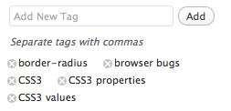

I had to build the edit tags interface for an application I'm working on, so I took a good look at how these are implemented across many popular applications nowadays. It seems there are a few patterns that are used over and over, and I'm unsure which one is the most preferable by users, they all have their advantages and disadvantages. In this post I'm going to describe these patterns and list some of the pros and cons I think they have. For simplicity, I will focus on the tag editing interface itself, ignoring any tag suggestions and other extra features.

### Pattern #1: Input field to add new tags, delete button for existing ones

Used by: Wordpress, flickr, foursquare

Pros:

- One click deletion of tags

Cons:

- Impossible to edit a tag, you have to remove it and add the corrected version
- Hard to delete many tags at once
- Disconnected new and existing tags, making it hard to get the bigger picture

foursquare's implementation was the worst I've tested: There's no (discoverable?) way to delete or edit a tag and when you add one via the text field it doesn't get cleared which is confusing because it makes it seem like an edit tags field although it's an add tags field, as I found out the hard way (by creating a "pizza, pasta" tag instead of 2 tags: pizza and pasta).

### Pattern #2: One text field to edit, delete or add new tags

Used by: delicious, Google reader, stackoverflow, reddit

Pros:

- Lets the user edit tags too, in addition to adding and deleting
- Easy to delete many tags at once
- All tags at one place

Cons:

- More cumbersome to delete a tag
- A bit more prone to mistakes than guided interfaces

### Pattern #3: Hybrid approach: Text field for all, existing tags seem to be inside and have a delete button

Used by: last.fm

Pros:

- All tags in one place
- One click deletion
- Easy to delete many tags too

Cons:

- There's no editing in last.fm's implementation, but the pattern easily allows for that, for example by using contentEditable on the tag <a>s

last.fm chooses to implement this by faking the tags being inside an input field: Technically they're implemented just like in pattern #1 above, with the difference that they visually appear to be inside the same box and every time a user inserts a comma (which is the tag separator) the tag they just typed is removed from the text field and a new <a> link with a delete button is created just before the text field, which is much smaller than it looks.

### Which pattern is the best?

As with most UI questions, I don't think there's a definite answer to that. It heavily depends on the audience too: A more technically inclined user might be more comfortable with the 2nd approach since it's the least restrictive one. The average casual internet user might prefer the 3rd approach. I don't think there's any case where pattern #1 is better than pattern #3, except when development time is a concern (pattern #1 is a bit easier to implement, although #2 is the easiest of all).

### Another pattern?

My initial attempt for the application I'm building was to use a hybrid approach of #2 and #3: When the user clicked on "Edit tags", the tag container would get a `contentEditable` attribute and the idea was that every time a comma or any other non-permitted character would be inserted a new tag would be created (or if we were in the middle of one, it would get split into 2). That would have all the advantages of #2 and #3, except one-click deletion. It would also have the advantage that the user is directly editing the interface, which is usually a good idea usability-wise. I hate to admit I gave up on it for the time being, because it proved harder to implement than it seemed and I had to move on, so I went with #2. I might revisit it sometime in the future though if I still think it's a good idea and nobody has done so by then.
