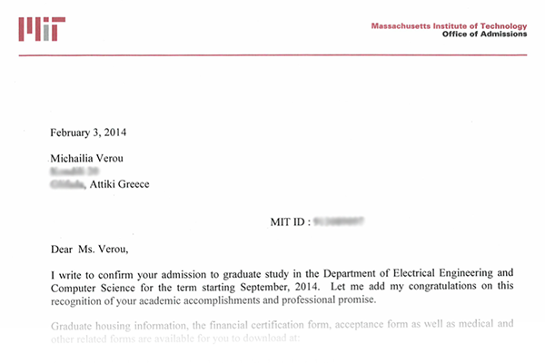

Last year, I did something crazy, that I've been wanting to do since I was little: I applied to MIT’s PhD program in Electrical Engineering and Computer Science.

It was not only crazy because I have been working for several years already, but also because I only applied to MIT, as I decided I did not want to go to any other university, both for pragmatic and emotional reasons. As any prospective grad student will tell you, applying to only one top university is recipe for failure. I didn't tell many people, but everyone who knew thought I'd get in — except me. You see, I wasn't a typical candidate. Sure, I have done lots of things I'm proud of, but I didn't have an amazing GPA or publications in prestigious academic conferences.

It felt like a very long shot, so you can imagine my excitement when I received the letters of acceptance, about a week ago. I will remember that moment forever. I was watching Breaking Bad, feeling miserable over a breakup that happened only a few hours earlier. About a minute into the episode (s05e09), I saw an email notification titled “Your application to MIT EECS”. My first thought was that there was some problem with my application. And then I read the first few lines:

> Dear Michailia Verou:
>
> If you have not already heard from them, you will shortly receive a letter from the EECS department at MIT, informing you that you have been admitted to the graduate program in Computer Science at MIT next fall. Congratulations!!

WHAAAA? Was it a scam? But then, how did they have all my details? Holy mother of the Flying Spaghetti Monster, I got in!!! Soon thereafter, a letter from [CSAIL](http://www.csail.mit.edu/) followed (where I said I wanted to work, specifically in the [UID](http://groups.csail.mit.edu/uid/)), and then even more letters. I started calling everyone who knew I applied to share the news, though it proved quite hard to form sentences instead of uncontrollably screaming in joy. I was (and am!) so excited about the future, that it completely overshadows any other life problems (at least for the time being).

Of course, my happiness is mixed with sheer terror. I keep worrying that I will be the dumbest person in the room, or that I don’t remember as much from my undergrad studies as the others will. I’m even terrified of meeting my future advisor(s) in case getting to know me better makes them wonder why I was accepted. But I try to remind myself about [impostor syndrome](http://en.wikipedia.org/wiki/Impostor_syndrome), and from what I've read in forums & blogs, it seems that I'm not alone in having such fears.

I held off blogging about it until I felt I was able to write something coherent, but I can’t wait to share my excitement any longer.

To the future!

To real life plot twists!

To MIT!

Boy, I’m thrilled. :D
