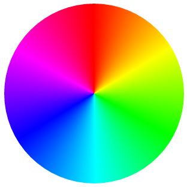

[](images/Screen-Shot-2015-06-18-at-16.26.40-.png)It’s no secret that I like conical gradients. In as early as 2011, I wrote [a draft for conical-gradient() in CSS](http://lea.verou.me/specs/conical-gradient/), that [Tab](http://www.xanthir.com/blog/) later said helped him when he [added them in CSS Image Values Level 4](http://www.w3.org/TR/css4-images/#conic-gradients) in 2012. However, almost **three years later, no progress has been made** in implementing them. Sure, the spec is still relatively incomplete, but that’s not the reason conical gradients have gotten no traction. **Far more underspecified features have gotten experimental implementations in the past.** The reason conical gradients are still unimplemented, is because very few developers know they exist, so browsers see no demand.

Another reason was that [Cairo](http://cairographics.org/), the graphics library used in Chrome and Firefox had no way of drawing a conical gradient. However, this changed a while ago, when [they supported mesh gradients](http://libregraphicsworld.org/blog/entry/mesh-gradients-in-cairo-now-official), of which conical gradients are a mere special case.

Recently, I was giving a talk on creating pie charts with CSS on a few conferences, and yet again, I was reminded of how useful conical gradients can be. While every CSS or SVG solution is several lines of code with varying levels of hackiness, conical gradients can give us a pie chart with a straightforward, DRY, one liner. For example, this is how to create a pie chart that shows 40% in gold and 60% in #f06:

```
padding: 5em; /* size */
background: conic-gradient(gold 40%, #f06 0);
border-radius: 50%; /* make it round */
```

[](images/Screen-Shot-2015-06-18-at-16.23.57-.png) So, I decided to take matters in my own hands. I wrote [a polyfill](http://leaverou.github.io/conic-gradient/), which I also used in my talk to demonstrate how awesome conical gradients can be and what cool things they can do. Today, during my [CSSConf](http://cssconf.com) talk, I released it publicly.

In addition, I mention to developers how important speaking up is for getting their favorite features implemented. **Browsers prioritize which features to implement based on what developers ask for.** It’s a pity that so few of us realize how much of a say we collectively have in this. This is more obvious with Microsoft and [their Uservoice forum](https://wpdev.uservoice.com/forums/257854-microsoft-edge-developer) where developers can vote on which features they want to see worked on, but pretty much every major browser works in a similar way. They monitor what developers request and what other browsers implement, and decide accordingly. The squeaky wheel will get the feature, so if you really want to see something implemented, **speak up**.

Since “speaking up” can be a bit vague (_“speak up where?”_ I can hear you asking), I also filed bug reports with all major browsers, that you can also find [in the polyfill page](http://leaverou.github.io/conic-gradient/#ask), so that you can comment or vote on them. That doesn’t mean that speaking up on blogs or social media is not useful though: That’s why browsers have devrel teams. The more noise we collectively make about the features we want, the more likely it is to be heard. However, the odds are higher if we all channel our voices to the venues browser developers follow and our voice is stronger and louder if we concentrate it in the same places instead of having many separate voices all over the place.

Also, I’m using the term “noise” here a bit figuratively. While it’s valuable to make it clear that we are interested in a certain feature, it’s even more useful to say **why**. Providing use cases will not only grab browsers’ attention more, but it will also convince other developers as well.

So go ahead, play with conic gradients, and if you agree with me that they are fucking awesome and we need them natively on the Web, **make noise**.

[conic-gradient() polyfill](http://leaverou.github.io/conic-gradient/)
