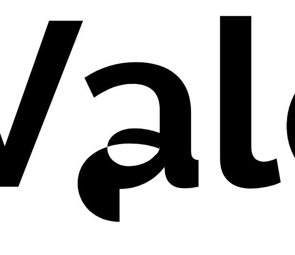

I like hand-editing my SVGs. Often I will create an initial version in Illustrator, and then export and continue with hand editing. Not only is it a bit of a meditative experience and it satisfies my obsessive-compulsive tendencies to clean up the code, it has actual practical benefits when you need to make certain changes or introduce animation. Some things are easier to do in a GUI, and others are easier to do in code, and I like having the flexibility to pick which one fits my use case best.

However, there was always a thing that was a PITA: modifying paths. Usually if I need anything more complicated than just moving them, I'd do it in Illustrator, but even moving them can be painful if they are not all relative (and no, I don't like introducing pointless transforms for things that should really be in the `d` attribute).

For example, this was today's result of trying to move an exported "a" glyph from [Raleway Bold](https://fonts.google.com/specimen/Raleway) by modifying its first [M](https://developer.mozilla.org/en-US/docs/Web/SVG/Attribute/d#MoveTo_path_commands) command:

Trying to move a path by changing its first M command when not all of its commands are relative.

This happened because even though _most_ commands were exported as relative, several were not and I had not noticed. I have no idea why some commands were exported as absolute, it seems kind of random.

When all commands are relative, moving a path is as simple as manipulating its initial [M command](https://developer.mozilla.org/en-US/docs/Web/SVG/Attribute/d#MoveTo_path_commands) and the rest just adapts, because **that's the whole point of relative commands**. Same with manipulating every other part of the path, the rest of it just adapts. It's beautiful. I honestly have no idea why anybody would favor absolute commands. And yet, googling "convert SVG path to relative" yields [one result](https://stackoverflow.com/questions/14179333/convert-svg-path-to-relative-commands), whereas there are plenty of results about converting paths to absolute. No idea why that's even desirable, ever (?).

I remembered I had come across that result before. Thankfully, there's also a [fiddle](https://jsfiddle.net/MC53K/) to go with it, which I had used in the past to convert my path. I love it, it uses this library called [Snap.svg](http://snapsvg.io/) which supports converting paths to relative as a _just-add-water_ [utility method](http://snapsvg.io/docs/#Snap.path.toRelative). However, that fiddle is a quick demo to answer a StackOverflow question, so the UI is not super pleasant to use (there is no UI: you just manipulate the path in the SVG and wait for the fiddle to run). This time around, I needed to convert multiple paths, so I needed a more efficient UI.

So I created [this demo](https://codepen.io/leaverou/full/RmwzKv) which is also based on Snap.svg, but has a slightly more efficient UI. You just paste your path in a textarea and it both displays it and instantly converts it to all-relative and all-absolute paths (also using Snap.svg). It also displays both your original path and the two converted ones, so you can make sure they still look the same. It even follows a pending-delete pattern so you can just focus on the output textarea and hit Cmd-C in one fell swoop.

I wasn't sure about posting this or just tweeting it (it literally took less than 30 minutes — including this blog post — and I tend to only post small things like that on [my twitter](https://twitter.com/leaverou)), but I thought it might be useful to others googling the same thing, so I may as well post it here for posterity. Enjoy!

<iframe src="https://codepen.io/leaverou/full/RmwzKv" width="100%" height="600" style="border: none"></iframe>
