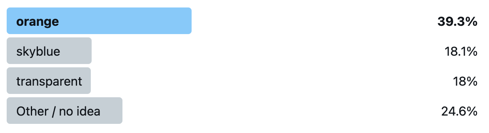

(_I always wanted to do a clickbait title like this and when this chance came along I could not pass it up. 😅 Sorry!_)

While putting my ideas into slides for my [Dynamic CSS workshop](https://smashingconf.com/online-workshops/workshops/lea-verou) for next week, I was working on a slide explaining how the CSS wide keywords work with custom properties. `inherit`, `initial`, `unset` I had used numerous times and knew well. But what about [`revert`](https://developer.mozilla.org/en-US/docs/Web/CSS/revert)? How did that work? I had an idea, but quickly coded up a demo to try it out.

The code was:

```
:root {
    --accent-color: skyblue;
}

div {
    --accent-color: revert;
    background: var(--accent-color, orange);
}
```

Phew, I was correct, but the amount of uncertainty I had before seeing the result tipped me that I might be on to something.

Before you read on, take a moment to think about what you would vote. Warning: Spoilers ahead!

🤔

🤔

🤔

🤔

So I posted a quiz on Twitter:

https://twitter.com/LeaVerou/status/1395379573190168576

These were the results after the 24 hours it ran for:



`orange` was the clear winner, and the actual correct answer, `skyblue` only got 18.1%, nearly the same as `transparent`!

If you got it wrong, you’re in **very** good company: not only did 82% of poll respondents get it wrong as well, but even the editor of the [CSS Variables spec](https://drafts.csswg.org/css-variables/) and co-editor of [CSS Cascading and Inheritance](https://drafts.csswg.org/css-cascade/#default) (which defines `revert`), [Tab Atkins](https://xanthir.com/), told me privately that he got it wrong too: he voted for `orange`! _(Yes, I did get his permission to mention this)_

So what actually happens? Why do we get `skyblue`? I will try to explain as best as I can.

Let's start by what `revert` does: It reverts the cascaded value of the property from its current value to the value the property _would have had_ if no changes had been made by the current style origin to the current element.

This means it cancels out any author styles, and resets back to whatever value the property would have from the user stylesheet and UA stylesheet. Assuming there is no `--accent-color` declaration in the user stylesheet, and of course UA stylesheets don't set custom properties, then that means the property doesn’t have a value.

Since custom properties are inherited properties (unless they are [registered](https://drafts.css-houdini.org/css-properties-values-api-1/#registered-custom-property) with `inherits: false`, but this one is not), this means the inherited value trickles in, which is — you guessed it — `skyblue`. You can see for yourself in [this codepen](https://codepen.io/leaverou/pen/zYZZpaY?editors=1100).

<iframe id="cp_embed_zYZZpaY" src="//codepen.io/anon/embed/zYZZpaY?height=250&amp;theme-id=1&amp;slug-hash=zYZZpaY&amp;default-tab=result" height="250" scrolling="no" frameborder="0" allowfullscreen allowpaymentrequest="" name="CodePen Embed zYZZpaY" title="CodePen Embed zYZZpaY" class="cp_embed_iframe" style="width:100%;overflow:hidden">CodePen Embed Fallback</iframe>

What if our property were registered as non-inheriting? Would it then be `orange`? Nice try, but no. When we register a custom property, it is mandatory to provide an initial value. This means that the property always resolves to a value, even `--accent-color: initial` does not trigger the fallback anymore. You can see this for yourself in [this codepen](https://codepen.io/leaverou/pen/qBrrpKZ?editors=1100) ([Chrome only as of May 2021](https://caniuse.com/mdn-css_at-rules_property)).

<iframe id="cp_embed_qBrrpKZ" src="//codepen.io/anon/embed/qBrrpKZ?height=250&amp;theme-id=1&amp;slug-hash=qBrrpKZ&amp;default-tab=result" height="250" scrolling="no" frameborder="0" allowfullscreen allowpaymentrequest="" name="CodePen Embed qBrrpKZ" title="CodePen Embed qBrrpKZ" class="cp_embed_iframe" style="width:100%;overflow:hidden">CodePen Embed Fallback</iframe>

_Liked this? Then you will love [the workshop](https://smashingconf.com/online-workshops/workshops/lea-verou)! There are [still a few tickets left](https://smashingconf.com/online-workshops/workshops/lea-verou)!_
