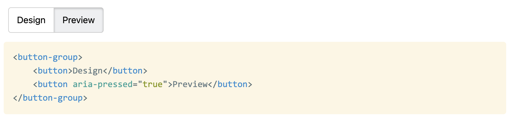

A few days ago I asked Twitter a seemingly simple question _(I meant `aria-pressed`, not `aria-selected` but Twitter doesn't allow edits…)_:

https://twitter.com/LeaVerou/status/1545712667515654144

For background, I was implementing a web component for an app I'm working on at work and I was getting into some pretty weird rabbit holes with my approach of generating radios and labels.

Unsurprisingly, [most](https://twitter.com/heydonworks/status/1545713406187114496) [people](https://twitter.com/WebReflection/status/1545722200598233097) [thought](https://twitter.com/gumnos/status/1545745858339250176) [the](https://twitter.com/TimBrock_DtD/status/1545714402367885313) [best](https://twitter.com/tolgamndl/status/1545714439000825856) [solution](https://twitter.com/jorgepinon/status/1545743881169510401) [is](https://twitter.com/dotstepan/status/1545729640731447298) [radio](https://twitter.com/sunlix/status/1545747700427145216) [buttons](https://twitter.com/gazjoy/status/1545754675395297280) [and](https://twitter.com/devongovett/status/1547593573448552450) [labels](https://twitter.com/rmors_/status/1547568003520221186). After all, it works without CSS, right? Progressive enhancement and everything?

That's what I thought too. I had contorted my component to generate labels and radios in the Shadow DOM from buttons in the light DOM, which resulted in awkward code and awkward CSS, but I felt I was fighting the good fight and doing the best thing for accessibility.

All this was challenged when the actual accessibility expert, [Léonie Watson](https://twitter.com/LeonieWatson) chimed in. For those of you who don’t know her, [she is pretty much _the_ expert](https://tink.uk/about-leonie/) when it comes to web accessibility and standards. She is also visually impaired herself, giving her a firsthand experience many other a11y aficionados lack. Her recommendation was contrary to what most others were saying:

https://twitter.com/LeonieWatson/status/1545745436740313089

She went on to make the point that if a design _looks_ like buttons, it should _act_ like buttons, otherwise there are mismatched expectations and poor UX for AT users:

https://twitter.com/LeonieWatson/status/1545762058339319808

https://twitter.com/LeonieWatson/status/1545757022645325824

In case you were wondering if state would be equally noticeable with `aria-pressed` and buttons, it is:

https://twitter.com/LeonieWatson/status/1545763493412052992

And some advice on grouping:

https://twitter.com/LeonieWatson/status/1545745923011117057

In theory doing this in Shadow DOM and/or using ElementInternals implicit roles should be fine, [though in practice we've had some trouble with that](https://twitter.com/LeonieWatson/status/1547544701036888065).

Today I posted [my attempt to implement what we've discussed in a `<button-group>` component](https://projects.verou.me/nudeforms/button-group/), which restarted the discussion.

Its [implementation is right here](https://github.com/LeaVerou/nudeforms/tree/main/button-group) if you want to improve it further! And make sure to [check out the actual Twitter thread](https://twitter.com/LeaVerou/status/1545712667515654144), as there is a lot of good stuff I couldn't include in this!

_**Edit:** Léonie wrote a blog post too, [Perceived affordances and the functionality mismatch](https://tink.uk/perceived-affordances-and-the-functionality-mismatch/)_. _It's a great read._
