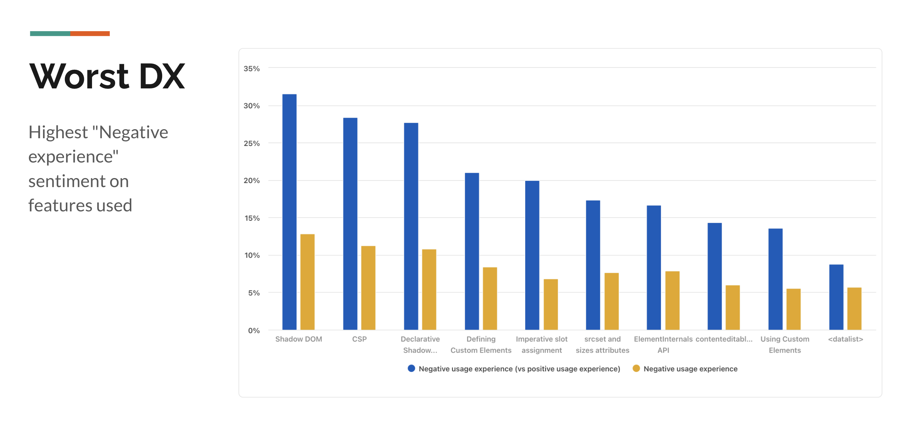
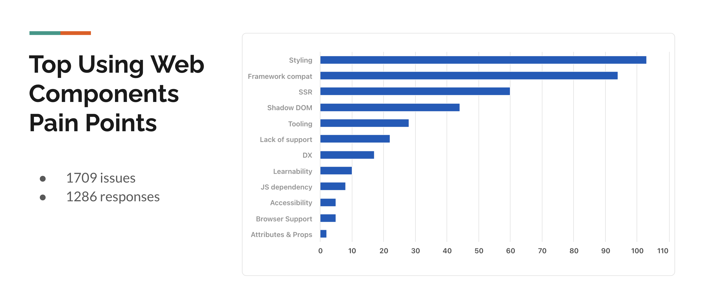
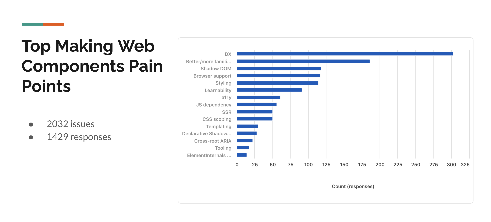
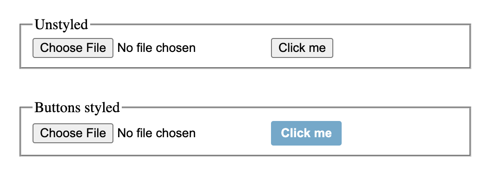

More than two years ago, I wrote one of my most impactful blog posts: [The failed promise of Web Components](../../2020/09/the-failed-promise-of-web-components/).
It stirred a lot of reaction in the community, and gave birth to the [Web Components Community Group](https://github.com/w3c/webcomponents-cg) of which I was a founding member.
It has done a lot to improve the state of Web Components through several different workstreams, and is planning a lot more.

That blog post centered around issues with what people *do* with Web Components technologies,
such as poor discoverability or the plain lack of components that are consistent with the rest of HTML.

I have since updated my opinion: the problems run deeper,
and extend to the technologies themselves.

Reviewing the preliminary data from [State Of HTML](../state-of-html-2023/),
Web Components APIs consistently keep creeping up as some of respondents' worst experiences.

<figure>



<figcaption>

Among those who had used a technology, which ones had the highest rates of negative sentiment?
Blue bars refer to % among those who also expressed sentiment,
yellow bars among those who had used the technology (regardless of whether they expressed sentiment).
</figcaption>
</figure>

Common problems include styling shadow DOM, and requring too much boilerplate code.

<figure>



<figcaption>

Styling (especially Shadow DOM) was the top complaint.
</figcaption>
</figure>

<figure>



<figcaption>

By far the biggest theme was complaints around DX, especially boilerplate code.
</figcaption>
</figure>

This is a polarizing issue in the front-end development community.
There seem to be two camps:
1. Those who seem to believe there are very few problems with Web Components, citing [usage statistics](https://twitter.com/EisenbergEffect/status/1717188337713201197) to support their opinion.
2. Those who believe Web Components are a failed experiment, and should be abandoned in favor of frameworks, citing the [sunk cost fallacy](https://en.wikipedia.org/wiki/Sunk_cost).

IMO, both sides have blind spots.

Usage statistics are not always a good measure of DX on the Web platform:
- Users cannot simply use something else; sometimes there is no alternative
- Poor low-level APIs are often abstracted away by nice higher level abstractions, so the API gets high usage, but the DX is still poor — it's just that only the developer of the abstraction has to deal with it now

But also, the fact that an API has DX issues doesn't mean we should throw the baby out with the bathwater and give up on it.

## Integrating Web Components still requires a lot of esoteric knowledge

A core promise of WC was that they could help abstract functionality away into reusable components,
empowering less technical authors to use them as building blocks to create complex UIs.

In practice right now, it’s largely the same people who write and use web components:

https://twitter.com/LeaVerou/status/1697245010650148924

Having WCs that can be dropped in to a page and just adapt seems to be a pipe dream.
Instead, to actually integrate a WC in your page you need to understand:
- Slots (Only 23% had used the `slot` attribute, and half had never even heard of it)
- `::part()` (only 13% have used according to State of HTML)
- ESM and `customElements.define()` if you want to assign a custom tag name (33% had used)

It is no wonder 57% of respondents had never (knowingly) used a Web Component.
It is also no wonder that the vast majority of WC libraries are also design systems,
with styles baked in.
Customizing them is usually possible, but involves learning about and setting a host of CSS variables
— sometimes only to find that the exact aspect you want to customize is not exposed.
This makes iterating hard, as there is so much upfront cost to trying a component out.
It also makes it harder for authors to mix and match as components from different libraries are visually incompatible.

Authors cannot fix this by themselves.
We (web standards folks) need to prioritize this user need and expose suitable primitives that facilitate creating components that adapt to the surrounding page without too much (or ideally any) config.

For example, the prevailing narrative right now is often "WC authors can just use a part/custom property/attribute for that".
Increasing API surface comes at a cost.
It increases iteration friction, and often forces authors to duplicate the same styling information multiple times, to cater to the different component APIs.
It’s not just about whether things are *possible*, it’s also about the ROI of doing said things.
People are not necessarily invested in a component the moment they use it, and for a technology to give rise to a blooming ecosystem it *must* facilitate experimentation.

## Reuse does not always require encapsulation

Components[^1] are a form of reuse, but also a form of encapsulation.
This is an unfortunate coupling, as these are orthogonal needs — at best they correlate.
Imagine if classes (in the OOP sense) could only have private members!

[^1]: When I refer to "components" without specifying Web Components or framework components, I’m referring to both.

Encapsulation is typically useful when it seprates concerns:
by abstracting some of the state away into smaller logical units, it becomes reusable and easier to manage and reason about.
This works when the modularization comes naturally, because the state we are abstracting away is actually logically separate.
Not every blob of HTML and CSS that we may want to reuse *also* happens to correspond to separate state that can be modularized.

There are two main categories of component use cases:
1. Widgets that are more broadly useful, and could even conceivably even become part of the platform one day (e.g. tabs, accordion, star rating, carousel, data table, map, chart etc.)
2. Components that are specific to the project, and are unlikely to be reused outside of it (e.g. user card, product card, blog post, etc.)

Right now these are tackled by the same set of technologies, but the underlying requirements are significantly different, especially around encapsulation.

Note that encapsulation is not black or white, there are different types, and different extents:
- What is encapsulated?
	- Data (or state) encapsulation is about keeping state separate.
	- Style encapsulation is about keeping styles separate.
- In what direction?
	- Inside-out encapsulation is about keeping the internals of a component separate from the outside.
	- Outside-in encapsulation is about keeping the outside separate from the internals of a component.
- How strict?
	- To what degree can we opt-out of it?


General purpose widgets tend to be more self-contained, and need less access the surrounding state, so data encapsulation (in both directions) tends to work well.
They typically have specific inputs that are separate from the business model of the context, and this abstraction comes naturally.
E.g. a slider has a `value`, not a `volume`, even if it’s used to set the latter.
The parent component also does not need to know anything about the internals of the widget.
Inside-out style encapsulation is typically desirable; these components don't usually need to style anything in their context, so any style leakage would have been accidental.
Outside-in style encapsulation is often undesirable, and strict outside-in isolation can hurt portability.
Typically they want to import at least *some* styles from the surrounding context, not all of which are naturally inheritable.
For example, a form element that is built from more complex form elements (e.g. a date picker, or my unfinished [`` experiment](https://nudeui.com/img-input/)) should inherit the base form styles of the context without the author having to make any special efforts.
Note that native controls also suffer from this. E.g. think of an `<input type=file>`:



Wouldn't it be great if styling buttons also styled the buttons in file inputs?
Developers would have been spared [so](https://stackoverflow.com/questions/572768/styling-an-input-type-file-button) [much](https://stackoverflow.com/questions/572768/styling-an-input-type-file-button/37183065) [pain](https://stackoverflow.com/questions/22157886/how-to-style-button-inside-of-file-upload-input)!
Of course this would need to be opt-in (or opt-out): there are perfectly valid use cases where you *don't* want this.
These may even co-exist within the same component.
E.g. think of a component for modal dialogs: you'd want to inherit the context's base form styles for its action buttons (e.g. "OK", "Cancel"), but not for its close (X) button.

Project-specific components typically need more access to the parent state, and data encapsulation can be a hindrance.
Even when strict encapsulation often seems fine at first, it can become a problem as requirements change.
This is because the abstraction was not designed around what state is a logical unit, but around what state is currently needed,
i.e. the separation is more coincidental than semantic.
Outside-in style encapsulation is even less desirable here.

----

You can often tell when the developer was fighting against encapsulation.
Possibly the most common pattern is trying to pass as much of the surrounding state as possble to the component,
either via way too many props, or via a single prop that is an object containing all or most of the state of the parent component.

While not particularly egregious, [this example from Kyle Simpson’s Web Unleashed talk](https://speakerdeck.com/getify/imperative-vs-declarative-weathering-the-storm?slide=43) reminded me of this:

```jsx
<Search
 searchText={searchText}
 setSearchText={setSearchText}
 locFound={locFound}
 setSelectedLoc={setSelectedLoc}
 resetLocState={resetLocState}
 setWeatherCanceled={setWeatherCanceled}
 ref={searchInputRef}
/>
```

Another such sign is when entire objects are passed to components for them to **modify**,
because just emitting events is inconvenient or straight up unsuitable for the use case.

When I was working on State of HTML, we added a feature to allow users to optionally express sentiment about their experience with each feature.
I asked the developer if we could show their selected sentiment on the comment prompt (“You said you used Shadow DOM and had a negative experience, tell us more”).
It seemed like an easy, straightforward change — after all usage was already displayed in the prompt.
It turned out that the comment prompt was a separate component that did not have access to the state of the question it was displayed in.

So why are there so many complaints about WC encapsulation and none for frameworks?
Several reasons:

- Frameworks do provide some limited forms of reuse without componentization (e.g. Vue’s [`v-for`](https://vuejs.org/guide/essentials/list.html)),
though components are still typically the only option for non-sequential reuse.
- Framework encapsulation focuses more around data, and less around styling.
Style encapsulation is possible (and common), but is usually opt-in.
- There are ways to override framework data encapsulation (some have been mentioned above), but there is no way to override style encapsulation in Web Components.

It is a recurring complaint that WC style encapsulation is both too draconian, and too loose:
1. Even when elements are exposed to the outside via parts, only shallow styling is permitted: no descendants, no pseudo-elements, not even pseudo-classes (though activity pseudo-classes *should* be allowed per spec). But there is also no way to restrict what styling happens, which [for some use cases is not restricted enough](https://github.com/w3c/csswg-drafts/issues/3467#issuecomment-453678965)!
2. Same with slotted elements: the component can only shallowly style them. Conceptually, there is a difference between styling the light DOM *around* a component, or styling elements actively slotted into it, yet the current APIs enforce an almost equally draconian isolation between the two.
3. There is no way to selectively allow styling from the rest of the page to trickle in so that base styles can be reused without needing to be duplicated as custom properties.

### What can we do?

Style encapsulation appears to be the biggest pain point.
There are existing proposals to address some of these issues:
- [Making `::slotted` a combinator](https://github.com/w3c/csswg-drafts/issues/7922) would open up the door to styling subtrees, which could fix a lot of the issues with slotted elements.
- [Style container queries](https://developer.chrome.com/blog/style-queries/) can help having higher level custom properties that can affect styling internally in much more complex ways. [Browser support](https://caniuse.com/css-container-queries-style) is not yet there, but the fact that they’ve already shipped in Chromium means they’ll soon have > 70% market share anyway.
- [`inherit()`](https://github.com/w3c/csswg-drafts/issues/2864) can help with many outside-in styling use cases: Imagine applying `display: contents` to the component root,
then simply using its properties as basically CSS variables that the author already knows about.
The proposal is already accepted by the CSS WG, but has not yet been specced.

Some additional research directions could be:
- Explore ways to expose more than shallow containers for parts, either whole subtrees or subsets.
-

<details class="callout question">

<summary>But what about the light DOM?</summary>

The light DOM is often touted as a solution to the style encapsulation problem.
In some ways, this is more like templating, and more like what frameworks do.
However, there is a fundamental difference: Frameworks *replace* the component with the template,
whereas WCs using the light DOM are still custom elements that just spawn descendants.
This creates very weird DX.

Thought experiment: imagine you want to build a web component that renders Markdown.
You can't really do it with the Shadow DOM, because you want its content to render like regular content without requiring authors to write a ton of special styles
(there are many components that do use the Shadow DOM, though I have reservations about how well they fit use cases).
This is exactly why I wrote [`<md-block>`](https://md-block.verou.me/).

While it does (IMO) address the core use cases better, there are a lot of warts:
- Once the markdown is rendered, there is no natural way to access the original content and modify it.
In line with the natural reactivity of HTML, not only this should be accessible, but it should also update the Markdown when modified.
The component does offer a custom `mdContent` property that is reactive like that, but that increases the API surface.
- At any given point in time the element could contain *either* Markdown or rendered HTML, and there’s no natural way to tell.
The component does offer a `rendered` attribute for that, but that is also ad hoc.
- It is simply not consistent with the rest of HTML to have an element that completely replaces its contents with different ones.
The only precedent is related to fixup, i.e. adding missing elements (e.g. `<body>`, `<head>`, `<tbody>`, `<summary>`), not replacing contents altogether.

Not to mention that you usually want *some* encapsulation, just not as draconian.

</details>

## Components are not well suited to traits

When all you have is a hammer, everything looks like a nail.
When all you have is components, everything needs a new element.
But is every modular, reusable behavior well suited to elements?

In HTML/XML, elements are essentially the *entities* and attributes are traits that augment an entity with additional metadata and/or behavior.
For example, an `<input>` is an entity, and `required` is a trait.
Imagine how much clunkier HTML would be, if the way to make an `<input>` required was to wrap it with a `<required>` element:

```html
<required>
  <input>
</required>
```

Not only is this way more verbose, it means you'd have to account for a different DOM structure depending on whether the button is disabled or not.
It gets worse once you add more traits to the mix, e.g. `autofocus`:

```html
<autofocus>
  <required>
	<input>
  </required>
</autofocus>
```

Imagine trying to write CSS to target required, autofocused inputs:

```css
required > autofocus > input,
autofocus > required > input {
  border: 1px solid red;
}
```

And it gets exponentially worse with every additional trait (e.g. `<disabled>`).

Yet this is *exactly* what we do in both WC and frameworks.
But at least framework components eventually expand to plain elements, but WC do not.

[Shoelace](https://shoelace.style/) is one of my favorite Web Components libraries.
Its components are beautiful, as customizable as the current tech allows, and a lot of thought has been put into designing an API that is both consistent with the rest of HTML, and still addresses user needs well.
However, it is still bound by the limitations of the platform.
Take a look at [`<sl-tooltip>`](https://shoelace.style/components/tooltip):


```html
<sl-tooltip content="This is a tooltip" placement="top">
  <button>Hover Me</button>
</sl-tooltip>
```

Add a tooltip to an element, now you have to re-examine all CSS code that applies to it.

`<sl-tooltip>` is essentially a trait.
In terms of syntax, something like this would have been far more appropriate:

```html
<button sl-tooltip="This is a tooltip" sl-tooltip-placement="top">Hover Me</button>
```

Or even:

```html
<button sl-tooltip="my-tooltip">Hover Me</button>
<sl-tooltip id="my-tooltip" placement="top">This is a <em>tooltip</em></sl-tooltip>
```

However, it is forced into being an element because there is no other way to make something that works properly.

Now from the framework land, let’s look at the [`<OverlayTrigger>`](https://react-bootstrap.netlify.app/docs/components/overlays/#overlaytrigger) and `<Tooltip>` components from [React Bootstrap](https://react-bootstrap.netlify.app/):

```jsx
<OverlayTrigger overlay={<Tooltip id="t-1">This is a tooltip</Tooltip>}>
	<button>Hover me</button>
</OverlayTrigger>
```

This is a lot more verbose than the equivalent in Shoelace, but at least it evaporates when rendered:

```html
<button aria-describedby="t-1">Hover me</button>
<div id="t-1" role="tooltip">This is a tooltip</div>
```

And it can also be abstracted away into another component:

```jsx
const Button = ({ id, children, title }) => (
	<OverlayTrigger overlay={<Tooltip id={id}>{title}</Tooltip>}>
		<button>{children}</button>
	</OverlayTrigger>
);
```

which will then be used as:

```jsx
<Button id="t-1" title="This is a tooltip">Hover me</Button>
```

We got a host of APIs for creating new HTML elements, but precious little for creating new attributes on existing elements.
Basically only static `data-*` attributes that cannot react to anything,
and would be way too verbose for implementing any more complex behavior (imagine Vue implemented with them, like `data-v-for` — [Angular did try it](https://docs.angularjs.org/guide/directive)).

The pattern of using attributes to augment an element with behaviors is used all over HTML — yet it is not an abstraction that is available to developers.
Think of `<datalist>`: you *could* create a `<fancy-datalist>` custom element,
but without some way to attach it to an `<input>`, it would be useless.

<details class="question callout">

<summary>What about mutation observers?</summary>

Yes, you could use a mutation observer to detect attribute changes and react to them,
but that is a hack that has several drawbacks:
- It breaks encapsulation, as you now need to monitor all parent shadow roots.
- It doesn't work for attributes in closed shadow roots.
- It doesn't work for attributes on elements that are not in the DOM.

</details>

### What can we do?

Thankfully, there is some hope that this will change soon.
After [Apple refused to implement customized built-in elements](https://github.com/WebKit/standards-positions/issues/97),
we had a [breakout session at TPAC 2023](https://github.com/w3c/tpac2023-breakouts/issues/44) to discuss alternative solutions to these use cases.

There are several proposals in this space, revolving around being able to augment existing elements (both built-ins and custom elements) with additional traits,
invokable either via attributes, identifiers within a specific attribute, or assignable via JS.

* [Element Behaviors](https://github.com/lume/element-behaviors)
* [Custom attributes](https://github.com/lume/custom-attributes)
* [Element custom enhancements](https://github.com/WICG/webcomponents/issues/1000)
* [Proposal: Custom attributes for all elements, enhancements for more complex use cases](https://github.com/WICG/webcomponents/issues/1029) by yours truly


## Boilerplate

Boilerplate and general DX was one of the most common complaints.
**HTML is reactive.** You update an attribute, the corresponding JS property also updates and vice versa. The component UI also updates accordingly.
Typically the design principle for abstractions is to follow the native ones of the language itself as closely as possible.
For example, a JS function should look and behave like a built-in JS function as much as possible.
For WCs, this means they should resemble native HTML elements as much as possible, reactivity and all.

However, developers were given a set of APIs to create custom elements, but no primitive to implement reactivity.
And implementing reactivity by hand is **hard**.
Without a library, even the simplest components require lines and lines of JS to get right.
In practice, developers start taking shortcuts.
*“Is this attribute likely to ever be changed after init or should it just be read only?”*

## Customization

As I often say (paraphrazing Alan Kay), the best interfaces make **common things easy, and complex things possible**.
When it comes to using a component, the common case is to just drop it in and use it as is,
while the complex case is to customize it.
Ideally, these two should be fluid: you should be able to start with the common case, and then gradually customize it as needed.
We’ve already discussed how style encapsulation makes this hard, but there are other issues too.
Consider even something as simple as the element name.

As a WC author, you can either register your component yourself, by calling `customElements.define()`, or export the class and let the user register it.
Ideally you want to be able to do *both*: register it as a default, but allow the user to override it by registering the exported class themsleves.
However, this is not possible (without using two separate files).

If you *do* call `customElements.define()` in the component definition module, it can never be registered with any other tag name (attempting to do so produces an error),
and there is no way to unregister it.
*The common case is easy, but the complex case is not possible.*

If you *don’t* call `customElements.define()` yourself, then users can register it with any tag name they want, but there is no config-free default.
*The complex case is possible, but the common case is not easy.*

The best workaround seems to be that the component author registers it with a default name, and if the user wants to register it with a different name,
they can create a dummy subclass and register that.