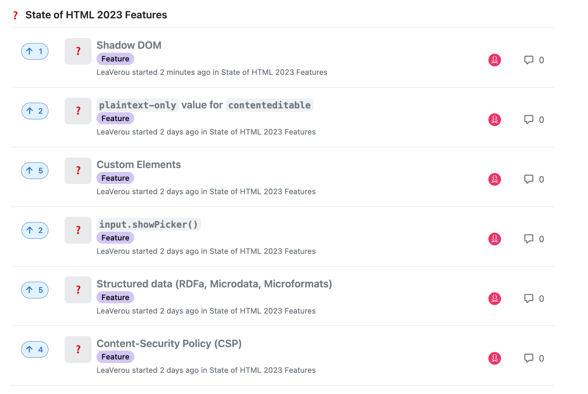

You have likely participated in several [Devographics surveys](https://survey.devographics.com/en-US) before,
such as [State of CSS](https://stateofcss.com/en-us/), or [State of JS](https://stateofjs.com/en-us/).
These surveys have become the primary source of unbiased data for the practices of front-end developers today
(there is also the [Web Almanac](https://almanac.httparchive.org/) research, but because this studies what is actually used on the web, it takes a lot longer for changes in developer practices to propagate).

You may remember that last summer, [Google sponsored me to be Survey Design Lead](/blog/2022/07/help-design-the-state-of-css-survey-2022/) for [State of CSS 2022](https://survey.devographics.com/en-US/survey/state-of-css/2022).
It went really well: we got 60% higher response rate than the year before, which gave browsers a lot of actionable data to prioritize their work.
The feedback from these surveys is a prime input into the [Interop](https://web.dev/interop-2023/) project,
where browsers collaborate to implement the most important features for developers interoperably.

So this summer, Google trusted me with a much bigger project, a brand new survey: **State of HTML**!

<!-- more -->

For some of you, a State of HTML survey may be the obvious next step, the remaining missing piece.
For others, the gap this is filling may not be as clear.
No, this is not about whether you prefer `
` or ``!
It turns out, just like JavaScript and CSS, HTML is actually going through an evolution of its own!
New elements like [`<selectmenu>`](https://github.com/Devographics/surveys/discussions/95) and [`<breadcrumb>`](https://github.com/Devographics/surveys/discussions/116) are on the horizon, or cool new features like [popovers](https://github.com/Devographics/surveys/discussions/138) and [declarative Shadow DOM](https://github.com/Devographics/surveys/discussions/100).
There are even JS APIs that are intrinsically tied to HTML, such as e.g. [Imperative slot assignment](https://github.com/Devographics/surveys/discussions/98)
or DOM APIs like [`input.showPicker()`](https://github.com/Devographics/surveys/discussions/153)
Historically, these did not fit in any of these surveys.
[Some](https://2022.stateofjs.com/en-US/features/browser-apis/#custom_elements) were previously asked in [State of JS](https://stateofjs.com/), [some](https://2021.stateofcss.com/en-US/features/accessibility/#tabindex) in [State of CSS](https://stateofcss.com/), but it was always a bit awkward.
This new survey aims to fill these gaps, and finish surveying the core technologies of the Web, which are HTML, CSS and JavaScript.

Designing a brand new survey is a more daunting task than creating the new edition of an existing survey,
but also an exciting one, as comparability with the data from prior years is not a concern,
so there is a lot more freedom.

Each *State of X* survey consists of two parts:
<dfn id="part1">Part 1</dfn> is a quiz: a long list of lesser-known and/or cutting-edge (or even upcoming) features where respondents select one of three options:

Starting with State of CSS 2022, respondents could also add freeform comments to provide more context about their answer through the little speech bubble icon.
One of my goals this year is to make this feature quicker to use for common types of feedback,
and to facilitate quantitative analysis of the responses (to some degree).

At the end of the survey, respondents even get a knowledge score based on their answers,
which provides immediate value and motivation which reduces survey fatigue.

<dfn id="part2">Part 2</dfn> is more freeform, and usually includes multiple-choice questions about tools and resources, freeform questions about pain points, and of course, demographics.

One of the novel things I tried in the 2022 State of CSS survey was to [involve the community in the design process](/blog/2022/07/help-design-the-state-of-css-survey-2022/),
with one-click voting for the features to ask about.
These were actually GitHub Issues with certain labels.
Two years prior I had released [MaVoice: an app to facilitate one click voting on Issues in *any* repo](/blog/2020/07/releasing-mavoice-a-free-app-to-vote-on-repo-issues/),
and it [fit the bill perfectly here](https://projects.verou.me/mavoice/?repo=devographics/surveys&labels=State%20of%20CSS%202022).

This process worked exceptionally well for uncovering blind spots: it turned out there were a bunch of CSS features that would be good to ask about, but were simply not on our radar.
This is one of the reasons I strongly believe in transparency and co-design: **no one human or small team can ever match the collective intelligence of the community**.

Predictably, I plan to try the same approach for State of HTML.
Instead of using MaVoice, this year I’m trying [GitHub Discussions](https://github.com/features/discussions).
These allow one click voting from the GitHub interface itself,
without users having to authorize a separate app.
They also allow for more discussion, and do not clutter Issues, which are better suited for -- well -- actual issues.

I have created a Discussions category for this and seeded it with 55 features spanning 12 focus areas (Forms & Editing, Making Web Components, Consuming Web Components, ARIA & Accessibility APIs, Embedding, Multimedia, Interactivity, Semantic HTML, Templating, Bridging the gap with native, Performance, Security & Privacy).
These initial ideas and focus areas came from a combination of personal research, as well as several brainstorming sessions with the [WebDX CG](https://www.w3.org/community/webdx/).

<a class="call-to-action" href="https://github.com/Devographics/surveys/discussions/categories/state-of-html-2023-features">Vote on Features for State of HTML 2023!</a>

You can also see a (read-only) summary of the proposed features with their metadata [here](https://coda.io/@leaverou/html-features)
though keep in mind that it’s manually updated so it may not not include new proposals.

If you can think of features we missed, please [post a new Discussion in this category](https://github.com/Devographics/surveys/discussions/new?category=state-of-html-2023-features).
There is also a more general [💬 State of HTML 2023 Design](https://github.com/Devographics/surveys/discussions/categories/state-of-html-2023-design) category,
for meta-discussions on Part 1 of the survey, and design brainstorming on Part 2.

Note that **the feedback period will be open for two weeks, until August 10th**.
After that point, feedback may still be taken into account, but it may be too late in the process to make a difference.

Some things to keep in mind when voting and generally participating in these discussions:
- The votes and proposals collected through this process are **only one of the many variables** that feed into deciding what to ask about, and are **non-binding**.
- There are **two goals** to balance here:
	1. The survey needs to provide value to developers -- and be fun to fill in!
	2. The survey needs to provide value to browsers, i.e. get them actionable feedback they can use to help prioritize what to work on. This is the main way that these surveys have impact on the web platform, and is at least as important as (1).
- While the title is "State of HTML", certain JS APIs or even CSS syntax is also relevant, especially those very close to HTML, such as DOM, ARIA, Web Components, PWAs etc.
- Stable features that have existed for a long time and are widely known are generally less likely to make it to the survey.

<a class="call-to-action" href="https://github.com/Devographics/surveys/discussions/categories/state-of-html-2023-features">Now go vote! 🗳</a>
