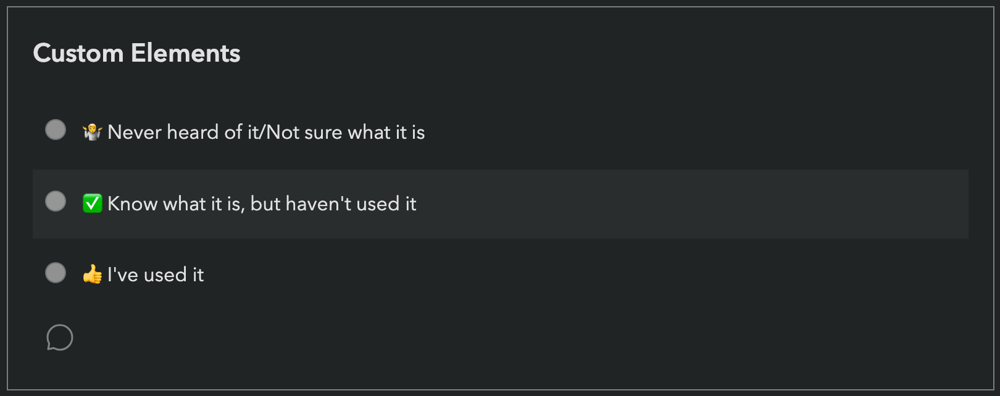

You have likely participated in several [Devographics surveys](https://survey.devographics.com/en-US) before,
such as [State of CSS](https://stateofcss.com/en-us/), or [State of JS](https://stateofjs.com/en-us/).
These surveys have become the primary source of unbiased data for the practices of front-end developers today
(there is also the [Web Almanac](https://almanac.httparchive.org/) research, but because this studies what is used on the web, it takes a lot longer for changes in developer practices to propagate).

You may remember that last summer, [Google sponsored me to be Survey Design Lead](/blog/2022/07/help-design-the-state-of-css-survey-2022/) for [State of CSS 2022](https://survey.devographics.com/en-US/survey/state-of-css/2022).
It went really well: we got 60% higher response rate than the year before, which gave browsers a lot of actionable data to prioritize their work.
The feedback from these surveys is a prime input into the [Interop](https://web.dev/interop-2023/) project,
where browsers collaborate to implement the most important features for developers interoperably.

So this summer, Google trusted me with a much bigger project, a brand new survey: **State of HTML**!

<!-- more -->

Your first reaction is probably wondering why we need a survey about HTML, of all things. Let me address your concerns: no, the survey is not going to be about whether you favor `<h3>`s or `<h4>`s for sub-headings, or whether you prefer `<em>` or `<i>`. It turns out, just like JavaScript and CSS, HTML is actually going through an evolution of its own! New elements like `<selectmenu>` and xxxxxxxxx are on the horizon, and there's also *******. 

But moreover, the purpose of this new survey is to fill in the gaps left between the State of JavaScript and State of CSS surveys: anything that doesn't quite fit into the CSS or JS worlds will now have its own home!

Designing a brand new survey is a more daunting task than creating the new edition of an existing survey,
but also an exciting one, as comparability with the data from prior years is not a concern,
so there is a lot more freedom.

Each *State of X* survey consists of two parts:
Part 1 is a quiz: a long list of lesser-known and/or cutting-edge (or even upcoming) features where respondents select one of three options:

Starting with State of CSS 2022, respondents could also add freeform comments to provide more context about their answer through the little speech bubble icon.
One of my goals this year is to make this feature quicker to use for common types of feedback,
and to facilitate quantitative analysis of the responses (to some degree).

At the end of the survey, respondents even get a knowledge score based on their answers,
which provides value and helps reduce survey fatigue.

Part 2 is more freeform, and usually includes multiple-choice questions about tools and resources, freeform questions about pain points, and of course, demographics.

And another new feature in the recently-closed [State of CSS 2023 survey](https://survey.devographics.com/en-US/survey/state-of-css/2023) is the addition of the **reading list**, a feature that lets you bookmark any survey item you'd like to know more about for later, and gives you a summary of useful links once you've finished the survey. 

One of the novel things I tried in the 2022 State of CSS survey was to [involve the community in the design process](/blog/2022/07/help-design-the-state-of-css-survey-2022/),
with one-click voting for the features to ask about.
These were actually GitHub Issues with certain labels.
Two years prior I had released [MaVoice: an app to facilitate one click voting on Issues in *any* repo](/blog/2020/07/releasing-mavoice-a-free-app-to-vote-on-repo-issues/),
and it [fit the bill perfectly here](https://projects.verou.me/mavoice/?repo=devographics/surveys&labels=State%20of%20CSS%202022).

This process worked exceptionally well for uncovering blind spots: it turned out there were a bunch of CSS features that would be good to ask about, but were simply not on our radar.
This is one of the reasons transparency is one of my core values: **no one human or small team can ever match the collective intelligence of the community**.

Predictably, I plan to do the same thing for State of HTML.
Instead of using MaVoice, this year I’m trying GitHub Discussions.
These allow one click voting from the GitHub interface itself,
without users having to authorize a separate app.
They also allow for more discussion, and do not clutter Issues, which are better suited for -- well -- actual issues.

I have created a Discussions category for this and seeded it with 55 features spanning 12 focus areas (Forms & Editing, Making Web Components, Consuming Web Components, ARIA & Accessibility APIs, Embedding, Multimedia, Interactivity, Semantic HTML, Templating, Bridging the gap with native, Performance, Security & Privacy).
These initial ideas and focus areas came from a combination of personal research, as well as several brainstorming sessions with the [WebDX CG](https://www.w3.org/community/webdx/).

<a class="call-to-action" href="https://github.com/Devographics/surveys/discussions/categories/state-of-html-2023-features">Vote on Features for State of HTML 2023!</a>

You can also see a (read-only) summary of the proposed features with their metadata [here](https://coda.io/@leaverou/html-features)
though keep in mind that it may not not include any new proposals, as it’s manually updated.

If you can think of features we missed, please post a new Discussion in this category!

Some things to keep in mind:
- The votes and proposals collected through this process are only one of the many variables that feed into deciding what to ask about, and are **non-binding**.
- There are two important goals to balance here: 1) Ask about a wide enough set of features so that the quiz score is meaningful to developers 2) Get browsers actionable feedback that can feed into prioritization for what to implement. Both are equally important.
- While the title is "State of HTML", certain JS APIs or even CSS syntax is also relevant, especially those very close to HTML, such as DOM, ARIA, Web Components, PWAs etc.
- Stable features that have existed for a long time and are widely known are generally less likely to make it to the survey.

Now go vote! 🗳

<a class="call-to-action" href="https://github.com/Devographics/surveys/discussions/categories/state-of-html-2023-features">Vote on Features for State of HTML 2023!</a>
