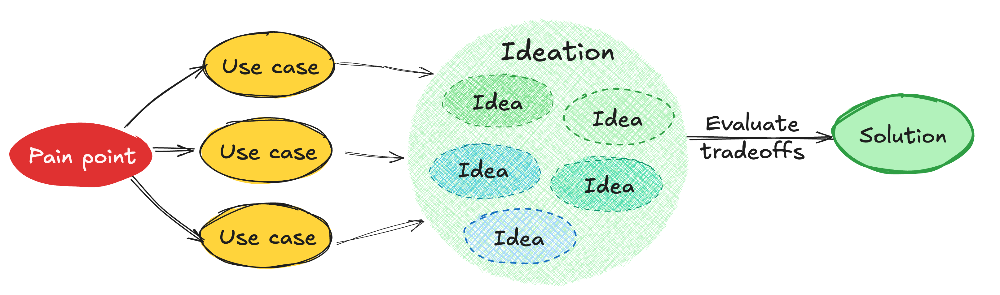

In most product literature, the design process looks a bit like this:



This works great with the kinds of transactional processes (marketplaces, social media, search engines, etc) it tends to discuss,
but can fall apart when designing creative tools (developer tools, no-code tools, design tools, languages, APIs etc.).
There are fundamental differences[^0] between the two:
- In transactional processes, users have clearly defined goals, and the task is highly specialized (e.g. "Go to work", "Order takeout", "Find accommodation for my upcoming trip") and can often be modeled as a linear process
- In creator tools, use cases vary *wildly*, goals are neither linear, nor clearly defined, and may even change throuhgout the session

In fact, creator tools typically ship knowingly addressing only a percentage of their key use cases — otherwise they would never ship at all.

[^0]: I’ve spent so long designing creator tools that I tended to assume my observations and learnings from my experience are universal.
I first read about the distinction in Joe Mc Lean’s
excellent post on [overfitting](https://bootcamp.uxdesign.cc/overfitting-and-the-problem-with-use-cases-337d9f4bf4d7), and it was a bit of an a-ha moment.

In [end-user programming](https://en.wikipedia.org/wiki/End-user_development) we talk about the **floor** and the **ceiling** of a tool:
- The **floor** is the minimum level of knowledge users need to create something useful.
- The **ceiling** refers to the extent of what can be created.

I think that vocabulary actually generalizes nicely to all creator tools.
A few examples:
- A programming language has an extremely high ceiling, but also a very high floor.
You can use it to make anything, but it requires years of training.
- A spreadsheet has a medium floor and a medium ceiling.
It requires some training, but not much, and it can make a wide variety of things, but not everything.
- Google Forms has a very low floor, but also a low ceiling.
Anyone can start using it with no training, but you can also only make a very specific kind of thing with it.

A lot of product work in creator tools centers around either **reducing the floor, or increasing the ceiling**.
A product that combines a low floor with a high ceiling is the unicorn of low-code/no-code tools.
Especially in general-purpose creator tools,
because use cases are so varied, they accumulate at a much faster rate than they can be addressed, especially in the beginning.
Therefore we end up with what I call a *"use case backlog"*: a list of use cases that are within scope, but we cannot yet address
due to lack of resources, good solutions, or both.

<figure>


<figcaption>

Pain points get processed into use cases, which accumulate in the use case backlog

</figcaption>

</figure>

Often, the design process for creator tools consists of *matching* these use cases to solutions, which can happen before, during, or after idea conception:

<figure>


<figcaption>

Here we started the design process with a use case in mind,
and made tweaks to the first idea during ideation to incorporate another use case into the design.
Because the first idea addressed a broader initial set of use cases, we decided to go with that and develop it further.
Then we validated its design with more use cases,
and in the end even realized it also addresses another, unrelated use case!

</figcaption>

</figure>

## From overfitting to eigensolutions

Shishir Mehrotra of Coda wrote about the importance of “[*Eigenquestions*](https://coda.io/@shishir/eigenquestions-the-art-of-framing-problems)” when framing problems, a term he came up with, inspired from his math background:

> the eigenquestion is the question where, if answered, it likely answers the subsequent questions as well.

This inspired me to name an analogous concept I’ve been pondering for a while: The *eigensolution*.
**Eigensolutions are solutions that address several key use cases, that are seemingly unrelated.**

<figure>


<figcaption>
Eigensolutions address multiple key but seemingly unrelated use cases.
</figcaption>

</figure>

An eigensolution is the polar opposite of [overfitting](https://bootcamp.uxdesign.cc/overfitting-and-the-problem-with-use-cases-337d9f4bf4d7).
Overfitting happens when the driving use cases behind a solution are insufficiently diverse,
so the solution ends up being so specific it cannot even generalize to use cases that are obviously related.

Overfitting is (and should be) the boogeyman of creative tool design.
It is a hallmark of poor design that leads to feature creep and poor user experiences.
It forces product teams to add more and more features to address the use cases that were not initially addressed.
This clutters the UI and confuses the user experience.
From the user’s perspective, there are now multiple distinct features that solve subtly different problems.

It is a spectrum, not a binary: overfitting and eigensolutions are just its two opposite ends.
Eigensolutions do not come along every day, and do not necessarily exist for all problems.
It is important to actively guard against overfitting by making sure solutions are validated by many diverse use cases.
However, going too far the other side and chasing eigensolutions for every problem is not the best use of resources.
Instead, I think a happy medium is to try and be on the right side of the spectrum:


Contrary to what you may expect, **eigensolutions can actually be quite hard to push to stakeholders**:
1. Due to their generality, they often require significantly higher engineering effort to implement than a more specific solution.
Quick-wins are easier to sell: they ship faster and add value sooner.
In my 11 years designing web technologies, I have seen many beautiful, elegant eigensolutions be vetoed due to implementation difficulties (which is often the right decision — it's all about the cost-benefit).
2. Eigensolutions tend to be lower level primitives, which are more flexible, but also involve higher friction than a solution that is tailored to a specific use case.

Both issues can often be addressed through **layering**, discussed below.

## Examples of eigensolutions

<div class=note>

A lot of my work (that I can share) is on text-based creator tools, which are not the best examples as they tend to require a lot of context to understand.
I decided to go ahead and include two examples from my own work, rather than not include examples at all or hold the post back until I can come up with better ones.
If you have good examples in mind that require less context to understand, please share in the comments!

</div>

<details>
<summary>

### Mavo dynamic structured values
</summary>

[Mavo](https://mavo.io/) is a programming language I developed while doing my PhD at MIT.
Its vision is to lower the barrier of developing full stack data-driven web applications down to the skills required to write HTML and spreadsheet-like[^1] formulas.
While HTML or spreadsheet formulas still require technical expertise, it is orders of magnitude lower than what is currently needed to build web applications,
especially applications that support login and/or cloud storage.

[^1]: I say "spreadsheet-like", because its formula language, MavoScript, was designed to be much easier for humans to read & write than spreadsheet formulas,
and to make the kinds of use cases that arise in data-driven web applications easier to express.

At first, Mavo formulas were only used to calculate and output atomic values, such as text, numbers, or dates.
Structured data like lists or objects was supported, but was mainly used as intermediate values; output was text-only.
For example, displaying the number of completed items in a to-do list, or concatenating multiple slider values together into a color value.

Over time, our use case backlog collected a number of use cases, which at first glance appeared unrelated:
1. Filtering lists based on discrete property values (e.g. show only tasks with certain statuses)
2. Displaying unions of data from multiple lists
3. Pivot tables: displaying a list of unique values with aggregate stats about their usage in the list (usually counts, but also min, max, average, etc.)
4. Displaying a fallback value while an expression is calculating or if it fails
5. Displaying programmatically generated data (e.g. a list of numbers from 1 to 10) with actual UI around each item

One solution we designed for the last one was an `mv-value` attribute that could be used on any element and would take a formula as its value
and display the result of that formula using the element as a template.
If the formula result changes, the displayed data updates reactively, just like regular formulas.
Using `mv-value` on lists trivially addresses use case 5:

```html
<input type="range" property="max" />
<div mv-multiple mv-value="1 .. max"></div>
```

But `mv-value` turned out to be an eigensolution: it provided a lower level primitive that could also be used to implement many other use cases
it was not conceived for.

When used on elements without structure, it behaved very similarly to just including a formula within the element,
with one key difference: if the formula failed, or while it was calculating (for async formulas),
the element contents would be displayed as a fallback value, addressing use case 4.

```html
<span mv-value="count(task)">0</span> items
```

Filters could now be created by using `mv-value` with a `unique()` formula, to generate a list of checkboxes, one for each unique value of a property,
and then using the values in a regular formula that toggles item visibility, addressing use case 1.[^2]

Unions of multiple lists (use case 2) can be implemented by simply using `mv-value="list(list1, list2, ...)"` on a list with the right structure [^3].

Pivot tables (use case 3) can be implemented by `mv-value` and either
a) a `unique()` formula, then a `count()` (or `max()` etc) within each item,
b) grouping, which is more efficient, but came later.
In fact, filters are often mini pivot tables, with the count being used to show the number of items that match the filter.

[^2]: This is still too involved to be the primary way to implement filters,
and coming up with a higher level primitive is an open problem.
But at least it is now about making it *easier*, rather than making it *possible*.

[^3]: This is not ideal because Mavo does not handle view updates well: mv-value data is not editable by default, and even when forced to be editable, edits do do not propagate back to the original data.
But many use cases did not require editing, and that is more of a bug than a fundamental limitation.

</details>

<details>
<summary>

### CSS `inherit()` function
</summary>

[CSS](https://en.wikipedia.org/wiki/CSS) is a language used to define the presentation of literally every website on the web.
I’ve been in the CSS Working Group since 2012, and have seen, designed, and worked on my fair share of solutions, and a few eigensolutions.

One of my CSS proposals that was recently accepted is for an [`inherit()` function](https://github.com/w3c/csswg-drafts/issues/2864),
which would allow descendant elements to reference the parent value of *any* CSS property,
which enables a broad set of existing seemingly unrelated use cases:

- CSS variables that build on the parent value, e.g. nesting level
- Font weight that is relative to the parent (made a bigger pain point after variable fonts)
- Inner corner rounding that correctly follows the parent
- Swapping foreground and background colors on accent elements
- Elements that “bleed” out of their parents margins
- Decorations that match the parent’s background or border color

There were existing proposals for many of these, some of which were overfitting.

</details>

## Use cases as the testsuite of product design

The most discerning of readers may have noticed that despite the name, it’s still about the use case:
**eigensolutions just expose links between use cases that may have been hard to detect, but seem obvious in retrospect**.
To take the `mv-value` example above, one *could* have seen in advance that all of these use cases were fundamentally about rendering programmatically derived structured data on custom UIs. But wasn't it much easier to see in retrospect?

Requiring all use cases to precede any design work can be unnecessarily restrictive,
as frequently solving a problem improves our understanding of the problem.

Joe McLean [takes a more extreme position](https://bootcamp.uxdesign.cc/overfitting-and-the-problem-with-use-cases-337d9f4bf4d7):

> I believe it’s best to think of a use case as a test case to see if your basic tools are working. What’s missing from the toolbox? What are the limits of what’s available? What 4 use cases would open up with the addition of one more tool?
>
> Use cases should be applied after design is done — to check if the tools available can accomplish the job. As a starting point, they put you in a mindset to overfit. This is especially dangerous because users will often tell you they love it in concept testing. “Ah yes, here is my process, represented in pictures!” But it’s only when you actually try to use the tool — hold the thing in your hands — that there’s a hundred things you need it to do that it doesn’t. It’s not flexible — it’s a series of menus and disappointed feature requirements.

Joe argues for using use cases *only* at the end, to validate a design, as he believes that starting from use cases leads to overfitting.
This is so much the polar opposite of current conventional wisdom, that many would consider it heresy.

Personally, I think that *also* imposes unnecessary constraints on the design process.
I find it helpful to start with a few use cases to drive the design, additional use cases to refine it, and even more to eventually validate it.
In some ways, this is similar to test-driven development in engineering: engineers start with a few test cases before writing any code,
then add more as they go to make sure everything works as expected.
It’s an iterative process.
If you’re on the right path, additional use cases lead to refinement at first, then validation in the end.
If not, they highlight fundamental flaws and show you you need to start over.

But if someone else’s creative process works best with using use cases only for validation, more power to them!

What matters is the outcome: designing a solution that addresses a broad set of use cases in a way users can understand and use.
**No proposal should be considered without being rigorously supported by use cases**.
It is not enough for use cases to exist;
they also need to be sufficiently diverse and correspond to user pain points that are both **real** and **pervasive** enough to justify adding a new feature.
But whether use cases drove the design, were used to validate it, or a mix of both is irrelevant,
and requiring one or the other imposes unnecessary constraints on the design process.

## Layering with shortcuts

My north star product design principle is *“Common things should be easy, complex things should be possible”* (paraphrasing [Alan Kay](https://www.goodreads.com/quotes/8636264-simple-things-should-be-simple-complex-things-should-be-possible) — because common things are not always simple).

Eigensolutions, by definition, tend to be lower level primitives.
They enable a broad set of use cases, but are not necessarily the most learnable or efficient way to implement all of them,
compared to a solution tailored to only one of these use cases.

However, this is one of the rare times in life where we can have our cake and eat it too.
Instead of implementing tailored solutions ad-hoc (risking overfitting), they can be implemented as **shortcuts**, higher level abstractions on top of the lower level primitive.
Done well, shortcuts provide dual benefit: not only do they reduce friction for common cases,
they also serve as teaching aids for the underlying lower level primitive,
since [we know](#TBD) that tweaking is easier than creating from scratch.
This offers a very smooth ease-of-use to power curve:
if users need to go further than what the shortcut provides, they can always fall back on the lower level primitive to do so.
This combined approach *both* reduces the floor *and* increases the ceiling.

### Example: Coda table filtering

[Coda](https://coda.io), a product I’ve been using a lot in the last few months, and has replaced Google Docs, Google Sheets, and a few custom apps I was using.
It’s full of examples of this pattern, but for the sake of brevity, I’ll focus on one:
table filtering.

At first, the filtering UI is pretty high level, designed around common use cases:

<figure>


<figcaption>

Also note the nice touch of "And" not just being informative, but also a control that allows the user to edit the logic used to combine multiple filters.

</figcaption>

</figure>

For the vast majority of use cases (I would guess over 95%), the UI is sufficient.
If you don’t need additional flexibility, you may not even notice the little f button on the top right.
But for those that need additional power it can be a lifesaver.
That little f indicates that behind the scenes, the UI is actually generating a *formula* for filtering.
Clicking it opens a formula editor, where you can edit the formula directly:


I suspect for the vast majority of use cases that need to use a formula, a simple tweak is all that is necessary
(as one data point, the one time I used this, it was just about using parentheses to combine AND and OR differently than what the UI did).
The user may have not been able to write the formula from scratch, but tweaking is easier.

### What to ship first?

In an ideal world, lower level primitives and shortcuts would be designed and shipped together.
However, engineering resources are typically limited, and it often makes sense to ship one before the other, so we can add value earlier.

This can happen in either direction:
1. **Lower level primitive first**, with demos and documentation to showcase common "recipes".
Then shortcuts to make common cases easy can ship at a later stage.
This prioritizes use case coverage over optimal UX, but it also allows collecting more data,
which can inform the design of the shortcuts.
2. **Shortcut first**, as an independent, ostensibly ad hoc feature.
Then later, once the lower level primitive ships, it is used to "explain" the shortcut, and make it more powerful.
This prioritizes covering a good chunk of use cases with optimal UX.

But which one?
As with most things in life, the answer is “it depends”.

A few considerations are:
- How many shortcuts do we need? What percentage of use cases do they cover?
- How confident are we that we will need the shortcuts to produce a good user experience? Could the lower level primitive be sufficient in the end?
- How confident are we about the specific shortcuts we need?
- How much engineering effort does the lower level primitive require and how does it compare to implementing the shortcuts as ad hoc features?
- Do we have extensibility mechanisms in place for users to create and share *their own* higher level abstractions over the lower level feature?

Outside of specific cases,
it's also good to have a design principle in place about which way is generally favored, which is part of the product philosophy
and can be used to fall back on when weighing the tradeoffs end up roughly even.

In the web platform we’ve gone back and forth on this a lot.
In the beginning, the Web skewed towards shipping higher level abstractions.
It had a low floor, but also a relatively low ceiling: many capabilities required browser plugins, or desktop applications.
The [Extensible Web Manifesto](https://extensiblewebmanifesto.org/) was created as a reaction,
urging standards groups to design low level primitives first.
For a while, this became the gold standard and many new features were very low level.
This filled some necessary gaps in the platform, but since resources are limited, the layering was often missed, resulting in *only* low level primitives which were a pain to use.
More recently, we’ve been [recommending](https://www.w3.org/TR/design-principles/#high-level-low-level) a more balanced approach, where tradeoffs are evaluated on a case by case basis.


