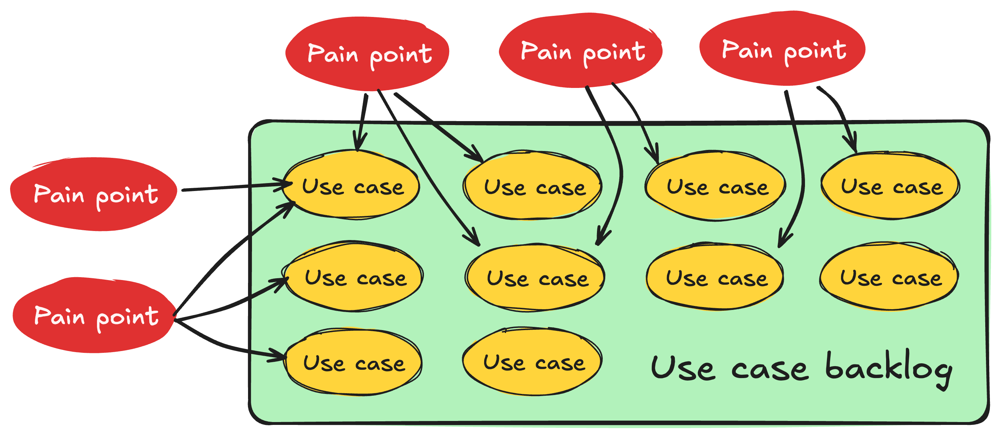

**tl;dr:**
[*Overfitting*](https://bootcamp.uxdesign.cc/overfitting-and-the-problem-with-use-cases-337d9f4bf4d7) happens when solutions don’t generalize sufficiently and is a hallmark of poor design.
*Eigensolutions* are the opposite: solutions that generalize so much they expose links between seemingly unrelated use cases.
Designing eigensolutions takes a mindset shift from linear design to *composability*.

## Creator tools are not Uber or Facebook

In product literature, the design process looks a bit like this:

This works great with the kinds of transactional processes (marketplaces, social media, search engines, etc) most product literature centers around,
but can fall apart when designing creative tools (developer tools, no-code tools, design tools, languages, APIs etc.),
as there are fundamental differences[^0] between the two:
- In **transactional processes**, users have clearly defined goals, and the task is highly specialized
(e.g. *"Go to work"*, *"Order takeout"*, *"Find accommodation for my upcoming trip"*) and can often be modeled as a linear process.
- In **creator tools**, use cases vary *wildly*, goals are neither linear, nor clearly defined, and may even change throughout the session.

Creator tools typically ship knowingly addressing only a percentage of their key use cases — otherwise they would never ship at all.
It’s all about balancing UX, use case coverage, and design/implementation effort.

[^0]: I’ve spent so long designing creator tools that I tended to assume my observations and learnings from my experience are universal.
I first read about this distinction in Joe Mc Lean’s
excellent post on [overfitting](https://bootcamp.uxdesign.cc/overfitting-and-the-problem-with-use-cases-337d9f4bf4d7), and it was a bit of an a-ha moment.

### Evaluating user experience: Floor and ceiling { #floor-ceiling }

In [end-user programming](https://en.wikipedia.org/wiki/End-user_development) we talk about the *floor* and the *ceiling* of a tool:
- The **floor** is the minimum level of knowledge users need to create something useful.
- The **ceiling** refers to the extent of what can be created.

<aside>

[Some](https://mres.medium.com/designing-for-wide-walls-323bdb4e7277) people also talk about [*wide walls*](https://johnumekubo.com/2017/11/09/low-floors-high-ceilings-and-wide-walls/): the range of things that can be made (i.e. how domain specific the tool is).
</aside>

I think that vocabulary generalizes more broadly to creator tools, and can be a useful UX metric.

<figure>

<figcaption>

*Programming languages* tend to have high ceiling, but also a high floor: You make anything, but it requires months or years of training,
whereas *domain specific GUI builders* like Google Forms have a low floor, but also a low ceiling: Anyone can start using them with no training, but you can also only make very specific kinds of things with them.
</figcaption>
</figure>

A product that combines a low floor with a high ceiling is the unicorn of creator tools.
Therefore, most product work in creator tools centers around either **reducing the floor** (making things *easier*), or **increasing the ceiling** (making things *possible*).
Which one of the two takes priority depends on various factors (user research, product philosophy, strategy etc.), and could differ by product area or even by feature.

### Evaluating use case coverage: The Use Case Backlog { #use-case-backlog }

In creator tools, use cases tend to accumulate at a much faster rate than they can be addressed, especially in the beginning.
Therefore we end up with what I call a *"use case backlog"*: a list of use cases that are within scope, but we cannot yet address
due to lack of resources, good solutions, or both.
The more general purpose and the more ambitious the tool is, the higher the rate of accumulation, since the pool of use cases is naturally larger.

<figure>

<figcaption>

Pain points get processed into use cases, which accumulate in the use case backlog

</figcaption>
</figure>

Unlike the linear design process of transactional processes,
the design process for creator tools often consists of *matching* use cases to solutions, which can happen before, during, or after idea conception:

{#

These diagrams (especially the ones below) have too many details and don't necessarily help comprehension.
Simplify, reduce to their essence, make them more abstract.
Also, illustrate better that this is an iterative process.

<figure>

<figcaption>

Here we started the design process with a few use cases in mind,
and made tweaks to the first idea during ideation to incorporate another use case into the design.
Because the first idea addressed a broader set of use cases, we decided to go with that and develop it further.
Then we validated its design with more use cases,
and in the end even realized it also addresses another, unrelated use case!

</figcaption>
</figure>
#}

A product may include *both* transactional processes and creator tools,
e.g. Instagram is a social media platform (transactional) with a photo editor (creator tool).
Although these tend to be more domain-specific creator tools, which are less good examples for the concepts discussed here.

## From overfitting to eigensolutions { #eigensolutions }

[Shishir Mehrotra](https://shishir.io/) (of [Coda](https://coda.io/)) wrote about the importance of “[*Eigenquestions*](https://coda.io/@shishir/eigenquestions-the-art-of-framing-problems)” when framing problems, a term he coined, inspired from his math background:

> the eigenquestion is the question where, if answered, it likely answers the subsequent questions as well.

This inspired me to name a symmetrical concept I’ve been pondering for a while: *Eigensolutions*.
**The *eigensolution* is a solution that addresses several key use cases, that previously appeared unrelated.**

{#
<figure>

<figcaption>
Eigensolutions address multiple key but seemingly unrelated use cases.
</figcaption>

</figure>
#}

An eigensolution is the polar opposite of [overfitting](https://bootcamp.uxdesign.cc/overfitting-and-the-problem-with-use-cases-337d9f4bf4d7).
Overfitting happens when the driving use cases behind a solution are insufficiently diverse,
so the solution ends up being so specific it cannot even generalize to use cases that are clearly related.

**Overfitting is one of the worst things that can happen during the design process.**
It is a hallmark of poor design that leads to feature creep and poor user experiences.
It forces product teams to keep adding more features to address the use cases that were not initially addressed.
The result is UI clutter and user confusion, as from the user’s perspective, there are now multiple distinct features that solve subtly different problems.

## A mindset shift to composability { #composability }

This is all nice and dandy, but how do we design and ship eigensolutions?
Do we just sit around waiting for inspiration to strike?
Well, we *could*, but it would be a pretty poor use of resources. :)

Instead, it takes a *mindset shift*, from the linear *Use case → Idea → Solution* process to **composability**.
Rather than designing a solution to address only our driving use cases,
step back and ask and ask yourself:
can we design a solution as a **composition** of smaller, more general features, that could be used together to address a broader set of use cases?
In many cases the features required for that composition are already implemented and are just missing one piece: our eigensolution.
In other cases composability may require more than one new feature, but the result can still be a net win since these features are useful on their own and can ship independently.

A composability mindset requires **being aware of pain points and use cases across many different product areas**.
This becomes harder in larger organizations, where product teams are highly specialized.
It’s not impossible, but requires conscious effort to cross-polinate all the way down,
rather than completely depending on higher levels of the hierarchy to maintain a bird’s eye view of the product.

It’s also important to note that it’s a spectrum, not a binary: *overfitting* and *eigensolutions* are just its two opposite ends.
Eigensolutions do not come along every day, and do not even exist for all problems.
While it’s important to actively guard against overfitting by making sure solutions are validated by many diverse use cases,
going too far the other side and chasing a general solution for every problem is also a poor use of resources.

{#
<figure>

**The General Problem**

<figcaption>

Source: [xkcd.com/974](https://xkcd.com/974/)
</figcaption>
</figure>
#}

Instead, I think a happy medium is to try and be on the right side of the spectrum:

## Shipping eigensolutions

Good design is only part of the work; but **without shipping, even the most well designed feature is a pointless document**.
Contrary to what you may expect, eigensolutions can actually be quite hard to push to stakeholders:
1. Due to their generality, they often require significantly higher engineering effort to implement.
Quick-wins are easier to sell: they ship faster and add value sooner.
In my 11 years designing web technologies, I have seen many beautiful, elegant eigensolutions be vetoed due to implementation difficulties in favor of far more specific solutions — and often this was the right decision, it's all about the cost-benefit.
2. Eigensolutions tend to be lower level primitives, which are more flexible, but can also involve higher friction to use than a solution that is tailored to a specific use case.

In many cases, [*layering*](#layering) can resolve or mitigate both of these issues.

## Layering with higher level abstractions { #layering }

My north star product design principle is *“Common things should be easy, complex things should be possible”* (paraphrasing [Alan Kay](https://www.goodreads.com/quotes/8636264-simple-things-should-be-simple-complex-things-should-be-possible) — because common things are not always simple, but it’s common things you want to optimize for),
which in essence is another way of aiming for [low floors and high ceilings](#floor-ceiling).

Eigensolutions tend to be lower level primitives.
They enable a broad set of use cases, but may not be the most learnable or efficient way to implement all of them, compared to a tailored solution.
In other words, they make complex things possible, but do not necessarily make common things easy.
*Some do both, in which case congratulations, you’ve got an even bigger unicorn! You can skip this section. :)*

However, this is one of the rare times in life where we can have our cake and eat it too.
Instead of implementing tailored solutions ad-hoc (risking overfitting),
they can be implemented as **shortcuts**: higher level abstractions *using* the lower level primitive.
Done well, shortcuts provide dual benefit: not only do they reduce friction for common cases,
they also serve as teaching aids for the underlying lower level feature.
This offers a very smooth ease-of-use to power curve:
if users need to go further than what the shortcut provides, they can always fall back on the lower level primitive to do so.
[We know](#TBD) that tweaking is easier than creating from scratch,
so even when users use that escape hatch, they can tweak what they had created with the higher level UI, rather than starting from scratch.
This combined approach *both* reduces the floor *and* increases the ceiling!

### Example: Table filtering in Coda

[Coda](https://coda.io) is a product I’ve been using a lot in the last few months.
It has replaced Google Docs, Google Sheets, and a few more niche or custom apps I was using.
Its UI is full of examples of this pattern, but for the sake of brevity, I will focus on one: table filtering.

At first, the filtering UI is pretty high level, designed around common use cases:

<figure>

<figcaption>

Also note the nice touch of "And" not just being informative, but also a control that allows the user to edit the logic used to combine multiple filters.

</figcaption>

</figure>

For the vast majority of use cases (I would guess >95%), the UI is perfectly sufficient.
If you don’t need additional flexibility, you may not even notice the little ***f*** button on the top right.
But for those that need additional power it can be a lifesaver.
That little *f* indicates that behind the scenes, the UI is actually generating a *formula* for filtering.
Clicking it opens a formula editor, where you can edit the formula directly:

I suspect that even for the use cases that require that escape hatch, a small tweak to the generated formula is all that is necessary.
The user may have not been able to write the formula from scratch, but tweaking is easier.
As one data point, the one time I used this, it was just about using parentheses to combine AND and OR differently than the UI allowed.
And as a bonus, the app can collect metrics about what users do with the lower level feature and use that to improve the higher level UI.
It’s a win-win all around.

### What to ship first?

In an ideal world, lower level primitives and higher level abstractions would be designed and shipped together.
However, engineering resources are typically limited, and it often makes sense to ship one before the other,
so we can provide value sooner.

This can happen in either direction:
1. **Lower level primitive first**.
Shortcuts to make common cases easy can ship at a later stage,
and demos and documentation to showcase common "recipes" can be used as a stopgap meanwhile.
This prioritizes use case coverage over optimal UX, but it also allows collecting more data,
which can inform the design of the shortcuts implemented.
2. **Higher level abstraction first**, as an independent, ostensibly ad hoc feature.
Then later, once the lower level primitive ships, it is used to "explain" the shortcut, and make it more powerful.
This prioritizes optimal UX over use case coverage:
we're not covering all use cases, but for the ones we are covering, we're offering a frictionless user experience.

But which one?
As with most things in life, the answer is “it depends”.

A few considerations are:
- How many shortcuts do we need? What percentage of use cases do they cover?
- How much harder is it to use the lower level primitive directly? Are we certain we will need to provide shortcuts, or is it possible it may be sufficient on its own?
- Which one are we more confident about?
- How much engineering effort does the lower level primitive require and how does it compare to implementing the shortcuts as ad hoc features?
- Do we have extensibility mechanisms in place for users to create and share *their own* higher level abstractions over the lower level feature?

Outside of specific cases,
it's also good to have a design principle in place about which way is generally favored, which is part of the product philosophy
(the answer to the [eigenquestion](https://coda.io/@shishir/eigenquestions-the-art-of-framing-problems/eigenquestions-3):
***"Are we optimizing for flexibility or learnability?"***)
and can be used to fall back on if weighing tradeoffs ends up inconclusive.

Note that **even when we don’t think the eigensolution is implementable**,
it can still be useful as a [*north star UI*](#nsui) and designing the tailored solutions as special cases of it can still be a good idea.

<aside id="nsui">

#### North Star UI?

The ideal UI for addressing a set of use cases in a perfect world where we have infinite resources.
This is rarely known to us, but there are cases where we know exactly what the perfect solution would be,
but it’s not feasible due to practical concerns (e.g. implementation challenges), so we need to keep looking.
However, it can still be useful as a guide to steer us in the right direction.
And in some cases, it becomes feasible later on, due to changes in internal or external factors.
In my 11 years of designing web technologies, I have seen many “unimplementable” solutions become implementable later on.

My favorite example, and something I’m proud to have personally helped drive is the current [CSS Nesting syntax](https://developer.mozilla.org/en-US/docs/Web/CSS/CSS_nesting/Using_CSS_nesting).
We had plenty of signal for what the optimal syntax for users would be, but it was vetoed by engineering across all major browsers, so we had to design around certain constraints.
Instead of completely diverging (which *could* have produced better syntaxes!), we used it as a north star, and designed and shipped a syntax that was a bit more verbose but forwards compatible with it.
Once we got consensus on that, I started trying to get people on board to explore ways (even potential algorithms) to bridge the gap,
until eventually Chrome engineers closed on a way to implement the north star syntax 🎉, and as they say, the rest is history.

</aside>

In the web platform we’ve gone back and forth on this a lot.
In the beginning, the Web skewed towards shipping higher level abstractions.
It had a low floor, but also a relatively low ceiling: many capabilities required browser plugins, or desktop applications.
The [Extensible Web Manifesto](https://extensiblewebmanifesto.org/) was created as a reaction,
urging standards groups to design low level primitives first.
For a while, this became the gold standard and many new features were very low level.
This filled some necessary gaps in the platform, but since resources are limited, the layering was often missed, resulting in *only* low level primitives which were a pain to use.
More recently, we’ve been [recommending](https://www.w3.org/TR/design-principles/#high-level-low-level) a more balanced approach, where tradeoffs are evaluated on a case by case basis.

## A fictional example: TableSoda { #example }

Suppose we were working on a fictional product that is an improvement over spreadsheets, let’s call it *TableSoda*.
It has several features that make it more powerful and user-friendly than spreadsheets:
- It allows users to have multiple tables and define formulas or datatypes for a whole column
- It also supports references from a cell of one table to a row of another table.
- Its formula language supports operations on entire columns, and can return entire rows from other tables.
- Each table can be shared with different people, but a given user can either see/edit all the rows and columns of a table, or none.

Some of the use cases in TableSoda’s [use case backlog](#use-case-backlog) are:

- Pivot tables: tables that display stats about the usage of a value in another table (usually counts but also sum, min, max, average, etc.)[^pivot]
- Unions of multiple tables. For example, combining a table of debits and a table of credits into a table of transactions.
- Vertical splitting: Multiple tables augmenting the same data with different metadata. For example, a table of product features, another table that scores these features on various factors, and lastly, a table of 👍🏼 reactions by different team members about each feature.
- Granular access control, by row(s) or column(s). For example, a table of tasks where each row is assigned to a different team member, and each team member can only see their own tasks and only edit the status column.

[^pivot]: Yes, pivot tables are more complex than that, but let’s keep it simple for the sake of the example.

With the traditional PM mindset, we would prioritize which one(s) of these is most important to solve, design a few possible solutions, evaluate tradeoffs between them.
Over time, we may end up with a pivot table feature, a table union feature, a table vertical split feature, a row-level access control feature, and a column-level access control feature.
These features would not necessarily be overfitting, they may solve their respective use cases quite well.
But they also add a lot of complexity to the product.

Instead, we would still prioritize which one to address first, but with the mindset of decomposing it to its essential components
and addressing those (note that there may be many different possible decompositions).
Suppose we decide that we want to prioritize pivot tables.
A pivot table is essentially[^pivot]:
- A table of all unique values in the source column
- For each unique value, columns with its count, sum, etc. in the source column

Users can already count the number of values in a column using formulas, and they can also use a `unique()` formula to get a list of unique values in a column.
So what prevents them from creating their own pivot tables?
There is no way to create dynamic tables in TableSoda, rows can only be added by users.
What if we could populate a table’s rows via a formula? The formula values could be used either for one column or multiple (if it returns a list of objects).

Formula-populated tables not only solve our driving use case, but all of the above:
- Unions can be implemented by using a formula to concatenate the rows of multiple tables into a single list.
- Vertical splitting can be implemented by using a formula to keep the rows of multiple tables in sync with a master table
- Granular access control can be implemented by having a table with different permissions that is populated using a formula that filters the rows and/or columns of the source table.

It’s an eigensolution!

Note that our eigensolution is not the end for any of our use cases.
It makes many things *possible*, but none of them are *easy*.
Some of them are common enough to warrant a [shortcut](#layering): UI that generates the formula needed.
For others, our solution is more of a *workaround* than a primary solution, and the search for a primary solution continues, potentially with reduced prioritization.
And others don’t come up often enough to warrant anything further.
But even if we still need to smoothen the ease-of-use to power curve, making things *possible* bought us a lot more time to make them *easy*.

## Use cases as the testsuite of product design

The most discerning of readers may have noticed that despite the name *eigensolution*, it’s still all about the use cases:
**eigensolutions just expose links between use cases that may have been hard to detect, but seem obvious in retrospect**.
In the example above, one *could* have seen in advance that all of these use cases were fundamentally about dynamically populating tables.
But wasn't it *so* much easier to see in retrospect?

Requiring all use cases to precede any design work can be unnecessarily restrictive,
as frequently solving a problem improves our understanding of the problem.

Joe McLean (of [Miro](https://miro.com/)) [takes a more extreme position](https://bootcamp.uxdesign.cc/overfitting-and-the-problem-with-use-cases-337d9f4bf4d7):

> I believe it’s best to think of a use case as a test case to see if your basic tools are working. What’s missing from the toolbox? What are the limits of what’s available? What 4 use cases would open up with the addition of one more tool?
>
> Use cases should be applied after design is done — to check if the tools available can accomplish the job. As a starting point, they put you in a mindset to overfit. This is especially dangerous because users will often tell you they love it in concept testing. “Ah yes, here is my process, represented in pictures!” But it’s only when you actually try to use the tool — hold the thing in your hands — that there’s a hundred things you need it to do that it doesn’t. It’s not flexible — it’s a series of menus and disappointed feature requirements.

Joe argues for using use cases *only* at the end, to validate a design, as he believes that starting from use cases leads puts you in a mindset to overfit.
This is so much the polar opposite of current conventional wisdom, that many would consider it heresy.

I think that *also* imposes unnecessary constraints on the design process.
I personally favor a more iterative process:

1. Collect as many diverse use cases as possible upfront to drive the design
2. Additional use cases are used to refine the design until it stabilizes
3. Even more at the end to validate it further.

If you’re on the right path, additional use cases will smoothly take you from refinement to validation as the design stabilizes.
If you’re not on the right path, they will expose fundamental flaws in your design and show you that you need to start over.

This has some similarities to test-driven development in engineering:
engineers start with a few test cases before writing any code,
then add more as they go to make sure everything works as expected.

But if someone else’s design thinking works best with using use cases only for validation, more power to them!

**What matters is that the outcome is a solution that addresses a broad set of use cases in a way users can understand and use.**
We can probably all agree that no proposal should be considered without being **rigorously** supported by use cases.
It is not enough for use cases to exist;
they need to be sufficiently diverse and correspond to *real* user pain points that are *common* enough to justify the cost of adding a new feature.
But whether use cases drove the design, were used to validate it, or a mix of both is irrelevant,
and requiring one or the other imposes unnecessary constraints on the design process.

*Thanks to Marily Nika and Elika Etemad for providing feedback on an earlier draft of this post.*
