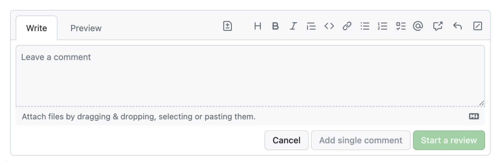

Usability and aesthetics *usually* go hand in hand.
In fact, there is even what we call the [*"Aesthetic Usability Effect"*](https://www.nngroup.com/articles/aesthetic-usability-effect/):
users perceive beautiful interfaces as easier to use and cut them more slack when it comes to minor usabiity issues.

Unfortunately, sometimes usability and aesthetics can be at odds, also known as “form over function”.

## Simplicity, and knowing when to stop

A common incarnation of form-over-function, is when designers start identifying signifiers and affordances as noise to be eliminated,
sacrificing a great deal of learnability for an — often marginal — improvement in aesthetics.

[Aesthetic and Minimalist Design](https://www.nngroup.com/articles/aesthetic-minimalist-design/) is one of the Nielsen/Norman core usability heuristics (and all other heuristics taxonomies have something similar).
More poetically, Antoine de Saint-Exupéry said *“Perfection is achieved, not when there is nothing more to add, but when there is nothing left to take away”*.
However, this is one of those cases where everyone agrees with the theory, but the devil is in the details (though user testing can do wonders for consensus).

<!-- more -->

Case in point: The new Github comment UI is *beautiful*.
Look at how the text area smoothly blends with the tab, creating an irregular and visually interesting shape!

<figure>

<figcaption>

The new GitHub commenting UI, unfocused.
</figcaption>
</figure>

<figure>

<figcaption>

The new GitHub commenting UI, focused. Am I the only one that expected the focus outline to also follow the irregular shape?
</figcaption>
</figure>

However, I cannot for the life of me internalize that this is a text field that I can type in.
Even after using it over a dozen times, I still have to do a double take every time (*“Where is the comment field?!”*, *“Why is this read-only?”*).

For comparison, this was the old UI:

<figure>

<figcaption>

The old GitHub commenting UI (focused only — I couldn’t find an unfocused one).
</figcaption>
</figure>

While definitely more cluttered, its main UI elements were much more recognizable:
there is a text field, indicated by the rounded rectangle, and tabs, indicated by the light gray border around the active tab.
By merging the two, both affordances are watered down to the point of being unrecognizable.

Yes, there was more visual clutter, not all of which serves a purpose.
A skilled designer could probably eliminate the rounded rectangle around the entire area without impacting usability.
But the current design goes too far, and throws the baby out with the bathwater.

<figure>

<figcaption>

Twitter seems to be trying something similar, but since there is no irregular shape,
the text field affordance is not entirely lost.
</figcaption>
</figure>

## The ever-evolving vocabulary of user interaction

Communication is all about mutually understood conventions: [a sufficiently widespread grammatical mistake eventually becomes part of the language](https://www.babbel.com/en/magazine/english-errors-that-are-now-accepted-as-correct).
In the language of user interfaces, affordances and signifiers are the vocabulary, and the same principles apply.
Learnability is not an intrinsic property of a UI; it is a function of the context (cultural and otherwise) in which it is used.

Many affordances and signifiers use metaphors from the physical world to communicate what a user can do.
For example a button that looks raised reminds us of physical buttons.
Tabs are a metaphor for the tabs in a binder.
Others are entirely arbitrary and acquire meaning through learning, such as link underlines or the “hamburger” menu icon.

We see the same pattern in language: some words are onomatopoeic, such as “buzz” or “meow”, while others are entirely learned, such as “dog” or “cat”.
Similarly, writing systems began as pictograms, but evolved to be more abstract and symbolic.

<figure>

<figcaption>

Insight and picture from https://ux.stackexchange.com/a/56896/11761

> At first, the symbols are direct (if cartoony) representations. Then they slowly lose their extrinsic meaning and become defined more by our conventions of using them (our shared language) and the references to outside concepts disappear.

It’s worth reading the whole post if you have time.
</figcaption>
</figure>

UI evolution is rife with patterns that began as obscure and ended up as obvious.
In other words, [external consistency](https://www.nngroup.com/articles/consistency-and-standards/) improved,
not because the UIs changed, but because the environment did.

Some examples you are undoubtedly familiar with:
- Underlines have always been a strong affordance for links (to the point that [using them for anything else is an antipattern](https://www.nngroup.com/articles/guidelines-for-visualizing-links/#:~:text=Don%27t%20underline%20any%20text%20that%27s%20not%20a%20link)).
However, users evolved to perceive weaker signals as links, such as different colors, especially [if used consistently](https://www.nngroup.com/articles/guidelines-for-visualizing-links/#:~:text=Never%20show%20text%20in%20your%20chosen%20link%20colors%20unless%20it%27s%20a%20link).
- Clicking a website logo to go to the homepage was once an obscure hidden interaction, almost an easter egg.
It is now so conventional that [a logo that does nothing when clicked is considered a usability issue](https://www.nngroup.com/articles/homepage-links/#:~:text=Website%20logos%20should%20link%20to%20the%20homepage) (though having separate Home links is [still the recommendation](https://www.nngroup.com/articles/homepage-links/), [28 years after the pattern was introduced](https://ux.stackexchange.com/a/81736/11761)!).
- Buttons used to need a 3D appearance to be perceived as such.
We gradually evolved such that any rectangle around text is perceived as a button, even if it is entirely flat (though research shows that [they](https://www.nngroup.com/articles/flat-ui-less-attention-cause-uncertainty/) [are still](https://www.nngroup.com/articles/clickable-elements/) [less](https://www.nngroup.com/articles/flat-design/) [effective](https://www.nngroup.com/articles/flat-design-long-exposure/)).

Could it be that the new GitHub comment UI is the beginning of a new convention?
It’s possible, but the odds are slim.
For new conventions to become established, they need to be widespread.
Links, buttons, website logos are present on any website, so users get plenty of exposure to any evolution in their design.
Similarly, multiline text fields and tabs are very commonplace UI elements. However, *their combination* is far less common.
Even if every tabbed text field on the Web begun using the exact same design, the average user would still not get enough exposure to internalize it.

## UX Stockholm Syndrome

It is entirely possible that I’m overestimating the impact of this on GitHub users.
After all, I have not done user testing on it, so I’m basing my opinion on my own experience, and on what I’ve learned about usability spending the better part of the last decade at MIT [teaching it](https://designftw.mit.edu/) and doing a PhD on it.

I wondered if it could be an A/B test, so I asked [Chris](https://svgees.us/) to show me what UI he was seeing.
He was also seeing the new UI, but interestingly he expressed frustration about being unable to tell where the text field actually is, and where he can type even before I told him about this article.
Whether or not it’s not an A/B test, I’m really hoping that GitHub is collecting enough metrics so they can evaluate the impact of this design on user experience at scale.

As for me, I take comfort in knowing that when there is no alternative, users can eventually adapt to any UI, no matter how poor, so I *will* at some point get used to it.
Airplane cockpits are the canonical example here, but this is commonly seen in UIs of a lot of enterprise software (though [the wind of change is blowing straight into the face of enterprise UX](https://uxmag.com/articles/the-future-of-enterprise-design-is-consumer-grade-ux)).

<aside>

Of course even with heavy training, poor UIs can still lead to disastrous consequences,
such as [plane crashes](https://en.wikipedia.org/wiki/Helios_Airways_Flight_522),
[hospital deaths](https://www.nngroup.com/articles/medical-usability/) or [military accidents](https://features.propublica.org/navy-uss-mccain-crash/navy-installed-touch-screen-steering-ten-sailors-paid-with-their-lives/).

</aside>

Our life is rife with examples of poor usability, to the point where if something is easy to use, people are often surprised.
There is even what some of us call “[UX Stockholm Syndrome](http://www.ianvoyce.com/index.php/2015/09/17/bad-ux-and-stockholm-syndrome/)”: after very prolonged exposure to a poor interface, users start believing that it is easy to use, and even advocate against improvements.
The [curse of knowledge](https://en.wikipedia.org/wiki/Curse_of_knowledge) makes them forget how difficult it was to learn, and the prolonged exposure can even make them efficient at using it.

Take **hex colors** for example. Quick, what color is `#7A6652`?
Learning to mentally translate between hex color notation and actual visible colors takes years of practice.
Hex notation was never designed for humans; it was designed for machines, as a compact way to represent the 3 bytes of RGB channels of earlier screens.
**Humans do not think of colors as combinations of lights.**
It’s not logical that to make brown you combine some red, a bit less green, and even less blue.
That is neither how we think about color, nor does it relate to any of our real-world color mixing experiences.
There are several color models with a more human-centered design, such as [HSL](https://en.wikipedia.org/wiki/HSL_and_HSV), [LCH](../../2020/04/lch-colors-in-css-what-why-and-how), [OKLCH](https://www.smashingmagazine.com/2023/08/oklch-color-spaces-gamuts-css/).
Their coordinates are designed around how humans describe colors,
such as hue for the main color (e.g. red, yellow, green, etc.), chroma/saturation to specify how intense the color is (e.g. 0 would be gray), and lightness to specify how light it is (e.g. white would be 100% and black would be 0%).
Yet, it’s common to see the kinds of people who have had very prolonged exposure to this notation (e.g. web designers) not only prefer it, but even try to sing its praises!

Another example, entirely outside of software, is music notation.
You’ve likely learned it as a child, so it’s hard to remember what the learning experience was like,
and if you regularly read music sheets, you may even believe it’s easy.
But if we try to step back and examine it objectively, it’s highly unintuitive.

Expanding on this would take a whole other article, but I will just give one example.
Take a look at the symbols for notes and pauses:

<figure>

<figcaption>
Image courtesy of [Musicnotes](https://www.musicnotes.com/blog/how-to-read-sheet-music/)

</figcaption>
</figure>

There is not only an ordering here, but successive symbols even have a fixed ratio of 2.
Yet *absolutely nothing* in their representation signifies this.
**Nothing in the depiction of ♩ indicates that it is longer than ♪, let alone that it is *double* the length.**
You just have to learn it.
Heck, there’s nothing even indicating whether a symbol produces sound or not!
Demanding a lot of [knowledge in the head](https://medium.com/@matthewraychiang/doet-knowledge-in-the-head-and-in-the-world-64f901627eb3)
is not a problem in itself; it’s a common tradeoff when efficiency is higher priority than learnability.
E.g. the alphabet is also a set of arbitrary symbols we need to learn to be able to form words.
But even the best tradeoff is worse than none, aka having your cake and eating it too beats both options.
Was a tradeoff really necessary here?
Was there really no possible depiction of these symbols that could communicate their purpose, order, and ratios? Or at least a notation that was [memorable by association rather than straight memorization](https://medium.com/@matthewraychiang/doet-knowledge-in-the-head-and-in-the-world-64f901627eb3)?

## Update: GitHub’s response (Nov 20th, 2023)

Apparently this post made quite a stir internally at GitHub, and after several iterations, [they fixed the issue](https://front-end.social/@dipree@mastodon.social/111444773791934052)! 🎉
This is the current comment UI:

