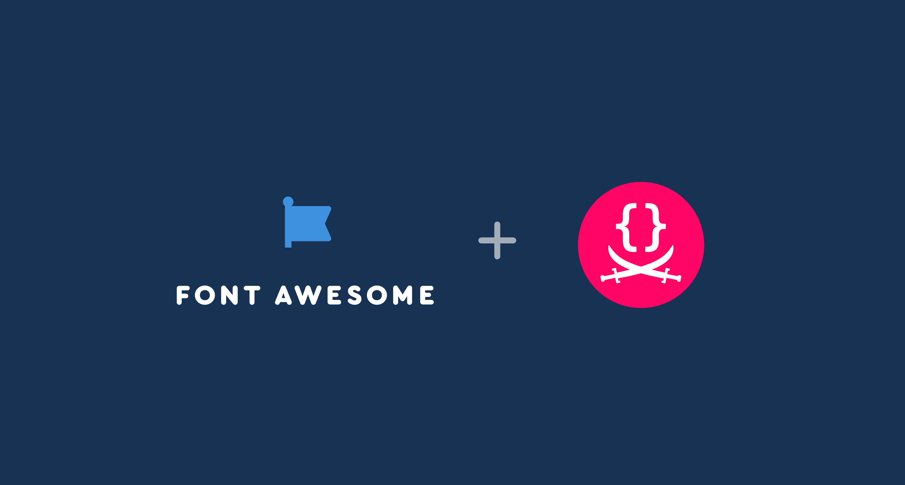

Folks, I have some exciting news to share. 🤩

Today I start a new chapter in my career.
After [a decade at MIT](../../2014/02/im-going-to-mit/), [teaching](https://designftw.mit.edu) and
doing [research](https://lea.verou.me/publications/#research) at the intersection of usability and programming language design,
I wrapped up my [PhD](https://phd.verou.me) two weeks ago
(yes, **I’m a Dr now**! And [_damn right I will_](https://www.nytimes.com/2018/06/28/opinion/women-dont-back-down-online.html) — once it actually sinks in)
and **today I start my new role as _Product Lead_ at [Font Awesome](https://fontawesome.com)**.

I will be evaluating user needs and improving product design and usability across all company products,
with an emphasis on [Web Awesome](https://www.kickstarter.com/projects/fontawesome/web-awesome),
the product we are launching early next year to revolutionize how Web UIs are built by using web components and CSS in ways you’ve never seen before.
Beyond improving the products themselves (all of which include **extensive free & open source versions**),
part of my role will utilize [my web standards experience](/specs) to collect web platform pain points from across the company and translating them to new and existing web standards proposals.

Yes, I know, it’s a match made in heaven. 😍
There is even a small chance I may have been the first to [create an icon font for use in a web UI via `@font-face`](../../2010/02/iphone-keyboard-with-css3-no-images/),
which would make it even more wonderfully poetic that I’m joining the company that has become synonymous with icon fonts on the Web.

However, it was not [my MIT PhD](https://phd.verou.me) that led me to this role,
but an email from Dave Gandy (creator & CEO of Font Awesome) about [Color.js](https://colorjs.io),
that turned into hours of chats,
and eventually a job offer for a role I could not refuse, one that was literally molded around my skills and interests.

The role is not the only reason I’m excited to join Font Awesome, though.
The company itself is a breath of fresh air:
open source friendly (as Dave says, _“literally the only reason we have Pro versions is that we need to sustain this somehow”_ 😅),
already profitable (= no scrambling to meet VC demands by cramming AI features nobody wants into our products),
fully remote, huge emphasis on work-life balance,
and an interview process that did not feel like an interview — or even a process.
In fact, they did not even want to look at my resume (despite my efforts 🤣).
It is telling that **in their 10 years of existence, not a single person has left the company, and they have never had to let anyone go**.
Moreover, it bridges the best of both worlds: despite having existed for a decade,
branching out to new products[^1] and markets gives it a startup-like energy and excitement.

[^1]: My excitement grew even stronger when a week before my start date, I learned that [11ty (and its creator, Zach Leatherman) had also joined Font Awesome](https://www.11ty.dev/blog/eleventy-font-awesome/)
— I think at this point every tool I use regularly is officially _Awesome_ 😅.
Yes, this site is built on 11ty as well. And even my [PhD thesis](https://phd.verou.me)!

I had been extremely selective in the job opportunities I pursued, so it took a while to find the perfect role.
Having ADHD (diagnosed only last year — I want to write a blog post about that too at some point),
I knew it was _crucial_ to find a job I could be passionate about:
ADHD folks are unstoppable machines in jobs they love (I have literally built my career by directing my [_hyperfocus_](https://en.wikipedia.org/wiki/Hyperfocus) to things that are actually productive),
but struggle way more than neurotypicals in jobs they hate.
It took a while, but when I started talking with Dave, I knew Font Awesome was _it_.

I’m still reeling from the mad rush of spending the past couple of months averaging 100-hour weeks to wrap up my PhD before I could start,
but I couldn’t be more excited about this new chapter.

I’m hoping to write a series of blog posts in the coming weeks about about my journey to this point.
Things like:
- How I decided that academia was not for me — but persisted to the finish line anyway because I’m stubborn AF 😅
- How I realized that product work is my real calling, not software engineering per se (as much as I love both)
- How I used web technologies instead of LaTeX to write [my PhD thesis](https://phd.verou.me) (and print it to [PDF](https://phd.verou.me/thesis.pdf) for submission), with [11ty](https://11ty.dev) plus several open source plugins, many of which I wrote, an ecosystem I hope to one day free more people from the tyranny of LaTeX (which was amazing in the 70s, but its ergonomics are now showing their age).

But for now, I just wanted to share the news, and go off to make the web more awesome — _for everyone_. 🚀

