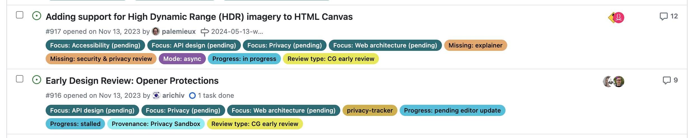

<div class=nutshell>

Can we emulate the upcoming CSS [`contrast-color()`](https://drafts.csswg.org/css-color-5/#contrast-color) function via CSS features that have already widely shipped?
And if so, what are the tradeoffs involved and how to best balance them?
</div>

## Relative Colors

Out of [all the CSS features I have designed](/specs/),
[Relative Colors](/specs/#relative-colors) aka _Relative Color Syntax_ (RCS) is definitely among the ones I’m most proud of.
In a nutshell, they allow CSS authors to derive a new color from an existing color value by doing arbitrary math on color components
in any supported color space:

```css
--color-lighter: hsl(from var(--color) h s calc(l * 1.2));
--color-lighterer: oklch(from var(--color) calc(l + 0.2) c h);
--color-alpha-50: oklab(from var(--color) l a b / 50%);
```

The elevator pitch was that by allowing lower level operations they provide authors flexibility on how to derive color variations,
giving us more time to figure out what the appropriate higher level primitives should be.

As of May 2024, RCS has [shipped in every browser except Firefox](https://caniuse.com/css-relative-colors).
but given that it is an [Interop 2024 focus area](https://web.dev/blog/interop-2024),
that [Firefox has expressed a positive standards position](https://mozilla.github.io/standards-positions/#css-relative-color-syntax),
and that the [Bugzilla issue](https://bugzilla.mozilla.org/show_bug.cgi?id=1701488) has had some recent activity and has been assigned,
I am optimistic it would ship in Firefox soon (edit: **it shipped 5 days after writing these lines, in Firefox 128** 🎉).
My guess it that it would become [Baseline](https://web.dev/baseline) by the end of 2024.

Even if my prediction is off, it already is available to **83% of users worldwide**,
and if you sort [its caniuse page](https://caniuse.com/css-relative-colors) by usage,
you will see the vast majority of the remaining 17% doesn’t come from Firefox,
but from older Chrome and Safari versions.
I think **its current market share warrants production use today**,
as long as we use `@supports` to make sure things *work* in non-supporting browsers, even if less pretty.

Most [Relative Colors tutorials](https://developer.chrome.com/blog/css-relative-color-syntax)
revolve around its primary driving use cases:
making tints and shades or other color variations by tweaking a specific color component up or down,
and/or overriding a color component with a fixed value,
like the example above.
While this does address some very common pain points,
it is merely scratching the surface of what RCS enables.
This article explores a more advanced use case, with the hope that it will spark more creative uses of RCS in the wild.

## The CSS `contrast-color()` function

One of the big longstanding CSS pain points is that it’s impossible to automatically specify a text color that is guaranteed to be readable on arbitrary backgrounds,
e.g. white on darker colors and black on lighter ones.

Why would one need that?
The primary use case is *when colors are outside the CSS author’s control*.
This includes:
- **User-defined colors.** An example you’re likely familiar with: GitHub labels. Think of how you select an arbitrary color when creating a label and GitHub automatically picks the text color — often poorly (we’ll see why in a bit)
- **Colors defined by another developer.** E.g. you’re writing a web component that supports certain CSS variables for styling.
You *could* require separate variables for the text and background, but that reduces the usability of your web component by making it more of a hassle to use.
Wouldn’t it be great if it could just use a [sensible default](https://www.nngroup.com/articles/slips/), that you can, but rarely need to override?
- **Colors defined by an external design system**, like [Open Props](https://open-props.style/), [Material Design](https://material.io/), or even (*gasp*) [Tailwind](https://tailwindcss.com/).

<figure>


<figcaption>
GitHub Labels are an example where colors are user-defined, and the UI needs to pick a text color that works with them.
GitHub uses WCAG 2.1 to determine the text color, which is why (as we will see in the next section) the results are often poor.
</figcaption>
</figure>

Even in a codebase where every line of CSS code is controlled by a single author,
reducing couplings can improve modularity and facilitate code reuse.

The good news is that this is not going to be a pain point for much longer.
The CSS function [`contrast-color()`](https://drafts.csswg.org/css-color-5/#contrast-color) was designed to address exactly that.
This is not new, you may have heard of it as `color-contrast()` before, an earlier name.
I recently [drove consensus to scope it down to an MVP](https://github.com/w3c/csswg-drafts/issues/9166) that addresses the most prominent pain points and can actually ship soonish,
as it circumvents some very difficult design decisions that had caused the full-blown feature to stall.
I then [added it to the spec](https://github.com/w3c/csswg-drafts/commit/39f469149abb5575505b6d2d54b8bddf119f896d) per WG resolution, though some details still need to be ironed out.

Usage will look like this:

```css
background: var(--color);
color: contrast-color(var(--color));
```

*Glorious, isn’t it?*
Of course, soonish in spec years is still, well, years.
As a data point, you can see in [my past spec work](/specs/) that with a bit of luck (and browser interest), it can take as little as 2 years to get a feature shipped across all major browsers after it’s been specced.
When the standards work is also well-funded,
there have even been cases where a feature went **from conception to baseline in 2 years**,
with [Cascade Layers](https://developer.mozilla.org/en-US/docs/Learn/CSS/Building_blocks/Cascade_layers) being the poster child for this:
[proposal by Miriam in Oct 2019](https://github.com/w3c/csswg-drafts/issues/4470),
[shipped in every major browser by Mar 2022](https://caniuse.com/css-cascade-layers).
But 2 years is still a long time (and there are no guarantees it won’t be longer).
What is our recourse until then?

As you may have guessed from the title, the answer is yes.
It may not be pretty, but there is a way to emulate `contrast-color()` (or something close to it) using Relative Colors.

## Using RCS to automatically compute a contrasting text color

In the following we will use the [OKLCh color space](https://www.w3.org/TR/css-color-4/#ok-lab), which is the most *perceptually uniform* *polar color space* that CSS supports.

<aside class="info" style="--label: 'Glossary'">

- **Perceptually uniform color space**: A color space where the Euclidean distance between two colors is proportional to their perceptual difference.
RGB spaces (and their polar forms, HSL, HSV, HSB, HWB, etc.) are typically *not* perceptually uniform.
Some examples of what this means for HSL in [my older post on LCH](../../2020/04/lch-colors-in-css-what-why-and-how/).
Examples of perceptually uniform color spaces include Lab, LCH, OkLab, and OkLCh.
- **Polar color space**: A color space where colors are represented as an angular hue (which determines the “core” color, e.g. red, yellow, green, blue, etc.) and two components that control the exact shade of that hue (typically some version of colorfulness and lightness).

</aside>

Let’s assume there is a Lightness value above which black text is guaranteed to be readable regardless of the chroma and hue,
and below which white text is guaranteed to be readable.
We will validate that assumption later, but for now let’s take it for granted.
In the rest of this article, we’ll call that value the **threshold** and represent it as <var>L<sub>threshold</sub></var>.

We will compute this value more rigously in the next section (and prove that it actually exists!),
but for now let’s use `0.7` (70%).
We can assign it to a variable to make it easier to tweak:

```css
--l-threshold: 0.7;
```

<aside class="info">

Most RCS examples in the wild use `calc()` with simple additions and multiplications.
However, **any math function supported by CSS is actually fair game**, including `clamp()`, trigonometric functions, and many others.
For example, if you wanted to create a lighter tint of a core color with RCS,
you could do something like this:

```css
background: oklch(from var(--color) 90% clamp(0, c, 0.1) h);
```

</aside>

Let’s work backwards from the desired result.
We want to come up with an expression that is composed of **widely supported CSS math functions**,
and will return <var>1</var> if <var>L</var> ≤ <var>L<sub>threshold</sub></var> and <var>0</var> otherwise.
If we could write such an expression, we could then use that value as the lightness of a new color:

```css
--l: /* ??? */;
color: oklch(var(--l) 0 0);
```

<aside class="info">

The CSS math functions that are widely supported are:
- `calc()`
- `min()`, `max()`, `clamp()`
- [Trigonometric functions](https://drafts.csswg.org/css-values-4/#trig-funcs) (`sin()`, `cos()`, `tan()`, `asin()`, `acos()`, `atan()`, `atan2()`) *([another CSS feature I proposed](https://lea.verou.me/specs/#css-trigonometric-functions), back in 2018 😁)*
- [Exponential functions](https://drafts.csswg.org/css-values-4/#exponent-funcs) (`exp()`, `log()`, `log2()`, `log10()`, `sqrt()`)

</aside>

How could we simplify the task?
One way is to **relax what our expression needs to return**.
We don’t actually need an exact <var>0</var> or <var>1</var>
If we can manage to find an expression that will give us <var>0</var> when <var>L</var> > <var>L<sub>threshold</sub></var>
and > <var>1</var> when <var>L</var> ≤ <var>L<sub>threshold</sub></var>,
we can just use `clamp(0, /* expression */, 1)` to get the desired result.

One idea would be to use ratios, as they have this nice property where they are > <var>1</var> if the numerator is larger than the denominator and ≤ <var>1</var> otherwise.

The ratio of $\frac{\displaystyle L}{\displaystyle L_{\mathrm{threshold}}}$ is < <var>1</var> for <var>L</var> ≤ <var>L<sub>threshold</sub></var> and > <var>1</var> when <var>L</var> > <var>L<sub>threshold</sub></var>.
This means that $\frac{\displaystyle L}{\displaystyle L_{\mathrm{threshold}}} - 1$ will be a negative number for <var>L</var> < <var>L<sub>threshold</sub></var> and a positive one for <var>L</var> > <var>L<sub>threshold</sub></var>.
Then all we need to do is multiply that expression by a huge number so that the positive number is guaranteed to be over <var>1</var>.

Putting it all together, it looks like this:

```css
--l-threshold: 0.7;
--l: clamp(0, (l / var(--l-threshold) - 1) * -infinity, 1);
color: oklch(from var(--color) var(--l) 0 h);
```

One worry might be that if L gets close enough to the threshold we could get a number between <var>0</var> - <var>1</var>,
but in my experiments this never happened, presumably since precision is finite.

### Fallback for browsers that don’t support RCS

The last piece of the puzzle is to provide a fallback for browsers that don’t support RCS.
We can use `@supports` with any color property and any relative color value as the test, e.g.:

```css
.contrast-color {
	/* Fallback */
	background: hsl(0 0 0 / 50%);
	color: white;

	@supports (color: oklch(from red l c h)) {
		--l: clamp(0, (l / var(--l-threshold) - 1) * -infinity, 1);
		color: oklch(from var(--color) var(--l) 0 h);
		background: none;
	}
}
```

In the spirit of making sure things work in non-supporting browsers, even if less pretty,
some fallback ideas could be:
- A white or semi-transparent white background with black text or vice versa.
- `-webkit-text-stroke` with a color opposite to the text color. This works better with bolder text, since half of the outline is inside the letterforms.
- Many `text-shadow` values with a color opposite to the text color. This works better with thinner text, as it’s drawn behind the text.

## Does this mythical L threshold actually exist?

In the previous section we’ve made a pretty big assumption:
That there is a Lightness value (<var>L<sub>threshold</sub></var>) above which black text is guaranteed to be readable regardless of the chroma and hue,
and below which white text is guaranteed to be readable regardless of the chroma and hue.
But does such a value exist?
It is time to put this claim to the test.

When people first hear about [perceptually uniform color spaces]() like [Lab](https://en.wikipedia.org/wiki/CIELAB_color_space), [LCH](https://en.wikipedia.org/wiki/CIELAB_color_space#Cylindrical_model) or their improved versions, [OkLab](https://bottosson.github.io/posts/oklab/) and [OKLCH](https://www.w3.org/TR/css-color-4/#ok-lab),
they imagine that they can infer the contrast between two colors by simply comparing their L(ightness) values.
This is unfortunately not true, as contrast depends on more factors than perceptual lightness.
However, there is certainly _significant_ correlation between Lightness values and contrast.

At this point, I should point out that while most web designers are aware of the [WCAG 2.1 contrast algorithm](https://www.w3.org/TR/WCAG21/#contrast-minimum),
which is part of the [Web Content Accessibility Guidelines](https://www.w3.org/TR/WCAG21/) and baked into law in many countries,
**it has been known for years that it produces extremely poor results**.
So bad in fact that in [some tests](https://www.cedc.tools/article.html) it performs almost as bad as random chance for any color that is not very light or very dark.
There is a newer contrast algorithm, [APCA](https://apcacontrast.com/) that produces _far_ better results,
but is not yet part of any standard or legislation, and there have previously been some bumps along the way with making it freely available to the public (which seem to be largely resolved).

<figure>
<div style="padding: .5em 1em; background: hsl(180 62% 40%); color: white">Some text</div>
<div style="padding: .5em 1em; background: hsl(180 62% 40%); color: black">Some text</div>
<figcaption>Which of the two seems more readable?
You may be surprised to find that the white text version fails WCAG 2.1,
while the black text version even passes WCAG AAA!
</figcaption>
</figure>

So where does that leave web authors?
In quite a predicament as it turns out.
It seems that the best way to create accessible color pairings right now is a two step process:
- Use APCA to ensure **actual readability**
- **Compliance failsafe**: Ensure the result does not actively _fail_ WCAG 2.1.

I ran [some quick experiments](research/) using [Color.js](https://colorjs.io)
where I iterate over the [OKLCh reference range](https://drafts.csswg.org/css-color-4/#prr-oklch) (loosely based on the P3 gamut)
in increments of increasing granularity and calculate the lightness ranges for colors where white was the "best" text color (= produced higher contrast than black) and vice versa.
I also compute the brackets for each level (fail, AA, AAA, AAA+) for both APCA and WCAG.

I then turned my exploration into an [interactive playground](research) where you can run the same experiments yourself,
potentially with narrower ranges that fit your use case, or with higher granularity.

<figure>
<video src="videos/playground.mp4" loop autoplay muted style="max-height: 60vh"></video>
<figcaption>Calculating lightness ranges and contrast brackets for black and white on different background colors.</figcaption>
</figure>

This is <a href="research/?c=0,0.4,0.025&h=0,359,1">the table produced with C ∈ [0, 0.4\] (step = 0.025) and H ∈ [0, 360) (step = 1)</a>:

<table>
	<thead><tr><th rowspan="2">Text color</th><th rowspan="2">Level</th><th colspan="2">APCA</th><th colspan="2">WCAG 2.1</th></tr><tr><th>Min</th><th>Max</th><th>Min</th><th>Max</th></tr></thead>
	<tbody class="white">
		<tr class="best"><th rowspan="5">white</th><td>best</td><td>0%</td><td>75.2%</td><td>0%</td><td>61.8%</td></tr>
		<tr class="fail"><td>fail</td><td>71.6%</td><td>100%</td><td>62.4%</td><td>100%</td></tr>
		<tr class="aa"><td>AA</td><td>62.7%</td><td>80.8%</td><td>52.3%</td><td>72.1%</td></tr>
		<tr class="aaa"><td>AAA</td><td>52.6%</td><td>71.7%</td><td>42%</td><td>62.3%</td></tr>
		<tr class="aaa+"><td>AAA+</td><td>0%</td><td>60.8%</td><td>0%</td><td>52.7%</td></tr>
	</tbody>
	<tbody class="black">
		<tr class="best"><th rowspan="5">black</th><td>best</td><td>66.1%</td><td>100%</td><td>52%</td><td>100%</td></tr>
		<tr class="fail"><td>fail</td><td>0%</td><td>68.7%</td><td>0%</td><td>52.7%</td></tr>
		<tr class="aa"><td>AA</td><td>60%</td><td>78.7%</td><td>42%</td><td>61.5%</td></tr>
		<tr class="aaa"><td>AAA</td><td>69.4%</td><td>87.7%</td><td>51.4%</td><td>72.1%</td></tr>
		<tr class="aaa+"><td>AAA+</td><td>78.2%</td><td>100%</td><td>62.4%</td><td>100%</td></tr>
	</tbody>
</table>

Note that these are the min and max L values for each level.
E.g. the fact that white text *can* fail WCAG when L ∈ [62.4%, 100%] doesn’t mean that *every* color with L > 62.4% will fail WCAG,
just that *some* do.
So, **we can only draw meaningful conclusions by inverting the logic**:
Since all white text failures are have an L ∈ [62.4%, 100%],
it logically follows that if L < 62.4%, white text will pass WCAG
regardless of what the color is.

By applying this logic to all ranges, we can draw similar guarantees for many of these brackets:

<figure>
<div style="overflow: auto">
<table style="margin-inline-end: 1ch"><thead><tr><th colspan="2"></th><th><strong>0%</strong> to <span class="divider after">52.7%</span></th><th><span class="divider before">52.7%</span> to <span class="divider after">62.4%</span></th><th><span class="divider before">62.4%</span> to <span class="divider after">66.1%</span></th><th><span class="divider before">66.1%</span> to <span class="divider after">68.7%</span></th><th><span class="divider before">68.7%</span> to <span class="divider after">71.6%</span></th><th><span class="divider before">71.6%</span> to <span class="divider after">75.2%</span></th><th><span class="divider before">75.2%</span> to <strong>100%</strong></th></tr></thead>
<tbody><tr><th rowspan="2"> Compliance <small>WCAG 2.1</small></th><th>white</th><td class="pass">✅ AA</td><td class="pass">✅ AA</td><td class="fail"></td><td class="fail"></td><td class="fail"></td><td class="fail"></td><td class="fail"></td></tr><tr><!--v-if--><th>black</th><td class="fail"></td><td class="pass">✅ AA</td><td class="pass">✅ AAA</td><td class="pass">✅ AAA</td><td class="pass">✅ AAA</td><td class="pass">✅ AAA</td><td class="pass">✅ AAA+</td></tr><tr><th rowspan="2"> Readability <small>APCA</small></th><th>white</th><td class="pass">😍 Best</td><td class="pass">😍 Best</td><td class="pass">😍 Best</td><td class="ok">🙂 OK</td><td class="ok">🙂 OK</td><td class="fail"></td><td class="fail"></td></tr><tr><!--v-if--><th>black</th><td class="fail"></td><td class="fail"></td><td class="fail"></td><td class="fail"></td><td class="ok">🙂 OK</td><td class="ok">🙂 OK</td><td class="pass">😍 Best</td></tr></tbody></table>
</div>
<figcaption>
Contrast guarantees we can infer for black and white text over arbitrary colors.
OK = passes but is not necessarily best.
</figcaption>
</figure>

You may have noticed that in general, WCAG has a lot of false negatives around white text,
and tends to place the Lightness threshold much lower than APCA.
This is a known issue with the WCAG algorithm.

Therefore, **to best balance readability and compliance, we should use the highest threshold we can get away with**.
This means:
- If passing WCAG is a requirement, the highest threshold we can use is **62.3%**.
- If actual readability is our only concern, we can safely ignore WCAG and pick a threshold somewhere between 68.7% and 71.6%, e.g. **70%**.

Here’s a [demo](#demo) so you can see how they both play out.
Edit the color below to see how the two thresholds work in practice, and compare with the actual contrast brackets, shown on the table next to (or below) the color picker.

<style>
.contrast-color {
	--text-shadow: 0 0 .05em black;
	--text-shadow-2: var(--text-shadow), var(--text-shadow);
	--text-shadow-4: var(--text-shadow-2), var(--text-shadow-2);
	--text-shadow-8: var(--text-shadow-4), var(--text-shadow-4);
	text-shadow: var(--text-shadow-8);
	color: white;
}

#demo {
	display: flex;
	gap: 2em;
	padding-block: 2rem;

	color-picker {
		flex: 1;

		&::part(swatch) {
			flex: 1.8;
		}
	}

	input[type=number] {
		field-sizing: content;
		background: none;
		color: inherit;
		border: .1em solid;
		border-radius: .2em;
	}

	table {
		width: auto;
		margin-bottom: 0;
	}

	@media (width <= 430px) {
		& {
			flex-direction: column;
		}
	}
}

@supports (color: oklch(from red l c h)) {
	:root {
		--supports-rcs: 1;
	}

	.if-no-rcs {
		display: none;
	}

	.contrast-color {
		--l: clamp(0, (l / var(--l-threshold) - 1) * -infinity, 1);
		color: oklch(from var(--color) var(--l) 0 h);
		text-shadow: none;
	}
}
</style>

<div class="warning if-no-rcs">

Your browser does not support Relative Color Syntax, so the demo below will not work.
This is what it looks like in a supporting browser:


</div>
<section id="demo">
<script type=module>
import { getLevel } from "./research/util.js";
globalThis.updateContrasts = function (color) {
	if (!color) {
		return;
	}
	for (let td of document.querySelectorAll("[data-algo]")) {
		let {algo, color: textColor} = td.dataset;
		let level = getLevel(algo, color.contrast(textColor, algo));
		td.textContent = level;
		td.className = level === "fail" ? "fail" : "pass";
	}
}
</script>
<script type=module src="https://elements.colorjs.io/src/color-picker/color-picker.js"></script>
<color-picker space="oklch" color="oklch(65% 30% 180)" oncolorchange="updateContrasts(this.color)" >
	<div class="contrast-color" style="--l-threshold: 0.7;"><var>L<sub>threshold</sub></var> = 70%</div>
	<label class="contrast-color" style="--l-threshold: 0.645;" style="--l-threshold: 0.623;">
		<var>L<sub>threshold</sub></var> =
		<input type="number" value="64.5" step="0.1" oninput="this.parentNode.style.setProperty('--l-threshold', this.value/100)">%
	</label>
	<div class="contrast-color" style="--l-threshold: 0.623;"><var>L<sub>threshold</sub></var> = 62.3%</div>
</color-picker>
<table id="contrasts">
	<caption>Actual contrast ratios</caption>
	<thead>
		<tr>
			<th>Text color</th>
			<th>APCA</th>
			<th>WCAG 2.1</th>
		</tr>
	</thead>
	<tbody>
		<tr>
			<th>White</th>
			<td data-algo="APCA" data-color="white"></td>
			<td data-algo="WCAG21" data-color="white"></td>
		</tr>
		<tr class="black">
			<th>Black</th>
			<td data-algo="APCA" data-color="black"></td>
			<td data-algo="WCAG21" data-color="black"></td>
		</tr>
</table>
</section>

Avoid colors marked "P3+", "PP" or "PP+", as these are almost certainly outside your screen gamut,
and [browsers currently do not gamut map properly](https://github.com/w3c/csswg-drafts/issues/9449), so the visual result will be off.

<aside class="note language-html" style="--label: 'Sneak peek'">

The [`<color-picker>`](https://elements.colorjs.io/src/color-picker) component above is part of a new project I’m working on called [Color Elements](https://elements.colorjs.io/) ([`color-elements`](https://www.npmjs.com/package/color-elements) on npm).
It’s a (*highly* experimental) collection of web components that make it easy to make color-related apps and demos.
If that seems interesting, feel free to try them out and provide feedback!
</aside>

Note that if your actual color is more constrained (e.g. a subset of hues or chromas or a specific gamut),
you might be able to balance these tradeoffs better by using a different threshold.
Run the experiment yourself with your actual range of colors and find out!

Here are some examples of narrower ranges I have tried and the highest threshold that still passes WCAG 2.1:

| Description | Color range | Threshold |
|-------------|-------------|-----------|
| Modern low-end screens | [Colors within the sRGB gamut](research/?gamut=srgb) | 65% |
| Modern high-end screens | [Colors within the P3 gamut](research/?gamut=p3) | 64.5% |
| Future high-end screens | [Colors within the Rec.2020 gamut](research/?gamut=rec2020) | 63.4% |
| Neutrals | [C ∈ [0, 0.03]](research/?c=0,0.03,0.01) | 67% |
| Muted colors | [C ∈ [0, 0.1]](research/?c=0,0.1,0.01) | 65.6% |
| Warm colors (reds/oranges/yellows) | [H ∈ [0, 100]](research/?h=0,100,1) | 66.8% |
| Pinks/Purples | [H ∈ [300, 370]](research/?h=300,370,1) | 67% |

It is particularly interesting that **the threshold is improved to 64.5% by just ignoring colors that are not actually displayable** on modern screens.
So, assuming (though sadly this is [not an assumption that currently holds true](https://github.com/w3c/csswg-drafts/issues/9449)) that browsers prioritize preserving lightness when gamut mapping, we *could* use 64.5% and still guarantee WCAG compliance.

You can even turn this into a utility class that you can combine with different thesholds:

```css
.contrast-color {
	--l: clamp(0, (l / var(--l-threshold, 0.623) - 1) * -infinity, 1);
	color: oklch(from var(--color) var(--l) 0 h);
}

.pink {
	--l-threshold: 0.67;
}
```

## Conclusion & Future work

Putting it all together, including a fallback, as well as a "fall forward" that uses `contrast-color()`,
the utility class could look like this:

```css
.contrast-color {
	/* Fallback for browsers that don't support RCS */
	color: white;
	text-shadow: 0 0 .05em black, 0 0 .05em black, 0 0 .05em black, 0 0 .05em black;

	@supports (color: oklch(from red l c h)) {
		--l: clamp(0, (l / var(--l-threshold, 0.623) - 1) * -infinity, 1);
		color: oklch(from var(--color) var(--l) 0 h);
		text-shadow: none;
	}

	@supports (color: contrast-color(red)) {
		color: contrast-color(var(--color));
		text-shadow: none;
	}
}
```

This is only a start.
I can imagine many directions for improvement such as:
- Since RCS allows us to do math with *any* of the color components
in *any* color space, I wonder if there is a better formula that still be implemented in CSS and balances readability and compliance even better.
E.g. I’ve had some chats with [Andrew Somers](https://github.com/Myndex) (creator of APCA) right before publishing this,
which suggest that doing math on luminance (the Y component of XYZ) instead could be a promising direction.
- We currently only calculate thresholds for white and black text.
However, in real designs, we rarely want pure black text,
which is why `contrast-color()` only guarantees a *“very light or very dark color”* unless the `max` keyword is used.
How would this extend to darker tints of the background color?

## Addendum

As often happens, after publishing this blog post, a ton of folks reached out to share all sorts of related work in the space.
I thought I’d share some of the most interesting findings here.

### Using luminance instead of Lightness

When colors have sufficiently different lightness values (as happens with white or black text),
humans disregard chromatic contrast (the contrast that hue/colorfulness provide)
and basically only use lightness contrast to determine readability.
This is why L can be such a good predictor of whether white or black text works best.

Another measure, luminance, is basically the color’s Y component in the XYZ color space,
and a good threshold for flipping to black text is when Y > 0.36.
This gives us another method for computing a text color:

```css
--y-threshold: 0.36;
--y: clamp(0, (y / var(--y-threshold) - 1) * -infinity, 1);
color: color(from var(--color) xyz-d65 var(--y) var(--y) var(--y));
```

As you can see in [this demo by Lloyd Kupchanko](https://blackorwhite.lloydk.ca/), using <var>Y<sub>threshold</sub></var> > 36%
very closely predicts the best text color as determined by APCA.

In my tests ([codepen](https://codepen.io/leaverou/pen/ExzVOME)) it appeared to work as well as the <var>L<sub>threshold</sub></var> method,
i.e. it was a struggle to find colors where they disagree.
However, [after this blog post, Lloyd added](https://twitter.com/lkupchanko/status/1791558925206409553) various <var>L<sub>threshold</sub></var> boundaries to his demo,
and it appears that indeed, <var>L<sub>threshold</sub></var> has a wider range where it disagrees with APCA than <var>Y<sub>threshold</sub></var> does.

Given this, **my recommendation would be to use the <var>Y<sub>threshold</sub></var> method if you need to flip between black and white text,
and the <var>L<sub>threshold</sub></var> method if you need to customize the text color further** (e.g. have a very dark color instead of black).

### Browser bug & workarounds

About a week after publishing this post, I discovered a browser bug with `color-mix()` and RCS,
where colors defined via `color-mix()` used in `from` render RCS invalid.
You can use [this testcase](https://codepen.io/leaverou/pen/ExzVOME) to see if a given browser is affected.
This has been fixed in Chrome 125 and Safari TP release 194, but it certainly throws a spanner in the works since the whole point of using this technique is that we don’t have to care how the color was defined.

There are two ways to work around this:
1. Adjust the `@supports` condition to use `color-mix()`, like so:
```css
@supports (color: oklch(from color-mix(in oklch, red, tan) l c h)) {
	/* ... */
}
```
The downside is that right now, this would restrict the set of browsers this works in to a teeny tiny set.
2. Register the custom property that contains the color:
```css
@property --color {
	syntax: "<color>";
	inherits: true;
	initial-value: transparent;
}
```
This completely fixes it, since if the property is registered, by the time the color hits RCS, it’s just a resolved color value.
`@property` is currently [supported](https://caniuse.com/mdn-css_at-rules_property) by a much wider set of browsers than RCS, so this workaround doesn’t hurt compatiblity at all.

### Useful resources

Many people have shared useful resources on the topic, such as:
- [Black or White?](https://blackorwhite.lloydk.ca/): Compare different contrast algorithms for picking between black or white
- [Dynamic text color contrast based on background lightness with CSS/SVG filters](https://miunau.com/posts/dynamic-text-contrast-in-css/): A different approach to the same problem (requires extra HTML element for the text)


*Thanks to [Chris Lilley](https://svgees.us),
[Andrew Somers](https://github.com/myndex),
[Cory LaViska](https://www.abeautifulsite.net/),
[Elika Etemad](https://fantasai.inkedblade.net/),
and [Tab Atkins-Bittner](https://xanthir.com/)
for their feedback on earlier drafts of this article.*