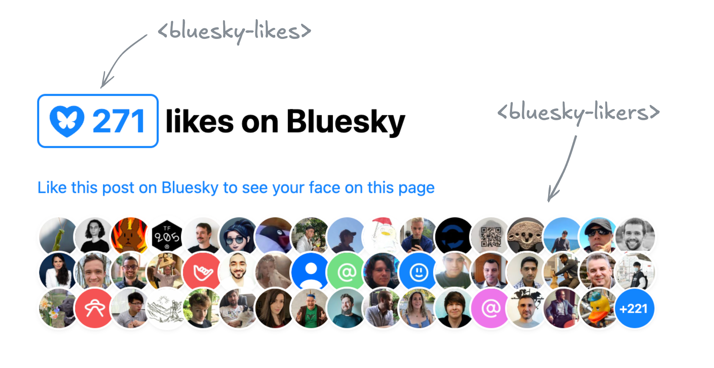
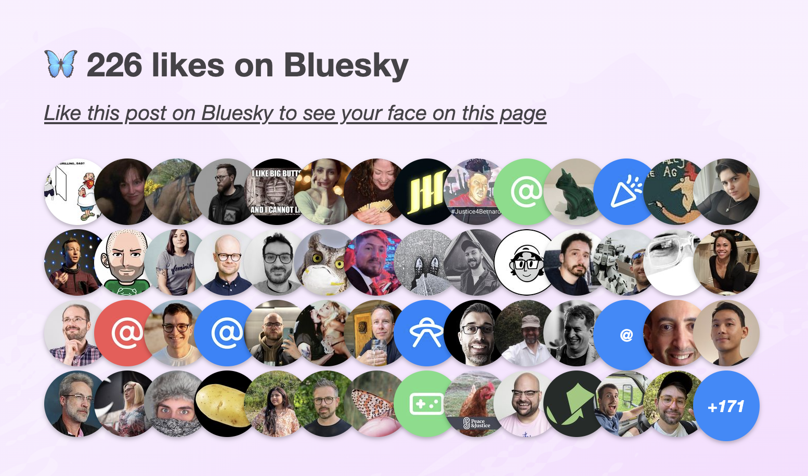

<figure>

<figcaption>

Just want the components? Here you go:
<a href="https://projects.verou.me/bluesky-likes/" target="_blank" class="small cta">
<i class="fa-brands fa-bluesky"></i> Demo</a>
<a href="https://github.com/LeaVerou/bluesky-likes" target="_blank" class="small cta">
<i class="fa-brands fa-github"></i> Repo</a>
<a href="https://www.npmjs.com/package/bluesky-likes" target="_blank" class="small cta">
<i class="fa-brands fa-npm"></i> NPM</a>
</figcaption>
</figure>

## A love letter to the Bluesky API

I’m old enough to remember the golden Web 2.0 era, when many of today’s big social media platforms grew up.
A simpler time, when the Web was much more extroverted.
It was common for websites to embed data from others (the peak of [mashups](https://en.wikipedia.org/wiki/Mashup_(web_application_hybrid))),
and prominently feature widgets from various platforms to showcase a post’s likes or shares.

Especially Twitter was so ubiquitous that the number of Twitter shares was my primary metric for how much people were interested in a blog post I wrote.
Then, websites started progressively becoming walled gardens, guarding their data with more fervor than Gollum guarding the Precious.
Features disappeared or got locked behind API keys, ridiculous rate limits, expensive paywalls, and other restrictions.
Don’t get me wrong, I get it.
A lot of it was reactionary, a response to abuse — the usual reason we can’t have nice things.
And even when it was to stimulate profit — it is understandable that they want to monetize their platforms.
People gotta eat.

I was recently reading [this interesting article](https://whitep4nth3r.com/blog/the-promise-that-wasnt-kept/) by Salma Alam-Naylor.
The article makes some great points, but it was something else that caught my eye: the widget of Bluesky likes at the bottom.

<figure class="no-padding">
	
	<figcaption>Salma's Bluesky likes widget that inspired these</figcaption>
</figure>

I mentioned it to my trusty apprentice [Dmitry](https://d12n.me/) who [discovered](https://codepen.io/dmitrysharabin/pen/Jodbyqm) the API was actually much simpler than what we've come to expect.
Later, it turned out Salma has even written an entire [post](https://whitep4nth3r.com/blog/show-bluesky-likes-on-blog-posts/) on how to implement the same thing on your own site.

The openness of the API was so refreshing.
Not only can you read public data without being authenticated, **you don’t even need an API key!**
Major nostalgia vibes.

It seemed the perfect candidate for a web component that you can just drop in to a page, give it a post URL, and it will display the likes for that post.
I just _had_ to make it, and of course use it right here.

<!-- more -->

**Web Components that use API data have been historically awkward.**
Let’s set aside private API keys or APIs that require authentication even for reading public data for a minute.
Even for public API keys, where on Earth do you put them?!
There is no established pattern for passing global options to components.
**Attributes need to be specified on every instance**, which is very tedious.
So every component invents their own pattern: some bite the bullet and use attributes, others use static class fields, `data-*` attributes on any element or on specific elements, separate ES module exports, etc.
None of these are ideal, so components often do multiple.
Not to mention the onboarding hassle of creating API keys if you want to try multiple APIs.

The Bluesky API was a breath of fresh air:
just straightforward HTTP GET requests with straightforward JSON data responses.

Sing with me!<br>
🎶 _all you need is `fetch`_ 🎺🎺🎺<br>
🎶 _all you need is `fetch`_ 🎺🎺🎺<br>
🎶 _all you need is `fetch`, `fetch`_ 🎶<br>
🎶 _`fetch` is all you need_ 🎶


Building a component that used it was a breeze.

## Two Components for displaying Bluesky likes

In the end I ended up building two separate components, published under the same [`bluesky-likes` npm package](https://www.npmjs.com/package/bluesky-likes):
- `<bluesky-likes>` — displays the number of likes for a post, and
- `<bluesky-likers>` — displays the list of users who liked a post.

They can be used separately, or together.
E.g. to get a display similar to Salma’s widget, the markup would look like this:

```html
<script src="https://unpkg.com/bluesky-likes" type="module"></script>

<h2>
	<bluesky-likes src="https://bsky.app/profile/lea.verou.me/post/3lhygzakuic2n"></bluesky-likes>
	likes on Bluesky
</h2>

<p>
	<a href="https://bsky.app/profile/lea.verou.me/post/3lhygzakuic2n">Like this post on Bluesky to see your face on this page</a>
</p>

<bluesky-likers src="https://bsky.app/profile/lea.verou.me/post/3lhygzakuic2n"></bluesky-likers>
```

And the result would be similar to this:


I started by making a single component that did both, but it quickly became clear that it was better to split them up.
It provided a lot more flexibility with only a tiny bit more effort for the common case,
and it allowed me to simplify the internal structure of each component.

Requests are **aggressively cached** across component instances,
so the fact that it’s two separate components doesn’t mean you’ll be making duplicate requests.
Additionally, these ended up pretty lightweight: the whole package is [~2.5 KB minified & gzipped](https://bundlephobia.com/package/bluesky-likes) and dependency-free.

<aside id="dependencies">
<h4>Aside: On dependencies</h4>

Don’t get me wrong; **I have nothing against dependencies**.
For nontrivial web components or web component libraries, they are typically necessary.
In fact, one of my many unfinished side projects is [a modular library of composable web component helpers](https://github.com/nudeui/element).

I don’t set out to make anything dependency-free; I think that’s the wrong goal.
**Abstractions are how technology moves forward.**
But abstractions come with a **cost**, so they need to add enough **value** to justify their existence in a project.
As with most things in life, it’s all about the balance of tradeoffs.

I tend to approach most dependencies in the same way I approached the epidural when I had my daughter:
first try without, and if it gets too painful, go for it.
It just never got to that point.
They both got close but then it was over. 🤷🏽‍♀️
</aside>

## API Design for Web Components

### Design Principles

Per my usual [API design philosophy](https://www.youtube.com/watch?v=g92XUzc1OHY),
I wanted these components to make common cases easy, complex cases possible, and not have usability cliffs,
i.e. the progression from the former to the latter should be smooth.

<figure>
	<object data="https://talks.verou.me/api-design/images/curve-delightful-3.svg"></object>
	<object data="images/usability-cliff.svg"></object>
	<figcaption>API design curve</figcaption>
</figure>

What does that mean for a web component?

#### Common use cases should be _easy_

You should have a good result by simply including the component and specifying the minimum input to communicate your intent,
in this case, a Bluesky post URL.
- You should not need to write CSS to make it look decent
- You should not need to write JavaScript to make it work
- You should not need to slot content for things that could have sensible defaults
- You should not need to specify things it can figure out on its own from things you've already specified

#### Complex use cases should be _possible_

If you’re willing to put more work into it, the sky should be the limit.
You should be able to completely restyle it, customize nearly every part of its UI etc, but the UX of these things doesn't need to be optimized.

For example:
- **Extensibility over encapsulation**:
If something doesn’t need to be hidden away, expose it as a [part](https://developer.mozilla.org/en-US/docs/Web/CSS/::part).
Don’t be frugal with your parts.
The downsides of exposing too many parts are few and small, but not exposing enough parts can make certain styling impossible.
- Don’t be frugal with [slots](https://developer.mozilla.org/en-US/docs/Web/API/Web_components/Using_templates_and_slots#adding_flexibility_with_slots):
use slots with fallback content liberally.
That way people can customize content or even entire parts of the UI.
- Expose [states](https://developer.mozilla.org/en-US/docs/Web/CSS/:state) for conditional styling. Yes, it’s Baseline now.

<article role="note" class="tip">

You can _style_ the `<slot>` element itself, to avoid adding (and thus, having to expose) additional wrapper divs.
And yes, you can expose a `<slot>` via a `part` as well.
Just be mindful that that part will be available whether the slot has slotted content or not.
</article>

For these components, as a proof of concept, in addition to parts and slots
all component styles and templates are exposed as static properties on the component class that you can modify or replace,
either directly on it, or in your own subclass, for extreme customizability.

#### No usability cliffs

**Making common things easy and complex things possible is not enough** for a good API.
Most use cases fall somewhere in between the two extremes.
If a small increase in use case complexity throws users off the deep end in terms of API complexity, they’re gonna have a _bad time_.

The API should have enough customization hooks that common customizations do not require going through the same flow as full customization and recreating everything.

For web components, this might mean:
- Ideally, **standard CSS properties** on the host should work.
This is also part of the [principle of least astonishment](https://en.wikipedia.org/wiki/Principle_of_least_astonishment).
However, sometimes this is simply not feasible or it would require unacceptable tradeoffs, which brings us to…
- Exposing enough **custom properties** that basic, common customizations don't require parts.
- Nest slots liberally: You should not have to replace an entire part of the UI just to customize its content.
**Nested slots allow you to provide UI extension points at different levels of abstraction.**

## The 99-99 rule of Web Components

The [Ninety-Ninety Rule](https://en.wikipedia.org/wiki/Ninety%E2%80%93ninety_rule) tells us that the last 10% of the work takes 90% of the time.
I would argue that for web components, it’s more like a 99-99 Rule.

Take these components as an example.
They are the poster child for the kind of straightforward, simple component that does one thing well, right?
But web components are a bit like children: if most people realized upfront how much work they are, way fewer would get made. 😅

<figure>
	<object data="images/iceberg.svg"></object>
	<figcaption>Building a web component is always more work than it looks</figcaption>
</figure>

Even when the core functionality is straightforward, there are so many other things that need to be done:
- Dynamically responding to changes (in attributes, slots, nested content, etc) like regular HTML elements takes work, especially if you want to do it 100% _properly_, which is rarely a good idea (more on that below).
Libraries like [Lit](https://lit.dev/) make some of it easier, but not trivial.
- Accessibility and i18n often take orders of magnitude more work than core functionality, especially together.
- Designing & implementing style and UI customization hooks
- Figuring out the right tradeoffs between performance and all of the above

And this is without any additional functionality creeping up.

Some ~~battle scars~~ examples below.

### Customizing the link in `<bluesky-likes>`

A good component has sensible defaults, but allows customization of everything users may reasonably want to customize.
There is nothing more annoying than finding a web component that does _almost_ what you want, but doesn’t allow you to customize the one thing you _really_ need to customize.

My first prototype of `<bluesky-likes>` always had an internal link in its shadow DOM that opened the full list of likers in a new tab.
This opened it up to usability, accessibility, and i18n issues:
- What if you want it to link to the post itself, or even an entirely different URL?
- How to customize the link attributes, e.g. `rel` or `target`?
- **a11y:** The link did not have a `title` at the time, only the icon had alt text.
This meant assistive technologies would read it like "Butterfly blue heart fifteen".
How to word the link title to best communicate what the link does to assistive technologies without excessive verbosity?
- And then, how to allow users to customize the link title for **i18n**?

Often components will solve these types of problems the brute force way, by replicating all `<a>` attributes on the component itself,
which is both heavyweight and a maintenance nightmare over time.

Instead, we went with a somewhat unconventional solution:
**the component detects whether it’s inside a link**, and removes its internal `<a>` element in that case.
This solves all four issues at once; the answer to all of them is to just wrap it with the link of your choice.
This allowed us to just pick a good default `title` attribute, and not have to worry about it.

It’s not perfect: now that `:host-context()` is [removed](https://github.com/w3c/csswg-drafts/issues/1914#issuecomment-2737310093),
there is no way for a component to style itself differently when it’s inside a link,
to e.g. control the focus outline.
And the detection is not perfect, because doing it 100% perfectly would incur a performance penalty for little gain.
But on balance, it so far seems the tradeoffs are worth it.

### The pain of creating accessible components { #a11y }

My first prototype of `<bluesky-likers>` wrapped all avatars with regular links (they just had `rel="nofollow"` and `target=_blank"`).
Quite reasonable, right?
And then it dawned on me: this meant that if a keyboard user had the misfortune of stumbling across this component in their path,
they would have needed to hit Tab 101 (!) times in the worst case to escape it.
**Yikes on bikes!** 😱

So what to do? `tabindex="-1"` would remove the links from the tabbing order, fixing the immediate problem.
But then how would keyboard users actually access them?

A bigger question is _“Do they need to?”_.
These links are entirely auxiliary;
in Salma’s original widget avatars **were not links at all**.
Even if someone wants to explore the profiles of people who liked a post for some reason,
the Bluesky "Liked By" page (already linked via `<bluesky-likes>`) is a much better fit for this.

When using a pointing device, links are free.
If you don’t interact with them, they don’t get in your way, so you may as well have them even if few users will need them.
But when something is part of the tabbing order, there is now a *cost* to it.
**Is the value of being able to tab _to_ it outweighed by the friction of having to tab _past_ it?**

On the other hand, it feels _wrong_ to have links that are not exposed at all to keyboard and assistive tech users.
Even if they are auxiliary, making them entirely inaccessible feels like we’re talking away their agency.

I decided to err on the side of exposing the links to keyboard users,
and added a description, via a `description` slot with default fallback content, to explain to SR users what is being displayed,
and a skip link after it, which is visible when focused.

<details class="warning">
<summary>Why not use the default slot for the description?</summary>

The default slot can be very convenient when nothing else is slotted.
However, it is very annoying to slot things in other slots _without_ slotting anything in the default slot.
Consider this:

```html
<bluesky-likers src="...">
     <div slot="empty">No likers :(</div>
</bluesky-likers>
```

It may not look like it, but here we’ve also slotted a few blank text nodes to the default slot,
which would obliterate the SR-accessible default description with no visible signs to the developer.
And since [2/5 devs don’t test at all for screen readers](https://2024.stateofhtml.com/en-US/features/accessibility/), they would be unlikely to notice.

Default slots are great because they allow users to specify content without having to understand slots — it’s just how HTML works.
However, because of this issue, I mainly recommend using them for things one nearly always wants to specify when using the component.
If actual content is slotted into it, the additional blank nodes are not a problem.
You could also choose to go for the default slot if you don’t have any other slots, though that’s a little more dangerous,
as you may always want to add more slots later.

</details>

It’s still not an ideal user experience though.
A skip link offers you the choice of skipping only at the beginning.
What happens if you tab through 30 links, and _then_ decide you’ve had too much?
Or when you’re tabbing backwards, via <kbd>Shift</kbd>+<kbd>Tab</kbd>?
Then you’re still stuck wading through all links with no escape and no respite.

In the end, perhaps I should bite the bullet and implement more [sophisticated keyboard navigation](https://developer.mozilla.org/en-US/docs/Web/Accessibility/Guides/Keyboard-navigable_JavaScript_widgets),
similar to how native form controls work (imagine a `<select>` having tab stops for every `<option>`!).
But I have already spent more than is reasonable on these components, so it’s time to let them ride the trains,
and leave the rest to PRs.
For now, I implemented <kbd>Home</kbd> and <kbd>End</kbd> keys to jump to the first and last link respectively, so that at least users have an out.

But as a former TAG member, I can't help but see this as a **gap in the platform**.
**It should not be this hard to create accessible components**.
It should not require jumping through hoops, and the process should not be a minefield.
Good keyboard accessibility benefits everyone, and the primitives the web platform currently provides to enable that are egregiously insufficient.

### The pain of creating localizable web components

Difficulty jumps to eleven when you want to make a component localizable.
As a minimum, it means _any_ UI text, no matter where it appears, must be customizable.
This is desirable _anyway_ for customizability, but it becomes _essential_ for localization.
The quick and dirty way is to provide slots for element content and attributes for content that appears in attributes (e.g. titles, aria-labels, etc).

<article role="note" class="note">

Avoid providing attributes as the only way to customize content.
This means they cannot contain HTML, which is often necessary for localization, and always desirable for customization.
That said, attributes are totally fine as a **shortcut** for making common cases easy.
E.g. a common pattern is to provide _both_ an attribute _and_ a label with the same name for commonly customizable things (e.g. labels).
</article>

However, this is often not enough.
For example, both components display formatted **numbers**:
`<bluesky-likes>` displays the total number of likes, and `<bluesky-likers>` displays the number of likes not shown (if any).

The web platform thankfully already provides a low-level primitive for formatting numbers: [`Intl.NumberFormat`](https://developer.mozilla.org/en-US/docs/Web/JavaScript/Reference/Global_Objects/Intl/NumberFormat),
which you can also access via [`number.toLocaleString()`](https://developer.mozilla.org/en-US/docs/Web/JavaScript/Reference/Global_Objects/Number/toLocaleString).
For example, to format `1234567` as `1.2M` , you can do

```js
// Try it in the console!
(1234567).toLocaleString("en", {notation: "compact"})
```

This is great for English UIs, but what about other languages?

If you answered _"Oh, we'll just pass `this.lang` to instead of a hardcoded `"en"`"_,
you’d be wrong, at least for the general case.
That gives you the element language **only when it’s directly specified on the element via a `lang` attribute**.
However, usually the `lang` attribute is not specified on every element,
but on an ancestor, and it inherits down.

Something like is a good compromise:

```js
const lang = this.lang
			|| this.parentNode.closest("[lang]")?.lang
			|| this.ownerDocument.documentElement.lang
			|| "en";
```

This gets you the element’s language correctly if it’s:
- specified on the element itself
- specified on an ancestor element within the same shadow tree
- specified on the root element of the document

This is what these components use.
It’s not perfect, but it covers a good majority of cases with minimal performance impact.
Notably, the cases it misses is when the component is inside a shadow tree but is getting its language from an element outside that shadow tree, that is also _not_ the root element.
I’d wager that case is very rare, and there is always the escape hatch of specifying the `lang` attribute on the component itself.

#### What would doing it 100% _properly_ entail?

If the route above is a shortcut and misses some cases, you may be wondering what it would take to cover every possible case.
Maybe it’s just for the lulz, or maybe you’re working under very strict guidelines that require you to fully emulate how a native element would behave.

<article role="note" class="warning">

I advise against following or even reading this section.
Proceed at your own risk.
Or save your mental health and [skip it](#ship-it-squirrel).
Unless you’re in the WHATWG, in which case please, go ahead.
</article>

So what would doing it 100% _properly_ look like?
First, we'd want to take nested shadow roots into account, using something like this,
which you might want to abstract into a helper function.

```js
let lang = this.lang;
if (!lang) {
	let langElement = this;
	while (!(langElement = langElement.closest("[lang]"))) {
		let root = langElement.getRootNode();
		let host = root.host ?? root.documentElement;
		langElement = host;
	}

	lang = langElement?.lang || "en";
}
```

But, _actually_, if you _really_ needed to do it properly, **even now you wouldn’t be done**!
What about dynamically reacting to changes?
Any element’s `lang` attribute could change at any point.

_Er, take my advice and don’t go there.
Pour yourself a glass of wine (replace with your vice of choice if wine is not your thing), watch an episode of your favorite TV show and try to forget about this._

Some of you will foolishly continue.
I hear some voices at the back crying _“But what about mutation observers?”_.

Oh my sweet summer child. _**What are you going to observe?**_

The element with the `lang` attribute you just found?
_WRONG._
What if a `lang` attribute is added to an element _between_ that ancestor and your component?
I.e. you go from this:

```html
<div lang="el" id="a">
	<div id="b">
		<bluesky-likes src="..."></bluesky-likes>
	</div>
</div>
```

To this:

```html
<div lang="el" id="a">
	<div lang="es" id="b">
		<bluesky-likes src="..."></bluesky-likes>
	</div>
</div>
```

Your component language is now `es`, but nothing changed in the element you were observing (`#a`), so nothing notified your component.
What is your recourse?

_I told you to not think about it. You didn’t listen. It’s still not too late to skip this section and escape the horrors that lie ahead._

Still here? Damn, you’re stubborn.
Fine, here’s how to do it with mutation observers if you _really_ need to. But be warned, it’s going to hurt.

Mutation observers cannot observe ancestors, so the only way to detect changes that way would be to observe not just the element with the `lang` attribute
but also **its entire subtree**.
Oh and if the path from your component to that ancestor involves shadow trees, you need to observe them separately,
because mutation observers don’t reach past shadow trees ([proposal](https://github.com/whatwg/dom/issues/1287) to change that).

😮‍💨
Surely, that should do it, right?
WRONG again.
_I told you it would hurt._

Consider the scenario where the ancestor with the `lang` attribute is removed.
Mutation observers cannot observe element removal ([proposal](https://github.com/whatwg/dom/issues/533) to fix that),
so if you go from this:

```html
<body lang="el">
	<div lang="el" id="a">
		<div id="b">
			<bluesky-likes src="..."></bluesky-likes>
		</div>
	</div>
</div>
```

To this:

```html
<body lang="el">
	<div id="b">
		<bluesky-likes src="..."></bluesky-likes>
	</div>
</div>
```

…nothing will notify your component if you’re just observing `#a` and its descendants.

**So the only way to get it right in all cases is to observe the entire tree, from the document root down to your component, including all shadow trees between your component and the root.**
_Feeling nauseous yet?_

There is one alternative.
So, the browser knows what the element’s language is, but the only way it exposes it is the [`:lang()` pseudo-class](https://developer.mozilla.org/en-US/docs/Web/CSS/:lang),
which doesn’t allow you to read it, but only check whether an element matches a given language.
While not ideal, we _can_ hack this to observe language changes.

Coupled with the earlier snippet to detect the current language,
this allows us to detect changes to the component’s language without the huge performance impact of observing the entire page.

How can we do that?
Once you’ve detected the component language, generate a rule that sets a CSS variable.
E.g. suppose you detected `el`, you'd add this to your shadow DOM:

```css
:host(:lang(el)) {
	--lang: el;
}
```

Then, we register the `--lang` property,
and observe changes to it via [Style Observer](../style-observer/) or just raw transition events.
When a change is detected, run the detection snippet again and add another CSS rule.

<article role="alert" class="warning">

When registering component CSS properties, make sure to register them globally (e.g. via `CSS.registerProperty()`),
as `@property` does not currently work in shadow DOM.
This is already spec'ed, but not yet implemented by browsers.
</article>

Now, _should you_ do this?
Just because you can, doesn’t mean you should.
In the vast majority of cases, a few false positives/negatives are acceptable,
and **the tradeoff and performance impact of introducing all this complexity is absolutely not worth it**.
I can only see it being a good idea in very specific cases, when you have a reason to strive for this kind of perfection.

**Most of web components development is about making exactly these kinds of tradeoffs**
between how close you want to get to the way a native element would behave,
and how much complexity and performance impact you’re willing to sacrifice for it.
But going all the way is rarely a good balance of tradeoffs.
That said, **this _should_ be easier**.
Reading a component’s language should not require balancing tradeoffs for crying out loud!

There is some progress on that front.
In September at TPAC we got [WHATWG consensus](https://github.com/whatwg/html/issues/7039#issuecomment-2378006020)
on standardizing a way to read the current language / direction and react to future changes.
To my knowledge, not much has happened since, but it’s a start.
Perhaps this dramatic reenactment generates some empathy among WHATWG folks on what web components developers have to go through.

## 🚢 it, squirrel! { #ship-it-squirrel }

It’s all fun and games and then you ship.

Hopefully, I have demonstrated that
if you’re not careful, building a web component can become a potentially unbounded task.
Some tasks are definitely necessary, e.g. accessibility, i18n, performance, etc,
but there comes a point where you’re [petting](https://theoatmeal.com/comics/creativity_petting).

So here they are:
<a href="https://projects.verou.me/bluesky-likes/" target="_blank" class="cta">
<i class="fa-brands fa-bluesky"></i> Demo</a>
<a href="https://github.com/LeaVerou/bluesky-likes" target="_blank" class="cta">
<i class="fa-brands fa-github"></i> Repo</a>
<a href="https://www.npmjs.com/package/bluesky-likes" target="_blank" class="cta">
<i class="fa-brands fa-npm"></i> NPM</a>

They’re far from perfect.
Yes, they could be improved in a [number of ways](https://github.com/LeaVerou/bluesky-likes/issues).
But they’re good enough to use here, and that will do for now.
If you want to improve them, pull requests are welcome (check with me for big features though).
And if you use them on a for-profit site, I do expect you to [fund their development](https://github.com/sponsors/LeaVerou).
That’s an ethical and social expectation, not a legal one (but it will help prioritization, and that’s in your best interest too).

If you’ve used them, I’d love to see what you do with them!
