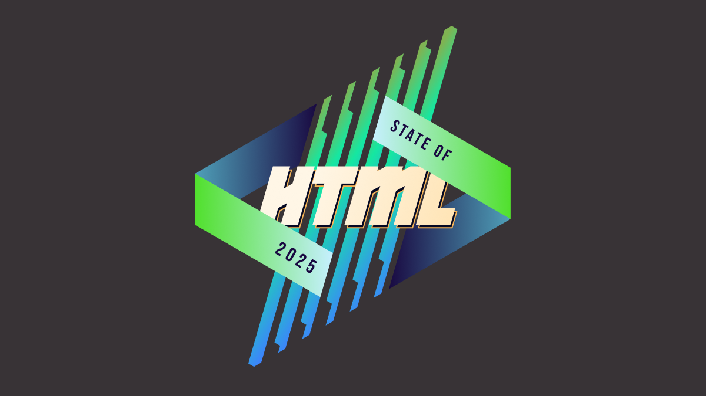

<figure class="no-padding">

<figcaption>
Mamma mia, here we go again!
</figcaption>
</figure>

Two years ago, I was funded by Google to [design the inaugural State of HTML survey](../../2023/design-state-of-html/).
While I had led _State of …_ surveys before (also graciously sponsored by Google), that was by far the most intense, as 0→1 projects often are.
In addition to the research, content, and analysis work that goes into every _State of …_ survey,
the unique challenges it presented were a forcing function for finally tackling some longstanding UX issues with these surveys.
As a result, we [pioneered new survey interaction UIs](../../2024/context-chips/), and validated them via usability testing.
This work did not just affect State of HTML, but had ripple effects on all subsequent _State of …_ surveys.

The [results](https://2023.stateofhtml.com/en-US/conclusion/) made it all worth it.
Turnout was the highest ever for a new Devographics [^devographics] survey: **21 thousand participants**, which remains a record high for State of HTML.
The survey findings heavily influenced [Interop 2024](https://web.dev/blog/interop-2024) (hello Popover API and Declarative Shadow DOM!) and helped prioritize several other initiatives, such as [stylable selects](https://developer.mozilla.org/en-US/docs/Learn_web_development/Extensions/Forms/Customizable_select).
Despite lower 2024 participation, the survey still significantly influenced [Interop 2025](https://web.dev/blog/interop-2025);
notably, View transitions was added after being prominent in the survey for two years in a row.

[^devographics]: [Devographics](https://devographics.com/) is the company behind "State of …" surveys.

This is the goal of these surveys: to **drive meaningful change in the web platform**.
Sure, getting a shareable score about what you know and seeing how you compare to the rest of the industry is fun, but the reason browser vendors pour thousands of dollars into funding these surveys is because they provide **unique vendor-neutral insights into developer pain points and priorities**, which helps them make better decisions about what to work on.
And this ultimately helps you: by getting your voice heard, you can directly influence the tools you work with.
**It's a win-win: developers get better tools, and browser vendors get better roadmaps.**

<aside class="no-icon">

<h4>Fun fact</h4>

One of my favorite examples of **impact** these surveys have driven is [CSS Nesting](https://www.youtube.com/watch?v=hcEDJq7jfdY).
Browsers ignored the proposal to do Nesting natively for **a decade**, the rationale being that preprocessors served the need just fine.
Then it came up in State of CSS 2022 as a top pain point and they **scrambled** to get it implemented ASAP.
It was Baseline just a year later.
Nothing moves things faster than demonstrating a clear need, and these surveys are a great way to do that.

</aside>

## State of HTML 2025

Last year, I was too busy to take the lead again.
Wrapping up my PhD and starting a new job immediately after, there was no time to breathe, let alone lead a survey.
I’m happy to be returning to it this year, but my joy is bittersweet.

When I was first asked to lead this year’s survey a few months ago,
I was still too busy to take it on.
Someone else from the community accepted the role — someone incredibly knowledgeable and talented who would have done a **fantastic** job.
But they live in the Middle East, and as the war escalated, their safety and their family’s well-being were directly impacted.
Understandably, leading a developer survey became the least of their concerns.
In the meantime, I made a few [decisions](../construction-lines/) that opened up some availability, and I was able to step in at the last minute.
It’s a sobering reminder that events which feel far away can hit close to home — shaping not just headlines, but the work and lives of people we know.

### Web Platform Features at the verge of Interop

A big part of these surveys is "feature questions": respondents are presented with a series of web platform features,
and asked about their familiarity and sentiment towards them.
At the end, they get a score based on how many they were familiar with that they can share with others,
and browser vendors and standards groups get signal on which upcoming features to prioritize or improve.

You can see which features were included in last year’s survey [here](https://2024.stateofhtml.com/en-US/features/) or in [^expanding] the table below.

[^expanding]: As an Easter egg, this widget is just a `
` element with custom CSS.
Inspect it to see how it works!
It works best in Chrome and Safari, as they fully support [`::details-content`](https://caniuse.com/mdn-css_selectors_details-content).
Chrome also supports [`calc-size()`](https://caniuse.com/mdn-css_types_calc-size), which enables a nice animation, while the interaction in Safari is more abrupt.
In terms of a11y, the summary gets spoken out as a regular `
` element, with "Show more" or "Show less" at the end of its content.
It seems ok-ish to me, but I’d love to hear from those with more expertise in this area.

State of HTML Features

| Feature | 2023 | 2024 |
|---------|------|------|
[`<datalist>`](https://html.spec.whatwg.org/multipage/form-elements.html#the-datalist-element)| ✅ | ✅ |
[`autocomplete` attribute](https://html.spec.whatwg.org/multipage/form-control-infrastructure.html#attr-fe-autocomplete)| ✅ | ✅ |
[HTML Media Capture](https://w3c.github.io/html-media-capture/#dfn-capture)| ✅ | ✅ |
[`input.showPicker()`](https://html.spec.whatwg.org/multipage/input.html#dom-input-showpicker)| ✅ | ✅ |
[FormData API](https://xhr.spec.whatwg.org/#dom-formdata)| ✅ | ✅ |
[`<selectlist>`](https://open-ui.org/components/selectmenu/)| ✅ |  |
[`contenteditable="plaintext-only"`](https://html.spec.whatwg.org/multipage/interaction.html#attr-contenteditable)| ✅ | ✅ |
[`<dialog>`](https://html.spec.whatwg.org/multipage/interactive-elements.html#the-dialog-element)| ✅ | ✅ |
[`
` and `
`](https://html.spec.whatwg.org/multipage/interactive-elements.html#the-details-element)| ✅ | ✅ |
[Exclusive Accordion](https://github.com/whatwg/html/pull/9400)| ✅ | ✅ |
[Popover API](https://html.spec.whatwg.org/multipage/popover.html#dom-popover)| ✅ | ✅ |
[`inert` attribute](https://html.spec.whatwg.org/multipage/interaction.html#the-inert-attribute)| ✅ | ✅ |
[Lazy loading](https://html.spec.whatwg.org/multipage/urls-and-fetching.html#lazy-loading-attributes)| ✅ | ✅ |
[`srcset` and `sizes` attributes](https://html.spec.whatwg.org/multipage/embedded-content.html#the-img-element)| ✅ | ✅ |
[Resource Hints](https://blog.logrocket.com/understanding-css-preload-other-resource-hints/)| ✅ | ✅ |
Content-Security Policy (CSP)| ✅ | ✅ |
[`fetchpriority` attribute](https://wicg.github.io/priority-hints/)| ✅ | ✅ |
[`blocking="render"`](https://html.spec.whatwg.org/multipage/urls-and-fetching.html#blocking-attributes)| ✅ | ✅ |
[`<model>` for AR/VR/3D content](https://immersive-web.github.io/model-element/)| ✅ | ✅ |
[`controlslist` attribute](https://wicg.github.io/controls-list/#solution-outline)| ✅ | ✅ |
[`<template>`](https://html.spec.whatwg.org/multipage/scripting.html#the-template-element)| ✅ | ✅ |
Using Custom Elements| ✅ | ✅ |
[Defining Custom Elements](https://html.spec.whatwg.org/multipage/custom-elements.html#dom-customelementregistry-define-dev)| ✅ | ✅ |
[Scoped Custom Element Registries](https://github.com/WICG/webcomponents/blob/gh-pages/proposals/Scoped-Custom-Element-Registries.md)| ✅ | ✅ |
Shadow DOM| ✅ | ✅ |
[Declarative Shadow DOM](https://github.com/mfreed7/declarative-shadow-dom)| ✅ | ✅ |
Named slot assignment| ✅ | ✅ |
[Imperative slot assignment](https://html.spec.whatwg.org/multipage/scripting.html#dom-slot-assign)| ✅ | ✅ |
[`ElementInternals` API](https://html.spec.whatwg.org/multipage/custom-elements.html#the-elementinternals-interface)| ✅ | ✅ |
[DOM Parts](https://github.com/WICG/webcomponents/blob/gh-pages/proposals/DOM-Parts.md)| ✅ | ✅ |
[HTML Modules](https://github.com/WICG/webcomponents/blob/gh-pages/proposals/html-modules-explainer.md)| ✅ | ✅ |
Landmark elements| ✅ | ✅ |
[`tabindex` attribute](https://html.spec.whatwg.org/multipage/interaction.html#attr-tabindex)| ✅ | ✅ |
[`focusgroup` attribute](https://open-ui.org/components/focusgroup.explainer/)| ✅ | ✅ |
[`<search>`](https://html.spec.whatwg.org/multipage/grouping-content.html#the-search-element)| ✅ | ✅ |
[File System Access API](https://web.dev/file-system-access/)| ✅ | ✅ |
[Badging API](https://developer.chrome.com/articles/badging-api/)| ✅ | ✅ |
[Web Share API](https://web.dev/web-share/)| ✅ | ✅ |
[Launch Handler API](https://wicg.github.io/web-app-launch/#launch_handler-member)| ✅ | ✅ |
[File Handling API](https://web.dev/file-handling/)| ✅ | ✅ |
[Window Controls Overlay API](https://wicg.github.io/window-controls-overlay/)| ✅ | ✅ |
[Isolated Web Apps](https://github.com/WICG/isolated-web-apps)| ✅ | ✅ |
[Customizable Select](https://open-ui.org/components/customizableselect/)|  | ✅ |
`EditContext` |  | ✅ |
`caretPositionFromPoint` |  | ✅ |
Clipboard API|  | ✅ |
CSS Custom Highlight API|  | ✅ |
`setHtmlUnsafe()`|  | ✅ |
`parseHtmlUnsafe()`|  | ✅ |
`Intl.Segmenter` API |  | ✅ |

I believe that co-designing these surveys with the community is the best way to avoid blind spots.
While the timeline is tighter than usual this year (**the survey is launching later this month!**), there is still a little time to ask:

👉🏼 Which upcoming HTML features or Web APIs are currently on your radar? 👈🏼

What does "on your radar" mean? Features you’re excited about and would love to see progress on.

Why focus on _upcoming_ features?
The best candidates for these surveys are features that are mature enough to be fleshed out (at least a mature proposal, ideally a spec and [WPT tests](https://web-platform-tests.org/)),
but not so mature they have already been implemented in every browser.
These are the features for which a survey such as this can drive **meaningful impact**.

If it's so early for a feature that it's not yet fleshed out, it's hard to make progress via initiatives such as [Interop](https://wpt.fyi/interop).
Interest is still useful signal to help prioritize work on fleshing it out, but it’s a bit of a longer game.
And for features that are already implemented everywhere, the only thing that can improve things further is passage of time
— a problem for which I unfortunately have no solution _(yet)_.

Obviously we’re looking at all the usual suspects already,
and initiatives such as [webstatus.dev](https://webstatus.dev/)
and [Web platform features explorer](https://web-platform-dx.github.io/web-features-explorer) provide a treasure trove of data which makes this task infinitely easier than it used to be.
But this kind of preliminary signal is also useful for filtering and prioritization — to give you a sense, my list of candidate new features to ask about already has 57 items (!).
Given that State of HTML 2024 asked about 49 features, that will need some _very_ heavy pruning.

<article class="note">

While the title is _"State of HTML"_,
anything that wouldn’t fit better in [State of CSS](https://stateofcss.com/) or [State of JS](https://stateofjs.com/) is fair game.
This includes topics such as accessibility, browser APIs, web components, templating, static site generation, media formats, and more.
This may seem strange at first, but is no different than how the [HTML specification](https://html.spec.whatwg.org/multipage/) itself covers a lot more than just HTML markup.

</article>

Any way to reach me works fine.
You can post in the comments here (preferred),

or reply on

	,  or
	<a href="{{ url }}" class="{{ service }}"
		title="{{ social[service].name }} post"
		style="--color: {{ social[service].color }}"
		target="_blank"><i class="fa-brands fa-{{ social[service].icon }}"></i> {{ social[service].name }}</a>
.

or ping me on any of my socials.

Make sure to check the other replies first, and 👍 those with features you care about.
Looking forward to your ideas and comments!
