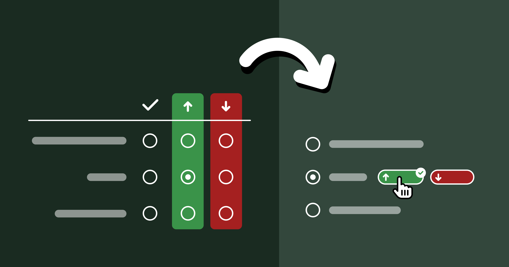

You may be familiar with this wonderful illustration and [accompanying
blog post](https://blog.crisp.se/2016/01/25/henrikkniberg/making-sense-of-mvp) by Henrik Kniberg about good MVPs:


It’s a very visual way to illustrate the age-old concept that
that a good MVP is not the one developed in isolation over months or years,
grounded on assumptions about user needs and goals,
but one that **delivers value to users as early as possible**,
so that future iterations can take advantage of the lessons learned from real users.

## From Hovercar to Skateboard { #spectrum }

I love Henrik’s metaphor so much, I have been using a similar system to flesh out product requirements and shipping goals, especially early on.
It can be immediately understood by anyone who has seen Henrik’s illustration,
and I find it can be a lot more pragmatic and flexible than the usual simple two tiered system (core requirements and stretch goals).
Additionally, I find this fits nicely into a [fixed time, variable scope](https://basecamp.com/shapeup/1.2-chapter-03#fixed-time-variable-scope) development process,
such as [Shape Up](https://basecamp.com/shapeup).

🛹 The Skateboard <small>aka the Pessimist’s MVP</small>
: What is the absolute minimum we _can_ ship, if need be?
Utilitarian, bare-bones, and somewhat embarrassing, but shippable — barely.
Anything that can be [flintstoned](https://stackingthebricks.com/the-fine-art-of-flintstoning/) gets flintstoned.

🛴 The Scooter <small>aka the Realist’s MVP</small>
: The minimum product that delivers value. Usable, but no frills. This is the target.

🚲 The Bicycle <small>aka the Optimist’s MVP</small>
: Stretch goals — UX polish, _"sprinkles of delight"_, nonessential but high I/E features.
Great if we get here, fine if we don’t.

🏍️ The Motorcycle
: Post-launch highest priority items.

🚗 The Car
: Our ultimate vision, taking current constraints into account.

🏎️ The Hovercar <small>aka the North Star UI</small>
: The ideal experience — unconstrained by time, resources, or backwards compatibility.
Unlikely to ship, but a guiding light for all of the above.

<article class="note" role="note">

Please note that the concept of a North Star UI has no relation to the [North Star Metric](https://mixpanel.com/blog/north-star-metric/).
While both serve as a guiding light for product decisions, and both are important,
the North Star UI guides you in _designing_ the product,
whereas the North Star Metric is about _evaluating_ success.
To avoid confusion, I'll refer to it as "North Star UI", although it’s not about the UI per se, but the product vision on a deeper level.
</article>

The first three stages are much more concrete and pragmatic, as they directly affect what is being worked on.
The more we go down the list, the less fleshed out specs are, as they need to allow room for customer input.
This also allows us to outline future vision, without having to invest in it prematurely.

The most controversial of these is the last one: the **hovercar**, i.e. the _North Star UI_.
**It is the very antithesis of the MVP.**
The MVP describes what we can ship ASAP,
whereas the North Star describes the most idealized goal, one we may _never_ be able to ship.

It is easy to dismiss that as a waste of time, a purely academic exercise.
_“We’re all about shipping. Why would we spend time on something that may not even be feasible?”_ I hear you cry in Agile.

Stay with me for a moment, and please try to keep an open mind.
Paradoxical as it may sound, fleshing out your North Star can actually **save you time**.
How? Start counting.

## Core Idea { #core }

At its core, this framework is about breaking down tough product design problems into three more manageable components:

1. **North Star**: What is the ideal solution?
2. **Constraints**: What prevents us from getting there _right now_?
3. **Compromises**: How close can we reasonably get given these constraints?

One way to frame it is is that 2 & 3 are **the product version of [tech debt](https://en.wikipedia.org/wiki/Technical_debt)**.[^tech-debt]

[^tech-debt]: Indeed, looks like [I’m not the first](https://andrewchen.com/product-design-debt-versus-technical-debt/) to draw a parallel between the two!

It's important to understand what constraints are fair game to ignore for 1 and which are not.
I often call these **_ephemeral or situational constraints_**.
They are constraints that are not fundamental to the product problem at hand,
but relate to the environment in which the product is being built and _could_ be lifted or change over time.
Things like:
- Engineering resources
- Time
- Technical limitations (within reason)
- Performance
- Backwards compatibility
- Regulatory requirements

Unlike ephemeral constraints, certain **requirements** are part of the problem description and cannot be ignored.
Some examples from the [case studies](#case-studies) below:
- [Context Chips Survey UI](#context-chips): Efficiency and discoverability
- [CSS Nesting Syntax](#css-nesting): Conciseness and readability

While these may be addressed differently in different solutions, it would be an oxymoron to have a North Star that did not take them into account.

## Benefits { #benefits }

### 1. It makes hard product problems tractable { #tractable }

Nearly every domain of human endeavor has a version of _divide and conquer_:
instead of solving a complex problem all at once, break it down into smaller, manageable components and solve them separately.
Product design is no different.

This process really shines when you’re dealing with the kinds of tough product problems where at least two of these questions are hard,
so breaking it down can do wonders for reducing complexity.

### 2. It makes the product design process robust and adaptable { #resilient }

By solving these components separately,
our product design process becomes can more easily adapt to changes.

I have often seen "unimplementable" solutions become implementable down the line,
due to changes in internal or external factors, or simply because someone had a lightbulb moment.

By addressing these components separately, when constraints get lifted all we need to reevaluate is our compromises.
But without this modularization, our only solution is to go back to the drawing board.
Unsurprisingly, companies often choose to simply miss out on the opportunity, because it’s cheaper (or seems cheaper) to do so.

### 3. It facilitates team alignment by making the implicit, explicit { #consensus }

<figure class="float">

<figcaption>
Every shipping goal is derived from the North Star, like peeling layers off an onion.
This is whether you realize it or not.
</figcaption>
</figure>

Whether you realize it or not, **every shipping goal is always derived from the North Star**, like peeling layers off an onion.
In some contexts the process of breaking down a bigger shipping goal into milestones that can ship independently is even called _layering_.

The process is so ingrained, so automatic, that most product designers don’t realize they are doing it.
They go from hovercar to car so quickly they barely realize the hovercar was there to begin with.
Thinking about the North Star is taboo — who has time for daydreaming?
We must ship, _yesterday_!

But the hovercar is **fundamental**.
Without it, there is no skateboard — you can’t reduce the unknown.
When designing it is not an explicit part of the process,
the result is that the main driver of all product design decisions is something that can never be explicitly discussed and debated like any other design decision.
In what universe is that efficient?

A skateboard might be a good MVP if your ultimate vision is a hovercar,
but it would be a _terrible_ minimum viable cruise ship — you might want to try a wooden raft for that.

<figure>

<figcaption>

A skateboard may be a great MVP for a car, but a terrible MVP for a cruise ship.
</figcaption>
</figure>

Making the North Star taboo doesn’t make it disappear (when did that _ever_ work?).

It just means that **everyone is following a different version of it.**
And since MVPs are products of the North Star, this will manifest as difficulty reaching consensus at every step of the way.

The product team will disagree on whether to ship a skateboard or a wooden raft,
then on whether to build a scooter or a simple sailboat,
then on whether to work on a speedboat or a yacht,
and so on.
It will seem like there is so much disconnect that every decision is hard,
**but there is actually only one root disconnect that manifests as multiple because it is never addressed head on.**

<figure>


<figcaption>

When the North Star is not clearly articulated, everyone has their own.
</figcaption>
</figure>

Here is a story that will sound familiar to many readers:

> A product team is trying to design a feature to address a specific user pain point.
Alice has designed an elegant solution that addresses not just the problem at hand, but several prevalent longstanding user pain points at once — an [eigensolution](../../2023/eigensolutions/).
She is aware it would be a little trickier to implement than other potential solutions,
but the increase in implementation effort is very modest, and easily offset by the tremendous improvement in user experience.
She has even outlined a staged deployment strategy that allows it to ship incrementally, adding value and getting customer feedback earlier.
>
> Excited, she presents her idea to the product team, only to hear engineering manager Bob dismiss it with  _"this is scope creep and way too much work, it’s not worth doing"_.
However, what Bob is _actually_ thinking is _"this is a bad idea; any amount of work towards it is a waste"_.
The design session is now derailed; instead of debating Alice’s idea on its merits, the discussion has shifted towards costing and/or reducing effort.
But this is a dead end because the amount of work was never the real problem.
In the end, Alice wants to be seen as a team player, so she backs off and concedes to Bob’s “simpler” idea, despite her worries that it is [overfit](https://bootcamp.uxdesign.cc/overfitting-and-the-problem-with-use-cases-337d9f4bf4d7) to the very specific use case being discussed, and the product is now worse.

**Arguing over effort _feels_ safer and less confrontational than debating vision — but is often a proxy war.**
Additionally, it is not productive.
If the idea is poor, effort is irrelevant.
And once we _know_ an idea is good and believe it to our core, we have more incentive to figure out implementation,
which often proves to be easier than expected once properly investigated.
**Explicitly fleshing out the Hovercar strips away the noise and brings clarity.**

When we answer the questions [above](#tractable) in order and reach consensus on the North Star before moving on to the compromises,
we know what is an actual design decision and what is a compromise driven by practical constraints.
**Articulating these separately, allows us to discuss them separately.**
It is very hard to evaluate tradeoffs collaboratively if you are not on the same page about what we are trading off and how much it’s worth.
**You need _both_ the cost _and_ the benefit to do a cost-benefit analysis!**

Additionally, fleshing the North Star out separately ensures that **everyone is on the same page about _what_ is being discussed**.
All too often have I seen early design sessions where one person is discussing the skateboard,
another the bicycle, and a third one the hovercar,
no-one realizing that the reason they can’t reach consensus is that they are designing different things.

### 4. It can improve the MVP via user testing { #user-testing }

Conventional wisdom is that we strip down the North Star to an MVP, ship that, then iterate based on user input.
With that process, **our actual vision never really gets evaluated** and by the time we get to it, it has already changed tremendously.

**But did you know you can actually get input from real users without writing a single line of code?**


**Believe it or not, you don't need to wait until a UI is prototyped to user test it.**
You can even user test a low-fi paper prototype or even a wireframe.
This is widely known in usability circles, yet somehow entirely unheard of outside the field.
The user tells you where they would click or tap on every step, and you mock the UI’s response by physically manipulating the prototype or showing them a wireframe of the next stage.

Obviously, this works better for some types of products than others.
It is notably hard to mock rich interactions or UIs with too many possible responses.
But when it _does_ work, its Impact/Effort ratio is very high;
you get to see whether your core vision is on the right track,
and adjust your MVP accordingly.

It can be especially useful when there are different perspectives within a team about what the North Star might be,
or when the problem is so novel that every potential solution is low-confidence.
No-one’s product intuition is always right, and **there is no point in evaluating compromises if it turns out that even the "perfect" solution was not actually all that great**.

### 5. It paves the way for future evolution { #evolution }

So far, we have discussed the merits of designing our North Star,
assuming we will never be able to ship it.
However, in many cases,
**simply articulating what the North Star is can bring it within reach.**
It’s not magic, just human psychology.

Once we have a North Star, **we can use it to evaluate proposed solutions**:
How do they relate to it?
Are they a milestone along a path that ends at the North Star?
Do they actively _prevent us_ from ever getting there?
Prioritizing solutions that get us closer to the North Star can be a powerful momentum building tool.

**Humans find it a lot easier to make one more step along a path they are already on, than to make the first step on an entirely new path.**
This is well-established in psychology and often used as a technique for managing depression or executive dysfunction.
However, it applies on anything that involves humans — and that includes product design.

Once we're partway there, it naturally begs the question: can we get closer? _How much closer?_
Even if we can’t get all the way there, maybe we can close enough that the remaining distance won’t matter.
**And often, the closer you get, the more achievable the finish line gets.**

In fact, sometimes simply reframing the North Star as a sequence of milestones rather than a binary goal can be all that is needed to make it feasible.
For an example of this, check out the [CSS Nesting case study](#css-nesting) below.

## Case studies { #case-studies }

In my 20 years of product design, I have seen ephemeral constraints melt away so many times I have learned to interpret _"unimplementable"_ as _"kinda hard; right now"_.
Two examples from my own experience that I find particularly relevant below,
one around Survey UI, and one around a [CSS](https://en.wikipedia.org/wiki/CSS) language feature.

### Context Chips and the Power of Engineering Momentum { #context-chips }

<figure>


</figure>


The case study is described at length in [Context Chips in Survey Design: “Okay, but how does it _feel_?”](../../2024/context-chips/).
In a nutshell, the relevant bits are:
- Originally, I needed to aggressively prioritize due to minimal engineering resources, which led me to design an extremely low-effort solution which still satisfied requirements.
- The engineer _hated_ the low-effort idea so much, he prototyped a much higher-effort solution in a day, backend and all.
Previously, this would have been entirely out of the question.
- Once I took the ephemeral constraints out of the question, I was able to design a much better, novel solution, but it got pushback on the basis of effort.
- Prototyping it allowed us to user test it, which revealed it performed way better than alternatives.
- Once user testing built engineering momentum and the implementation was more deeply looked into, it turned out it did not actually require as much effort as initially thought.

Here is a dirty little secret about software engineering (and possibly any creative pursuit):
**neither feasibility nor effort are fixed for a given task.**
Engineers are not automatons that will implement everything with the same energy and enthusiasm.
They may implement product vision they disagree with,
but you will be getting very poor ROI out of their time.

Investing the time and energy to get engineers *excited* can really pay dividends.
**When good engineers are excited, they become miracle workers.**

In fact, _engineering momentum_ is often, **all that is needed to make the infeasible, feasible.**
It may seem hard to fit this into the crunch of OKRs and KPIs but it’s worth it; the difference is not small, it is orders of magnitude.
Things that were impossible or insurmountable become feasible, and things that would normally take weeks or months get done in days.

One way to build engineering momentum is to demonstrate the **value and utility of what is being built**.
All too often, product decisions are made in a vacuum, based on gut feelings and assumptions about user needs.
Backing them up with **data**, such as usability testing sessions is an excellent way to demonstrate (and test!) their basis.
When possible, **having engineers observe user testing sessions firsthand** can be much more powerful than secondhand reports.

{#
### CSS Conic Gradients { #conic-gradients }

<figure class="float" id="hue-wheel">
<style>
#hue-wheel {
	width: min-content;
	flex-flow: column;
	pre {
		width: auto;
		font-size: 75%;
	}
}
</style>
<div style="
  width: min(300px, 50vmin); aspect-ratio: 1; border-radius: 50%;
  background: conic-gradient(in hsl, red, orange, yellow, lime, cyan, blue, magenta, red);"></div>

```css
background: conic-gradient(in hsl,
	red, orange, yellow, lime,
	cyan, blue, magenta, red);
```
<figcaption>
Conical gradients are often used to render hue wheels.
</figcaption>
</figure>

Often, what makes a high effort feature feasible (or even trivial) is a **change in the environment**.
An example that comes to mind is [CSS conic gradients](/specs/#conical-gradients).
Conic gradients are the type of gradient that is created by (conceptually) rotating a ray around a center point.

I originally [proposed](https://lists.w3.org/Archives/Public/www-style/2011Mar/0472.html) adding conic gradients to CSS in 2011, and they first shipped in 2018 (in Chrome 69)!
Someone observing this timeline without context may just conclude _"pffft, standards just take _forever_ to ship"_.
But there is *always* a reason, either technical, human, or both.
In this case, the reason was technical.
Browsers do not implement things like shadows and gradients from scratch, they use graphics libraries such as [Skia](https://skia.org/), [Cairo](https://www.cairographics.org/), or [Core Graphics](https://developer.apple.com/documentation/coregraphics), which in turn are also abstractions over the OS-provided graphics APIs.

At the time these libraries did not support any primitive that could be used to render conic gradients (e.g. sweep gradients, mesh gradients, etc.).
In the years that followed, one after another these libraries added support for some kind of gradient primitive that could be used to easily render conic gradients, which took the proposal from prohibitively high to low effort.
I also created a [polyfill](../../2015/06/conical-gradients-today/) which stimulated developer demand, increasing Impact.
These two things together took the Impact/Effort ratio from "not worth it" to "let’s do this, stat" and in 2 years the feature was implemented across all major browsers. #}

### Relaxed CSS Nesting and the Power of Evolution { #css-nesting }

Sometimes high effort things just take a lot of hard work and there is no way around it.
Other times, feasibility is just **one good idea away**.

One of my favorite examples, and something I’m proud to have [helped drive](/specs/#relaxed-css-nesting) is the [relaxed CSS Nesting syntax](https://developer.mozilla.org/en-US/docs/Web/CSS/CSS_nesting/Using_CSS_nesting), now [shipped in every browser](https://caniuse.com/css-nesting).
It is such an amazing case study on the importance of having an explicit and consensus-backed North Star UI [^css-nesting-talk].

[^css-nesting-talk]: I even did [an entire talk about it at Web Unleashed](https://www.youtube.com/watch?v=hcEDJq7jfdY),
with a lot more technical detail than what I have included here.

In a nutshell, CSS nesting was a (then new) CSS syntax that let developers better organize their code through reducing repetition.

<figure id="css-nesting-example" class="float">
<style>
#css-nesting-example {
	pre {
		font-size: 50%;
		font-weight: 600;
		width: auto;
		overflow: auto;
	}
	pre code {
		white-space: pre;
	}
}
</style>

```css
table.browser-support {
	border-collapse: collapse;
}
table.browser-support th,
table.browser-support td {
	border: 1px solid silver;
}
@media (width < 600px) {
	table.browser-support,
	table.browser-support tr,
	table.browser-support th,
	table.browser-support td {
		display: block;
	}
}
table.browser-support th {
	border: 0;
}
table.browser-support td {
	background: yellowgreen;
}
table.browser-support td:empty {
	background: red;
}
table.browser-support td > a {
	color: inherit;
}
```

```css
table.browser-support {
	border-collapse: collapse;

	@media (width < 600px) {
		&, tr, th, td {
			display: block;
		}
	}

	th, td {
		border: 1px solid silver;
	}
	th {
		border: 0;
	}
	td {
		background: yellowgreen;

		&:empty {
			background: red;
		}

		> a {
			color: inherit;
		}
	}
}
```

<figcaption>
Example of CSS code, with (right) and without (left) nesting.
Which one is easier to read?
</figcaption>

</figure>

This is one of the rare cases where the North Star was well known in advance,
since the syntax was already well established in developer tooling (CSS preprocessors).
Instead, **the big challenge was navigating the practical constraints**,
since CSS implemented in browsers has different performance characteristics,
so a syntax that is feasible for tooling may be out of reach for a browser.
In this case, the North Star syntax had been ruled out by browser engineers due to prohibitive parsing performance [^lookahead],
so we had to design a different, more explicit syntax that could be parsed more efficiently.

[^lookahead]: for any Compilers geeks out there that want all the deets: it required potentially unbounded lookahead since there is no fixed number of tokens a parser can read and be able to tell the difference between a selector and a declaration.

At this point, it is important to note that CSS Nesting is a feature that is very heavily used once available.
Conciseness and readability are paramount,
especially when conciseness is the sole purpose of the feature in the first place!

[Initial attempts](https://www.w3.org/TR/2021/WD-css-nesting-1-20210831/#nesting) for a syntax that satisfied these technical requirements introduced a lot of noise,
making the syntax tedious to write and noisy to read.
Even worse, these attempts were actively incompatible with the North Star syntax, as well as other parts of the language (namely, the `@scope` rule).
This meant that even if the North Star syntax became feasible later,
CSS would need to forever support syntax that would then have no purpose,
and would only exist as a wart from the past, just like HTML doctypes.

Once Google became very keen to ship Nesting (driven by  [State of CSS 2022](https://2022.stateofcss.com/en-US/usage/#missing_features_freeform), which showed it as the top missing CSS feature),
a small subset of the CSS Working Group, led by Elika Etemad and myself met to explore alternatives,
and produced **four competing proposals**.
The one that the group voted to adopt [^option3] was the one I [designed](https://github.com/w3c/csswg-drafts/issues/7834#issuecomment-1272373216) explicitly to answer the question:
**If the North Star syntax is out of the question _right now_, what is the largest subset of it that is feasible?**

[^option3]: Originally dubbed [*“Lea’s proposal”*](https://github.com/w3c/csswg-drafts/blob/2535b93ca241a1db5a29c47c5b22c5b1d0be2e71/css-nesting-1/proposals.md), and later ["Non-letter start proposal"](https://github.com/w3c/csswg-drafts/blob/main/css-nesting-1/proposals.md), but became known as [Option 3](https://webkit.org/blog/13607/help-choose-from-options-for-css-nesting-syntax/) from its position among the five options considered (including the original syntax).

<aside>

This highlights the importance of taking into account the long-term **evolution** of a product in addition to the short-term **utility** and **usability** (although they are more important).
Some of the other proposals had slightly better ergonomics than that the intermediate milestone we went with, but were incompatible with the North Star so they would have ruled it out.

*We took a bet: we sacrificed **a little bit of short-term usability**, to have a chance at **much better usability in the long term**.*
Sacrificing _a lot_ of short-term utility or usability for a better future evolution trajectory is _generally_ a bad idea, because you are risking being stuck with the poor intermediate solution, but even that can be acceptable when you have high confidence that you’ll get there, especially if that future is not very far.
</aside>

Once we got consensus on this intermediate syntax, I [started exploring whether we could get any closer to the 🌟](https://github.com/w3c/csswg-drafts/issues/7961), even proposing an algorithm that would reduce the number of cases that required the slower parsing to essentially an edge case.
A few other WG members joined me, with my co-TAG member Peter Linss being most vocal.

**This is a big advantage of North Star compatible designs: it is _much_ easier to convince people to move a little further along on the path they are already on, than to move to a completely different path.**
With a bit of luck, you may even find yourself implementing an "infeasible" North Star without even realizing it, one little step at a time.

We initially faced a lot of resistance from browser engineers, until eventually a brilliant Google engineer, [Anders Ruud](https://github.com/w3c/csswg-drafts/issues/7961#issuecomment-1489883575) and his team experimented with variations of my proposed algorithm and actually closed in on a way to implement the North Star syntax in Chrome.
The rest, as they say, is history. 🌟

## Conclusion

Hopefully by now you’re convinced about the value of investing time in reaching alignment on an explicit North Star that has buy-in from the entire product team.

A common misconception is that the North Star is a static goal that prevents you from adapting to new data, such as customer feedback.
But often, your North Star will change a lot over time, and that’s okay.
**Having an initial destination does not take away your ability to course correct.**
That’s not giving up, it’s adapting.

And yes, it’s true that many product teams _do_ use a vision-led approach — they just start from the car, not the hovercar.
While that confers some of the benefits above, there is still an implicit reduction happening, because the hovercar is still there in the back of their mind.

Note that for this framework to be beneficial, it is important that **everyone is on the same page and understands the steps, benefits, and goals** of this approach.
Co-designing a North Star with a team that sees the process as a pointless thought experiment will only add friction and will not confer any of these benefits.
Also, this is a mindset that can only work when applied top-down.
If you are not a decision-maker at your place of work and leadership is not on board,
you will have a very hard time if you try to push this ad hoc, without first getting leadership buy-in.
You can try sending them a link to this blog post!

If this post resonated, please share your own case studies in the comments.
Or, if you decide to give this framework a try, I'd love to hear how it went!
