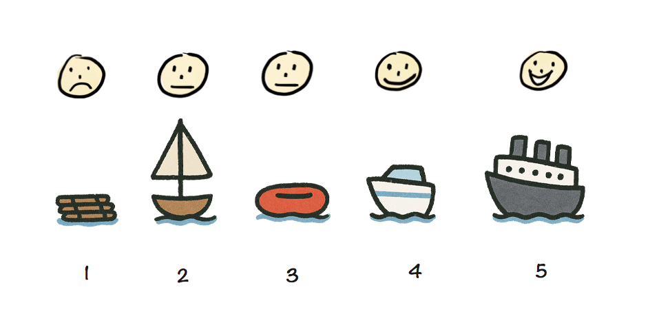
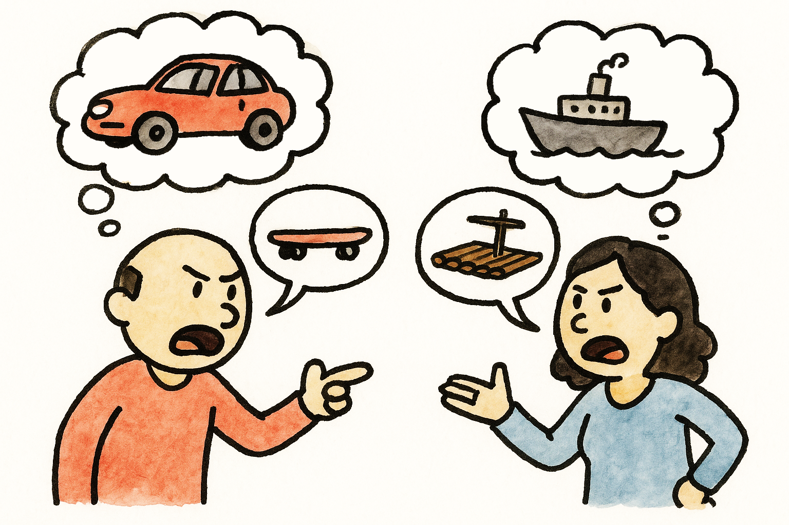

You may be familiar with this wonderful [illustration and accompanying
blog post by Henrik Kniberg](https://blog.crisp.se/2016/01/25/henrikkniberg/making-sense-of-mvp):


It’s a very visual way to illustrate the age-old concept that
that a good MVP is not the one developed in isolation over months or years,
grounded on assumptions about user needs and goals,
but one that delivers value to users as early as possible,
so that future iterations can take advantage of the lessons learned from real users.

## The MVP as a range { #mvp-range }

While not quite what Henrik intended,
I love this metaphor so much, I have been using it to describe shipping goals when writing product specs.
I find they are understandable to anyone who has seen Henrik’s illustration,
and fit nicely into a [fixed time, variable scope](https://basecamp.com/shapeup/1.2-chapter-03#fixed-time-variable-scope) development process,
such as [Shape Up](https://basecamp.com/shapeup).

1. 🛹 **The Skateboard (aka the Pessimist’s MVP):**
What is the absolute minimum we _can_ ship, if need be?
This is the most bare-bones set of features, without which we cannot ship at all.
It skews more utilitarian: it has the basic _functionality_ we need, but its UX is very rough, even embarrassing.
Anything that can be [flintstoned](https://stackingthebricks.com/the-fine-art-of-flintstoning/) is flintstoned.
This is meant to be less-than a traditional MVP.
1. 🛴 **The Scooter (aka the Realist’s MVP):**
It is the minimum set of features we want to ship that will still provide value and fulfill enough user needs across enough user segments to be worth it.
Its UX is more well thought out than the skateboard but anything nontrivial to implement is punted unless essential.
This is closer to a traditional MVP.
1. 🚲 **The Bicycle (aka the Optimist’s MVP):**
The wishlist or stretch goals.
If everything goes _really_ well, what else can we ship?
This may include UX improvements, "sprinkles of delight", and features that are nonessential but have high I/E ratios.
This is where we aspire to be, but we are not going to be heartbroken if we don’t get there.
1. 🏍️ **The motorcycle:**
These are improvements that are beyond even the optimistic MVP, but we want to get to sometime in the near future.
1. 🚗 **The car:**
Improvements that we can ship in the medium to longer term future.
1. 🏎️ **The race car (aka the North Star UI):**
This is the ideal product we would ship if we were not bound by ephemeral constraints like time, resources, performance considerations, or backwards compatibility.

The meat is the first three stages, since they directly affect what is being worked on.
The more we go down the list, the less fleshed out specs are, since we _know_ they will change once we have input to customers.

The most controversial of these is the last one: the race car, i.e. the North Star UI.
It is the very antithesis of the MVP.
The MVP describes what we can ship ASAP,
whereas the North Star describes the most idealized goal, one we may _never_ be able to ship.

It is easy to dismiss that as a waste of time, a purely academic exercise.
_“We’re all about shipping. Why would we spend time on something that may not even be feasible?”_ I hear you cry.

Stay with me for a moment.
Paradoxical as it may be, hopefully by the end of this I will have convinced you that fleshing it out pays dividends in the long run and actually **saves you time**.

## 1. It makes product design more deliberate { #deliberate }

<!-- <figure>
TODO: Race car with arrows pointing to car, motorcycle, bike, scooter, skateboard.
</figure> -->

Whether you realize it or not, **the North Star is the only actual input into the product design process.**
Every other stage is derived from it, like peeling layers off an onion (in fact in some contexts the process of breaking down a bigger shipping goal into milestones that can ship independently is literally called _layering_).

The process is so ingrained, so automatic, that many product designers don’t realize that they are doing it.
They go from race car to car, or even motorcycle so quickly they barely realize there was anything else there to begin with.
Thinking about the North Star feels like a guilty pleasure — who has time for this daydreaming?
We must ship, _yesterday_!

But the race car is **fundamental**.
Without it, there is no skateboard — you can’t reduce the unknown.
Without a solid North Star, your MVP is a confused jumble of design decisions and compromises, so tangled it becomes impossible to tell them apart.

To stick with the transportation metaphor,
a skateboard might be a good MVP if your ultimate vision is a race car,
but it would be a _terrible_ minimum viable  cruise ship — you might want to try a wooden raft for that.

<figure>

<figcaption>

A skateboard may be a great MVP for a car, but a terrible MVP for a cruise ship.
</figcaption>
</figure>


This North Star will likely change a lot down the line, informed by experience and user feedback.
That’s okay; having an initial destination does not remove your ability to course correct.

## 2. It simplifies problem solving { #problem-solving }

Nearly every domain has a version of _divide and conquer_:
instead of trying to solve a complex problem all at once, break it down into smaller, more manageable components and solve them separately.
Product design is no different.
The concept of a North Star UI breaks down tough product design problems into three more manageable components:

1. **North Star**: What is the ideal solution?
2. **Ephemeral constraints**: What prevents us from getting there?
3. **Compromises**: How close can we reasonably get given these constraints?

Depending on the product problem, this could simplify things a little or a lot.
This framework really shines when you’re dealing with really tough product problems, where two or three of these components are hard,
so focusing on one at a time really helps cut down complexity.

## 3. It facilitates team alignment { #consensus }

When the North Star UI is not clearly articulated, it doesn't mean it doesn’t exist.
It just means that **everyone is following a different version of it.**

Since MVPs are products of the North Star, this will manifest as difficulty reaching consensus at every step of the way,
because the root disconnect is never addressed head on.

<figure>


</figure>

Citing practical constraints feels less confrontational than debating the merits of an idea directly.
Fleshing out the North Star UI as an explicit goal strips away this noise and brings clarity.

Here is a story that may sound familiar:
Alice has designed an elegant solution that addresses several user pain points at once — an [eigensolution](../../2023/eigensolutions/).
She is aware it would be a little tricky to implement, but she thinks the tremendous improvement in user experience is worth it,
and she even has ideas about how to layer it in such a way that it can ship incrementally, adding value and getting customer feedback earlier.
Excited, she presents her idea to the product team, only to hear Bob dismiss it with  _"this is way too much work, it’s not worth doing"_.
However, what Bob is _actually_ thinking is _"this is a bad idea; any amount of work towards it is a waste"_.
The discussion is derailed: instead of figuring out whether Alice’s solution is good, the team is now spending all remaining time
discussing how much work it would be and whether it could be reduced.

This is not productive.
First, if the idea is not good, the amount of work is irrelevant and spending time costing it is putting the cart before the horse.
And if it is, often implementation proves to be easier than expected once it is properly investigated.

It is important to answer the questions above in order, and reach consensus on what the North Star is before moving on to the compromises.
This way, **we are aware of what is an actual design decision** and what is a compromise driven by practical constraints.
Articulating these separately, allows us to discuss them separately.
It is very hard to evaluate tradeoffs collaboratively if you are not on the same page about what we are trading off and how much it’s worth.
**You cannot do a cost-benefit analysis without being aware of _both_ the cost _and_ the benefit.**

Additionally, discussing the North Star separately ensures that everyone is on the same page about what is being designed.
All too often have I seen design sessions where one person is discussing what the skateboard should be,
another what the bicycle should be, and another what the car should be,
no-one realizing they are talking cross purposes.

## 4. It can improve the MVP via user testing

Conventional wisdom is that we strip down the North Star to an MVP, ship that, then iterate based on user input.
With that process, our actual vision never really gets evaluated.
By the time we get to it, it has already changed tremendously.
**But did you know you can actually get input from real users without writing a single line of code?**


Believe it or not, you don't need to wait until a UI is prototyped to user test it.
For some reason, this seems to be almost unheard of outside usability circles,
but you can even user test a low-fi paper prototype or even a wireframe.
The user tells you where they would click or tap on every step, and you mock the UI’s response by physically manipulating the prototype or showing them a wireframe of the next stage.
This allows you to user test your North Star UI from the start, and adjust your MVP accordingly.

Obviously, this works better for some types of products than others.
It is notably hard to mock rich interactions or UIs with too many possible responses.
But when it does work, it can have a very high Impact/Effort ratio.
It can be especially useful when there are vastly different perspectives within a team about what the North Star UI might be, or when the problem is so novel that every potential solution is low-confidence.
Even the best product intuition can be wrong, and there is no point in evaluating compromises if it turns out that even the "perfect" solution is not actually all that great.


## 5. It paves the way for getting there (someday) { #evolution }

Just like the mythical North Star, a North Star UI serves as a guide to steer us in the right direction.
**Simply articulating what the North Star is can make it more feasible.**
It’s not magic, just human psychology.

First, once we have a North Star, we can use it to evaluate proposed solutions:
How do they relate to a future where said North Star is implemented?
Are they a milestone along that path, or do they actively prevent us from ever getting there?

Prioritizing solutions that get us closer to the North Star can be a powerful momentum building tool.
Once we're partway there, it naturally begs the question: can we get closer? How much closer?
**it is _much_ easier to convince people to move further along a path they are already on than to start a different path.**
Even if we can’t get all the way there, maybe we can close enough that the remaining distance won’t matter.
And often, the closer you get, the more achievable the finish line gets.
In fact, sometimes simply reframing the North Star as a sequence of milestones rather than a binary goal can be all that is needed to make it feasible.

<aside>

For an example of this, check out the [CSS Nesting case study](#css-nesting) below.
</aside>

## 6. Today's constraints are not tomorrow's constraints { #adaptability }

North Star UIs make the product design process more resilient and adaptable.
I have often seen **"unimplementable" solutions become implementable** down the line, due to changes in internal or external factors, or simply because someone had a lightbulb moment.

Without a solid foundation to fall back on, this means our only options are to either go back to the drawing board, or miss out on the opportunity to adapt.
With a solid North Star UI in place, when constraints get lifted we only need to re-evaluate our compromises, which is usually much easier than starting from scratch.

### Case studies where constraints were lifted { #case-studies }

I have seen ephemeral constraints get lifted so many times that I have learned to interpret _"cannot be done"_ as _"hard; right now"_.
Some examples from my own experience below.

#### Change in Engineering Momentum: Sentiment Chips { #sentiment-chips }

Here is a little secret that applies to nearly all software engineers:
**neither feasibility nor effort are fixed for a given task.**

Engineers are not automatons that will blindly implement whatever they are told with the same energy and enthusiasm.
If you are content getting Engineering to reluctantly agree to implement your vision, you’re typically getting very poor ROI out of it.

**Often all that is needed to make the infeasible, feasible is engineering momentum.**
Investing the extra time and energy to get engineers *excited* can really pay off.
**When good engineers are excited, they become miracle workers.**
The difference is not small, it is orders of magnitude.
Things that were impossible or insurmountable become feasible, and things that would normally take weeks or even months are prototyped in days.

One way to get engineers excited is to convince them about the **value and utility of what they are building**.
All too often, product decisions are made in a vacuum, based on gut feelings and assumptions about user needs.
Backing them with data, such as usability testing sessions [(and having engineers observe!)](../context-chips/) is an excellent way to demonstrate their basis.

#### Change in the Environment: CSS Conic Gradients { #conic-gradients }

<figure class="float" id="hue-wheel">
<style>
#hue-wheel {
	width: min-content;
	flex-flow: column;
	pre {
		width: auto;
		font-size: 75%;
	}
}
</style>
<div style="
  width: min(300px, 50vmin); aspect-ratio: 1; border-radius: 50%;
  background: conic-gradient(in hsl, red, orange, yellow, lime, cyan, blue, magenta, red);"></div>

```css
background: conic-gradient(in hsl,
	red, orange, yellow, lime,
	cyan, blue, magenta, red);
```
<figcaption>
Conical gradients are often used to render hue wheels.
</figcaption>
</figure>

Sometimes, what makes a high effort feature feasible (or even trivial) is a change in the environment.
An example that comes to mind is [CSS conic gradients](/specs/#conical-gradients).
Conic gradients are the type of gradient that is created by (conceptually) rotating a ray around a center point.

I originally [proposed](https://lists.w3.org/Archives/Public/www-style/2011Mar/0472.html) adding conic gradients to CSS in 2011, and they first shipped in 2018 (in Chrome 69)!
Someone observing this timeline without context may just conclude _"pffft, standards just take _forever_ to ship"_.
But there is *always* a reason, either technical, human, or both.
In this case, the reason was technical.
Browsers do not implement things like shadows and gradients from scratch, they use graphics libraries such as [Skia](https://skia.org/), [Cairo](https://www.cairographics.org/), or [Core Graphics](https://developer.apple.com/documentation/coregraphics), which in turn are also abstractions over the OS-provided graphics APIs.

At the time these libraries did not support any primitive that could be used to render conic gradients (e.g. sweep gradients, mesh gradients, etc.).
In the years that followed, one after another these libraries added support for some kind of gradient primitive that could be used to easily render conic gradients, which took the proposal from prohibitively high to low effort.
I also created a [polyfill](../../2015/06/conical-gradients-today/) which stimulated developer demand, increasing Impact.
These two things together took the Impact/Effort ratio from "not worth it" to "let’s do this, stat" and in 2 years the feature was implemented across all major browsers.

#### Someone had a Lightbulb Moment: Relaxed CSS Nesting Syntax { #css-nesting }

Sometimes high effort things just take a lot of hard work and there is no way around it.
Other times they are one good idea away.

One of my favorite examples, and something I’m proud to have [helped drive](/specs/#relaxed-css-nesting) is the [relaxed CSS Nesting syntax](https://developer.mozilla.org/en-US/docs/Web/CSS/CSS_nesting/Using_CSS_nesting), now [shipped in every browser](https://caniuse.com/css-nesting).
It is such an amazing case study on the importance of having a North Star UI,
I even did [an entire talk about it at Web Unleashed](https://www.youtube.com/watch?v=hcEDJq7jfdY),
with a lot more technical details that I have included here.

In a nutshell, CSS nesting is a syntax that allowed CSS developers to reduce repetition and better organize their code by allowing them to nest rules inside other rules.

<figure id="css-nesting-example" class="float">
<style>
#css-nesting-example {
	pre {
		font-size: 50%;
		font-weight: 600;
		width: auto;
	}
}
</style>

```css
table.browser-support {
	border-collapse: collapse;
}
table.browser-support th,
table.browser-support td {
	border: 1px solid silver;
}
@media (width < 600px) {
	table.browser-support,
	table.browser-support tr,
	table.browser-support th,
	table.browser-support td {
		display: block;
	}
}
table.browser-support th {
	border: 0;
}
table.browser-support td {
	background: yellowgreen;
}
table.browser-support td:empty {
	background: red;
}
table.browser-support td > a {
	color: inherit;
}
```
```css
table.browser-support {
	border-collapse: collapse;

	@media (width < 600px) {
		&, tr, th, td {
			display: block;
		}
	}

	th, td {
		border: 1px solid silver;
	}
	th {
		border: 0;
	}
	td {
		background: yellowgreen;

		&:empty {
			background: red;
		}

		> a {
			color: inherit;
		}
	}
}
```

<figcaption>
Example of CSS code, with (right) and without (left) nesting.
Which one is easier to read?
</figcaption>

</figure>

This is one of the few cases where the North Star UI was well known in advance,
since the syntax was already well established in developer tooling (CSS preprocessors).
Instead, **the big challenge was navigating the practical constraints**,
since CSS implemented in browsers has different performance characteristics,
so a syntax that is easily feasible for a preprocessor may be out of reach for a browser.
In this case, the North Star syntax had been ruled out by browser engineers due to prohibitive parsing performance [^1],
so we had to design a different, more explicit syntax that could be parsed more efficiently.

[^1]: for any Compilers geeks out there that want all the deets: it required potentially unbounded lookahead since there is no fixed number of tokens a parser can read and be able to tell the difference between a selector and a declaration.

[Initial attempts](https://www.w3.org/TR/2021/WD-css-nesting-1-20210831/#nesting) for a syntax that satisfied these requirements introduced a lot of noise,
in the form of an awkward, noisy `@nest` token that needed to be placed in the beginning of many nested rules.

At this point, it is important to note that CSS Nesting is a feature that once available,
it is used all over a stylesheet, not just a couple times here and there.
For such widely used features, every character counts.
Conciseness and readability of syntax are paramount,
especially when conciseness is the sole purpose of this feature in the first place!

Worse yet, these attempts were actively incompatible with the NSUI syntax, as well as other parts of CSS (namely, the `@scope` rule).
This meant that even if the NSUI became feasible later,
CSS would need to forever support syntax that would then have no purpose,
it would exist just as a wart from the past, just like HTML doctypes.

This proposal sat dormant for a while, since implementors were not exactly in a hurry to ship it.
This all changed when [State of CSS 2022](https://2022.stateofcss.com/en-US/usage/#missing_features_freeform) showed Nesting as the top missing CSS feature, making Google suddenly very keen to ship it.

A small subset of the CSS Working Group, led by Elika Etemad and yours truly organized a number of breakouts to explore alternatives,
an effort that produced not one, not two, but four competing proposals.
The one that the group voted to adopt [^option3] was the one I [designed](https://github.com/w3c/csswg-drafts/issues/7834#issuecomment-1272373216) with the NSUI in mind, by asking the question:
**If the NSUI is out of the question _right now_, how close can we get and still be compatible with it in case it becomes feasible later on?**

[^option3]: Originally dubbed [*“Lea’s proposal”*](https://github.com/w3c/csswg-drafts/blob/2535b93ca241a1db5a29c47c5b22c5b1d0be2e71/css-nesting-1/proposals.md), and later ["Non-letter start proposal"](https://github.com/w3c/csswg-drafts/blob/main/css-nesting-1/proposals.md), but became known as [Option 3](https://webkit.org/blog/13607/help-choose-from-options-for-css-nesting-syntax/) from its position among the five options considered (including the original syntax).

<aside>

This highlights the importance of taking into account the long-term **evolution** of a product in addition to the short-term **utility** and **usability** (although they are more important).
Some of the other proposals had slightly better ergonomics than that the intermediate milestone we went with, but were incompatible with the NSUI so they would have ruled it out.
*We took a bet: we sacrificed **a little bit of short-term usability**, to have a chance at **much better usability in the long term**.*
Sacrificing _a lot_ of short-term utility or usability for a better future evolution trajectory is _generally_ a bad idea, because you are risking being stuck with the poor intermediate solution, but can still be acceptable when you have very high confidence that you’ll get there, especially if that future is not very far.
</aside>

Once we got consensus on this intermediate syntax, I [started exploring whether we could get any closer to the NSUI](https://github.com/w3c/csswg-drafts/issues/7961), even attempting to propose an algorithm that would reduce the number of cases that required the slower parsing to essentially an edge case.
A few other WG members joined me, with my co-TAG member Peter Linss being most vocal.
**This is a big advantage of NSUI-compatible designs: it is _much_ easier to convince people to move a little further along on the path they are already on, than to move to a completely different path.**
With a bit of luck, you may even find yourself implementing an "infeasible" NSUI without even realizing it, one step at a time.

We initially faced a lot of resistance from browser engineers, until eventually [Anders Ruud](https://github.com/w3c/csswg-drafts/issues/7961#issuecomment-1489883575) and his team experimented with variations of my proposed algorithm and actually closed in on a way to implement the NSUI syntax in Chrome.
The rest, as they say, is history.

## Conclusion

Hopefully by now you’re convinced about the tremendous value of spending time reaching consensus on an explicit North Star UI that has buy-in from the entire product team.
However, it is important that everyone is on the same page and understands the steps and benefits of this framework.
Trying to design the North Star with people that see that as a pointless thought experiment does not confer any of these benefits, and just adds friction.
