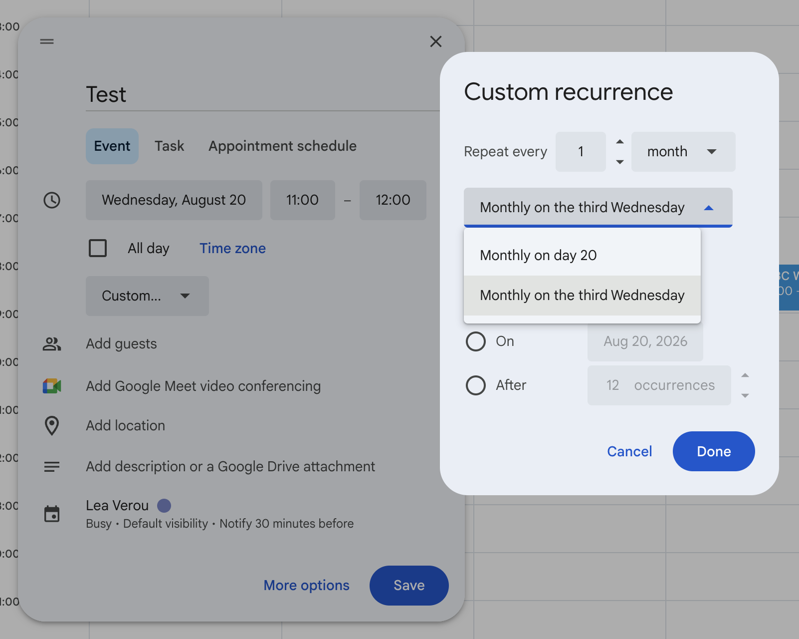

One of my favorite product design principles is Alan Kay’s _“Simple things should be simple, complex things should be possible”_.
^[[Kay himself replied on Quora and provided background on this quote](https://www.quora.com/What-is-the-story-behind-Alan-Kay-s-adage-Simple-things-should-be-simple-complex-things-should-be-possible). Don’t you just love the internet?]

However, in the years since, I've come to realize that making simple things easy and complex things possible is a good first step,
but for most things, it's not enough.

## Not just about APIs { #scope }

Since [Alan Kay](https://en.wikipedia.org/wiki/Alan_Kay) was a computer scientist, his adage is typically framed as an API design principle.
However, it's a good rule of thumb for pretty much any creative tool, any user interface designed to help people create artifacts.
APIs are only an example of such an interface.

The line between creative tools and transactional processes
^[a distinction I first read about in [Joe McLean’s brilliant post on overfitting](https://medium.com/design-bootcamp/overfitting-and-the-problem-with-use-cases-337d9f4bf4d7)]
is blurry.
While APIs or design and development tools are squarely in the creative tool category,
what about something like Google Calendar?
If you squint, it could be argued that Google Calendar is a creative tool where **the artifact being created is a calendar event**.

<figure class="width-m">
  <video src="videos/google-calendar.mp4" muted autoplay loop></video>
  <figcaption>
    Is Google Calendar a creative tool?
  </figcaption>
</figure>

Indeed, Kay’s maxim has clearly been used in its design.
Everything has sensible defaults that can be tweaked, so if all we want is to add an hour-long event at a specific date and time, we can do that with a single click at the right place in the calendar.
Can't really get simpler than that.
We can drag an edge to make it shorter or longer, or drag & drop to reschedule it (direct manipulation),
and we can tweak most details from the popup itself, or click "More Options" and get even more control (e.g. set guest permissions).
**Simple things are easy, and complex things are possible.**

## Which things are simple? { #simplicity }

For a long time, I used to argue that the principle should be "_Common_ things should be easy, _uncommon_ things should be possible".
Often, the most common use cases are not at all simple!
<!--
Take color manipulation for example.
A common use case is generating tints and shades from a key color.
Generating tints and shades of a key color by just adjusting lightness does not produce good results.
^[yes, even in a perceptually uniform color space like OKLCh. Yes, I do plan to write a blog post about this. But meanwhile, you can check out the data in https://palettes.colorjs.io to see how irregular hand-tweaked color palettes are in every color space.]
Instead, the math for generating aesthetically pleasing tints and shades is much more complex.

Or music.
The simplest way to generate musical notes is a single sine wave at the right frequency for each note.
But it sounds _awful_.
Instead, actual instruments produce a ton of these, at slightly different frequencies and layer them together.
It’s actually surprisingly difficult to emulate the sound of e.g. piano keys with a low-level API such as [Web Audio](https://developer.mozilla.org/en-US/docs/Web/API/Web_Audio_API) (yes, speaking from experience). -->

For example,
the common use case when using an HTML sanitizer is preventing XSS attacks.
And yet, that is _insanely_ complex to get right.
Defining explicit allowlists and blocklists is far simpler, but also more niche.
The upcoming [Sanitizer API](https://developer.mozilla.org/en-US/docs/Web/API/HTML_Sanitizer_API) supports defaults that are optimized for that, but allow overriding to define custom allowlists or blocklists.

```js
// Use "magic" presets designed to prevent XSS attacks
element.setHTML(unsafeHTML);

// Custom, possibly unsafe configuration
element.setHTML(unsafeHTML, {
  removeElements: ["span", "script"],
  removeAttributes: ["lang", "id"],
  comments: false,
});
```

The common case is not simple at all, and encapsulates a lot of complexity,
and the simple case is not common.

But then I realized I was putting the cart before the horse and getting sidetracked by the complexity of the implementation.
The "simple" things that should be easy are **simple from the user’s perspective**.
Simplicity refers to the conceptual complexity of the use case.
Simple things _are_ the most common things that people want to do, by definition!
The complexity of solving them is entirely orthogonal.

### User needs come first

To make simple things easy, the interface needs to support the user's mental model,
rather than requiring additional user effort to translate it to what the interface expects.
This may be different than the model the underlying implementation uses, which means that often **interface simplicity and implementation simplicity are in direct conflict**.

This becomes more clear with an example.
Take a look at these two common types of faucets:

<figure style="align-items: end;">


<figcaption>
Simple to use does not necessarily mean simple to implement.
</figcaption>
</figure>

When using a bathroom faucet, the user's mental model is around water temperature and pressure, rather than hot and cold water amounts.
However, the underlying implementation expects amounts of hot and cold water as inputs.

The first faucet is a _thin abstraction_: it exposes the underlying implementation directly, passing the complexity on to users, who now need to do their own translation of temperature and pressure into amounts of hot and cold water.
The second design prioritizes user needs, _abstracts_ the underlying implementation to support the user's mental model.
It provides controls to adjust the water temperature and pressure independently, and translates them to the amounts of hot and cold water internally.
The interface sacrifices implementation simplicity for UI simplicity.

Users having to expend cognitive effort to compute things that the interface could be computing for them, or implementation details leaking out into the UI are both very common UX antipatterns.
They both happen organically when people design interfaces thinking about what _they_ want to expose, rather than what _users_ want to do.
It's a natural human tendency to think about what _they_ need out of an interaction, rather than what the other party needs, despite the latter producing better results.
This is not specific to UI design, it applies to negotiations, networking, and many other aspects of life.
As an anecdote, every semester David and I taught [Design for the Web](https://designftw.mit.edu), we'd have students come to us after the first lecture
to express how much simply _thinking_ about users had shifted their mindset — they had never thought of doing that before.
That initial mindset shift from "what do _I_ need" to "what do _users_ need" improves the UIs people design tremendously, even before learning any actual usability theory.

This tension is probably the most common point of friction between UX/product folks and engineers.
Advocating for "simplicity" is a platitude — everyone agrees that all else being equal, simpler is better!
**It’s the tradeoffs between different types of simplicity that are tough.**

Having an explicit design principle in place helps resolve that tension more easily.
The Web Platform's version of it is called [Priority of Constituencies](https://www.w3.org/TR/design-principles/#priority-of-constituencies):

> User needs come before the needs of web page authors, which come before the needs of user agent implementors, which come before the needs of specification writers, which come before theoretical purity.

At its core, this is saying that user needs are more important than developer needs and that developer needs are more important than theoretical purity.
The rest is simply the same principle applied recursively, since the same group may be users in one context and developers in another.
In the web platform's case, web page authors are developers when it comes to web apps (and thus their needs are lower priority than the needs of *their* users)
but users when it comes to the web platform itself (and thus their needs are higher priority than the needs of browser developers).

While the specifics are different, every creative product can (and IMO, should) adopt a similar principle.
For example end-users > plugin authors > engineering team > theoretical purity.

## Incremental user effort for incremental value

### Avoid usability cliffs

Picture a plane with two axes: the horizontal axis being the complexity of the desired task (Use case complexity), and the Y axis the cognitive and/or physical effort users need to put into using the interface to accomplish their task.

<figure class="outlined width-m">
  <object data="images/curve-alankay.svg"></object>
  <figcaption>
    Alan Kay's maxim visualized.
  </figcaption>
</figure>

Alan Kay's maxim can be visualized as follows:
- _Simple things being easy_ means there should be a point on the lower left (low use case complexity → low user effort).
- _Complex things being possible_ means there should be a point somewhere on the far end.
The lower down the better (lower user effort), but higher up is **acceptable**.


But the maxim doesn’t tell us anything about all the other points in between.

<aside class="pullquote">
  <blockquote>
    Simple things being easy and complex things being possible is not enough — you also need a smooth curve between the two
  </blockquote>
</aside>

Simple use cases are often the [spherical cows in space](https://en.wikipedia.org/wiki/Spherical_cow) of product design.
They work _great_ for prototypes to convince stakeholders, but the real world is messy and most use cases fall somewhere in between.
It’s important that users are not thrown into the deep end when their use cases are simple, but with a few warts.

<!-- A good strategy for smoothening out the curve is to apply the principle _recursively_.
Once you have made simple things easy and complex things possible for the core flow,
isolate groups of use cases with commonalities and repeat the process for their subflows. -->

Let’s take the HTML `<video>` element as an example.
Simple things are certainly easy: all we need to get a nice sleek toolbar that works well is a single attribute: `controls`.
We just slap it on our `<video>` element and bam, we’re done with a single line of HTML:

```html
<video src="videos/cat.mp4" controls></video>
```

Now let’s suppose use case complexity increases _juuuust a little bit_.
Maybe I want to add buttons to jump 10 seconds back or forwards. Or a language picker for subtitles. Or key moment indicators, like YouTube. Or just to hide the volume control on a video that has no audio track.
None of these are particularly niche, but the default controls are all-or-nothing: the only way to change them is to reimplement the whole toolbar from scratch, which takes hundreds of lines of HTML, CSS, and JavaScript to do well.

<figure class="width-m">
  <object data="images/curve-cliff.svg"></object>
  <figcaption>

    The user experience of HTML `<video>` has a usability cliff.
  </figcaption>
</figure>

Simple things are easy and complex things are possible.
But once use case complexity crosses a certain (low) threshold, user effort abruptly shoots up.

This is called a **usability cliff**, and is common when products make simple things easy and complex things possible by providing two distinct interfaces:
a very high level one that caters to the most common use case, and a very low-level one that lets users do whatever but they have to reimplement everything from scratch.

For delightful user experiences, **making simple things easy and complex things possible is not enough — the transition between the two should also be smooth**.
The user effort required to achieve incremental value should be proportional to the value gained.
There should be no point where incremental value requires orders of magnitude more user effort.

You can visualize this like that:

<figure class="width-m">
  <object data="images/curve-delightful.svg"></object>
  <figcaption>
    A delightful user experience has a smooth power-to-effort curve without cliffs.
	The slower the rare of increase, the better.
  </figcaption>
</figure>

### Apply the principle _recursively_

One good way to avoid cliffs is to ask yourself: among the use cases I considered "complex", which ones are most common?
Then make simple things easy for them too.

This was a big reason why [PrismJS](https://prismjs.com), a syntax highlighting library I wrote in 2012, became so popular,
reaching over 2 *billion* downloads on npm and being used on some pretty huge websites ^[The other one being that it was the only one at the time that made syntax highlighting actually _look good_].

Simple things were easy: highlighting code on a website that used good HTML took nothing more than including a CSS file and a script tag.
Because its only hook was regular HTML, and there was no Prism-specific "handshake" in the markup, it was able to work across a large variety of toolchains, even tooling where authors had little control over the HTML produced (e.g. Markdown).

Complex things were possible: it included a simple, yet extensive system of [hooks](https://www.npmjs.com/package/blissful-hooks) that allowed [plugin](https://prismjs.com/#plugins) authors to modify its internal implementation to do whatever by basically inserting arbitrary code at certain points and modifying state.

But beyond these two extremes, the principle was applied _recursively_:
**Common complex things were also easier than uncommon complex things.**
For example, while adding a new language definition required more knowledge than simply using the library, a lot of effort went into reducing both the effort and the knowledge required to do so.
Styling required simple CSS, styling simple, readable class names.
And as a result, the ecosystem flourished with hundreds of contributed languages and themes.

This is a very common pattern for designing extensible software:
**a powerful low-level plugin architecture,
with easier _shortcuts_ for common extensibility points**.

### Malleable shortcuts

A corollary of _Incremental user effort for incremental value_ is that if the interface provides a simple way to accomplish part of a complex use case, users should be able to take advantage of it to get a headstart for more complex use cases, rather than having to recreate the solution from scratch using a more complex interface.

At their core, all ways to smoothen this curve revolve around *tweaking*:
Making sure that the solution to simple cases is sufficiently flexible that it takes _a lot_ of use case complexity before users need to recreate the solution from scratch using lower-level primitives, if they need to at all.

This is the core issue with the `<video>` example:
The way it makes simple things easy is completely inflexible.
There are no extensibility points, no way to customize anything.
It’s take it or leave it.

While web components are not typically the poster child of good user experiences, there is one aspect of web component APIs that allows them to provide a very smooth power-to-effort curve: [slots](https://developer.mozilla.org/en-US/docs/Web/API/Web_components/Using_templates_and_slots).
Slots are predefined insertion points with defaults.
If I’m writing a `<my-video>` component, I can define its default play button like this:

```html
<button id="play">
	<slot name="play-button-icon">▶️</slot>
</button>
```

And now, a component consumer can use `<my-video src="cat.mp4">` and get a default play button, or slot in their own icon:

```html
<my-video src="cat.mp4">
	<i slot="play-button-icon" class="fa-solid fa-play"></i>
</my-video>
```

But the best thing about slots is that they can be **nested**.
This means that component authors can defensively wrap parts of the UI in slots, and component consumers can override just the parts they need, at the granularity they need.
For example, `<my-video>` could also wrap the default play button itself in a slot:

```html
<slot name="play-button">
	<button id="play">
		<slot name="play-button-icon">▶️</slot>
	</button>
</slot>
```

And then, component consumers can _still_ only override the icon, or override the whole button:

```html
<my-video src="cat.mp4">
	<button slot="play-button">
		<i slot="play-button-icon" class="fa-solid fa-play"></i>
	</button>
</my-video>
```

Empty slots facilitate **insertion points**.
For example, the `<my-video>` component author could support inserting controls before or after the play button like so:

```html
<slot name="play-button-before"></slot>
<slot name="play-button">
	<button id="play">
		<slot name="play-button-icon">▶️</slot>
	</button>
</slot>
<slot name="play-button-after"></slot>
```

And then, component consumers can use them to add additional controls:

```html
<my-video src="cat.mp4">
  <button slot="play-button-before" class="skip-backwards"><svg>…</svg></button>
  <button slot="play-button-after" class="skip-forwards"><svg>…</svg></button>
</my-video>
```

Given enough extension points, users would only need to resort to building custom controls from scratch when they truly have a very complex use case that cannot be implemented as a delta over the default controls.
That smoothens out the curve, which may look more like this:

<figure class="width-m">
  <object data="images/curve-slots.svg"></object>
  <figcaption>
    A custom video component that uses slots extensively can smoothen the curve.
  </figcaption>
</figure>

Let’s get back to Google Calendar for another example.
Suppose we want to create a recurring event.
Even within the less simple use case of creating a recurring event, there are simpler use cases (e.g. repeat every week),
and more complex ones (e.g. every third week, on the third Sunday of the month, twice a week etc.).

Google Calendar has used *tweakable presets* to make simple things easy and complex things possible at the micro-interaction level.
Simple things are easy: you just pick a preset.
But these presets are not just shortcuts for common cases.
They also serve as entrypoints into the more "advanced" interface that can be used to set up almost any rule — with enough user effort.

**Tweakable presets** smoothen the curve exactly because they contain the additional user effort to only the delta between the user's use case, and the simpler use case the interface is optimized for.
By doing that, they also become a teaching tool for the more advanced interface, that is much more effective than help text, which is typically skimmed or ignored.

<figure>




<figcaption>
Google Calendar making simple things easy and complex things possible at the micro-interaction level.
</figcaption>
</figure>


### A hierarchy of abstractions

So far, both malleable abstractions we have seen revolved around extensibility and customization — making the solution to simple use cases more flexible so it can support medium complexity use cases through customization.

The version of this on steroids is defining low-level primitives as building blocks, and then composing them into high-level abstractions.

My favorite end-user facing product that does this is [Coda](https://coda.io).
If you haven’t heard of Coda, imagine it as a cross between a spreadsheet, a database, and a document editor.

Coda implements its own formula language, which is a way for end users to express complex logic through formulas.
Think spreadsheet formulas, but a lot better.
For many things, the formula language is its lowest level primitive.

Then, to make simple things easy, Coda provides a UI for common cases, but here’s the twist:
The UI is generating formulas behind the scenes.
Whenever users need to go a little beyond what the UI provides, they can switch to the formula editor and tweak the generated formula,
which is infinitely easier than starting from scratch.

Let’s take the filtering interface as an example, which I [have written about before](../../2023/eigensolutions/#coda-filtering).
At first, the filtering UI is pretty high level, designed around common use cases:

<figure>


<figcaption>

Another nice touch: "And" is not just communicating how multiple filters are combined, but is also a control that lets users edit the logic.

</figcaption>

</figure>

For the vast majority of use cases, the high-level UI is perfectly sufficient.
If you don’t need additional flexibility, you may not even notice the little ***f*** button on the top right.
But for those that need additional power it can be a lifesaver.
That little *f* indicates that behind the scenes, the UI is actually generating a *formula* for filtering.
Clicking it opens a formula editor, where you can edit the formula directly:


I suspect that even for the use cases that require that escape hatch, a small tweak to the generated formula is all that is necessary.
The user may have not been able to write the formula from scratch, but **tweaking is easier**.
As one data point, the one time I used this, it was just about using parentheses to combine AND and OR differently than the UI allowed.

<!-- This also makes another point:
**Presets don’t have to be predefined.**
They can be dynamically generated based on the current state (e.g. in this case the table columns and their types).
Even the Google Calendar presets are subtly dynamic, using the selected date as input. -->

Smoothening the curve is not just about minimizing user effort for a theoretical user that understands your interface perfectly (efficiency), it's also about minimizing the effort required to get there (learnability).
The fewer primitives there are, the better.
Defining high-level abstractions in terms of low-level primitives is also a great way to simplify the user's mental model and keep cognitive load at bay.
It's an antipattern when users need to build multiple different mental models for accomplishing subtly different things.

When high-level abstractions are defined as predefined configurations of the existing low-level primitives, there is only one mental model users need to build.
The high level primitives _explain_ how the low-level primitives work, and allow users to get a headstart for addressing more complex use cases via tweaking rather than recreating.
And from a product design perspective, it makes it much easier to achieve smooth power-to-effort curves because you can simply define intermediate abstractions rather than having to design entirely separate solutions ad hoc.

For the Web Platform, this was basically the core point of the [Extensible Web Manifesto](https://extensiblewebmanifesto.org/),
which those of you who have been around for a while may remember:
It aimed to convince standards editors and browsers to ship low-level primitives that _explain_ how the existing high-level abstractions worked.

#### Low-level doesn't mean low implementation effort

**Low-level primitives** are building blocks that can be composed to solve a wider variety of user needs, whereas **high-level abstractions** focus on eliminating friction for a small set of user needs.
Think of it that way: a freezer meal of garlic butter shrimp is a high-level abstraction, whereas butter, garlic, and raw shrimp are some of the low-level primitives that go into it.

The low-level vs high-level distinction refers to the **user experience**, not the underlying implementation.
Low-level primitives are not necessarily easier to implement, and are often much harder.
Since they can be composed in many different ways, there is a much larger surface area that needs to be designed, tested, documented, and supported.
It's much easier to build a mortgage calculator than a spreadsheet application.

As an extreme example, a programming language is one of the most low-level primitives possible: it can build anything with enough effort, and is not optimized for any particular use case.
Compare the monumental effort needed to design and implement a programming language to that needed to implement e.g. a weather app, which is a high-level abstraction that is optimized for a specific use case and can be prototyped in a day.

As another extreme example, it could even be argued that an AI agent like ChatGPT is actually a _low-level_ primitive from a UX perspective,
despite the tremendous engineering effort that went into it.
It is not optimized for any particular use case, but with the right prompt, it can be used to effectively replace many existing applications.
The [floor and ceiling model](../../2023/eigensolutions/#floor-ceiling) also explains what is so revolutionary about AI agents: despite having a very high ceiling, their floor is as low as it gets.

### Reveal complexity progressively

Another corollary of _Incremental user effort should produce incremental value_ is also that **things that produce no value should not incur user effort**.
Complexity should be tucked away until it's needed.
Users should not have to deal with complexity that is not relevant to them.
_Enterprise software, I’m looking at you._

For example, individual user accounts should not need to set up "workspaces" separately from setting up their account, or designate representatives for different business functions (legal, accounting, etc.).
This is complexity that belongs to complex use cases leaking out to simple ones.
Any concepts exposed through a UI should add user-facing value.
If a concept does not add user-facing value, it should not be exposed to users.

And for APIs, this emphasizes the importance of sensible defaults, so that users don't need to make a ton of micro-decisions that may be entirely irrelevant to them.

## When a shorter curve is the right call

Every design principle is a rule of thumb, not a hard and fast law.
Sometimes, there are good reasons not to make the curve extend across the entire spectrum.

### When not motivated by user needs

<figure class="outlined float">
  <object data="images/curve-photoshop.svg"></object>
</figure>

Some products are framed exactly around only one end of the spectrum.
While they could do better and extend their curve a little bit, their entire value proposition is around one end of the spectrum,
so it doesn't make a lot of sense to invest resources in improving the other end.

Professional tools are an example where focusing around complex things being possible may be acceptable, such as airplane cockpits, or Photoshop.
Tools that require a high level of domain expertise can typically afford to require some training,
as said training often happens at the same time as acquiring the domain expertise.
For example, a pilot learns how an airplane cockpit works while also learning how to fly.

For many of these tools, use cases are so variable that making simple things significantly easier would turn them into a different product.
For example, Photoshop is a professional-grade graphics editor, that can be used for a large variety of graphics-related tasks.
Focusing around a specific subset of use cases, say photo manipulation, doesn't give us a better Photoshop UI, it gives us Lightroom.
Is there a way to combine the two into a single product so that users don't need to understand when to use which tool, without making both actively worse?
Perhaps, but it's not at all obvious.

On the other hand, something like Instagram’s photo editor makes it trivial to perform simple photo manipulations that look good with very little user effort and no domain expertise (low floor),
but is quite limited in its capabilities; there are many things it simply cannot do (low ceiling).
While there is a lot of room for improvement, making significantly more complex things possible is largely out of scope as beyond a certain point it would require domain expertise that Instagram's target audience lacks.


### Security & privacy

Sometimes, decomposing a high-level solution into low-level primitives can introduce security & privacy issues that a more tightly coupled high-level solution can avoid.

When I was in the TAG, at some point we reviewed a proposal for a low-level API which would allow websites to read the list of fonts installed on the user's system.
This raised huge red flags about user privacy and [fingerprinting](https://en.wikipedia.org/wiki/Device_fingerprint).
However, upon closer inspection, it turned out that nearly use cases were highly concentrated,
and were all variations of the same scenario:
letting end-users select a font from their system to apply it to a given artifact (e.g. a document, a graphic etc).
A high-level font picker form control where the browser takes care of displaying the list of fonts and only communicates the selected font back to the application would _both_ address privacy concerns _and_ make the API easier to use.

### Performance

Sometimes, design decisions are driven by performance considerations, rather than usability principles.
For example, CSS selectors got `:focus-within` to match elements that contained a focused element long before `:has()` was added, which allows targeting ancestors in a much more generic way.
There was no question that `:has()` would have been a better solution, but it was considered impossible to implement performantly at the time `:focus-within` was designed.
And even today, browsers apply certain optimizations to `:focus-within` that make it perform better than `:has()`.

Other times, sensible defaults are not possible because the common case is also the slowest.
This is the reason why [`inherits`](https://developer.mozilla.org/en-US/docs/Web/CSS/@property/inherits) is mandatory when registering CSS properties:
the default that would be best for users (`true`) is also the slowest, but making `false` the default would mean that registered properties behave differently from native properties by default.
Instead, it was decided to not have a default, and make the descriptor mandatory.


## Which comes first, convenience or capability?

Alan Kay's maxim only deals with _what_ to do, not _when_ to do it.
There is no discussion around **prioritization**.
But in the real world, the _when_ is just as important as the _what_.

Sure, let's make simple things easy and complex things possible.
But **which solution do you ship _first_?**
Which one do you design first?

Stay tuned for Part 2, which will cover exactly this!
