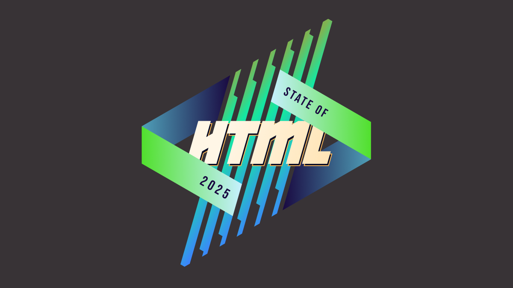

State of HTML 2025 survey is now open!
<a href="https://survey.devographics.com/en-US/survey/state-of-html/2025/?source=leaverou" class="cta" target="_blank" style="--icon: var(--icon-ballot-check);">Take it now</a>

<figure class="no-padding" style="background: #383336">

<figcaption>
Mamma mia, here we go again!
</figcaption>
</figure>

About two weeks ago, I [announced](../design-state-of-html/) that I was back leading this year’s State of HTML 2025 survey, after a one year hiatus.
We are grateful for all the suggestions that poured in, they were immensely helpful in shaping the survey.
After two weeks of hard work from a small team spanning three continents, we are finally ready to launch!

I would urge **each and every one of you that works with the web platform to fill out this survey**.
It’s a unique opportunity to have your voice heard in the browser vendors’ decision-making process.
Survey results are **used by browsers to prioritize roadmaps** — the reason Google is funding this.
The results from State of … surveys directly feed into prioritization for next year’s [Interop](https://web.dev/blog/interop-2025) project.

Time spent thoughtfully filling them out is an investment that can come back to you tenfold
in the form of seeing features you care about implemented, browser incompatibilities being prioritized, and gaps in the platform being addressed.
In addition to browsers, several standards groups are also using the results for prioritization and decision-making.

Additionally, you get to learn about new and upcoming features you may have missed,
and get a personalized, sharable score at the end to see how you compare to other respondents!

<a href="https://survey.devographics.com/en-US/survey/state-of-html/2025/?source=leaverou" class="cta" target="_blank">Take State of HTML 2025 Survey</a>

While the survey will be open for about a month,
responses entered **within the first two weeks (until end of July)** will have a much higher impact on the Web,
as preliminary data will be directly used to inform Interop 2026.

## FAQ

### What’s new this year?

We spent a lot of time thinking about which features we are asking about and why.
As a result, we **added 35 new features, and removed 18 existing ones** to make room.
This is probably one of the hardest parts of the process, as we had to make some tough decisions.

We are also using the Web Components section to pilot a new format for pain points questions,
consisting of a multiple choice question with common pain points,
followed by the usual free form text list:

<figure class="center" style="max-width: 40em">

</figure>

While this increases the number of questions,
we are hoping it will _reduce_ survey fatigue by allowing participants to skip the freeform question more frequently (or spend less time on it) if most of their pain points have already been covered by the multiple choice question.

Last but not least, we introduced browser support icons for each feature, per popular request:

### Can I edit my responses?

**Absolutely!** Do not worry about filling it out perfectly in one go.
If you create an account, you can edit your responses for the whole period the survey is open, and even fill it out across multiple devices,
e.g. start on your phone, then fill out some on your desktop, etc.
Even if you’re filling it out anonymously, you can still edit responses on your device for some time,
so you can have it open in a browser tab and revisit it periodically.

### Why are there JS questions in an HTML survey?

This question comes up a lot every year.

For the same reason there are JS APIs in the [HTML standard](https://html.spec.whatwg.org/):
many JS APIs are intrinsically related to HTML.
We mainly included JS APIs that are in some way related to HTML, such as:
- APIs used to manipulate HTML dynamically (DOM, interactivity, etc.)
- Web Components APIs, used to create custom HTML elements
- PWA features, including APIs used to access underlying system capabilities (OS capabilities, device capabilities, etc.)

The only two exceptions to this are two `Intl` APIs,
which were mainly included because we wanted to get participants thinking about any localization/internationalization pain points they may have.

**However, if you don’t write any JS, we absolutely still want to hear from you!**
In fact, I would encourage you **even more strongly** to fill out the survey,
as people who don't write JS are very underrepresented in these surveys.
**All questions are optional**, so you can just skip any JS-related questions.

There is also a question at the end, where you can select that you only write HTML/CSS:

### Why are some features included that are early stage proposals with no browser support?

While proposals with no browser support are not good candidates for immediate prioritization by browsers,
their [context chips](../2024/context-chips/) give browser vendors and standards groups invaluable insight into what matters to developers,
which _also_ drives prioritization decisions.

However, we heard you loud and clear: when mature and early stage features are mixed together, you felt bait-and-switched.
So this year, we are including icons to summarize browser support of each feature we ask about:

We are hoping this will also help prevent cases where participants confuse a new feature they have never heard of, with a more established feature they are familiar with.

### Is the survey only available in English?

Absolutely not! Localization has been an integral part of these surveys since the beginning.
Fun fact: None of the people working on these surveys is a native English speaker.

<figure class="center">

<figcaption>

[State of HTML 2024](https://survey.devographics.com/en-US/survey/state-of-html/2024) had translations for 31 languages.
</figcaption>
</figure>

However, since translations are a community effort, they are not necessarily complete, especially in the beginning.
If you are a native speaker of a language that is not yet complete, please consider [helping out](https://github.com/Devographics/locale-en-US#readme)!

### I found a bug, what should I do?

Please file an issue so we can fix it!

- [File content issue](https://github.com/Devographics/surveys/issues/new)
- [File technical issue](https://github.com/Devographics/Monorepo/issues/new)

