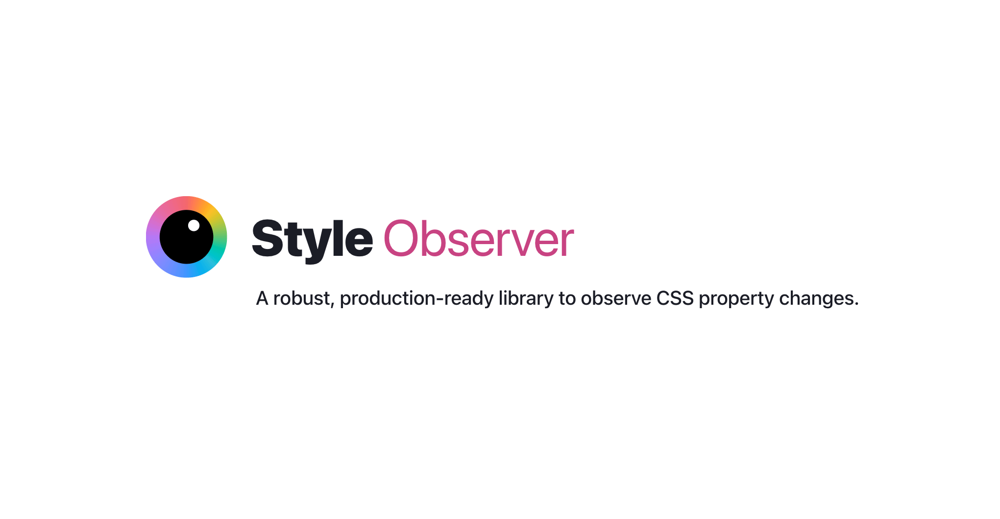
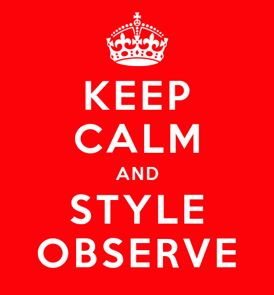

<figure class="outlined">

</figure>

I cannot count the number of times in my career I wished I could run JS in response to CSS property changes,
regardless of what triggered them: media queries, user actions, or even other JS.

Use cases abound.
Here are some of mine:
- Implement higher level custom properties in components, where one custom property changes multiple others in nontrivial ways (e.g. a `--variant: danger` that sets 10 color tokens).
- Polyfill missing CSS features
- Change certain HTML attributes via CSS (hello `--aria-expanded`!)
- Set CSS properties based on other CSS properties without having to mirror them as custom properties

The most recent time I needed this was to prototype an idea I had for [Web Awesome](https://webawesome.com),
and I decided this was it:
I’d either find a good, bulletproof solution, or I would build it myself.

Spoiler alert:
<a href="https://observe.style" title="And I couldn't even resist registering a domain for it 🤦🏽‍♀️ It’s all fun and games until the renewal bills start coming 🥲" class="cta">Oops, I did it again</a>

<!-- more -->

## A Brief History of Style Observers

The quest for a JS style observer has been long and torturous.
Many have tried to slay this particular dragon, each getting us a little bit closer.

The earliest attempts relied on [polling](https://en.wikipedia.org/wiki/Polling_(computer_science)), and thus were also prohibitively slow.
Notable examples were [`ComputedStyleObserver` by Keith Clark](https://github.com/keithclark/ComputedStyleObserver) in 2018
and [`StyleObserver` by PixelsCommander](https://github.com/PixelsCommander/StyleObserver) in 2019.

[Jane Ori](https://propjockey.io) first asked “Can we do better than polling?” with her [css-var-listener](https://github.com/propjockey/css-var-listener) in 2019.
It parsed the selectors of relevant CSS rules, and used a combination of observers and event listeners to detect changes to the matched elements.

[Artem Godin](https://github.com/fluorumlabs) was the first to try using transition events such as `transitionstart` to detect changes, with his [css-variable-observer](https://github.com/fluorumlabs/css-variable-observer) in 2020.
In fact, for CSS properties that are animatable, such as `color` or `font-size`, using transition events is already enough.
But what about the rest, especially custom properties which are probably the top use case?

In addition to pioneering transition events for this purpose, Artem also concocted a brilliant hack to detect changes to custom properties:
he stuffed them into `font-variation-settings`, which is animatable regardless of whether the axes specified corresponded to any real axes in any actual variable font, and then listened to transitions on that property.
It was brilliant, but also quite limited: it only supported observing changes to custom properties whose values were numbers (otherwise they would make `font-variation-settings` invalid).

The next breakthrough came four years later, when [Bramus Van Damme](https://github.com/bramus) pioneered a way to do it "properly", using the (then) newly Baseline `transition-behavior: allow-discrete` after [an idea by Jake Archibald](https://github.com/w3c/csswg-drafts/issues/8982#issuecomment-2317203434).
His [@bramus/style-observer](https://github.com/bramus/style-observer) was the closest we’ve ever gotten to a "proper" general solution.

Releasing his work as open source was already a great service to the community, but he didn't stop there.
He stumbled on [a ton of browser bugs](https://allow-discrete-bugs.netlify.app/), which he did an incredible job of [documenting](https://www.bram.us/2024/08/31/introducing-bramus-style-observer-a-mutationobserver-for-css/#custom-props) and then filing.
His conclusion was:

> Right now, the only cross-browser way to observe Custom Properties with @bramus/style-observer is to register the property with a syntax of "`<custom-ident>`".
> Note that `<custom-ident>` values can not start with a number, so you can’t use this type to store numeric values.

Wait, what?
That was still _quite_ the limitation!

My brain started racing with ideas for how to improve on this.
What if, instead of trying to work around all of these bugs at once, we _detect_ them so we only have to work around the ones that are actually present?

## World, meet `style-observer`

At first I considered just sending a bunch of PRs, but I wanted to iterate fast, and change too many things.
I took the fact that the domain [`observe.style`](https:/`observe.style) was available as a sign from the universe, and decided the time had come for me to take my own crack at this age-old problem, armed with the knowledge of those who came before me and with the help of my trusty apprentice [Dmitry Sharabin](https://d12n.me/) _(hiring him to work full-time on our open source projects is a whole separate blog post)_.

One of the core ways `style-observer` achieves better browser support is that
it **performs feature detection** for many of the bugs Bramus identified.
This way, code can work around them in a targeted way, rather than the same code having to tiptoe around all possible bugs.
As a result, it basically works in every browser that supports [`transition-behavior: allow-discrete`](https://caniuse.com/mdn-css_properties_transition-behavior),
i.e. 90% globally.

<figure class="float">

</figure>

- **Safari transition loop bug ([#279012](https://bugs.webkit.org/show_bug.cgi?id=279012))**:
`StyleObserver` [detects](https://github.com/LeaVerou/style-observer/blob/main/src/util/detect-transitionrun-loop.js) this and works around it by debouncing.
- **Chrome unregistered transition bug ([#360159391](https://issues.chromium.org/issues/360159391))**:
`StyleObserver` [detects](https://github.com/LeaVerou/style-observer/blob/main/src/util/detect-unregistered-transition.js) this bug and works around it by registering the property, if unregistered.
- **Firefox no initial `transitionstart` bug ([#1916214](https://bugzilla.mozilla.org/show_bug.cgi?id=1916214))**:
By design, `StyleObserver` does not fire its callback immediately (i.e. works more like `MutationObserver` than like `ResizeObserver`).
In browsers that *do* fire an initial `transitionstart` event, it is ignored.
- In addition, while working on this, we found [a couple more bugs](https://github.com/LeaVerou/style-observer/issues/42).

Additionally, besides browser support, this supports throttling, aggregation, and plays more nicely with existing transitions.

Since this came out of a real need, to (potentially) ship in a real product, it has been exhaustively tested, and comes with a testsuite of > 150 unit tests (thanks to Dmitry’s hard work).

If you want to contribute, one area we could use help with is benchmarking.

That’s all for now!
Try it out and let us know what you think!

- Docs: [observe.style](https://observe.style)
- Repo: [leaverou/style-observer](https://github.com/LeaVerou/style-observer)
- NPM: [style-observer](https://www.npmjs.com/package/style-observer)

<a href="https://observe.style" class="cta">Gotta end with a call to action, amirite?</a>
