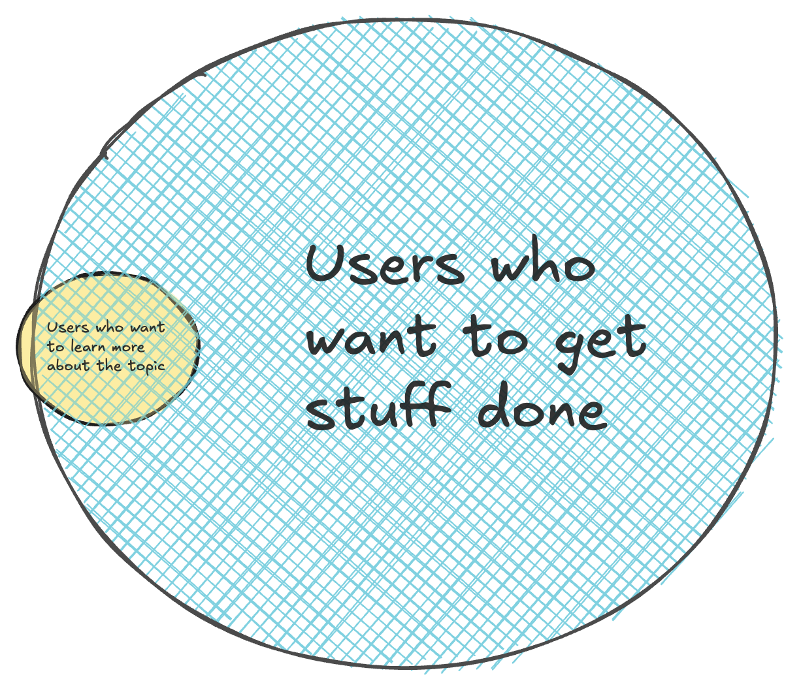
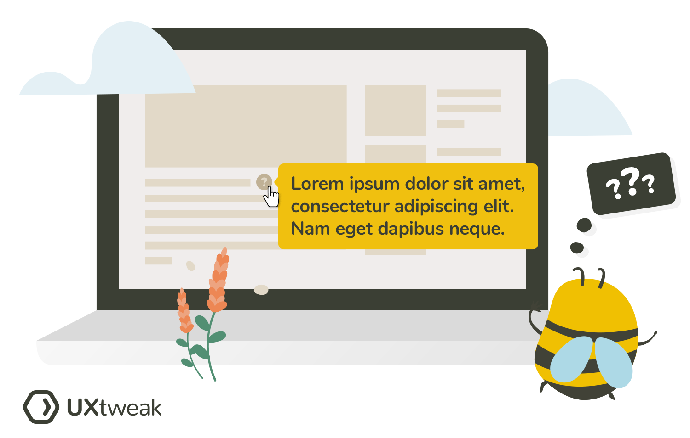
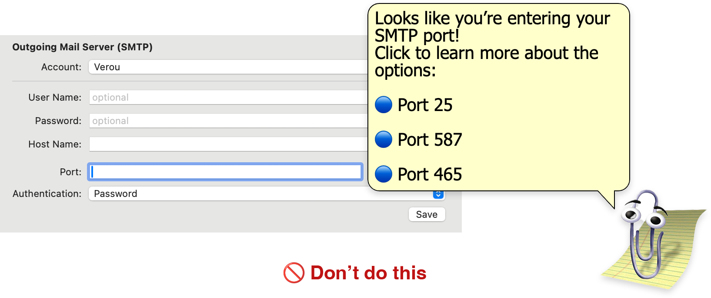
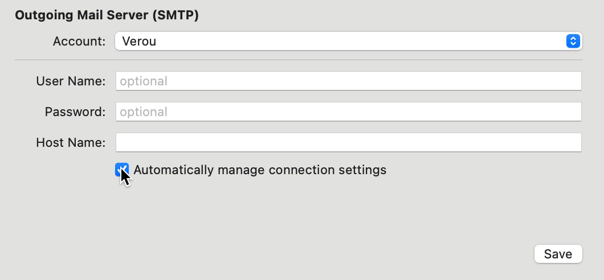
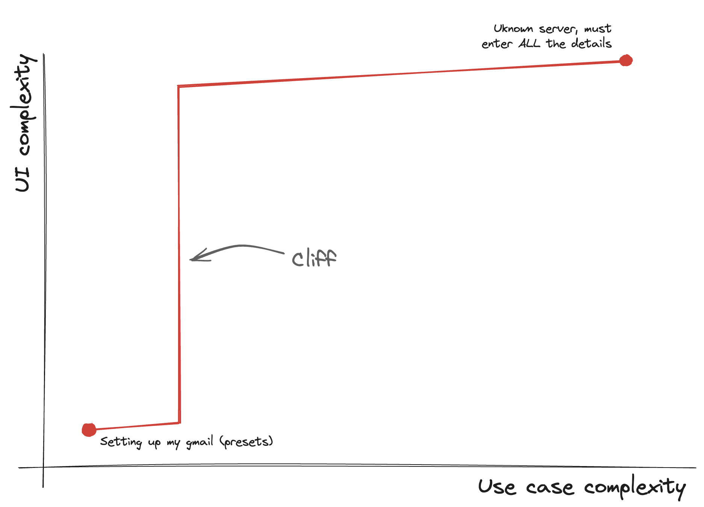

We overestimate how much users care about our product area.
In most cases, they just want to get stuff done rather than be on the receiving end of a tutorial.

Tools that teach users as they go can be great …provided the user is in the mood to learn.

**Teaching requires consent.**
Unsolicited teaching can be just as grinding as encounters with your awkward cousin Tom who won't shut up about the migratory patterns of Canadian geese.

<figure>

</figure>

Unless you’re building an educational tool (in which case this essay is not for you), the user has not consented to being taught simply by using your product.
You may think educating them is in their best interest, but it’s not your call to make.

_“Do your job well and spare me the details”_ is a valid, complete, and very common use case.

**Good interfaces (just like good APIs) are all about abstraction.**
They simplify the world around us and _reduce_ the amount of information we need to know to navigate it.
They make us feel like we have superpowers.

<figure>

<figcaption>

Two very different approaches to train ticketing:
The ticket machine in Oslo (left) prioritizes abstraction. I swipe my card and get on the train. If I’m in the majority, I’m done.
The ticket machine in Stockholm (right) wants me to learn about every possible option and make an informed decision, whether I have the bandwidth for it or not.
_(Example borrowed from [Aral Balkan](https://ar.al/)’s fantastic talk “A Happy Grain of Sand”)_
</figcaption>
</figure>

In some ways, an interface that explains how everything works whether I asked for it or not is contrary to the very idea of abstraction.
**I should not need to care!**

<figure class="caption-h">

<figcaption>
Here is a handy Venn diagram to illustrate.
</figcaption>
</figure>

_Some_ users may genuinely want to learn.
I did not claim the intersection of users getting a job done and those who want to learn more is empty,
just that it’s not 100% (or even close to it).
While learning should not stand in the way of getting their job done,
contextual non-blocking [progressive disclosure](https://www.nngroup.com/videos/progressive-disclosure/) can be a great way for the more curious users to learn more without getting in the way of the majority.

<figure class="float">

<figcaption>

Contextual non-blocking [progressive disclosure](https://www.nngroup.com/videos/progressive-disclosure/) can be a great way for the more curious users to learn more.
Illustration: [UXtweak](https://www.uxtweak.com/)
</figcaption>
</figure>

Imagine if your email client gave you a tutorial about SMTP ports every time you added a new email account.
Or if TurboTax held your hand while you manually filled in a [1040](https://www.irs.gov/forms-pubs/about-form-1040) explaining things as you went instead of just doing it for you and involving you only for the information that is absolutely necessary.[^1]

[^1]: Sure, you might be interested in any of these things, but you know you’re in the minority, right?

As product designers, we likely care a lot more about the topic than our average user.
Especially if we also belong to the target group that we are building for, it’s very easy to over-index on our own feelings and needs and be led astray.
But in most cases, users care far less about the topic than we do.
They (typically) just want to get their job done with the minimal amount of hassle and move on with their day, not engage in a lengthy conversation.
In fact, if they didn't have to deal with your UI at all they would be even happier — [the best user interface is none](https://www.nointerface.com/).

This can be a hard pill to swallow.
Remember how you felt when you first learned that the [vast majority of users skim](https://www.nngroup.com/articles/how-users-read-on-the-web/) your carefully crafted copy ([and sometimes miss its existence altogether](https://www.nngroup.com/articles/f-shaped-pattern-reading-web-content/))?
And now your bubble bursts once more, as you realize that most users don’t give a hoot about this area that fascinates you — to them your product is just a means to an end.
I think that a lot of product design and UX work is about exactly this type of reframing,
Realizing that most users don’t care,
and learning to design products that provide them with great experiences **anyway**.
Ironically, the same holds true for (regular) teaching.

## Handling abstraction leaks

Often, [abstractions leak](https://en.wikipedia.org/wiki/Leaky_abstraction).
Even the most sophisticated tools will sometimes fail to infer user intent well.
Exposing low-level knobs to empower users to adjust a poor result is a good escape hatch to make common things easy and complex things possible.
And if you do expose said low-level knobs, it's reasonable to explain what they do.
But even then, intermediate abstractions and smart defaults can be more powerful than an overly chatty UI.

In fact, I would go as far as to say that **forcing the user to learn should be a last resort**, if you truly are out of other options.
And do not get carried away thinking that a user who is accessing lower-level settings is necessarily interested in learning more — they most likely still just want to get their job done and are likely low-key frustrated about doing extra work to get there.
As a rule of thumb, if the user’s interest to learn dissipates when your tool produces a good result, their [job to be done](https://hbr.org/2016/09/know-your-customers-jobs-to-be-done) does not include learning.

To stick with the mail client example, if your email provider is not recognized you can still enter the details manually,
but that does not mean you suddenly acquired a special interest in the SMTP protocol.

While trying to teach me is better than nothing, it requires a lot more time and energy from me than the alternatives.
What alternatives?
An obvious alternative is a good default, though that alone does not help me if I need to override it.
Apple Mail goes beyond that and provides an _intermediate abstraction_:
even if you _do_ need to enter the details manually, it will still try to handle the lower level connectivity stuff for you unless you explicitly ask it not to.

Intermediate abstractions and sensible defaults are an excellent way to reveal complexity progressively and not only make common things easy and complex things possible, but also to avoid usability cliffs, where a small increase in use case complexity leads to a disproportionately large increase in UI complexity.

----

Don’t get me wrong — I love learning, and I love teaching. So much that I’ve devoted a sizable chunk of my 20 year career to it.
But teaching those who do not wish to be taught is an exercise in frustration, and a waste of everyone’s time.
And especially when it comes to a UI, chances are you don’t _really_ need to.

_The title of this essay is a riff on [Steve Krug’s seminal usability book _“Don’t Make Me Think!”_](https://sensible.com/dont-make-me-think/) which I would strongly recommend to anyone._
