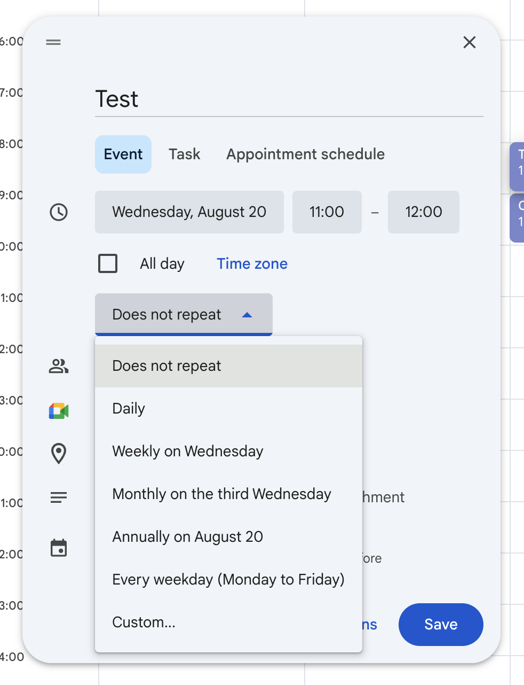
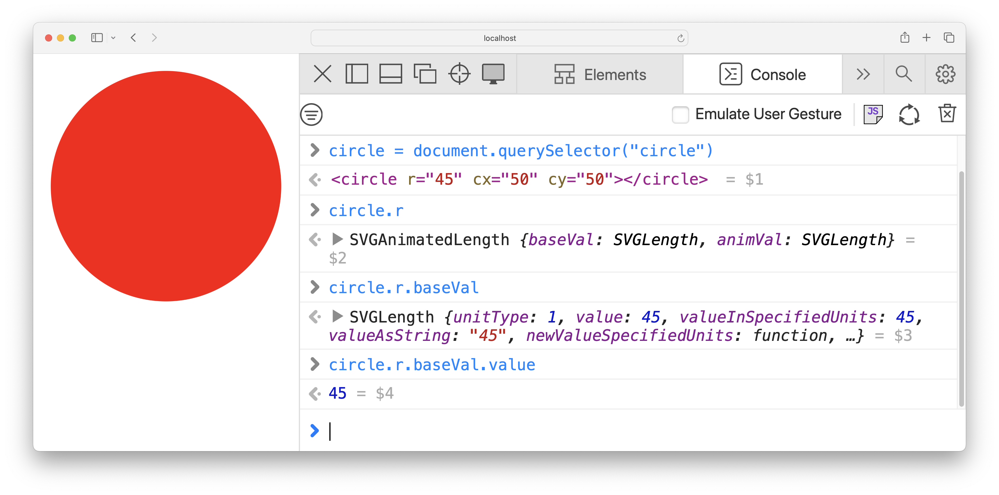

<figure class="float" style="max-width: 12em">

<figcaption>

Alan Kay [[source]](https://aes2.org/community/technical-council/richard-c-heyser-memorial-lecture-series/details-of-heyser-lectures/memorial-lecture-at-109th-alan-kay-the-computer-revolution-hasnt-happened-yet/)</figcaption>
</figure>

One of my favorite product design principles is Alan Kay’s _“Simple things should be simple, complex things should be possible”_.
^[[Kay himself replied on Quora and provided background on this quote](https://www.quora.com/What-is-the-story-behind-Alan-Kay-s-adage-Simple-things-should-be-simple-complex-things-should-be-possible). Don’t you just love the internet?]

I had been evangelizing it almost verbatim long before I knew I was not the first to coin it.

However, after applying it to dozens of products, languages, and other interfaces over the last 20 years, I have realized that there is a lot more to it than meets the eye.
As usual, the devil is in the details.

## Long-Tail UIs { #long-tail-uis }

Since [Alan Kay](https://en.wikipedia.org/wiki/Alan_Kay) was a computer scientist, his quote is typically framed as a PL or API design principle.
But that is downplaying its importance — **programming languages and APIs are only a small subset** of the interfaces it applies to.

_Making simple things easy and complex things possible_ is great guidance for nearly every interface where
use cases are **sufficiently varied** so that some or most are simple but there is a **long tail** of complex use cases,
**each of them being niche individually, but all together representing a significant portion of total user needs**.

For lack of a better term, let's call these **Long-Tail UIs**.
Nearly all interfaces that help humans create artifacts fall in this category.
This includes creative tools such as development environments, design tools, programming languages, APIs, etc, but is not limited to them.

Take **Google Calendar** for example.
While it could be argued that it _is_ a tool that helps humans create artifacts (calendar events),
it is not really a creative tool.
And yet, it’s definitely a Long-Tail UI:
its use cases are sufficiently varied that most are simple, but there is a large tail of complex use cases (e.g. recurring events, guests, multiple calendars, timezones, etc.).

Indeed, Kay’s maxim has clearly been used in its design.
The simple case has been so optimized that you can literally add a one hour calendar event with a single click (using a placeholder title).
You can also drag to make adjustments to the times and duration without typing ^[Yes, typing can be faster than dragging, but minimizing homing between input devices improves efficiency more, see [KLM](https://en.wikipedia.org/wiki/Keystroke-level_model)].
But almost every possible edge case is also catered to — with additional user effort.

<figure class="width-m">
  <video src="videos/google-calendar.mp4" muted autoplay loop></video>
  <figcaption>
    Google Calendar is squarely a long-tail UI.
  </figcaption>
</figure>

While creative tools are the poster child of long-tail UIs,
there are long-tail UI _components_ in many interfaces generally designed around [transactional processes](https://medium.com/design-bootcamp/overfitting-and-the-problem-with-use-cases-337d9f4bf4d7) such as e-commerce or meal delivery (e.g. result filtering & sorting, product personalization interfaces, etc.).

<figure class="width-m">


<figcaption>

Airbnb’s filtering UI here is definitely making an effort to make simple things easy (personalized shortcuts!) and complex things possible.
</figcaption>
</figure>

While some interfaces benefit more than others from making simple things easier or more complex things possible, it's actually quite difficult to find interfaces that do not benefit at all.
These exceptions tend to mainly revolve around cases where one of the two is either not desirable (e.g. for security, safety, or performance reasons) or out of scope by design.

## It’s all about the curve

You may think your UI is the bees knees because it makes simple things easy and complex things possible.
But that’s just the baseline.
It only means you did not royally screw it up (and yes, it's surprising how many interfaces do).
But truly delightful interfaces _also_ take the care to ensure that the transition between the two is smooth throughout.

Picture a plane with two axes: the horizontal axis being the **complexity** of the desired task (_Use case complexity_), and the Y axis the cognitive and/or physical **effort** users need to put into using the interface to accomplish their task.

<figure class="outlined width-m">
  <object data="images/curve-alankay.svg"></object>
  <figcaption>
    Alan Kay's maxim visualized.
  </figcaption>
</figure>

Alan Kay's maxim can be visualized as follows:
- _Simple things being easy_ means there should be a point on the lower left (low use case complexity → low user effort).
- _Complex things being possible_ means there should be a point somewhere on the far end.
The lower down the better (lower user effort), but higher up is **acceptable**.

But even if we get these two points — **what about all the points in between?**
There are a ton of different ways to connect them, and they produce vastly different overall user experiences.

<figure class="outlined width-m">
  <object data="images/curve-multiple.svg"></object>
  <figcaption>

  For delightful user experiences, **making simple things easy and complex things possible is not enough — the transition between the two should also be smooth**.
  </figcaption>
</figure>

Meet the **complexity-to-effort curve**, the most important usability metric you've never heard of.

## User effort is a currency

Simple use cases are often the [spherical cows in space](https://en.wikipedia.org/wiki/Spherical_cow) of product design.
They work _great_ for prototypes to convince stakeholders, or in marketing demos, but the real world is messy.
For most products, there is a host of use cases that are _mostly_ simple — just with a wart here or there.

<aside class="pullquote">

> **Avoid usability cliffs.**
> Don’t throw users into the deep end when their use case becomes only slightly more complex.
> Incremental user effort cost should be proportional to incremental value gained.


</aside>

A model with surprising predictive power is to **treat user effort like a currency** that users are spending to buy solutions to their problems.
Nobody likes paying it;
in an ideal world software would read our mind and execute perfectly with zero effort.
But since we don’t live in such a world, users are typically willing to pay more in effort when they feel their use case warrants it.
Imagine ordering pizza, and finding that adding ham to a margherita increases the price 300%.
Unfair, right? Infuriating, right?

When a slight increase in complexity results in a significant increase in user effort cost, we have a **usability cliff**.
Usability cliffs make users feel cheated, just like you felt when ordering that fictitious pizza.

<figure class="width-m">
  <object data="images/curve-cliff.svg"></object>
  <figcaption>

    A usability cliff is when a small increase in use case complexity requires a large increase in user effort.
  </figcaption>
</figure>


<article class="example">

Let’s take the HTML `<video>` element as an example.
Simple things are certainly easy: all we need to get a nice sleek toolbar that works well on every device is a single attribute: `controls`.
We just slap it on our `<video>` element and bam, we’re done with a single line of HTML:

<figure class="multiple" style="align-items: center;">

```html
<video src="videos/cat.mp4" controls></video>
```
➡️

</figure>

Now let’s suppose use case complexity increases _juuuust a little bit_.
Maybe I want to add buttons to jump 10 seconds back or forwards. Or a language picker for subtitles. Or key moment indicators, like YouTube. Or just to hide the volume control on a video that has no audio track.
None of these are particularly niche, but the default controls are all-or-nothing: the only way to change them is to reimplement the whole toolbar from scratch, which takes hundreds of lines of HTML, CSS, and JavaScript to do well.

Simple things are easy and complex things are possible.
But once use case complexity crosses a certain (low) threshold, user effort abruptly shoots up.
**That's a usability cliff.**

Usability cliffs are common when products make simple things easy and complex things possible by providing two entirely disjoint flows:
a very high level one that caters to the most common use case, and a very low-level one that is an escape hatch: it lets users do whatever but they have to recreate the solution to the simple use case from scratch before they can tweak it.

</article>

<aside class="pullquote">

> **No, you can’t uncover friction by asking users.**
> Users will be vocal about things not being possible, but rarely about things being hard.
</aside>

Now imagine you’re starving, and this pizzeria is the only place that is currently open.
You would likely still order it, but you’re not happy about the transaction.

Unreasonable user-effort costs universally lead to poor user experiences.
Your product is not producing delight, but dissatisfaction and resentment.
These negative feelings pile up, and negatively impact nearly all metrics (churn, conversion, etc.), yet are hard to measure directly as they are _"death by a thousand paper cuts"_.
There is no KPI for this.
Even if you ask customers directly, few have the awareness to correctly identify and attribute the dissatisfaction (those who do are typically those with a background in usability/HCI/product or similar).

Novices often misattribute the blame altogether, e.g. to themselves, or to computers being hard.
Experts often forget about the friction once they've figured out how to solve the problem.
And most users have been so conditioned to expect poor user experiences that they often _expect them_
^[When I was running user studies at MIT, I’ve often had users exclaim “I can't believe it! I tried to do the obvious simple thing and it actually worked!”]
**So no, you can’t uncover friction by asking users.**
This is a common misconception of many engineers.
If I had a dollar for every time I’ve heard “users have not complained about this”, I would buy a new house.
**Users will be much more vocal about things not being possible, than about things not being easy.**
That also means that if users reach the point of complaining about something being too hard, you better listen.

So then how do you find these issues?
1. **Usability testing** lets you actually observe firsthand what things are hard instead of having them filtered through users' memories and perceptions.
2. [**Design reviews/audits**](/consulting/#design-reviews) by usability experts is complementary to usability testing, as it often uncovers different issues. Design reviews are also great for maximizing the effectiveness of usability testing by getting the low-hanging fruit issues out of the way before it.
3. **Dogfooding** can be unparalleled as a discovery tool.
However, it's important to keep in mind that **you are not the typical user**, and avoid overindexing on your own needs.
E.g. you’re probably such a power user, you would also surface issues no-one else has.
To actually evaluate and prioritize the issues it surfaces, you still need user research.


## Takeaways

- **Treat user effort like a currency, not a free gift.**
The more you waste, the less happy your users will be.
- **Avoid usability cliffs.**
Don’t throw users into the deep end when their use case becomes only slightly more complex.
Evaluate all points of the curve, not just the two extremes.
- **The user effort required to achieve incremental value should be proportional to the value gained.**
There should be no point where incremental value requires orders of magnitude more user effort.
- **No, you cannot just ask users.**


### Apply the principle _recursively_

<aside class="pullquote">

> Common complex things should be easier than uncommon complex things
</aside>

Long-tail UIs rarely have a uniform long tail.
Typically, some complex use cases are more simple than others.
Therefore, one good way to avoid cliffs is to apply the principle *recursively*.
Once you've made simple use cases easy, consider the remaining use cases. Which ones are simplest among them?
Then optimize them too.

This was a big reason why [PrismJS](https://prismjs.com), a syntax highlighting library I wrote in 2012, became so popular,
reaching over 2 *billion* downloads on npm and being used on some pretty huge websites ^[The other one being that it was the only one at the time that made syntax highlighting actually _look good_].

Simple things were easy: highlighting code on a website that used good HTML took nothing more than including a CSS file and a script tag.
Because its only hook was regular HTML, and there was no Prism-specific "handshake" in the markup, it was able to work across a large variety of toolchains, even tooling where authors had little control over the HTML produced (e.g. Markdown).

Complex things were possible: it included a simple, yet extensive system of [hooks](https://www.npmjs.com/package/blissful-hooks) that allowed [plugin](https://prismjs.com/#plugins) authors to modify its internal implementation to do whatever by basically inserting arbitrary code at certain points and modifying state.

But beyond these two extremes, the principle was applied _recursively_:
**Common complex things were also easier than uncommon complex things.**
For example, while adding a new language definition required more knowledge than simply using the library, a lot of effort went into reducing both the effort and the knowledge required to do so.
Styling required simple CSS, styling simple, readable class names.
And as a result, the ecosystem flourished with hundreds of contributed languages and themes.

This is a very common pattern for designing extensible software:
**a powerful low-level plugin architecture,
with easier _shortcuts_ for common extensibility points**.

### Tweakable over take-it-or-leave-it

Many complex use cases are just simple use cases with a few tweaks.
Rather than canned take-it-or-leave-it solutions for simple cases (which as we've seen, tend to produce cliffs),
a good way to smoothen the curve and require only _incremental effort for incremental value_ is to make these solutions **tweakable**.
Tweaking tends to be much easier than starting from scratch, so you want to limit starting from scratch to the cases where it's actually desirable.

With tweakable shortcuts, even if the simple solution does not fully cover the use case, the only additional user effort required is that needed to tweak it so that it does.
The flow serves a dual purpose: **it gives simple use cases a solution, and complex use cases a headstart**.

This is the core issue with the `<video>` example:
The way it makes simple things easy is completely inflexible.
There are no extensibility points, no way to customize anything.
It’s take it or leave it.

While web components are not typically the poster child of good user experiences, there is one aspect of web component APIs that allows them to provide a very smooth power-to-effort curve: [slots](https://developer.mozilla.org/en-US/docs/Web/API/Web_components/Using_templates_and_slots).
Slots are predefined insertion points with defaults.
If I’m writing a `<my-video>` component, I can define its default play button like this:

```html
<button id="play">
	<slot name="play-button-icon">▶️</slot>
</button>
```

And now, a component consumer can use `<my-video src="cat.mp4">` and get a default play button, or slot in their own icon:

```html
<my-video src="cat.mp4">
	<i slot="play-button-icon" class="fa-solid fa-play"></i>
</my-video>
```

But the best thing about slots is that they can be **nested**.
This means that component authors can defensively wrap parts of the UI in slots, and component consumers can override just the parts they need, at the granularity they need.
For example, `<my-video>` could also wrap the default play button itself in a slot:

```html
<slot name="play-button">
	<button id="play">
		<slot name="play-button-icon">▶️</slot>
	</button>
</slot>
```

And then, component consumers can _still_ only override the icon, or override the whole button:

```html
<my-video src="cat.mp4">
	<button slot="play-button">
		<i slot="play-button-icon" class="fa-solid fa-play"></i>
	</button>
</my-video>
```

Empty slots facilitate **insertion points**.
For example, the `<my-video>` component author could support inserting controls before or after the play button like so:

```html
<slot name="play-button-before"></slot>
<slot name="play-button">
	<button id="play">
		<slot name="play-button-icon">▶️</slot>
	</button>
</slot>
<slot name="play-button-after"></slot>
```

And then, component consumers can use them to add additional controls:

```html
<my-video src="cat.mp4">
  <button slot="play-button-before" class="skip-backwards"><svg>…</svg></button>
  <button slot="play-button-after" class="skip-forwards"><svg>…</svg></button>
</my-video>
```

Given enough extension points, users would only need to resort to building custom controls from scratch when they truly have a very complex use case that cannot be implemented as a delta over the default controls.
That smoothens out the curve, which may look more like this:

<figure class="width-m">
  <object data="images/curve-slots.svg"></object>
  <figcaption>
    A custom video component that uses slots extensively can smoothen the curve.
  </figcaption>
</figure>

Let’s get back to Google Calendar for another example.
Suppose we want to create a recurring event.
Even within the less simple use case of creating a recurring event, there are simpler use cases (e.g. repeat every week),
and more complex ones (e.g. every third week, on the third Sunday of the month, twice a week etc.).

Google Calendar has used *tweakable presets* to make simple things easy and complex things possible at the micro-interaction level.
Simple things are easy: you just pick a preset.
But these are not just presets, they are also tweakable shortcuts.
They also serve as entrypoints into the more "advanced" interface that can be used to set up almost any rule — with enough user effort.

**Tweakable presets** smoothen the curve exactly because they contain the additional user effort to only the delta between the user's use case, and the simpler use case the interface is optimized for.
By doing that, they also become a **teaching tool** for the more advanced interface, that is much more effective than help text, which is typically skimmed or ignored.

<figure>




<figcaption>
Google Calendar making simple things easy and complex things possible at the micro-interaction level.
</figcaption>
</figure>


### A hierarchy of abstractions

So far, both tweakable abstractions we have seen revolved around extensibility and customization — making the solution to simple use cases more flexible so it can support medium complexity use cases through customization.

The version of this on steroids is defining super low-level primitives as building blocks that make complex things possible,
and then composing them into various high-level abstractions that make simple things easy.

My favorite end-user facing product that does this is [Coda](https://coda.io).
If you haven’t heard of Coda, imagine it as a cross between a spreadsheet, a database, and a document editor.

Coda implements its own formula language, which is a way for end users to express complex logic through formulas.
Think spreadsheet formulas, but a lot better.
For many things, the formula language is its lowest level primitive.

Then, to make simple things easy, Coda provides a UI for common cases, but here’s the twist:
The UI is generating formulas behind the scenes that users can then tweak!
Whenever users need to go a little beyond what the UI provides, they can switch to the formula editor and tweak the generated formula,
which is infinitely easier than writing it from scratch.

Let’s take the filtering interface as an example, which I [have written about before](../../2023/eigensolutions/#coda-filtering).
At first, the filtering UI is pretty high level, designed around common use cases:

<figure>


<figcaption>

Another nice touch: "And" is not just communicating how multiple filters are combined, but is also a control that lets users edit the logic.

</figcaption>

</figure>

For the vast majority of use cases, the high-level UI is perfectly sufficient.
If you don’t need additional flexibility, you may not even notice the little ***f*** button on the top right.
But for those that need additional power it can be a lifesaver.
That little *f* indicates that behind the scenes, the UI is actually generating a *formula* for filtering.
Clicking it opens a formula editor, where you can edit the formula directly:


I suspect that even for the use cases that require that escape hatch, a small tweak to the generated formula is all that is necessary.
The user may have not been able to write the formula from scratch, but **tweaking is easier**.
As one data point, the one time I used this, it was just about using parentheses to combine AND and OR differently than the UI allowed.

<!-- This also makes another point:
**Presets don’t have to be predefined.**
They can be dynamically generated based on the current state (e.g. in this case the table columns and their types).
Even the Google Calendar presets are subtly dynamic, using the selected date as input. -->

Smoothening the curve is not just about minimizing user effort for a theoretical user that understands your interface perfectly (efficiency), it's also about minimizing the effort required to get there (learnability).
The fewer primitives there are, the better.
Defining high-level abstractions in terms of low-level primitives is also a great way to simplify the user's mental model and keep cognitive load at bay.
It's an antipattern when users need to build multiple different mental models for accomplishing subtly different things.

When high-level abstractions are defined as predefined configurations of the existing low-level primitives, there is only one mental model users need to build.
The high level primitives _explain_ how the low-level primitives work, and allow users to get a headstart for addressing more complex use cases via tweaking rather than recreating.
And from a product design perspective, it makes it much easier to achieve smooth power-to-effort curves because you can simply define intermediate abstractions rather than having to design entirely separate solutions ad hoc.

For the Web Platform, this was basically the core point of the [Extensible Web Manifesto](https://extensiblewebmanifesto.org/),
which those of you who have been around for a while may remember:
It aimed to convince standards editors and browsers to ship low-level primitives that _explain_ how the existing high-level abstractions worked.

#### Low-level doesn't mean low implementation effort

**Low-level primitives** are building blocks that can be composed to solve a wider variety of user needs, whereas **high-level abstractions** focus on eliminating friction for a small set of user needs.
Think of it that way: a freezer meal of garlic butter shrimp is a high-level abstraction, whereas butter, garlic, and raw shrimp are some of the low-level primitives that go into it.

The low-level vs high-level distinction refers to the **user experience**, not the underlying implementation.
Low-level primitives are not necessarily easier to implement, and are often much harder.
Since they can be composed in many different ways, there is a much larger surface area that needs to be designed, tested, documented, and supported.
It's much easier to build a mortgage calculator than a spreadsheet application.

As an extreme example, a programming language is one of the most low-level primitives possible: it can build anything with enough effort, and is not optimized for any particular use case.
Compare the monumental effort needed to design and implement a programming language to that needed to implement e.g. a weather app, which is a high-level abstraction that is optimized for a specific use case and can be prototyped in a day.

As another extreme example, it could even be argued that an AI agent like ChatGPT is actually a _low-level_ primitive from a UX perspective,
despite the tremendous engineering effort that went into it.
It is not optimized for any particular use case, but with the right prompt, it can be used to effectively replace many existing applications.
The [floor and ceiling model](../../2023/eigensolutions/#floor-ceiling) also explains what is so revolutionary about AI agents: despite having a very high ceiling, their floor is as low as it gets.

## Respect user effort

If you like eating out, this may be a familiar scenario:

> — I would like the rib-eye, medium-rare please.
> — Thank you sir. And how would you like your steak cooked?

Infuriating, right?
And yet, this is how a ton of UIs and APIs work.

<aside class="pullquote">

> Keep user effort close to the minimum necessary to declare _intent_
</aside>

If _incremental value should require incremental user effort_, an obvious corollary is that **things that produce no value should not require user effort**.
And yet, it's surprising how often interfaces require users to do work that confers them absolutely no benefit,
such as dealing with complexity that is not relevant to them, or doing work that the UI should be doing for them.

Treat user effort as a scarce resource and keep it close to the minimum necessary to declare _intent_.
The user experience of expending effort without getting any value in return just because an interface requires jumping through certain hoops to use is demoralizing;
the UI equivalent of red tape.
On the other hand, interfaces where every bit of user effort required is meaningful and produces tangible value are a joy to use.
Guess which one is more likely to minimize churn?

@@@ lazy coding prioritizing developer convenience over user experience

### Reveal complexity progressively

Complexity should be tucked away until it's needed.
Users should not have to deal with complexity that is not relevant to them.
_Enterprise software, I’m looking at you._

For example, individual user accounts should not need to set up "workspaces" separately from setting up their account, or designate representatives for different business functions (legal, accounting, etc.).
This is complexity that belongs to complex use cases leaking out to simple ones.
Any concepts exposed through a UI should add user-facing value.
If a concept does not add user-facing value, it should not be exposed to users.

And for APIs, this emphasizes the importance of sensible defaults and shortcuts.
Users should be able to use an API without making micro-decisions about things they don't care about or learning parts of the API that are not relevant to them.

My favorite example of this is the SVG DOM.

It's fantastic that it has been typed from the get go.
It's great that it provides access to both the animated value and the base value.<br>
It's _not_ great that all this complexity is thrown at users whether it's relevant to them or not.<br>
There is no simple way to just get a value and stuff it elsewhere, like there is for the HTML DOM.
All the complexity of the more advanced use cases is thrown at users whether it's relevant to them or not.<br>
Complex things are possible, but simple things are not easy.
There is no curve, just a horizontal line.

<figure>
  
  <object data="images/curve-svg-dom.svg"></object>
  <figcaption>
    It's great that the SVG DOM supports all this.
    It's not great that users need to deal with it whether it's relevant to them or not.
  </figcaption>
</figure>

### Support the user's mental model

Requiring users to perform mental gymnastics to translate their mental model to the interface's is another form of disrespecting user effort.
What does that look like?
Take a look at these two common types of faucets:

<figure style="align-items: end;">


<figcaption>
Simple to use does not necessarily mean simple to implement.
</figcaption>
</figure>

When using a bathroom faucet, the user's mental model is around water temperature and pressure, not hot and cold water amounts.
It's the underlying implementation that expects amounts of hot and cold water as inputs.

The first faucet is a _thin abstraction_: it exposes the underlying implementation directly, passing the complexity on to users, who now need to do their own translation of temperature and pressure into amounts of hot and cold water.
It prioritizes implementation simplicity at the expense of wasting user effort.

The second design prioritizes user needs and _abstracts_ the underlying implementation to support the user's mental model.
It provides controls to adjust the water temperature and pressure independently, and internally translates them to the amounts of hot and cold water.
This interface sacrifices implementation simplicity to minimize user effort.

Implementation details leaking out into the UI is a very common UX antipattern.
Sometimes it happens simply because abstraction is hard.
It's much easier to expose what's already there than to rethink it.
Other times, it reflects a prioritization of developer convenience over user experience.
We'll address this in the next section.

### Compute what can be computed

Users should not have to expend cognitive effort computing things that the interface could be computing for them.
If you _can_ calculate something from user input, don't require them to enter it manually.
This does not only reduce superfluous user effort, it also reduces preventable errors.

As an example, take the `removeChild()` DOM method, used to remove a child element from its parent.
In the abstract, its signature seems reasonable:

```js
parent.removeChild(child);
```

But this means two variables that need to have a very specific relationship are entered as separate inputs.
This introduces an error condition, for the case where these variables _don't_ have that relationship.
In practice, the relationship is enforced by having a single variable, and deriving the other one from it:

```js
element.parentNode?.removeChild(element);
```

While this eliminates the error condition, it still adds superfluous gruntwork into the user experience.
**User intent is muddled by noise.**

Contrast this with the newer:

```js
element.remove();
```

Now code reflects the user intent with no superfluous noise.
If the element parent is required for the operation of removing the element, it is simply computed from it by the implementation of the `remove()` method.

### Reduce gruntwork and boilerplate


Boilerplate is repetitive syntax that users need to include without thought, because it does not actually communicate intent.
It's just a little song and dance that the user needs to do _before_ they can communicate intent.

Just like computation, this kind of gruntwork is much better suited to machines, rather than humans.

There are three different causes for this:
1. Not enough effort has been put into making simple things easy, i.e. complexity is not being revealed progressively when needed
2. It is driven by a need to avoid being "opinionated"
3. The wrong technology is being used to solve the problem and does not support sufficient automation

For 1, see the previous section on [revealing complexity progressively](#revealing-complexity-progressively).

Let’s talk a bit about 2, as this is a common point of friction between UX/product folks and engineers.


If it can be generated, generate it.


The previous point is about reducing cognitive user effort by eliminating superfluous computation from the user experience,
whereas this is about reducing physical effort by not requiring manual effort that does not advance the interface's understanding of user intent.


Let’s take an example from Bootstrap:

@@@@@


<!-- Even if you're not 100% right, it's better to provide a customizable default that works in 80% of cases and requires effort to correct in 20% of cases than to make 100% of users expend effort so that the UI is not "opinionated" (unless there is truly no sensible option or there are other considerations to not setting a default, e.g. inclusivity). -->


Do not require users to type boilerplate.
They are not your monkeys.

Specifying defaults that nearly never need customization also fall in this category, even if they _technically_ are declaring intent.
Intent should be the delta from the average case, otherwise you may as well require users to specify your entire implementation.
It's your interface


## The simplicity that matters { #simplicity }

<aside class="pullquote">

> The "simple" things that should be easy are those that are simple from the user’s perspective,
> not those that are simple to implement
</aside>

For a long time, I used to argue that the principle should be "_Common_ things should be easy, _uncommon_ things should be possible".
Often, the most common use cases are not at all simple!
<!--
Take color manipulation for example.
A common use case is generating tints and shades from a key color.
Generating tints and shades of a key color by just adjusting lightness does not produce good results.
^[yes, even in a perceptually uniform color space like OKLCh. Yes, I do plan to write a blog post about this. But meanwhile, you can check out the data in https://palettes.colorjs.io to see how irregular hand-tweaked color palettes are in every color space.]
Instead, the math for generating aesthetically pleasing tints and shades is much more complex.

Or music.
The simplest way to generate musical notes is a single sine wave at the right frequency for each note.
But it sounds _awful_.
Instead, actual instruments produce a ton of these, at slightly different frequencies and layer them together.
It’s actually surprisingly difficult to emulate the sound of e.g. piano keys with a low-level API such as [Web Audio](https://developer.mozilla.org/en-US/docs/Web/API/Web_Audio_API) (yes, speaking from experience). -->

For example,
the common use case when using an HTML sanitizer is preventing XSS attacks.
And yet, that is _insanely_ complex to get right.
Defining explicit allowlists and blocklists is far simpler, but also more niche.
The upcoming [Sanitizer API](https://developer.mozilla.org/en-US/docs/Web/API/HTML_Sanitizer_API) supports defaults that are optimized for that, but allow overriding to define custom allowlists or blocklists.

```js
// Use "magic" presets designed to prevent XSS attacks
element.setHTML(unsafeHTML);

// Custom, possibly unsafe configuration
element.setHTML(unsafeHTML, {
  removeElements: ["span", "script"],
  removeAttributes: ["lang", "id"],
  comments: false,
});
```

The common case is not simple at all, and encapsulates a lot of complexity,
and the simple case is not common.

But then I realized I was putting the cart before the horse and getting sidetracked by the complexity of the implementation.
The "simple" things that should be easy are **simple from the user’s perspective**.
Simplicity refers to the conceptual complexity of the use case.
Simple things _are_ the most common things that people want to do, by definition!
The complexity of solving them is entirely orthogonal.

You can tell when an interface gets this wrong.
How many times have you heard — or said — “All I wanted to do was [thing], why is it so complicated?!”

### User needs come first

To make simple things easy, the interface needs to support the user's mental model,
rather than requiring additional user effort to translate it to what the interface expects.
This may be different than the model the underlying implementation uses, which means that often **interface simplicity and implementation simplicity are in direct conflict**.

This becomes more clear with an example.


This tension is probably the most common point of friction between UX/product folks and engineers.
Advocating for "simplicity" is a platitude — everyone agrees that all else being equal, simpler is better!
**It’s the tradeoffs between different types of simplicity that are tough.**

Having an explicit design principle in place helps resolve that tension more easily.
The Web Platform's version of it is called [Priority of Constituencies](https://www.w3.org/TR/design-principles/#priority-of-constituencies):

> User needs come before the needs of web page authors, which come before the needs of user agent implementors, which come before the needs of specification writers, which come before theoretical purity.

At its core, all this is really saying is:
- user needs > developer needs
- developer needs > theoretical purity

The rest is simply the same principle applied recursively, since in the web platform, web page authors are developers when it comes to web apps (and thus their needs are lower priority than the needs of *their* users)
but users when it comes to the web platform itself (and thus their needs are higher priority than the needs of browser developers).
Almost every platform, language, API, extensible tool, etc has a similar hierarchy of users.
E.g. in an end-user facing product that supports plugins such as Coda, the hierarchy could be end-users > plugin authors > engineering team > theoretical purity.

While the exact groups are different, every creative product can (and IMO, should) adopt a similar principle.
For example end-users > plugin authors > engineering team > theoretical purity.

## Which comes first, convenience or capability?

Alan Kay's maxim only deals with _what_ to do, not _when_ to do it.
There is no discussion around **prioritization**.
But in the real world, the _when_ is just as important as the _what_.

Sure, let's make simple things easy and complex things possible.
But **which solution do you ship _first_?**
Which one do you design first?

Stay tuned for Part 2, which will cover exactly this!
