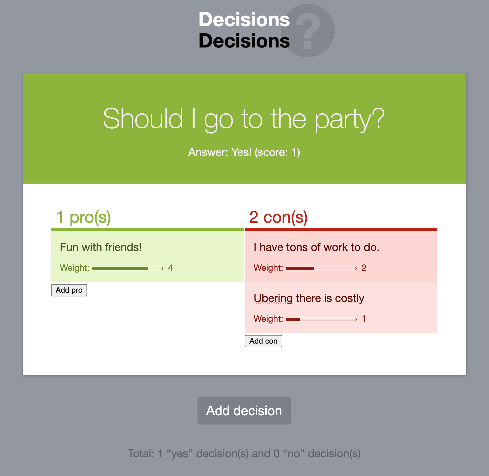
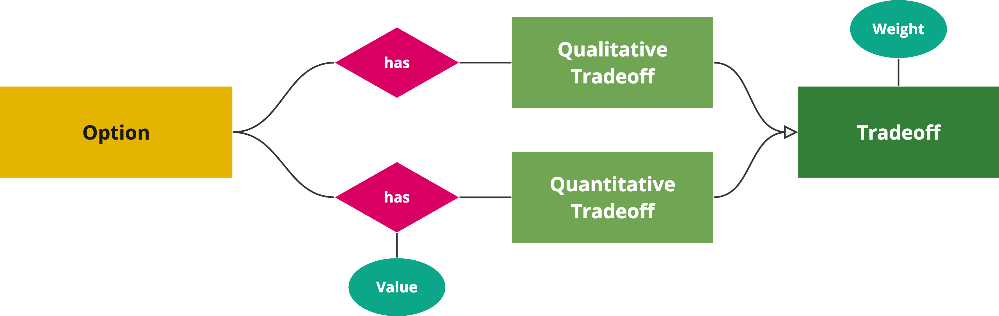

Every decision we make involves weighing tradeoffs, whether that is done consciously or not.
From evaluating whether an extra bedroom is worth $800 extra in rent,
whether being able to sleep lying down during a long flight is worth the $500 upgrade cost,
to whether you should take a pay cut for that dream job.

For complex high-stakes decisions involving many competing tradeoffs, trying to decide with your gut can be paralyzing.
The complex tradeoffs that come up when designing products [^productdef] fall in that category so frequently that analytical decision-making skills are considered one of the most important skills a product manager can have.
I would argue it’s a bit broader: analytical decision-making is one of the most useful skills a *human* can have.

[^productdef]: I use *product* in the general sense of a functional entity designed to fulfill a specific set of needs or solve particular problems for its users.
This does not only include commercial software, but also things like web technologies, open source libraries, and even physical products.

Structured decision-making is a passion of mine (perhaps as a coping mechanism for my proneness to analysis paralysis).
In fact, one of the very first demos of [Mavo](https://mavo.io/) (the novice programming language I designed at MIT)
was [a decision-making tool for weighed pros & cons](https://mavo.io/demos/decisions/).
It was even one of the two apps our usability study participants were asked to build during the [first Mavo study](https://dl.acm.org/doi/abs/10.1145/2984511.2984551?casa_token=Z5AMbJ7MB9AAAAAA:gaAFymIL30oZ7na6ewp8I-rwM186s_X3utoryMGohkUBmtwEJ6GvOs88XwniyWHHkub6_We3OSKe).
I do not only use the techniques described here for work-related decisions,
but for any decision that involves complex tradeoffs (often to the amusement of my friends and spouse).

<figure style="background: hsl(220 8% 60%);">

<figcaption>

The [Decisions Mavo app](https://mavo.io/demos/decisions/), one of the first Mavo demos, is a simple decision-making tool for weighed pros & cons.

</figcaption>
</figure>

Before going any further, it is important to note a big caveat.
**Decision-making itself *also* involves tradeoffs: adding structure makes decisions easier, but consumes more time**.
To balance this, I tend to favor an **iterative approach**, adding more precision and structure **only if the previous step failed to provide clarity**.
Each step progressively builds on the previous one, minimizing superfluous effort.

For very simple, uncontroversial decisions, just discussing or thinking about pros and cons can be sufficient, and the cost-benefit of more structure is not worth it.
Explicitly listing pros and cons is probably the most common method, and works well when consensus is within reach and the decision is of moderate complexity.
However, since not all pros and cons are equivalent, this delegates the weighing to your gut.
For more complex or controversial decisions, there is value in spending the time to also make the weighing more structured.

## The tradeoff scorecard

### What is a decision matrix?

A decision matrix, also known as a scorecard, is a table with options as rows and criteria as columns, with a column in the end that calculates a score for each option based on the criteria.
These are useful both for selection, as well as prioritization, where the score is used for *ranking* options.
In selection use cases, the columns can be specific to the problem at hand, or predefined based on certain principles or factors, or a mix of both.
Prioritization tends to use predefined columns to ensure consistency.
There is a number of frameworks out there about what these columns should be and how to calculate the score, with [RICE](https://www.intercom.com/blog/rice-simple-prioritization-for-product-managers/) (**R**each × **I**mpact × **C**onfidence / **E**ffort) likely being the most popular.

The Tradeoff Scorecard is not a prioritization framework, but a decision-making framework for choosing among several options.

### Qualitative vs. quantitative tradeoffs

Typically, tradeoffs fall in two categories:
- **Qualitative**: Each option either includes the tradeoff or it doesn’t.
Thing of them as tags that you can add or remove to each option.
- **Quantitative**: The tradeoff is associated with a value (e.g. price, effort, number of clicks, etc.)

Not all tradeoffs are all equal.
Even for qualitative tradeoffs, some are more important than others, and the differences can be quite vast.
Some strengths may be huge advantages, while others minor nice-to-haves.
Similarly, some weaknesses can be dealbreakers, while others minor issues.

We can model this by assigning a weight to each tradeoff (typically a 1-5 or 1-10 integer).
But if quantitative tradeoffs have a weight, doesn’t that make them quantitative?
The difference is that the weight applies to the *tradeoff* itself, and is applied the same to each each option,
whereas the value of quantitative tradeoffs quantifies the relationship between *tradeoff* and *option* and thus, is different for each.
Note that quantitative tradeoffs *also* have a weight, since they also don’t all matter the same.

In diagrammatic form, it looks a bit like this:

These categories are not set in stone.
It is quite common for **qualitative tradeoffs to become quantitative** down the line as we realize we need more granularity.
For example, you may start with *"Poor discoverability"* as a qualitative tradeoff, then realize that there is enough variance across options that you instead need a quantitative "Discoverability" factor with a 1-5 rating.
The opposite is more rare, but it's not unheard of to realize that a certain factor does not have enough variance to be worth a quantitative tradeoff
and instead should be modeled as 1-2 qualitative tradeoffs.

The overall score of each option is the sum of the scores of each individual tradeoff for that option.
The score of each tradeoff is often simply its weight multiplied by its value, using 1/-1 as the value of qualitative tradeoffs (pro = 1, con = -1).

While qualitative tradeoffs are either pros or cons, quantitative tradeoffs may not be universally positive or negative.
For example, consider *price*: a low price is a strength, but a high price is a weakness.
Similarly, *effort* is a strength when low, but a weakness when high.
Calculating a score for these types of tradeoffs can be a bit more involved:
- For ratings, we can subtract the midpoint and use that as the value. E.g. by subtracting 3 from a 1-5 rating we get value from -2 to 2.
Adjust accordingly if you don’t want the switch to happen in the middle.
- For less constrained values, such as prices, we can use the value’s *percentile* instead of the raw number.

### Explicit vs implicit tradeoffs

When listing pros and cons across many choices, have you noticed that there is a lot of repetition?
First, several options share the same pros and cons, which is expected, since they are alternative solutions to the same problem.
But also because **pros and cons come in pairs**.
Each strength has a complementary weakness (which is the absence of that strength), and vice versa.

For example, if one UI option involves a jarring UI shift (a bad thing), the presence of this is a weakness, but its *absence* is a strength!
In other words, **each qualitative tradeoff is present on all options, either as a strength or as a weakness**.
The decision of whether to pick the strength or the weakness as the primary framing for each tradeoff is often based on storytelling and/or minimizing effort (which one is more common?).
A good rule of thumb is to try to avoid negatives (e.g. instead of listing "no jarring UI shift" as a pro, list "jarring UI shift" as as con).

It may seem strange to view it this way, but imagine you were trying to compare and contrast five different ideas, three of which involved a jarring UI shift.
You would probably list "no jarring UI shifts" as a pro for the other two, right?

This realization helps cut the amount of work needed in half:
we simply assume that **for any tradeoff not *explicitly* listed, its *opposite* is *implicitly* listed**.

### Putting it all together

Your choice of tool can make a big difference to how easy this process is.
In theory, we *could* model all tradeoffs as a classic decision matrix, with a column for each tradeoff.
Quantitative tradeoffs would correspond to numeric columns, while qualitative tradeoffs would correspond to boolean columns (e.g. checkboxes).

Indeed, if all we have is a grid-based tool (e.g. spreadsheets), we may be stuck doing exactly that.
It does have the advantage that it makes it trivial to convert a qualitative tradeoff to a quantitative one, but it can be very unwieldy to work with.

If our tool of choice supports lists within cells, we can do better.
These boolean columns can be combined into one column as a list of all relevant tradeoffs.
Then, a separate table can be used to define weights for each tradeoff (and any other metadata, e.g. optional notes).

I currently use [Coda](https://coda.io) for these tradeoff scorecards.
While not perfect, it does support lists in cells, and has a few other features that make working with tradeoff scorecards easier:
- Thanks to its [relation](https://help.coda.io/en/articles/1385997-connect-tables-with-relation-columns) concept, the list of tradeoffs can be actually linked to their definitions.
This means that hovering over each tradeoff displys a popup with its metadata, and that I can add tradeoffs by selecting them from a popup menu.
- Conditional formatting allows me to color-code tradeoffs based on their type (strength/weakness or pro/con) and weight (lighter color for smaller impact).
- Its formula language allows me to show and list the *implicit* tradeoffs for each option (though there is no way to have them be color-coded too).

There are also limitations however:
- While I can apply conditional formatting to color-code the *opposite* of each tradeoff, I cannot display implicit tradeoffs as nice color-coded chips, in the same way as explicit tradeoffs, since relations can only display the primary column.
- Weights for quantitative tradeoffs have to be baked in the formula (there are some ways to make them editable, but )
