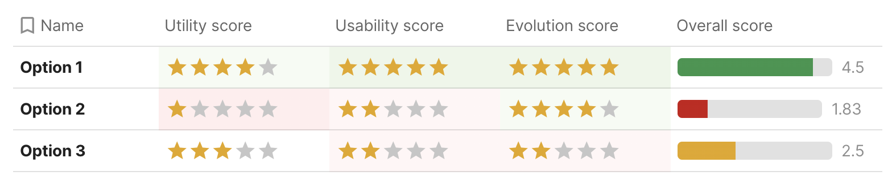
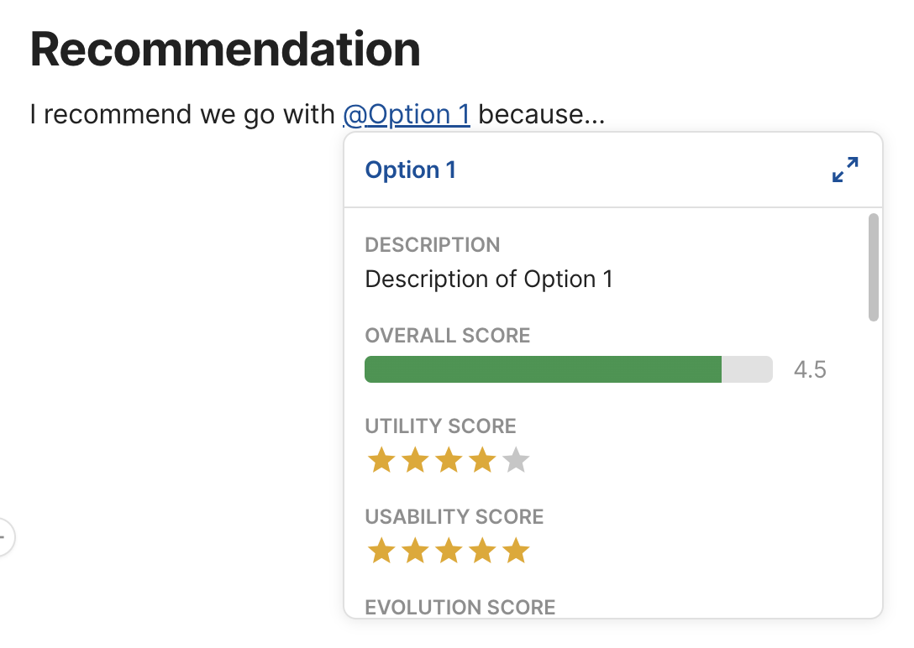

TBD: Lacks a conclusion, illustrations, and examples.

I was recently asked to describe the guiding principles I would use to weigh three different solutions to a specific user pain point,
with an emphasis on the user/customer.
There are typically other factors to consider, such as engineering effort, business goals, etc.,
but these were out of scope in that particular case.

Since most prioritization frameworks include a user-centered / impact component, the framework discussed here can complement them nicely, by simply replacing some of the factors with its outcome.
For example, if using [RICE](https://www.intercom.com/blog/rice-simple-prioritization-for-product-managers/), you can use this framework to calculate R×I,
then proceed to multiply by C/E as usual (being mindful of units).

## The Three Axes

Utility and Usability (which Nielsen groups under [*Usefulness*](https://www.nngroup.com/articles/usability-101-introduction-to-usability/)) are considered the core pillars of [Product-led Growth](https://www.nngroup.com/articles/product-led-growth-ux/).
However, both Utility and Usability are short-term metrics and do not consider the bigger picture, so only using them as a compass could result in short-sightedness.
I think there is also a third axis, which I call *Evolution*, and refers to how well a feature fits into the bigger picture,
by examining how it relates to the product’s past and (especially) future.

1. **Utility** (aka *Impact*):
How many use cases and user pain points does it address, how well, and how prominent are they?
2. **Usability**: How easy is it to use?
Evaluating usability at the idea stage is tricky, as overall usability will vary depending on how each idea is implemented, and there is often a lot of wiggle room within the same idea. At this stage, we are *only* concerned with aspects of usability inherent in the idea itself.
3. **Evolution**:
How does it relate to features that we have shipped in the past and features we may ship in the future?
Being mindful of this prevents feature creep and ensures the mental models exposed via the UI remain coherent.

These are not entirely independent, there are complex interplays between them:
- *Evolution* affects *Usability*: Features that fit poorly into the product’s past and future will create later usability issues.
However, treating it as a separate factor helps us catch these issues much earler, and at the right conceptual level.
- *Utility* and *Usability* can often be at odds: the more powerful a feature is, the more challenging it is to make it usable.

Now let’s discuss each axis in more detail.

### Utility

Utility measures the value proposition of a feature for users.
It can be further broken down to:

- [**Raising the ceiling**](../../2023/eigensolutions/#floor-ceiling): What becomes *possible*? Does it enable any use cases for which there is no workaround?
- [**Lowering the floor**](../../2023/eigensolutions/#floor-ceiling): What becomes *easier*? Does it provide a better way to do something for which there is already a workaround? How big is the delta?
- [**Widening the walls**](https://mres.medium.com/designing-for-wide-walls-323bdb4e7277): Does it serve an ignored audience or market? Does it broaden the set of use cases served by the product?
- **Use Case Significance**: How *important* are the use cases addressed?

While this applies more broadly, it is particularly relevant and top priority for [creative tools](https://lea.verou.me/blog/2023/eigensolutions/).

In evaluating the overall *Utility* of an idea, it can often be helpful to list *primary* and *secondary* use cases separately,
and evaluate Significance for them separately.

#### Primary & Secondary use cases { #primary-secondary-use-cases }

*Primary use cases* are those for which a solution is optimal (or close), and have often been the driving use cases behind its design.
This is to contrast with *secondary use cases*, for which a solution is a workaround.
Another way to frame this is *friction*: How much friction does the solution involve for each use case?
For *primary use cases*, that should be close to 0, whereas for *secondary use cases* it will be higher.

A good design will ideally have a healthy amount of both.
Lack of secondary use cases could hint that the feature may be overly tailored to specific use cases ([overfitting](https://bootcamp.uxdesign.cc/overfitting-and-the-problem-with-use-cases-337d9f4bf4d7)).

The north star goal should obviously be to address all use cases head-on, with zero friction.
But since resources are finite, enabling workarounds buys us time.
**There is far less pressure to solve a use case for which there is a workaround, than one that is not possible at all.**
The latter contributes to churn far more directly.

It is not unheard of to ship a feature with a low number of primary use cases, simply because it has a high number of secondary use cases, and will buy us time to work on better solutions for them.
In these cases, [Evolution](#evolution) is even more important: when we later have addressed all these use cases head-on,
does this feature still serve a purpose?

#### Use Case Significance

This is a rough measure of how *important* the features addressed are.
This needs to be evaluated holistically: an incremental improvement for a common interaction is far more impactful than a substantial improvement for a niche use case.

Some ways to reason about it may be:

* **Frequency**: How frequently do these use cases come up in a single user journey?
* **Reach**: What percentage of users do they affect?
* **Criticality**: How much do they matter to users? Are they a nice-to-have or a dealbreaker?
* **Vision**: How do the use cases relate to the software’s high level goals?

*Vision* may at first seem more related to the business than the user. However, when software design loses sight of its vision, the result can be a confusing, cluttered user experience that doesn’t cater to any use case well.

### Usability

There are many ways to break usability down into independent, quantifiable dimensions.
I generally go with a tweaked version of the one I first learned at [MIT’s UI Design & Implementation](http://web.mit.edu/6.813/) course I took in 2016 *(and then [taught](http://web.mit.edu/6.813/www/sp18/general/#course_staff) in 2018 and [replaced](https://designftw.mit.edu/) in 2020 😅)*,
bringing it one step closer to the original [Nielsen](https://www.nngroup.com/articles/usability-101-introduction-to-usability/) dimensions by re-adding Satisfaction:

1. **Learnability**: How easy is it for users to understand?
2. **Efficiency**: Once learned, is it fast to use?
3. **Safety** (aka *Errors*): Are errors few and recoverable?
4. **Satisfaction**: How pleasant is it to use?

Some examples of usability considerations and how they relate to these dimensions:

<dl>
<dt>

**Learnability**
</dt>
<dd>

* **Compatibility**: Does it re-use existing concepts or introduce new ones?
* **Internal Consistency**: How consistent is it with the way the rest of the product works?
* **External Consistency**: How consistent is it with the environment (other products, related domains, etc.)?
* **Memorability**: When users return to the design after a period of not using it, how easily can they reestablish proficiency?
</dd>
<dt>

**Efficiency**
</dt>
<dd>

* **Speed**: How many steps does it take to accomplish a task and how long does each step take?
* **Cognitive Load**: How much mental effort does it require?
* **Physical Load**: How much physical effort does it require?
</dd>
<dt>

**Safety**
</dt>
<dd>

* **Error-proneness**: How hard is it for users to make mistakes?
* **Error severity**: How severe are the consequences of mistakes?
* **Recoverability**: How easy is it to recover from mistakes?
</dd>
<dt>

**Satisfaction**
</dt>
<dd>

* **Aesthetics**: How visually pleasing is it?
* **Ergonomics**: How comfortable is it to use?
* **Enjoyment**: How fun is it to use?
</dd>
</dl>

<aside>

Different usability breakdowns generally converge to similar components, altough they may disagree on which of these are top-level, or may consider some out of scope.
For example [Nielsen](https://www.nngroup.com/articles/usability-101-introduction-to-usability/) uses a narrower definition of Learnability, and considers *Memorability* a separate component, whereas in our courses we consider a boroader view of Learnability that includes Memorabilty as well.
</aside>

*Satisfaction* is a bit of an oddball.
First, it has limited applicability to certain types of UIs, e.g. non-interactive text-based UIs (programming languages, APIs, etc.).
Even where it applies, it can be harder to quantify.
But most importantly, when deciding between ideas there is rarely enough signal to gauge satisfaction.
If it's not helpful for your use case, just leave it out.

Each idea will rarely have universally worse or better usability than another.
More commonly, it will be better in some dimensions and worse in others.
To evaluate these tradeoffs, we need to understand the situation and the user.

#### The situation

“Situation” here refers to the use case plus its context.

The more **repetitive or common the task**, the higher the importance of *Efficiency*.
For example text entry is an area where efficiency needs to be optimized down to individual keystrokes or minute pointing movements.
On the other end of the spectrum, for highly **infrequent tasks**, users don't have time to develop transferable knolwedge across uses and thus *Learnability* is very important (e.g. tax software, visa applications).
Last, the **more there is at stake**, the more important *Safety* becomes.
Some examples of cases where Safety is top priority would be missile launches, airplane navigation, healthcare software on a macro scale, or privacy, data integrity, finances on a micro scale.

There is granularity here as well.
For example, a visa application is used infrequently enough that learnability matters far more than efficiency for the product in general.
However, if it includes a question where it expects the user to enter their last 20 international trips, efficiency for trip entry is important.

Sometimes, two factors may genuinely be equally important.
Consider a stock trading program used on a daily basis by expert traders. Lost seconds translate to lost dollars, but mistakes also translate to lost dollars.
Is Efficiency or Safety more important?

Note that there are also interplays between different dimensions: the more effort a task involves (efficiency), the more high stakes a mistake is perceived to be (safety).
You have likely experienced this: a lengthy form losing your answers feels a lot more frustrating than having to re-enter your email in a login form.

#### The user

As a general rule of thumb, novices need learnability whereas for experts other dimensions of usability are more important.
*But who is an expert? Expert in what?*

*Application expertise* is orthogonal to *domain expertise*.
Tax software for accountants needs good learnability in terms of application features, but can assume familiarity with tax concepts (but not necessarily recall).
Conversely, tax software for regular taxpayers needs both: as software that is typically only used once a year, learnability in terms of application features is top priority.
But abstracting and simplifying tax concepts is also important, as most users are not very proficient in them.

Generally speaking, the more we can rely on training, the less important learnability becomes.
This is why airplane cockpits are so complex: pilots have spent years of training learning to use these UIs,
so efficiency and safety are prioritized instead (or at least should be — sadly that is [not always the case](https://en.wikipedia.org/wiki/Helios_Airways_Flight_522)).

That said, there is often an opportunity for **disruption** here, by taking a product that has the potential to bring value to many but currently requires lengthy training, and creating one that requires little to none.
Creator tools are prime candidates for this, with no-code/low-code tools being a flagship example right now.
However, almost every mainstream technology went through this kind of democratization at some point: computers, cameras, photo editing, video production, etc.

This distinction does not only apply to the product as a whole, but also **individual product areas**.
For example, an onboarding flow needs to prioritize learnability regardless of the priorities of the rest of the product.

### Evolution

Evolution is a bigger picture measure of how well a proposed feature fits into the product’s past, present and future,
with an emphasis on the latter, since relationship to the past and present is also the *Internal Consistency* component of *Learnability*.

When evaluating compatibility with potential future evolution, it’s important to not hold back.
Ten years down the line, when today’s implementation constraints, technology limitations, or resource limits are no more,
what would we ship and how does this feature relate to it?
Does it have a place in that future, is it entirely unnecessary, or — worse — does it actively conflict with it?

This is to avoid feature creep by ensuring that features are not designed ad hoc, but they contribute towards a coherent conceptual design.

The most common way for a feature to connect to the product’s past, present, and future is by being a milestone across a certain axis of progress:
* **Level of abstraction** (See [Layering](../eigensolutions#layering)):
  * Is it a shortcut to a present or future lower level primitive?
  * Is it a lower level primitive that explains existing functionality?
* **Power**: Is it a less powerful version of a future feature?
* **Granularity**: Is it a less granular version of a future feature?

If we have a [north star UI](../eigensolutions#nsui), part of this is to consider whether a proposed feature is compatible with it or actively diverges.

A feature *could* also be entirely orthogonal to all existing features and still be a net win wrt Evolution.
For example, when it helps us streamline UX by allowing us to later *remove* another feature that has been problematic.

## Weighing tradeoffs

While all three are very important, they are not *equally* important.
In broad strokes, usually, **Utility > Usability > Evolution**.
Here’s why:

* [**Utility > Usability**](https://elezea.com/2016/01/utility-is-more-important-than-usability/):
If a product does not provide value, *people leave*, even if it provides a fantastic user experience for the few and/or niche use cases it actually serves.
* **Usability > Evolution**, since Evolution is a long-term / more speculative concern, whereas Usability a more immediate / higher confidence one.

Depending on the product and the environment however, this trend could be reversed:
- **Competition**: If a product is competing in a space where use cases are already covered very well, but by products with poor usability, *Usability* becomes more important.
In fact, many successful products were actually usability innovations: The Web, Dropbox, the iPhone, Zoom, and many others.
- **Mutability**: [Change is always hard](https://www.intercom.com/blog/navigating-the-complexity-of-change-aversion/),
but for some products it’s a lot harder, making a solid *Evolution* path more important.
Web technologies are an extreme example: it is almost impossible to remove or change anything, ever, as there are billions of uses in the wild, no way to migrate them, and no control over them. Instead, changes have to be designed as *new* technologies or additions to existing ones.
- **Complexity**: The more complexity increases, the more important it becomes to keep further increase at bay, so *Evolution* becomes more important.

## Ok, now make the darn decision already!

So far we’ve discussed various tradeoffs, so it may be unclear how to use this as a framework to make actual decisions.

**Decision-making itself *also* involves tradeoffs: adding structure makes it easier to decide, but consumes more time**.
To balance this, I tend to favor an iterative approach, adding more precision and structure if the previous step failed to provide enough clarity.
For simple, uncontroversial decisions, just discussing the three axes can be sufficient, and the cost-benefit of more structure is not worth it.
But for more complex higher stakes decisions, a more structured approach can pay off.

Let’s consider the goals for any scoring framework:
1. **Compare and contrast**: Make an informed decision between alternatives without being lost in the complexity of their tradeoffs.
2. **Drive consensus**: It is often easier for a team to agree on a rating or weight for an individual factor, than the much bigger decision of which option to go with.
3. **Communicate**: Provide a way to communicate the decision to stakeholders, so they can understand the rationale behind it.

Calculating things precisely (e.g. use case coverage, significance, reach etc.) is rarely necessary for any of them, and thus not a good use of time.
Remember that the only purpose of scores is to help us compare alternatives. They have no meaning outside of that context.
In the spirit of an iterative approach, start with a simple 1-5 score for each factor, and only add more granularity and/or precision if that does not suffice for converging to a decision.

We can use three tables, one for each factor, with a row for each idea.
Then the columns are:

<dl>
<dt>Utility</dt><dd>

* Primary use cases
* Secondary use cases
* Utility Score *(1-5)*
</dd>
<dt>Usability</dt><dd>

* Learnability
* Efficiency
* Safety
* Usability Score *(1-5)*
</dd>
<dt>Evolution</dt><dd>

* Past & Present
* Future
* Evolution Score *(1-5)*
</dd>
</dl>

We fill in the freeform columns first, which should then give us a pretty clear picture of the score for each factor.

Finally, using the 3:2:1 ratio mentioned above, the overall score would be:

$$
Overall\_Score = \frac{ 3 \cdot Utility\_Score + 2 \cdot Usability\_Score + 1 \cdot Evolution\_Score }{3 + 2 + 1}
$$

### Template: User-Centered Decision Worksheet

I have set up a [Coda template]() for this, which you can copy and fill in with your own data.

Why [Coda](https://coda.io/) instead of something like Google Docs or Google Sheets?
* I don’t have to repeat each idea in the multiple tables, I can set them up as views and they update automatically
* Rich text (lists, etc) within table cells make it easier to brainstorm
* One-click rating widgets for scores (great when iterating)
* I can output the overall score for each feature with a formula, and it updates automatically.
No need to clumsily copy-paste it across cells either, I can just define it once for the whole column.
I can even use controls for the weights that are outside the table entirely.
* This may be subjective, but I find Coda docs more well designed than any alternative I’ve tried.

<figure>

<figcaption>
As a bonus, I can then even @-mention each feature in the rest of the doc, and hovering over it shows a tooltip with all its metadata!
</figcaption>
</figure>
