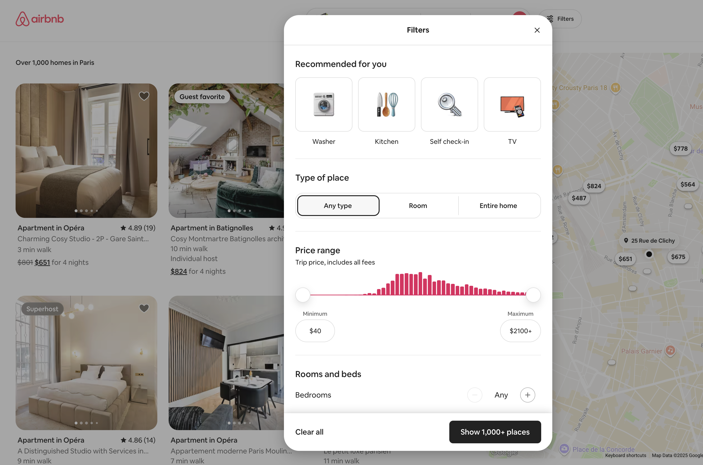

<figure class="float" style="max-width: 12em">

<figcaption>

Alan Kay [[source]](https://aes2.org/community/technical-council/richard-c-heyser-memorial-lecture-series/details-of-heyser-lectures/memorial-lecture-at-109th-alan-kay-the-computer-revolution-hasnt-happened-yet/)</figcaption>
</figure>

One of my favorite product design principles of all time is Alan Kay’s _“Simple things should be simple, complex things should be possible”_.
^[[Kay himself replied on Quora and provided background on this quote](https://www.quora.com/What-is-the-story-behind-Alan-Kay-s-adage-Simple-things-should-be-simple-complex-things-should-be-possible). Don’t you just love the internet?]
I had been evangelizing it almost verbatim long before I knew I was not the first to coin it.

However, after applying it to dozens of products, languages, and other interfaces over the last 20 years,
I have learned that there is a lot more to delightful user experiences.
Making simple things easy and complex things possible is only the baseline, a good first step.

<details class="note" id="simple-things" style="z-index: 0; width: fit-content;">
<summary><h4>What are the simple things that should be easy?</h4></summary>

Alan Kay’s principle is meaningless without alignment on what simplicity means.
What are the simple things that should be easy?
For example, I have seen engineers advocate for "simplicity" and get nods all around the room (it’s a platitude — who would argue _against_ simplicity?),
and then you realize they are referring to keeping their codebases simple, at the expense of user experience.
Which is the polar opposite of Kay’s principle!

As a user interface design principle, _simple_ refers to **use cases that are simple from the user’s perspective**,
the most common things that people want to do.
Implementation complexity is entirely orthogonal; they may be simple to implement, or insanely complex.
And because life is not fair, more often than not, user experience and implementation simplicity are in direct conflict.

For a long time, I used to argue that the principle should be "_Common_ things should be easy, _uncommon_ things should be possible".
Often, the most common use cases are not at all simple!
Implementing a high-level solution for the common case may actually involve a lot of internal complexity.

</details>

## The Long-Tail of Niche { #long-tail-of-niche }

Since [Alan Kay](https://en.wikipedia.org/wiki/Alan_Kay) was a computer scientist, his quote is typically framed as a PL or API design principle.
But that is downplaying its importance — **programming languages and APIs are only a small subset** of the interfaces it applies to.

But _making simple things easy and complex things possible_ is great guidance for nearly every interface where
use cases are **sufficiently varied** so that most are simple but there is a **long tail** of complex use cases,
**each of them being niche individually, but all together representing a significant portion of total user needs**.

For lack of a better term, let's call these **Long-Tail UIs**.
Nearly all interfaces that help humans create artifacts fall in this category.
This includes creative tools such as development environments, design tools, programming languages, APIs, etc, but is not limited to them.

Take **Google Calendar** for example.
While it could be argued that it _is_ a tool that helps humans create artifacts (calendar events),
it is not really a creative tool.
And yet, it’s definitely a Long-Tail UI:
its use cases are sufficiently varied that most are simple, but there is a large tail of complex use cases (e.g. recurring events, guests, multiple calendars, timezones, etc.).

Indeed, Kay’s maxim has clearly been used in its design.
The simple case has been so optimized that you can literally add a one hour calendar event with a single click (using a placeholder title).
You can also drag to make adjustments to the times and duration without typing ^[Yes, typing can be faster than dragging, but minimizing homing between input devices improves efficiency more, see [KLM](https://en.wikipedia.org/wiki/Keystroke-level_model)].
But almost every possible edge case is also catered to — with additional user effort.

<figure class="width-m">
  <video src="videos/google-calendar.mp4" muted autoplay loop></video>
  <figcaption>
    Google Calendar is squarely a long-tail UI.
  </figcaption>
</figure>

While creative tools are the poster child of long-tail UIs,
there are long-tail UI _components_ in many interfaces generally designed around [transactional processes](https://medium.com/design-bootcamp/overfitting-and-the-problem-with-use-cases-337d9f4bf4d7) such as e-commerce or meal delivery (e.g. result filtering & sorting, product personalization interfaces, etc.).

<figure class="width-m">



<figcaption>

Airbnb’s filtering UI here is definitely making an effort to make simple things easy (personalized shortcuts!) and complex things possible.
</figcaption>
</figure>

While some interfaces benefit more than others from making simple things easier or more complex things possible, it's actually quite difficult to find interfaces that do not benefit at all.
These exceptions tend to mainly revolve around cases where one of the two is either not desirable (e.g. for security, safety, or performance reasons) or out of scope by design.

## It’s all about the curve

You may think your UI is the bees knees because it makes simple things easy and complex things possible.
But that’s just the baseline.
It only means you did not royally screw it up (and yes, it's surprising how many interfaces do).
But truly delightful interfaces _also_ take the care to ensure that the transition between the two is smooth throughout.

Picture a plane with two axes: the horizontal axis being the **complexity** of the desired task (_Use case complexity_), and the Y axis the cognitive and/or physical **effort** users need to put into using the interface to accomplish their task.

<figure class="outlined width-m">
  <object data="images/curve-alankay.svg"></object>
  <figcaption>
    Alan Kay's maxim visualized.
  </figcaption>
</figure>

Alan Kay's maxim can be visualized as follows:
- _Simple things being easy_ means there should be a point on the lower left (low use case complexity → low user effort).
- _Complex things being possible_ means there should be a point somewhere on the far end.
The lower down the better (lower user effort), but higher up is **acceptable**.

But even if we get these two points — **what about all the points in between?**
There are a ton of different ways to connect them, and they produce vastly different overall user experiences.

<figure class="outlined width-m">
  <object data="images/curve-multiple.svg"></object>
  <figcaption>

  For delightful user experiences, **making simple things easy and complex things possible is not enough — the transition between the two should also be smooth**.
  </figcaption>
</figure>

Meet the **complexity-to-effort curve**, the most important usability metric you've never heard of.

Simple use cases are often the [spherical cows in space](https://en.wikipedia.org/wiki/Spherical_cow) of product design.
They work _great_ for prototypes to convince stakeholders, or in marketing demos, but the real world is messy.
For most products, there is a host of use cases that are _mostly_ simple — just with a wart here or there.

<aside class="pullquote">

> **Avoid usability cliffs.**
> Don’t throw users into the deep end when their use case becomes only slightly more complex.
> Incremental user effort cost should be proportional to incremental value gained.


</aside>

A model with surprising predictive power is to **treat user effort like a currency** that users are spending to buy solutions to their problems.
Nobody likes paying it;
in an ideal world software would read our mind and execute perfectly with zero effort.
But since we don’t live in such a world, users are typically willing to pay more in effort when they feel their use case warrants it.
The problems arise when there is a mismatch between user effort cost and value gained.

For actual currency, it’s common to do market segmentation to design pricing structures.
There is an analogous process here for user effort — a _use case segmentation_ if you will.

## Avoid usability cliffs

Imagine ordering pizza, and finding that adding ham to a margherita increases the price 300%.
Unfair, right? Infuriating, right?

When a slight increase in complexity results in a significant increase in user effort cost, we have a **usability cliff**.
Usability cliffs make users feel cheated, just like you felt ordering that fictitious pizza.

<figure class="width-m">
  <object data="images/curve-cliff.svg"></object>
  <figcaption>

    A usability cliff is when a small increase in use case complexity requires a large increase in user effort.
  </figcaption>
</figure>

<article class="example">

Let’s take the HTML `<video>` element as an example.
Simple things are certainly easy: all we need to get a nice sleek toolbar that works well on every device is a single attribute: `controls`.
We just slap it on our `<video>` element and bam, we’re done with a single line of HTML:

<figure class="multiple" style="align-items: center;">

```html
<video src="videos/cat.mp4" controls></video>
```
➡️

</figure>

Now let’s suppose use case complexity increases _juuuust a little bit_.
Maybe I want to add buttons to jump 10 seconds back or forwards. Or a language picker for subtitles. Or key moment indicators, like YouTube. Or just to hide the volume control on a video that has no audio track.
None of these are particularly niche, but the default controls are all-or-nothing: the only way to change them is to reimplement the whole toolbar from scratch, which takes hundreds of lines of HTML, CSS, and JavaScript to do well.

Simple things are easy and complex things are possible.
But once use case complexity crosses a certain (low) threshold, user effort abruptly shoots up.
**That's a usability cliff.**

Usability cliffs are common when products make simple things easy and complex things possible by providing two entirely disjoint flows:
a very high level one that caters to the most common use case, and a very low-level one that is an escape hatch: it lets users do whatever but they have to recreate the solution to the simple use case from scratch before they can tweak it.

</article>

<aside class="pullquote">

> **You cannot uncover friction by asking users.**
> Users will be vocal about things not being possible, but rarely about things being hard.
</aside>

Now imagine you’re starving, and this pizzeria is the only place that is currently open.
You would likely still order it, but you’re not happy about the transaction.

Unreasonable user-effort costs universally lead to poor user experiences.
Your product is not producing delight, but dissatisfaction and resentment.
These negative feelings pile up, and negatively impact nearly all metrics (churn, conversion, etc.), yet are hard to measure directly as they are _"death by a thousand paper cuts"_.
There is no KPI for this.
Even if you ask customers directly, few have the awareness to correctly identify and attribute the dissatisfaction (those who do are typically those with a background in usability/HCI/product or similar).

Novices often misattribute the blame altogether, e.g. to themselves, or to computers being hard.
Experts often forget about the friction once they've figured out how to solve the problem.
And most users have been so conditioned to expect poor user experiences that they often _expect them_
^[When I was running user studies at MIT, I’ve often had users exclaim “I can't believe it! I tried to do the obvious simple thing and it actually worked!”]
**So no, you can’t uncover friction by asking users.**
This is a common misconception many engineers have.
If I had a dollar for every time I’ve heard “users have not complained about this”, I would buy a new house!
**Users will be much more vocal about things not being possible, than about things not being easy.**
That also means that if users reach the point of complaining about something being too hard, you better listen.


## Respect user effort

Treat user effort as a scarce resource and keep it close to the minimum necessary to declare _intent_.

Interfaces where every bit of user effort required is meaningful and produces tangible value are a joy to use.
The interface is on your side, gently helping you along with every step, instead of treating your time and energy as worthless.

If you like eating out, this may be a familiar scenario:

> — I would like the rib-eye please, medium-rare.<br>
> — Thank you sir. How would you like your steak cooked?

Infuriating, right?
And yet, this is how a ton of user interfaces work.

<aside class="pullquote">

> Keep user effort close to the minimum necessary to declare _intent_
</aside>

If _incremental value should require incremental user effort_, an obvious corollary is that **things that produce no value should not require user effort**.
If user effort is a currency, there is nothing worse than paying without getting anything in return.

And yet, interfaces frequently require users to do work that confers them absolutely no benefit,
and could have absolutely been handled by the UI.

A classic example which is thankfully going away, is the credit card input form which asks for the type of credit card as a separate input.


<figure class="float">


<figcaption>

Source: [NNGroup article](https://www.nngroup.com/articles/edit-credit-card/) (adapted).
</figcaption>
</figure>

Credit card numbers are designed so that the type of credit card can be determined from the first four digits.
There is zero reason to ask for it as a separate input.
Beyond wasting user effort, it introduces an unnecessary error condition that you now need to handle: that the selected type may be inconsistent with the type actually inferred from the card number.

### Maximize signal-to-noise ratio { #signal-to-noise-ratio }

User actions that meaningfully communicate intent to the interface (once), are signal.
Any other step users need to take to accomplish their goal, including communicating the same parameters multiple times, is noise.
In text-based interfaces, such as programming languages and APIs, input parameters formatted according to the developer’s mental model (which may or may not match the format they communicate them to the API), are signal.
All other code is noise.

Some noise is unavoidable, but too much noise can obfuscate signal.
Low signal-to-noise ratio often manifests as unnecessary parameters that need to be provided even though they can be determined from other parameters already provided,
which creates _boilerplate_.
Boilerplate is code or configuration that needs to be ported over from one use case to another, either with minor tweaks, or even entirely unchanged (in which case the signal-to-noise ratio is 0).
By definition, boilerplate is user effort that does not signal intent, or which has a low signal-to-noise ratio.
It is effectively the UI equivalent of red tape — hoops you need to jump through to accomplish your actual goal, which appear to serve no actual purpose in furthering your goal except for the fact that they are required for mysterious reasons.

A short yet demonstrative example is the web platform’s DOM methods for removing an element from the DOM tree.
Assuming the element is represented by a variable called `element`, the minimum necessary to signal intent is something involving `element` and `remove` once,
plus minimal additional syntax.
Pretty much exactly like the modern DOM method, [`element.remove()`](https://developer.mozilla.org/en-US/docs/Web/API/Element/remove), which came along circa 2013.
Before that, there was only the [`parent.removeChild(child)`](https://developer.mozilla.org/en-US/docs/Web/API/Node/removeChild) method.
It required two parameters: the element to remove, and its parent.
But the parent is not a separate variable — it is _always_ the child node’s parent!
The only time when it isn’t, is when the method is used incorrectly, introducing an unnecessary error condition.
As a result, its actual usage involved a fair bit of boilerplate, where
developers had to write a much noisier `if (element.parentNode) element.parentNode.removeChild(element)` (frequently encapsulated in utility functions).
^[Yes, today it would have been `element.parentNode?.removeChild(element)`, which is a little less noisy, but this was before the optional chaining operator.]

It may seem small, but this is only because the overall code is small.
The actual difference in signal-to-noise ratio is staggering: 80% vs 20%.

<figure class="width-m">
  <object data="images/code-signal-to-noise.svg"></object>
  <figcaption>
    The difference in signal-to-noise ratio is staggering: 80% vs 20%.
  </figcaption>
</figure>


### In defense of magic


The examples above are the straightforward kind of inference: when you can predict user intent with 100% certainty.
In those cases, it’s simply a matter of engineering effort, and requiring parameters that can be inferred as separate inputs is just lazy.

It starts getting murky when you _can_ predict user intent with a high degree of confidence, but not 100%.
In those cases, you usually need to provide an escape hatch, or simply decide that the remaining cases are out of scope, which is a tougher sell.
I have seen many engineers argue for explicit input parameters even for things where we can predict user intent with a very high degree of confidence,
because if we’re not sure it’s "magic" and _everyone knows that magic is _bad_.
I beg to differ.


### User needs come first

To make simple things easy, the interface needs to support the user's mental model,
rather than requiring additional user effort to translate it to what the interface expects.
This may be different than the model the underlying implementation uses, which means that often **interface simplicity and implementation simplicity are in direct conflict**.

This becomes more clear with an example.


This tension is probably the most common point of friction between UX/product folks and engineers.
Advocating for "simplicity" is a platitude — everyone agrees that all else being equal, simpler is better!
**It’s the tradeoffs between different types of simplicity that are tough.**

Having an explicit design principle in place helps resolve that tension more easily.
The Web Platform's version of it is called [Priority of Constituencies](https://www.w3.org/TR/design-principles/#priority-of-constituencies):

> User needs come before the needs of web page authors, which come before the needs of user agent implementors, which come before the needs of specification writers, which come before theoretical purity.

At its core, all this is really saying is:
- user needs > developer needs
- developer needs > theoretical purity

The rest is simply the same principle applied recursively, since in the web platform, web page authors are developers when it comes to web apps (and thus their needs are lower priority than the needs of *their* users)
but users when it comes to the web platform itself (and thus their needs are higher priority than the needs of browser developers).
Almost every platform, language, API, extensible tool, etc has a similar hierarchy of users.
E.g. in an end-user facing product that supports plugins such as Coda, the hierarchy could be end-users > plugin authors > engineering team > theoretical purity.

While the exact groups are different, every creative product can (and IMO, should) adopt a similar principle.
For example end-users > plugin authors > engineering team > theoretical purity.


## Takeaways

So then how do you find these issues?
1. **Usability testing** lets you actually observe firsthand what things are hard instead of having them filtered through users' memories and perceptions.
2. [**Design reviews/audits**](/consulting/#design-reviews) by usability experts is complementary to usability testing, as it often uncovers different issues. Design reviews are also great for maximizing the effectiveness of usability testing by getting the low-hanging fruit issues out of the way before it.
3. **Dogfooding** can be unparalleled as a discovery tool.
However, it's important to keep in mind that **you are not the typical user**, and avoid overindexing on your own needs.
E.g. you’re probably such a power user, you would also surface issues no-one else has.
To actually evaluate and prioritize the issues it surfaces, you still need user research.

- **Treat user effort like a currency, not a free gift.**
The more you waste, the less happy your users will be.
- **Avoid usability cliffs.**
Don’t throw users into the deep end when their use case becomes only slightly more complex.
Evaluate all points of the curve, not just the two extremes.
- **The user effort required to achieve incremental value should be proportional to the value gained.**
There should be no point where incremental value requires orders of magnitude more user effort.
- **No, you cannot just ask users.**
