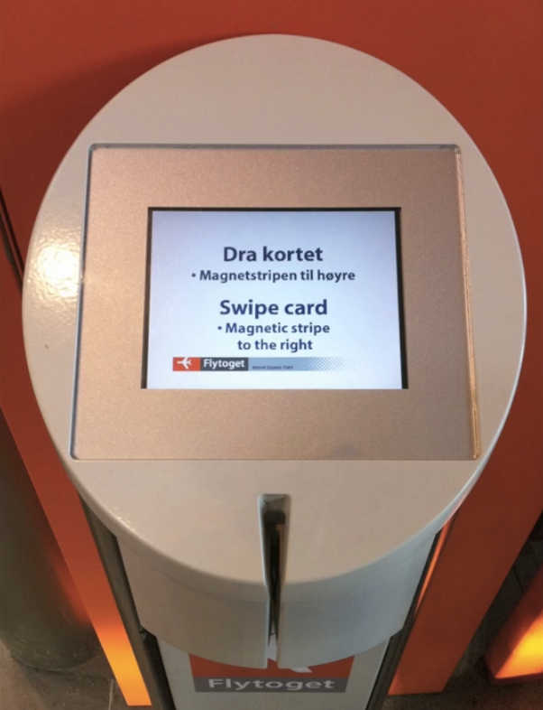

<figure class="float" style="max-width: 12em; position: relative; z-index: 1;">

<figcaption>

Alan Kay [[source]](https://aes2.org/community/technical-council/richard-c-heyser-memorial-lecture-series/details-of-heyser-lectures/memorial-lecture-at-109th-alan-kay-the-computer-revolution-hasnt-happened-yet/)</figcaption>
</figure>

One of my favorite product design principles of all time is Alan Kay’s _“Simple things should be simple, complex things should be possible”_.
^[[Kay himself replied on Quora and provided background on this quote](https://www.quora.com/What-is-the-story-behind-Alan-Kay-s-adage-Simple-things-should-be-simple-complex-things-should-be-possible). Don’t you just love the internet?]
I had been saying it almost verbatim long before I heard of Kay's quote.

Of course, _simple_ refers to use cases that are **simple from the user’s perspective**, i.e. the most common use cases.
They may not be at all simple to implement, and interface simplicity is usually [inversely correlated](#poc) with implementation simplicity.
And which things are _complex_, depends on **product scope** to some degree.
Instagram’s complex cases are vastly different than Photoshop’s complex cases, but as long as there is a range, Kay's principle still applies.

His maxim is deceptively simple, but its implications run deep.
It isn’t just a design ideal — it’s a call to continually balance friction, scope, and tradeoffs in service of the people using our products.

Since [Alan Kay](https://en.wikipedia.org/wiki/Alan_Kay) was a computer scientist, his quote is typically framed as a <abbr title="Programming Language">PL</abbr> or API design principle,
but that sells it short.
It applies to a much, _much_ broader class of interfaces.

I’m not aware of a name for this class, but it seems to have a lot to do with the _distribution of use cases_.
Products often cut scope by figuring out the ~20% of use cases that drives ~80% of usage — aka the [Pareto Principle](https://en.wikipedia.org/wiki/Pareto_principle).
However, there are products with such diverse use cases that the Pareto Principle does not (meaningfully) apply to the product as a whole.
There are certainly common use cases and niche ones, but there is no clean 20% subset that drives 80% of usage — or anything close to it.
**The long tail of niche use cases is so numerous, they are significant in aggregate**.
For lack of a better term, let's call these *long-tail UIs* (but let me know if you’re aware of a better name!).

**Nearly all creative tools are long-tail UIs.**
That’s why it works so well for programming languages and APIs — both are types of creative interfaces.
But so are graphics editors, word processors, spreadsheets, and countless other interfaces that help humans create artifacts — even some you would never describe as creative.

<aside class="note">

Yes, **programming languages and APIs are types of user interfaces**.
If this surprises you, watch my [DotJS 2024 talk titled "API Design is UI Design"](https://www.youtube.com/watch?v=g92XUzc1OHY).
It’s only 20 minutes, but covers a lot of ground, including some of the ideas in this post.

This is also why I try to include both code and GUI examples in my product/usability posts — to drive exactly this point home.
If you only work on GUIs and the code examples don't make sense to you, you can skip them and the post still makes sense.

</aside>

<article class="good example" style="display: flex; flex-flow: row wrap; gap: 1rem; align-items: start">

<!-- No idea why this gets the wrong color with a heading anchor -->
<h4>Example: Google Calendar</h4>

You wouldn't describe Google Calendar as a creative tool, but it _is_ a tool that helps humans create artifacts (calendar events).
It is also a long-tail product:
there is a set of common, conceptually simple cases (one-off events at a specific time and date),
and a long tail of complex use cases (recurring events, guests, multiple calendars, timezones, etc.).

Indeed, Kay’s maxim has clearly been used in its design.
The simple case has been so optimized that you can literally add a one hour calendar event with a single click (using a placeholder title).
A different duration can be set after that first click through dragging
^[Yes, typing can be faster than dragging, but minimizing homing between input devices improves efficiency more, see [KLM](https://en.wikipedia.org/wiki/Keystroke-level_model)].
But almost every possible edge case is also catered to — with additional user effort.

<figure>
  <video src="videos/google-calendar.mp4" muted autoplay loop loading="lazy"></video>
  <figcaption>
    Google Calendar is squarely a long-tail UI.
  </figcaption>
</figure>

Google Calendar is also an example of an interface that digitally encodes real-life,
demonstrating that **complex use cases are not always power user use cases**.
Often, the complexity is driven by life events.
E.g. your taxes may be complex without you being a power user of tax software,
and your family situation may be unusual without you being a power user of every form that asks about it.

</article>

The Pareto Principle is still useful for individual **features**, as they tend to be more narrowly defined.
E.g. there _is_ a set of spreadsheet formulas (actually much smaller than 20%) that drives >80% of formula usage.

While creative tools are the poster child of long-tail UIs,
there are _long-tail components_ in many [transactional](https://medium.com/design-bootcamp/overfitting-and-the-problem-with-use-cases-337d9f4bf4d7) interfaces such as e-commerce or meal delivery (e.g. result filtering & sorting, product personalization interfaces, etc.).

<figure class="width-m">


<figcaption>

Filtering UIs are another big category of long-tail UIs, and they involve so many tradeoffs and tough design decisions you could literally write a book about just them.
Airbnb’s filtering UI here is definitely making an effort to make simple things easy with (personalized! 😍) shortcuts and complex things possible via more granular controls.
</figcaption>
</figure>


## It’s all about the curve { #curve }

Picture a plane with two axes: the horizontal axis being the **complexity** of the desired task (again from the user's perspective, nothing to do with implementation complexity),
and the Y axis the cognitive and/or physical **effort** users need to expend to accomplish their task using a given interface.

Following Kay’s maxim guarantees these two points:
- _Simple things being easy_ guarantees a point on the lower left (low use case complexity → low user effort).
- _Complex things being possible_ guarantees a point _somewhere_ on the far right.
The lower down the better, but higher up is **acceptable**.

<figure class="outlined width-m">
  <object data="images/curve-alankay.svg"></object>
  <figcaption>
    Alan Kay's maxim visualized.
  </figcaption>
</figure>

But even if we get these two points — **what about all the points in between?**
There are a ton of different ways to connect them, and they produce _vastly_ different overall user experiences.
How does your interface fare when it comes to a use case that is only _slightly_ more complex?
Are users yeeted into the deep end of interface complexity (bad), or do they only need to invest a proportional, incremental amount of effort to achieve their goal (good)?

Meet the **complexity-to-effort curve**, the most important usability metric you've never heard of.

<figure class="outlined width-m">
  <object data="images/curve-multiple.svg"></object>
  <figcaption>

  For delightful user experiences, making simple things easy and complex things possible is not enough — the transition between the two should also be smooth.
  </figcaption>
</figure>

You see, **simple use cases are the [spherical cows in space](https://en.wikipedia.org/wiki/Spherical_cow) of product design**.
They work _great_ for prototypes to convince stakeholders, or in marketing demos, but the real world is _messy_.
Most artifacts that users need to create to achieve their real-life goals rarely fit into your "simple" flows completely, no matter how well you’ve done your homework.
They are _mostly_ simple — with a _liiiiitle_ wart here and there.

For a long-tail interface to serve user needs well **in practice**,
we also need to **design the curve, not just its endpoints**.

## User effort as a currency { #currency }

A model with surprising predictive power is to **treat user effort as a currency** that users are spending to buy solutions to their problems.
Nobody likes paying it;
in an ideal world software would read our mind and execute perfectly with zero user effort.
Since we don’t live in such a world, users are typically willing to pay more in effort when they feel their use case warrants it.

Just like regular pricing, actual user experience often depends more on the relationship between cost and expectation (budget) than on the absolute cost itself.
If you pay more than you expected, you feel ripped off.
You may still pay it because you need the product in the moment, but you'll be looking for a better deal in the future.
And if you pay less than you expected, you feel like you got a bargain, with all the delight and loyalty that entails.

## Avoid usability cliffs { #cliffs }

<aside class="pullquote">

> Incremental user effort cost should be proportional to incremental value gained.

</aside>

Suppose you were ordering pizza. You want a simple cheese pizza with ham and mushrooms.
You use the online ordering system, and you notice that adding ham to your pizza triples its price.
We're not talking some kind of fancy ham where the pigs were fed on caviar and bathed in champagne, just a regular run-of-the-mill pizza topping.
You may still order it if you’re starving and no other options are available, but _how does it make you feel?_

It’s not that different when the currency is user effort.
The all too familiar "*But I **just** wanted to _________, why is it so hard?*".

When a slight increase in complexity results in a significant increase in user effort cost, we have a **usability cliff**.
Usability cliffs make users feel resentful, just like the customers of our fictitious pizza shop.


<figure class="width-m">
  <object data="images/curve-cliff.svg"></object>
  <figcaption>

    A usability cliff is when a small increase in use case complexity requires a large increase in user effort.
  </figcaption>
</figure>

Usability cliffs are very common in products that make simple things easy and complex things possible through entirely separate flows with no integration between them:
a super high level one that caters to the most common use case with little or no flexibility,
and a very low-level one that is an escape hatch: it lets users do whatever,
but they have to recreate the solution to the simple use case from scratch before they can tweak it.

<article class="bad example">

<h4>Example: The HTML video element</h4>

Simple things are certainly easy: all we need to get a video with a nice sleek set of controls that work well on every device is a single attribute: `controls`.
We just slap it on our `<video>` element and we’re done with a single line of HTML:

<figure class="multiple" style="align-items: center;">

```html { style="font-size: 150%" }
<video src="videos/cat.mp4" controls></video>
```
➡️

</figure>

Now let’s suppose use case complexity increases _juuuust a little bit_.
Maybe I want to add buttons to jump 10 seconds back or forwards.
Or a language picker for subtitles.
Or just to hide the volume control on a video that has no audio track.
None of these are particularly niche, but the default controls are all-or-nothing: the only way to change them is to reimplement the whole toolbar from scratch, which takes hundreds of lines of code to do well.

Simple things are easy and complex things are possible.
But once use case complexity crosses a certain (low) threshold, user effort abruptly shoots up.
**That's a usability cliff.**

</article>

<article class="bad example">

<h4>Example: Instagram editor</h4>

<video src="videos/instagram.mov" muted autoplay loop loading="lazy" style="height: 15em; max-height: 100cqh; float: inline-end; margin-inline-start: 1em"></video>

For Instagram's photo editor, the simple use case is canned filters, whereas the complex ones are those requiring tweaking through individual low-level controls.
However, they are implemented as separate flows: you can only tweak the _intensity_ of the filter, but you cannot see what primitives it is implemented with and tweak them independently.
You _can_ layer both types of edits on the same image, but they are additive, which doesn’t work well.

Ideally, the two panels would be integrated, so that selecting a filter would adjust the low-level controls accordingly, which would facilitate incremental tweaking
AND would serve as a teaching aid for how filters work.

</article>

<article class="good example">

<h4>Example: Filtering in Coda</h4>

My favorite end-user facing product that gets this right is [Coda](https://coda.io),
a cross between a document editor, a spreadsheet, and a database.
All over its UI, it supports entering formulas instead of raw values, which makes complex things possible.

Then, to make simple things easy, it also provides the usual GUI options you'd expect if there was no formula language at all.
But here’s the twist: **these presets are actually generating formulas behind the scenes that users can then tweak**!
Whenever users need to go a little beyond what the UI provides, they can switch to the formula editor and tweak the generated formula
(which is infinitely easier than writing it from scratch).


<figure>


<figcaption>


Another nice touch: "And" is not just communicating how multiple filters are combined, but is also a control that lets users edit the logic.

</figcaption>

</figure>

Defining high-level abstractions in terms of low-level primitives is a great way to achieve a smooth power-to-effort curve,
as it allows you to expose tweaking at various intermediate levels and scopes.
The downside is that it can sometimes constrain the types of high-level solutions that can be implemented.
Whether the tradeoff is worth it depends on the product and use cases.

</article>


## Maximize signal-to-noise ratio { #signal-to-noise }


If you like eating out, this may be a familiar scenario:

> — I would like the rib-eye please, medium-rare.<br>
> — Thank you sir. How would you like your steak cooked?

<aside class="pullquote" role="presentation">

> Keep user effort close to the minimum necessary to declare _intent_
</aside>

Annoying, right?
And yet, this is how many user interfaces work; expecting users to communicate the same intent multiple times in slightly different ways.

If _incremental value should require incremental user effort_, an obvious corollary is that **things that produce no value should not require user effort**.

Using the model of user effort as a currency, it is easy to see why: who likes paying without getting anything in return?
**Respect user effort.**
Treat it as a scarce resource — just like regular currency — and keep it close to the minimum necessary to declare _intent_.
Do not require users to do work that confers them no benefit, and could have been handled by the UI.
**If it can be derived from other input, it should be derived from other input.**

<figure class="float">


<figcaption>

Source: [NNGroup](https://www.nngroup.com/articles/edit-credit-card/) (adapted).
</figcaption>
</figure>

A once ubiquitous example that is thankfully going away, is the credit card form which asks for the type of credit card in a separate dropdown.
Credit card numbers are designed so that the type of credit card can be determined from the first four digits.
There is zero reason to ask for it separately.
Beyond wasting user effort, duplicating input that can be derived introduces an **unnecessary error condition** that you now need to handle:
what happens when the entered type is not consistent with the entered number?

User actions that meaningfully communicate intent to the interface, are **signal**.
Any other step users need to take to accomplish their goal, is **noise**.
This includes communicating the same input more than once,
providing input separately that could be derived from other input with complete or high certainty,
transforming input from their mental model to the interface's mental model,
and any other demand for user effort that does not serve to communicate new information about the user's goal.

Some noise is unavoidable.
The only way to have 100% signal-to-noise ratio would be if the interface could mind read.
But too much noise increases friction and obfuscates signal.

A short yet demonstrative example is the web platform’s methods for programmatically removing an element from the page.
To signal _intent_ in this case, the user needs to communicate two things:
(a) **what** they want to do (remove an element), and (b) **which element** they want to remove.
Anything beyond that is noise.

The modern [`element.remove()`](https://developer.mozilla.org/en-US/docs/Web/API/Element/remove) DOM method has an extremely high signal-to-noise ratio.
It’s hard to imagine a more concise way to signal intent.
However, the older [`parent.removeChild(child)`](https://developer.mozilla.org/en-US/docs/Web/API/Node/removeChild) method that it replaced had much worse ergonomics.
It required two parameters: the element to remove, and its parent.
But the parent is not a separate source of truth — it would _always_ be the child node’s parent!
As a result, its actual usage involved _boilerplate_, where
developers had to write a much noisier `if (element.parentNode) element.parentNode.removeChild(element)`
^[Yes, today it would have been `element.parentNode?.removeChild(element)`, which is a little less noisy, but this was before the optional chaining operator.].

_Boilerplate_ is repetitive code that users need to include without thought, because it does not actually communicate intent.
It’s the **software version of red tape**: hoops you need to jump through to accomplish your goal, that serve no obvious purpose in furthering said goal except for the fact that they are required.

It may seem small, but this is only because the overall code is small.
The actual difference in signal-to-noise ratio is staggering
^[The exact numbers (81% vs 20% here) vary based on specifics such as variable names,
but when the difference is meaningful, it is so large it transcends such details.].

<figure class="width-m">
  <object data="images/code-signal-to-noise.svg"></object>
  <figcaption>
    The difference in signal-to-noise ratio is staggering: 81% vs 20% in this case.
  </figcaption>
</figure>

Of course, it was usually encapsulated in utility functions, which provided a similar signal-to-noise ratio as the modern method.
However, user-defined abstractions don't come for free, there is an effort (and learnability) tax there too.

Improving signal-to-noise ratio is also why the front-end web industry gravitated towards component architectures: they increase signal-to-noise ratio by encapsulating boilerplate.
As an exercise for the reader, try to calculate the signal-to-noise ratio of a [Bootstrap accordion](https://getbootstrap.com/docs/5.3/components/accordion/#example) (or any other complex Bootstrap component).


## You cannot uncover friction by asking users { #asking-users }

<aside class="pullquote">

> Users are much more vocal about things not being possible, than things being hard.
</aside>

When pointing out friction issues in [design reviews](/consulting/#design-reviews),
I have sometimes heard "_users have not complained about this_".
This reveals a fundamental misunderstanding about the **psychology of user feedback**.

**Users are much more vocal about things not being possible, than about things being hard.**
The reason becomes clear if we look at the neuroscience of each.

In terms of intellectual response, friction is transient.
Once the user accomplishes their goal and moves on to the next task, it no longer occupies working memory (mediated by the prefrontal cortex, responsible for reasoning and planning).
In many cases, friction is _death by a thousand paper cuts_, and the user doesn’t retain each cut consciously at all.
However, [emotions persist for much longer than their initial trigger](https://journals.sagepub.com/doi/abs/10.1037/1089-2680.2.3.271).
The negative emotions the friction created accumulate and erode customer loyalty over time.
Filing a complaint, however, requires prefrontal engagement — which in this case is brief or nonexistent.
Users may not even understand why the software feels unpleasant: the details fade, but the feelings remain.

Hard limitations, on the other hand, persist as conscious appraisals.
The trigger doesn’t go away, since there is no workaround, so it’s far more likely to surface in explicit user feedback.

Both types of pain points cause negative emotions,
but friction is primarily processed by the [limbic system](https://en.wikipedia.org/wiki/Limbic_system) more (emotion),
whereas hard limitations remain in the [prefrontal cortex](https://en.wikipedia.org/wiki/Prefrontal_cortex) (reasoning).
This also means that when users finally do reach the breaking point and complain about friction, you better listen.

<aside class="pullquote">

> Friction is primarily processed by the limbic system, whereas hard limitations remain in the prefrontal cortex
</aside>

Second, **user complaints are filed when there is a mismatch in expectations**.
Things are not possible but the user feels they should be, or interactions cost more user effort than the user had budgeted,
e.g. because they know that a competing product offers the same feature for less (work).
Often, users have been conditioned to expect poor user experiences,
either because _all_ options in the category are high friction, or because the user is too novice to know better
^[When I was running user studies at MIT, I’ve often had users exclaim “I can't believe it! I tried to do the obvious simple thing and it actually worked!”].
So they begrudgingly pay the price, and don’t think they have the right to complain, because it's just how things are.

You might ask, “If all competitors are equally high-friction, how does this hurt us?”
First, you’re not only competing within a category; you’re competing with all alternative solutions — including **nonconsumption** (see [Jobs-to-be-Done](https://hbr.org/2016/09/know-your-customers-jobs-to-be-done)).
Even for retention, **users can defect to a different category altogether** (e.g., building native apps instead of web apps).
**An unmet need is a standing invitation to disruption** that a competitor can exploit at any time.

Historical examples abound.
When it comes to actual currency, a familiar example is **Airbnb**: Until it came along, nobody would complain that a hotel of average price is expensive — it was just the price of hotels.
If you couldn't afford it, you just couldn't afford to travel, period.
But once Airbnb showed there is a cheaper alternative for hotel prices _as a whole_, tons of people jumped ship.

It’s no different when the currency is user effort.
**Stripe** took the payment API market by storm when it demonstrated that payment APIs did not have to be so high friction.
**iPhone** disrupted the smartphone market when it demonstrated that no, you did not have to be highly technical to use a smartphone.
The list goes on.

Unfortunately, friction is hard to instrument.
With good telemetry you can detect specific issues (e.g., dead clicks), but there is no KPI to measure friction as a whole.
And no, [NPS](https://en.wikipedia.org/wiki/Net_promoter_score) isn’t it — [and you’re probably using it wrong anyway](https://jmspool.medium.com/net-promoter-score-considered-harmful-and-what-ux-professionals-can-do-about-it-fe7a132f4430).
Instead, the emotional residue from friction quietly drags *many* metrics down (churn, conversion, task completion), sending teams in circles like [blind men touching an elephant](https://en.wikipedia.org/wiki/Blind_men_and_an_elephant).
That’s why dashboards must be paired with **product vision** and **proactive, [first‑principles](https://www.intercom.com/blog/peeling-back-to-first-principles/) product leadership**.

[Steve Jobs](https://en.wikipedia.org/wiki/Steve_Jobs) exemplified this posture: proactively, aggressively eliminating friction presented as “inevitable.”
He challenged unnecessary choices, delays, and jargon, without waiting for KPIs to grant permission.
_Do mice really need multiple buttons? Does installing software really need multiple steps? Do smartphones really need a stylus?_
Of course, this worked because he had the authority to protect the vision; most orgs need explicit trust to avoid diluting it.

So, if there is no metric for friction, how do you identify it?

1. **Usability testing** lets you actually observe firsthand what things are hard instead of having them filtered through users' memories and expectations.
2. [**Design reviews/audits**](/consulting/#design-reviews) by usability experts is complementary to usability testing, as it often uncovers different issues. Design reviews are also great for maximizing the effectiveness of usability testing by getting the low-hanging fruit issues out of the way before it.
3. **Dogfooding** is unparalleled as a discovery tool — nothing else will identify as many issues as using the product yourself, for your own, real needs.
However, it's important to keep in mind that you’re a huge power user of your own product.
You cannot surface learnability issues ([curse of knowledge](https://en.wikipedia.org/wiki/Curse_of_knowledge)) and you _will_ surface issues no-one else has.
Dogfooding is a fantastic discovery tool, but you still need user research to actually evaluate and prioritize the issues it surfaces.


## User needs come first { #poc }

Reducing friction rarely comes for free, just because someone had a good idea.
These cases do exist, and they are great, but it usually takes sacrifices.
And without it being an organizational priority, it's very hard to steer these tradeoffs in that direction.

The most common tradeoff is implementation complexity.
Simplifying user experience is usually a process of driving complexity inwards and encapsulating it in the implementation.
Explicit, low-level interfaces are far easier to implement, which is why there are so many of them.
Especially as deadlines loom, engineers will often push towards externalizing complexity into the user interface, so that they can ship faster.
And if Product leans more data-driven than data-informed, it's easy to look at customer feedback and conclude that what users need is more features
_([it's not](https://uxdesign.cc/great-products-do-less-things-but-better-5dde0ee3fc76))_.

<article class="example">

<figure style="align-items: end;">


<figcaption>
Simple to use is often at odds with simple to implement.
</figcaption>
</figure>

The first faucet is a _thin abstraction_: it exposes the underlying implementation directly, passing the complexity on to users, who now need to do their own translation of temperature and pressure into amounts of hot and cold water.
It prioritizes implementation simplicity at the expense of wasting user effort.

The second design prioritizes user needs and _abstracts_ the underlying implementation to support the user's mental model.
It provides controls to adjust the water temperature and pressure independently, and internally translates them to the amounts of hot and cold water.
This interface sacrifices some implementation simplicity to minimize user effort.

</article>

This is why I’m skeptical when someone advocates for "simplicity".
Advocating for "simplicity" is a platitude — everyone agrees that all else being equal, simpler is better!
**It’s the tradeoffs between different types of simplicity that are tough.**

In some cases, reducing friction even carries tangible financial risks, which makes leadership buy-in crucial.
This kind of tradeoff cannot be made by individual designers — it requires usability as a priority to trickle down from the top of the org chart.

<article class="example">



The Oslo airport train ticket machine is the epitome of a high signal-to-noise interface.
You simply swipe your credit card to enter and you swipe your card again as you leave the station at your destination.
That's it. No choices to make. No buttons to press. No ticket.
You just swipe your card and you get on the train.
Today this may not seem radical, but back [in 2003, it was groundbreaking](https://flytoget.no/en/about/our-story/).

To be able to provide such a frictionless user experience, they had to make a financial tradeoff:
it does not ask for a PIN code, which means the company would need to simply absorb the financial losses from fraudulent charges (stolen credit cards, etc.).


</article>

When user needs are prioritized at the top, it helps to cement that priority as an **organizational design principle** to point to when these tradeoffs come along in the day-to-day.
Having a design principle in place will not instantly resolve all conflict, but it helps turn conflict about priorities
into conflict about whether an exception is warranted, or whether the principle is applied correctly, both of which are generally easier to resolve.
Of course, for that to work everyone needs to be on board with the principle.
But here's the thing with design principles (and most principles in general): they often seem obvious in the abstract, so it's easy to get alignment in the abstract.
It’s when the abstract becomes concrete that it gets tough.

The Web Platform has its own version of this principle, which is called [Priority of Constituencies](https://www.w3.org/TR/design-principles/#priority-of-constituencies):

> "User needs come before the needs of web page authors, which come before the needs of user agent implementors, which come before the needs of specification writers, which come before theoretical purity."

This highlights another key distinction.

### Consumers over Producers

It’s not about prioritizing user needs over developer needs, it's about prioritizing **consumer needs over producer needs**.
Developers are just one type of producer.

- Consumers are typically more numerous than producers, so this **minimizes collective pain**.
- Producers are typically more **advanced**, and can handle more complexity than consumers. I've heard this principle worded as "_Put the pain on those who can bear it_", which emphasizes this aspect.
- Producers are typically more **invested**, and less likely to leave

The web platform has multiple tiers of producers:
- **Specification writers** are at the bottom of the hierarchy, and thus, can handle the most pain (_ow!_ 🥴)
- **Browser developers** ("_user agent implementors_" in the principle) are consumers when it comes to specifications, but producers when it comes to the web platform
- **Web developers** are consumers when it comes to the web platform, but producers when it comes to their own websites

Even within the same tier there are producer vs consumer dynamics.
When it comes to web development libraries, the web developers who write them are producers and the web developers who use them are consumers.

This distinction also comes up in extensible software, where plugin authors are still consumers when it comes to the software itself,
but producers when it comes to their own plugins.
It also comes up in [dual sided marketplace products](https://en.wikipedia.org/wiki/Two-sided_market)
(e.g. Airbnb, Uber, etc.),
where buyer needs are generally higher priority than seller needs.

## Life by a thousand ✨ sprinkles of delight ✨ { #sprinkles-of-delight }

In the economy of user effort, the antithesis of overpriced interfaces that make users feel ripped off
are those where **every bit of user effort required feels meaningful** and produces **tangible value** to them.
The interface is on the user's side, gently helping them along with every step, instead of treating their time and energy as disposable.
The user feels like they’re getting a **bargain**: they get to spend _less_ than they had budgeted for!
And we all know how motivating a good bargain is.

User effort bargains don't have to be radical innovations;
don't underestimate the power of small touches.
A zip code input that auto-fills city and state,
a web component that automatically adapts to its context without additional configuration,
a pasted link that automatically defaults to the website title (or the selected text, if any),
a freeform date that is correctly parsed into structured data,
a login UI that remembers whether you have an account and which service you've used to log in before,
an authentication flow that takes you back to the page you were on before.
Sometimes many small things can collectively make a big difference.
In some ways, it's the polar opposite of _death by a thousand paper cuts_:
**Life by a thousand sprinkles of delight!** 😀

## Conclusion

In the end, “_simple things simple, complex things possible_” is table stakes.
The key differentiator is the [shape of the curve](#curve) between those points.
Products win when uer effort scales smoothly with use case complexity, [cliffs](#cliffs) are engineered out, and [every interaction declares a meaningful piece of user intent](#signal-to-noise).
That doesn't just happen by itself.
It involves hard tradeoffs, saying no a lot, and [prioritizing user needs at the organizational level](#poc).
Treating user effort like real money, forces you to design with restraint.
A rule of thumb is place the pain where it’s best absorbed by prioritizing [consumers over producers](#consumers-over-producers).
Do this consistently, and the interface feels **delightful** in a way that sticks.
Delight turns into trust.
Trust into loyalty.
Loyalty into product-market fit.
