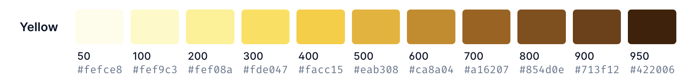

<div class=nutshell>

CSS Variable Groups is a way to define multiple properties under the same namespace and pass the entire group around,
addressing several pain points around design tokens, design systems, and integrating third-party components.

</div>

## Pain points

### Background

Design tokens and design systems are about a lot more than color, but I’ll focus on color here, as that is the worst of it and also easier to explain.

The color part of most design systems consists of the following:
- Core hues: red, yellow, green, blue, etc. These are hues specifically picked by designers, not to be confused with the corresponding named colors.
- Neutrals / Grays (often more than one)

Each of the above is typically defined as a main color plus tints/shades under a number, with larger numbers corresponding to darker colors.
There is no commonly agreed naming convention wrt the numbering scheme used.

Some popular examples of such design systems:

| Design system | Hues | Neutrals | Levels | Range | Increment | Extras |
|--------|--------|--------|--------|--------|--------|--------|
[Open color](https://yeun.github.io/open-color/) | 12 | 1 | 10 | 0 - 9 | 1 |
[Open props](https://open-props.style/#colors) | 17 | 2 | 13 | 0 - 12 | 1 |
[Tailwind](https://tailwindcss.com/docs/customizing-colors) | 17 | 5 | 11 | 50 - 950 | 100 | 50, 950
[Material](https://m2.material.io/design/color/the-color-system.html#color-theme-creation) | 17 | 2 | 10 | 50-900 | 100 | 50 |
[Adobe Spectrum](https://spectrum.adobe.com/page/color-palette/) | 13 | 1 | 13 | 100 - 1300 | 100 | Gray 50, Gray 75 |
[GitHub Primer](https://primer.style/foundations/color/base-scales) | 8 | 1 | 10 | 0 - 9  | 1 | |
[Ant Design](https://ant.design/docs/spec/colors) | 12 | 1 | 10 (13 for grays) | 1 - 10 | 1 | |
[IBM Design Language](https://www.ibm.com/design/language/color/) | 7 | 3 | 10 | 10 - 100 | 10 | |
[Radix UI](https://www.radix-ui.com/themes/docs/theme/color) | 25 | 6 | 12 | 1 - 12 | 1 | |

In terms of CSS variables, this translates to variables like e.g. `--color-red-600`, `--color-gray-10` etc on `:root`. A LOT of them.

### Summary of pain points & requirements

Distilling these pain points into their essence, it looks like the actual pain points are:
1. **Aliasing**: Aliasing a set of variables with a common prefix to a different prefix is very commonly needed, and requires *a lot* of CSS.
Even when using a build tool to automate this, the size of the resulting CSS is huge, and it is hard to debug as it clogs up the devtools.
2. Defining these tokens requires manually defining every single one, even when it could be computed via interpolation.
3. Getting arbitrary tokens (e.g. through a calculation) is impossible.

Any solution would need to meet the following requirements:
1. Subtree scoped: It needs to be possible to alias a set of variables to a different prefix on a subtree, so `@property` and any new tree-scoped @-rules are out.
2. Pave the cowpaths: Assuming a web app involves three classes of users (page authors, design system authors, web component authors)
the syntax should not require opt-in from all parties at once.
Individual classes of users should be able to derive value without all other parties having to change anything.
3. It should not require more than one declaration to style a single design aspect (e.g. the primary color) of a subtree or web component.

#### Biggest pain point: Aliasing

Then, to be used in the UI, the colors are also assigned *semantic* meaning: brand color, primary (or accent) color, secondary color, success, danger, etc. Pure hues can still be used directly for certain cases.

Assigning e.g.
```css
--color-primary: var(--color-blue);
```

Does *not* also automatically give you `--color-primary-10`, `--color-primary-20` and so on. **You have to painfully define them yourself**:

```css
--color-primary-10: var(--color-blue-10);
--color-primary-20: var(--color-blue-20);
/* ... */
--color-primary-100: var(--color-blue-100);
```

And this is for *all* your semantic colors. We’re talking about *a lot* of variable declarations.
And often specific tints are aliased further, e.g. text, border, background etc.
Often, all of this must be repeated for dark mode, high contrast mode, etc.

But let’s assume we dutifully do all this. Now let’s suppose we want to theme a certain part of the page with a different primary color.  E.g. maybe we have callouts and we want to style notes (with shades of) green, tips yellow, warnings red, etc. We *could* have a `--color` or `--color-primary` property for the callout component, but that does not give us any of its variations, no, we need to define those manually *again*.

This also means that integrating third-party components is painful, because every single color variation they may need needs to be passed on individually. Most components [bundle an entire design system](https://shoelace.style/tokens/color#primitives) and authors are expected to override every single property to integrate it with their own.

Note that this applies regardless of whether the tints and shades are precomputed (as is the case with most design systems today) or dynamically computed from color manipulation functions (our bright future?).

This is also a problem when adopting external libraries and design systems.
Currently, most libaries, design systems, icon libraries etc. have to use lengthy namespacing to avoid conflicts.
E.g. [Adobe Spectrum](https://spectrum.adobe.com/page/color-palette/) prefixes each color with `--spectrum-global-color-` (e.g. `--spectrum-global-color-celery-100`).
They also often use color names that the author may want to remap to simpler names.
The effort needed for an author to remap all of these to more reasonable names is non-trivial (Radix UI even has [a section on this](https://www.radix-ui.com/themes/docs/theme/color#aliasing-colors) — note that this is *just* for one color!).

#### Pain point 2: Repetitiveness and verbosity

First, it is important to note that aesthetically pleasing color palettes are not completely perceptually uniform.
Chroma and hue often get skewed as you move towards the lightness edges, and they are skewed in different ways depending on the hue.
As the most obvious example, look at how yellows become orange as they darken in both of these but even more so in OC:

<figure>

<figcaption>Tailwind’s yellow palette</figcaption>
</figure>

<figure>

<figcaption>Open Color’s yellow palette</figcaption>
</figure>


*That said*, while we could not generate all tints through interpolation,
interpolation could approximate at least *some of them*.
But right now, the best we can do is something like this:

```css
--color-green-200: color-mix(in oklch, var(--color-green-100) 20%, var(--color-green-500));
--color-green-300: color-mix(in oklch, var(--color-green-100) 40%, var(--color-green-500));
/* ... */
```

Now suppose we don't like the interpolated `--color-green-300` and want to tweak it.
We’d *also* need to tweak `--color-green-200` if we want it to use that!

#### Pain point 3: Cannot reference tokens programmatically

Since these are variables and variable names cannot be composed dynamically,
there is no way to transform a number (e.g. `200`) or a keyword (e.g. `red`) to a color token,
which could have allowed components to abstract away the specifics of the design system.

## The Proposal: CSS Variable Groups { #proposal }

The underlying pain point here is that authors need to be able to map *a set* of CSS variables to a different name, reactively.
What if we allowed them to do _just that_?

### Defining and using a variable group { #defining-using }

This proposal allows authors to define groups of variables with the same prefix, by using braces
and then pass the whole group around to other variables:

```css
--color-green: {
	100: oklch(95% 13% 135);
	200: oklch(95% 15% 135);
	/* ... */
	900: oklch(25% 20% 135);
};
```

Then this is equivalent to creating `--color-green-100`, `--color-green-200`, etc. variables.
But with one difference. When doing:

```css
--color-primary: var(--color-green);
```

This is passing a structured object behind the scenes so you *automatically* get `--color-primary-100`, `--color-primary-200` etc.

This allows patterns like:

```css
/* Author CSS */
:root {
	--color-green: {
		100: oklch(95% 13% 135);
		200: oklch(95% 15% 135);
		/* ... */
		900: oklch(25% 20% 135);
	};
}

some-component,
.callout-note {
	--color-primary: var(--color-green);
}

.callout-note {
	background: var(--color-primary-200);
}

/* some-component.css */
:host {
	background: var(--color-primary-100);
	border: var(--color-primary-400);
	color: var(--color-primary-900);
}
```

<div class="note">

We may need to start with a hyphen (or two), because [the `<ident>` production does not allow starting with a number](https://drafts.csswg.org/css-syntax/#ident-token-diagram):
```css
--color-green: {
	-100: oklch(...);
	-200: oklch(...);
	/* ... */
}
```

But in the rest of this I’m gonna assume that Tab can come up with some ingenious solution to allow us to have the nicer syntax. 🙂
OTOH if these have a prefix, it means there are no naming conflicts with any predefined ones (`base`, `default`, etc.)
</div>

<div class=note>

Do we need a way to reference internal properties without having to use their full name (akin to JS `this`)?
</div>

The group inherits like a regular value, though if descendants define e.g. `--color-green-200`,
that would override the group value for that particular key.

#### Defining or overriding tints _outside_ the group

Note that once a variable is defined a group, ANY variable with that prefix on the same element becomes part of the group and is passed around or inherited down.
This means that this should work:

```css
:root {
	--color-green: {
		100: oklch(95% 13% 135);
		900: oklch(25% 20% 135);
	}
}

html {
	--color-green-200: oklch(95% 15% 135);
}

my-component {
	--color-primary: var(--color-green);
	background: var(--color-primary-200);
}
```

Or even this:

```css
/* style.css */
:root {
	--color-green: {};
}

my-component {
	--color-primary: var(--color-green);
	background: var(--color-primary-200);
}

/* design-system.css */
:root {
	--color-green-100: oklch(95% 13% 135);
	--color-green-200: oklch(95% 15% 135);
	/* ... */
	--color-green-900: oklch(25% 20% 135);
}
```

Which provides a way to "upgrade" existing design systems to using this new syntax without any changes to their code.

### Using groups on non-custom properties: The `base` property

When referencing a variable whose value is a group (e.g. `var(--color-green)` above) on a non-custom property,
by default it would either IACVT or resolve to `<empty-token>` (not sure which one is best here).

However, you can set a base value via the special `base` property (alternative names: `default`, `value`) which defines a plain value for when the property is used in a context that does not support groups, such as any of the existing non-custom properties:

```css
--color-green: {
	base: oklch(65% 50% 135);
	100: oklch(95% 13% 135);
	200: oklch(95% 15% 135);
	/* ... */
	900: oklch(25% 20% 135);
};

.note {
	/* Same as border: 1px solid oklch(65% 50% 135)); */
	border: 1px solid var(--color-green);
}
```

<aside>
In the future we may want to introduce native properties that accept groups.
Another possibility is to allow groups to be used as a shorthand’s whole value.
</aside>

### Nested variable groups

Variable groups can be infinitely nested, which allows a single variable to hold an entire color palette:

```css
--color: {
	green: {
		base: oklch(65% 50% 135);
		100: oklch(95% 13% 135);
		200: oklch(95% 15% 135);
		/* ... */
		900: oklch(25% 20% 135);
	};
	red: {
		base: oklch(55% 55% 30);
		100: oklch(95% 13% 30)
	}
}
```

This color palette could be passed on to a component in one go:

```css
--component-palette: var(--color);
```

The values are not limited to colors and the keys are not limited to numbers:

```css
--font: {
	serif: Vollkorn;
	sans: Inter;
	mono: Inconsolata;
};
```

In fact, together with nesting, one could imagine passing *entire* design systems around with a single variable reference!

```css
/* primer.css */
--primer: {
	color: {
		/* ... */
	},
	font: {
		/* ... */
	},
	/* ... */
};

/* author css */
--design: var(--primer);
```

With compatible naming schemes, authors could even compose their design system by mixing and matching from existing design systems.
E.g. using the Primer design system, with the Open Color color palette:

```css
/* primer.css */
--primer: {
	color: {/* ... */};
	font: {/* ... */};
	size: {/* ... */};
	/* ... */
}

/* open-color.css */
--oc: {
	red: { /* ... */ }
}

/* author css */
--design: var(--primer);
--design-color: var(--oc);
```

<div class=note>

Note that as currently defined, the pattern above would *override* Primer’s colors with Open Color’s,
so `--primer-color` would *also* resolve to `var(--oc)`.
To avoid this, authors could alias each top-level group separately:

```css
--design: {
	color: var(--oc);
	font: var(--primer-font);
	size: var(--primer-size);
	/* ... */
}
```
</div>

### Tweaking the default value without destroying the group

To minimize surprise, things like this:

```css
/* Make core green a little yellower */
--color-green: oklch(65% 50% 130);
```

Would need to override the whole variable value, meaning `--color-green-100` is now undefined (`initial`).
This is also consistent with how shorthands work.
Also, if we kept the subproperties intact when overriding the base color, they would get out of sync, which is worse.

But this begs the question: then how do we override *just* the default value?
For example, to tweak the base color and maintain dynamic tints generated from it.

One way would be to expose special properties like `base` like regular custom properties that can be overridden. Then you could just do that:

```css
/* Make core green a little yellower */
--color-green-base: oklch(65% 50% 130);
```

And as a bonus, this facilitates debugging, and allows customizing more than just the default value.

## Facilitating continuous variations { #continuous }

So far, this proposal has been about facilitating the use of predefined static tokens.
But what if we could support *dynamic* variations, where only a few key values are defined, and the rest are interpolated within them?

<div class=note>
This is the least fleshed out part of this proposal, but I think it could be a very powerful feature (possibly not MVP though).
</div>

### The `default` property

I’m thinking of a `default` special property (other potential names: `any`, `other`, `else`, `*` (if possible)), that would be a catch-all for any undefined value.
The key would be passed to the expression as a predefined keyword (e.g. `arg`), but that can be customized.

```css
--color-green: {
	base: oklch(65% 50% 135);
	100: oklch(95% 13% 135);
	default: color-mix(in oklch, var(--color-green-100) calc((100 - arg / 10) * 1%), var(--color-green-900));
	900: oklch(25% 20% 135);
};
```

It could even be a shorthand, with `default-value` and `default-type` to specify the return type.

Customizing the arg name (both for readabiity and to facilitate nested use cases):

```css
--color-green: {
	base: oklch(...);
	100: oklch();
	name: tint;
	default: color-mix(in oklch, var(--color-green-100) calc((100 - tint / 10) * 1%), var(--color-green-900));
	900: oklch();
};
```

### Piecewise interpolation

The previous example always calculates mid points from the ends of the spectrum. However, it would serve use cases far better to be able to set spot colors to course correct and have the intermediate tints compute from them, similar to how gradient color stops work.

Perhaps numerical keys could be auto-detected and the closest min and max keys and values could be made available to the expression as keywords.
Potential names: `min` and `max` for values, `min-key`, `max-key` for the keys.
Example (see [`progress()`](https://drafts.csswg.org/css-values-5/#progress-func)):

```css
--color-green: {
	base: oklch(...);
	100: oklch();
	default: color-mix(in oklch, min calc(progress(arg from min-key to max-key) * 100%), max);
	900: oklch();
};
```

These would only be available when `arg` is numerical AND there are other numerical keys defined.
There could be a max without a min and vice versa if only larger or only smaller numerical keys are available.

It could even be specified with *just* `default`:

```css
--gray: {
	default: color-mix(in oklab, white calc(1% * arg), black);
}
```

### Issues

One issue is that while defining tokens via interpolation can be convenient, design system authors often do not want to expose the entire spectrum,
but only a few carefully chosen tokens.
So even if we allow the token values to be specified via a formula, we may need to introduce a way to optionally limit the keys that are exposed.
Potential solutions:
- A `default-keys` property (potentially a shorthand) that defines the min/max/step for the keys that are exposed.
- A way to list specific keys, rather than a catch-all `default`

## Getting group properties dynamically { #functional-syntax }

Currently, we can only access properties via static offsets, even when dynamic variations are allowed.
If we automatically exposed a functional syntax for every group, we could select the right token on the fly, possibly as a result of calculations.
Nested groups would simply involve more than one argument.

This would also allow mapping design tokens to a different naming scheme and reducing verbosity.
E.g. suppose we have `--spectrum-global-color-celery-100` to `--spectrum-global-color-celery-1300` and we want to map them to `--color-green-1` to `--color-green-13`,
i.e. not just a different prefix, but also a different scale:

```css
/* Turn Spectrum colors into a group */
--spectrum-global-color: {};
--spectrum-global-color-celery: {};

--color-green: {
	default: --spectrum-global-color-celery(calc(arg / 100));
}
```

One downside to simply making these functions is that they could potentially clash with custom functions.
Roma Komarov [proposed](https://github.com/w3c/csswg-drafts/issues/9992#issuecomment-1962321439) a separate `get()` function that would take the prefix as its first argument.
I quite like this, and it means it can ship separately, as it can be based on property naming, not groups.
This also means it does not require converting anything into groups.
So the example above would be way simpler:

```css
--color-green: {
	default: get(--spectrum-global-color-celery, calc(arg / 100));
}
```


## Alternative decomposed design { #decomposed-alternative }

We could decouple this into three separate features.
This is likely easier to implement as a whole, but also these features can ship independently and add value on their own.
However, it also makes it less ambitious, as it becomes harder to add some of the more advanced features (e.g. continuous variations).

### A function to map CSS variables with a common prefix to a different prefix

A `var()`-like function (e.g. `vars()`, `group()`) for mapping many variables with a common prefix to a different prefix.
```css
--color-primary: group(--color-green);
```

Maybe even `var()` itself, where we’d distinguish between the two because the var reference would include an asterisk:
```css
--color-primary: var(--color-green-*);
```

The downside of this is that it’s unclear whether that also sets `--color-primary` to `var(--color-green)`.
Perhaps we should give up on base values and do:

```css
--color-primary: var(--color-green);
--color-primary-*: var(--color-green-*);
```

That is certainly more explicit, at the cost of verbosity and potential for error.

### A nesting syntax for setting multiple variables with the same prefix at once

This would look just like the one above, but instead of specifying a group, it is just syntactic sugar for setting many variables at once.

### Continuous variations?

If nesting is merely syntactic sugar, that definitely makes it harder to add continuous variations as a feature.
It would need to be a separate feature that does not depend on nesting.

Perhaps something like this could work:

```css
--color-green-*: color-mix(in oklch, var(--color-green-100) calc((100 - arg / 10) * 1%), var(--color-green-900));
```

or:

```css
--color-green-[tint]: color-mix(in oklch, var(--color-green-100) calc((100 - tint / 10) * 1%), var(--color-green-900));
```

It is unclear whether these are possible syntax-wise, since we had to introduce a bunch of restrictions to future syntax to make `&`-less nesting work.

## Other ideas explored { #other-ideas }

Some of the following may be useful in their own right, but I don’t think solve the pain points equally well.

### Custom Functions

At first glance it appears that [custom functions](https://github.com/w3c/csswg-drafts/issues/9350) can solve all of these issues.
Instead of defining tokens like `--color-red-200` authors would instead be defining `--color-red(200)`.

There are several issues with this approach.
1. Aliasing becomes extremely heavyweight as it requires a whole new function:
```css
@function --color-red(--tint: 40) {
	/* ... */
}

@function --color-primary(--tint: 40) {
	result: --color-red(var(--tint));
}
```
2. Which part is variable is part of the syntax, so e.g. in the example above, there is no clear path to defining a `--color()` function from that.
2. There is no way to pass a few key colors to a component or subtree and have the rest be computed from them.
In fact, we cannot pass functions around at all, only the result of their invocation.
2. Functions are global, whereas things like "primary color" often need to be scoped to a subtree.
2. The fallback story is unclear (see [#9990](https://github.com/w3c/csswg-drafts/issues/9990))
3. This approach works far better for tints that are generated as samples on a continuous axis.
It is unclear how a set of predefined tints would look like as something like that.
4. The migration path from existing design systems is rocky, whereas nested groups paves the cowpaths by allowing the same syntax to continue to be used and even provides a way to convert *existing* tokens to a group (and potentially [allowing a functional syntax *as well*](#functional-syntax)).
5. This only allows a single level, so entire palettes or design systems cannot be passed around unless the entire design system is encapsulated in a single function.

### Handle tints and shades in CSS …automagically? { #tint-shade }

This idea involves trying to eliminate the need for precomputed variations by simply doing it in CSS. E.g. `color-tint(var(--color-yellow) 30%)`.
While these functions would be useful in their own right, it is incredibly difficult (and likely impossible) to design something that would completely remove the need for custom designer intervention due to the [lack of uniformity in the current manual palettes]().

### Make design systems a first-class citizen { #design-systems-syntax }

This would involve standardizing a dedicated syntax and naming scheme (for the low level common denominator things — tints, hues, fonts, etc.) for design tokens,
and providing authors with a whole different syntax for passing design tokens around.
In some ways a bit like `accent-color` on steroids.

There is certainly some value in such an endeavor:
- Something like this would work *wonders* for making it easier to integrate web components into a page without having to tweak a ton of knobs (since even with variable groups, the component needs to be aware of the naming scheme used for the variations)
- Similarly, authors could experiment with different themes without having to tweak anything in their own CSS or page.
- They would be visible everywhere, even in non tree-abiding pseudo-elements and `@-rules` (but we could solve that in a much simpler way, e.g. via a `@document` or `::document` rule).

However, this would be a far bigger undertaking and the Impact / Effort does not seem favorable.
It is unclear if there is any advantage other than standardizing names (which could simply be "standardized" by convention).
Variables get you a lot out of the box, that with this would need to redefine.
E.g. it would be very important to pass design tokens to SVGs, but [SVG params](https://tabatkins.github.io/specs/svg-params/) are designed around variables.

It is also unclear if baking a naming scheme into CSS, even just for the lowest common denominator things, is feasible, given the amount of variation out there.

------

I ran this by a couple design systems folks I know, and the response so far has been overwhelmingly "I NEED THIS YESTERDAY".
While I’m pretty sure the design can use a lot of refinement (especially around continuous values) and I have not yet checked with implementors about feasibility, I’m really hoping we can prioritize solving this problem.

Note that beyond design systems, this would also address many (most?) of the use cases around maps that keep coming up (don't have time to track them down right now, but maybe someone else can).