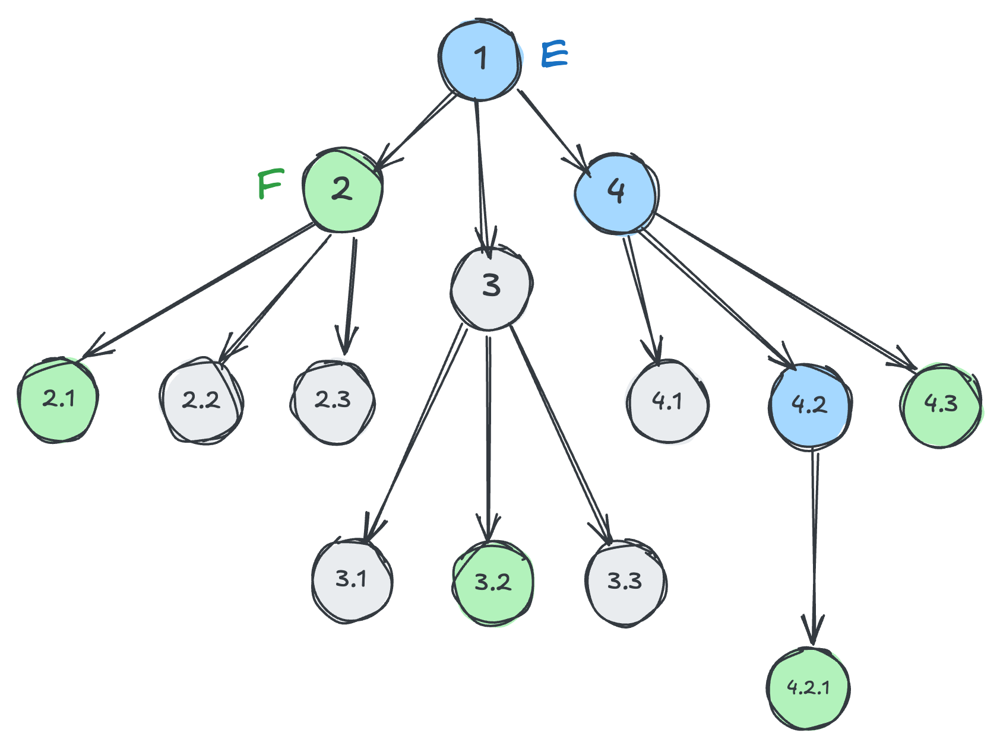

Prior art:
- This came out of the discussion in https://github.com/whatwg/html/issues/10143 though use cases extend beyond it
- Originally, I filed #12453 thinking that a selector that is the inverse of a descendant combinator would suffice, but as @tabatkins correctly pointed out that often selects more elements than you intend, as the matching includes all ancestors.
- There is also #4940 from 2020 for the descendant version of this
- And before that, https://lists.w3.org/Archives/Public/www-style/2015Mar/0298.html from 2015

There are many use cases in CSS where the child/adjacent sibling combinators are too strict, yet the descendant/general sibling combinators are too greedy and essentially, one needs a middle ground: something that extends beyond immediate children/siblings, but **only until it finds a match in each direction**.

Instead of "lazy" we can also call them "proximity combinators" or "closest combinators".

This includes:
1. Lazy descendant: Find a descendant that matches a given selector, but no descendants of that (lazy descendant)
2. Lazy ancestor: Find the closest ancestor that matches a given selector, but no ancestors of that (lazy `:has(* &)`, backwards lazy descendant)
3. Lazy subsequent sibling: Find a next sibling that matches a given selector, but no siblings after that (lazy `~`)
4. Lazy preceding sibling: Find a previous sibling that matches a given selector but no siblings before that (lazy backwards `~`)

Note that for each of these, the matched result is a strict superset of the corresponding strict combinator and a strict subset of the corresponding lazy combinator. E.g. for lazy descendant, if child (`>`) matches, that's what you get. For lazy next sibling, if `+` matches, that's what you get.

We should also disentangle this proposal from #12453. If we decide we don't want to have backwards combinators, we could _only_ do lazy descendant and lazy subsequent sibling, and people can always use `:has()` to invert them. Though the biggest use case is getting  the closest ancestor, which would be a backwards combinator.

Per #12451, we could give them readable names, E.g. lazy ancestor could be `/closest/`, though things like `/preceding-sibling/` or `/subsequent-sibling/` seem excessively long (and reminiscent of XPath — yikes). So it's plausible we may want to give these ASCII art names to connect them with their greedy or strict counterparts:
- Lazy descendant could be `>>`. This also lends itself nicely to the ancestor version: `<<`
- Lazy subsequent sibling could be `~~` or `++`. `++` lends itself nicely to the preceding sibling version: `--`.

So, I’ll use `>>`, `<<`, `++`, `--` for the rest of this, but the syntax is TBD.

> [!NOTE]
> TBD: if the first operand in `E >> F` also matches `F`, is it included in the matched set? XPath had a "descendant or self" combinator which is sorely missing from CSS. But perhaps it’s best not to conflate the two concepts. OTOH, that’s how JS's `element.closest()` works.
> We could also make `<<` behave this way but not `>>`, though breaking their inverse relationship could cause confusion.

Everything below applies to siblings as well.

### How does it work the _lazy descendant_ work and how does it differ from the child and descendant combinators?

Think of it that way: Selectors are a string representation of a set of elements, and combinators are just infix operators on sets of elements.
Just like `1 + 2 + 3` adds `1 + 2`, produces `3` and then does `3 + 3` to get `6`, conceptually, a combinator `E /foo/ F` computes the set of elements matched by `E`, applies a transformation to each (defined by `/foo/`), produces a union of the results, then filters it by `F`.

In JS parlance, `E /foo/ F` would look like (assume `foo(element)` applies the transformation):

```js
document.querySelectorAll(E).flatMap(foo).filter(e => e.matches(F)
```

Given no operator precedence, combinators are applied left to right (right to left produces the same result, just requires a different conceptual model, as [explained by @tabatkins](https://github.com/w3c/csswg-drafts/issues/12453#issuecomment-3046915842)).

> [!NOTE]
> This is a useful mental model, not how UAs actually implement selector matching (which is right to left). However, as @tabatkins explained [here]() that simply changes the transformation, but the core logic is still the same.

With that mental model:
- The child combinator (`E > F`) matches `E`, gets all children of each matched element, then filters by `F`.
- The descendant combinator (`E F`) matches `E`, gets all its descendants, then filters by `F`
- In the lazy descendant combinator, the transformation and filtering are integrated, as matching in each direction _stops_ when a match is found.
	- A less efficient way to implement it could be to do `E F` and then filter out any elements that are descendants of other elements in the set. This is how authors have to do it today, but it's very easy to do it incorrectly and introduce subtle bugs (see below).

Here is a visual example:

<figure>



<figcaption>

Blue nodes match `E` and green nodes match `F`.
</figcaption>
</figure>

| Selector | Matched elements |
|----------|------------------|
| `E > F` | 2 |
| `E F` | 2, **2.1**, 3.2, 4.2.1, 4.3 |
| `E >> F` | 2, 3.2, 4.2.1, 4.3 |
| `F << E` or `E:has(F >> E)` | 1, 4.2 |
| `E:has(F)` | 1, 4, 4.2 |
| `E:has(> F)` | 4.2 |

Another reason to add them is that even for cases where the greedy versions suffice, **lazy combinators _could_ be implemented to be more performant**.

## Use cases

- DOM methods that take selectors `querySelector()`, `querySelectorAll()`, `matches()`, `closest()` etc (and all abstractions that use them)
- HTML attributes that take selectors

<div class="callout todo">

Populate this with use cases as I find them.
</div>

## Alternatives

### Embed filtering selector in the combinator

Lazy combinators do introduce something unprecedented in how CSS combinators work: The transformation and the filtering step are integrated.
Until now, `E /foo/ F` was three steps:
1. Match `E`
2. Apply the transformation `foo` to each matched element
3. Filter the results by `F`

With lazy combinators, 2 and 3 need to be done together, which has no precedent in CSS and may turn out to be not implementable.
We have seen how they _could_ be implemented as syntactic sugar, so perhaps that could be a way forwards, but then we lose any performance benefits.
Another option could be to make the filtering selector part of combinator, e.g. `E /closest-descendant(F)/ *`.
I’m hoping we don't have to resort to this.
Beyond its excessive verbosity, we've seen how authors find it very confusing when they have to stuff selectors in places where they don't belong (see `:nth-child(1 of E)`; authors are puzzled why they can't just have `E:nth-match(1)`).
Worst case, perhaps we could have both, and define `E >> F` as sugar over `E /closest-descendant(F)/ *`.

## FAQ

### Isn’t this basically what `@scope` does?

There are some similarities between `@scope` and lazy descendants, but they have different purposes and do different things.

Lazy combinators have several benefits over `@scope`:
- Flexibility
- Do not affect the matching scope
- Portability
- Clarity

More details below.

#### Flexibility

`@scope` only covers ancestor/descendant relationships.
**There is no such thing as sibling scope.**

Additionally, `@scope` is more limited: you define the root of the matching, an optional descendant selector to exclude, and that’s about it.
However, selectors can have any number of combinators, anywhere in the selector.

#### Do not affect the matching scope

`@scope` defines two things: the anchor for relative selectors, and the scope for matched elements.
There are many use cases where you want these to be separate, such as the HTML attribute use cases, where you want to restrict matched elements to be within a certain element,
but also match relative selectors against the element itself, not its scoping root.

#### Portability

`@scope` is a CSS syntactic construct, not a selector.
There are many contexts that accept CSS selectors, but not general CSS syntax:
- DOM methods: `querySelector()`, `querySelectorAll()`, `matches()`, `closest()` etc (and all abstractions that use them)
- HTML attributes if something around https://github.com/whatwg/html/issues/10143 comes to pass

One way to think about it is that `@scope` is a meta-selector, that affects how _other_ selectors match.
Let’s draw a parallel with regular expressions.
Regular expressions have flags, which change how regexp matching works (e.g. `i` for case-insensitive matching).
There is still value in regexp **syntax** to do the same thing for a part of the regular expression, which is why we have [regexp modifiers](https://developer.mozilla.org/en-US/docs/Web/JavaScript/Reference/Regular_expressions/Modifier).

Even within CSS, for many use cases, a selector syntax is a more lightweight solution than `@scope`.
`@scope` is still useful due to its effects on the cascade and how it's the only way to write CSS selectors that are DOM-aware.
But many use cases don't need that.

#### Predictability

Because `@scope` is a syntactic construct, authors expect more out of it than it can provide.
For example, something that often trips up authors is that inherited properties still inherit outside the donut scope.
There is no such confusion with selectors. Authors know what to expect from them.

## Isn't this already possible via `.e .f:not(.f .f)`?

_(This was brought up by @SelenIT in https://github.com/w3c/csswg-drafts/issues/4940#issuecomment-611903372)_

Not in the general case. Consider this:

```html
<div id=e1 class=f>
	<div id=e2 class=e>
		<div id=e3 class=f></div>
		<div id=e4 class=f>
			<div id=e5 class=f></div>
		</div>
	</div>
</div>
```

`#e2 >> .f` would give us `#e3`, which is what we expected. However, `#e2 .f:not(.f .f)` would give us **no** elements because `#e3` _does_ match `.f .f`.

`#e2 .f:not(#e2 .f .f)` would work, but not in the general case: `.e .f:not(.e .f .f)` could still fail if there was another ancestor `.e` around the whole thing.

This highlights _exactly_ why we need this. These kinds of subtle matching bugs can creep in very easily, and are very hard to fix.

### I don't like combinators, can we use a pseudo-class?

Pseudo-classes are *filters*. They cannot redirect the matched target like combinators can. We cannot do `E << F` via `E:closest(F)`.
If we do this with a pseudo-class it would need to be on `F`, like `F:closest-to(E)`, which will be quite awkward in practice.

### I don't like combinators, can we use a pseudo-element?

While element-backed pseudo-elements do exist (`::part`, `::slotted()`, `::details-content` etc), they are typically pseudo-elements instead of combinators because they are limited in some way. Additionally, even for those, the fact that they are not regular selectors causes no end of author pain (e.g. see #7922) so that is not a pattern to emulate any more than is absolutely necessary.

### But pseudos have nice readable names, and `<<`/`>>`/etc are confusing

It’s true that the fact that existing combinators use symbols (`>`, `+`, `~`) instead of the nice readable names of pseudo-classes and pseudo-elements can make them confusing.
There have been discussions over the years about using `/name/` for new combinators as opposed to ASCII art (see #12451 for a request to formalize this).

That said, I do think that for these particular combinators, symbols can aid learnability by connecting them to the existing ones:
- It seems natural that `>>` is a less strict version of `>`
- It seems natural that `<<` is the inverse of `>>`

Seeing syntax as a UI, symbols are essentially its icons. And just like icons, symbols are problematic when used in a way that is both nonobvious and disconnected from any existing conventions in the rest of the UI. As an extreme example, consider this: which expression is more readable, `1 + 2 * 3` or `1 plus 2 times 3`?

Additionally, icons that need to be learned represent a tradeoff of learnability for efficiency, so they can be a good choice for frequently seen things (the reason why we went with `&` for Nesting instead of something more descriptive like `@nest`). As another example, we can look at XPath, which favors named combinators and only has two symbolic ones (`/` and `//`). What is more readable, `a ~ b` or `//a/following-sibling::b`?

### Combinators that can go in both directions are hard to read without parentheses

What is `A << B >> C`? Isn't it more clear as `B:has(>> A) >> C`?
As with most things in life, _it depends_.
Yes, when viewed in the abstract like this it can seem that `:has()` is superior, because in the absence of other context, we hang on to the one actual word in there.
As mentioned above, pseudo-classes are filters, whereas combinators are transformations.
Some selectors are more readable expressed as filtering operations, whereas others are more readable expressed as transformations.

When specifying e.g. the
Suppose you have a `.callout` with modifier classes like `.note` or `.tip` and a `.title` and an `.icon` descendants, and these callouts can be nested.
`
```css
.callout {
	>> .icon {}
	>> .title {}

	&.note {
		>> .icon {}
		>> .title {}
	}
}
```
